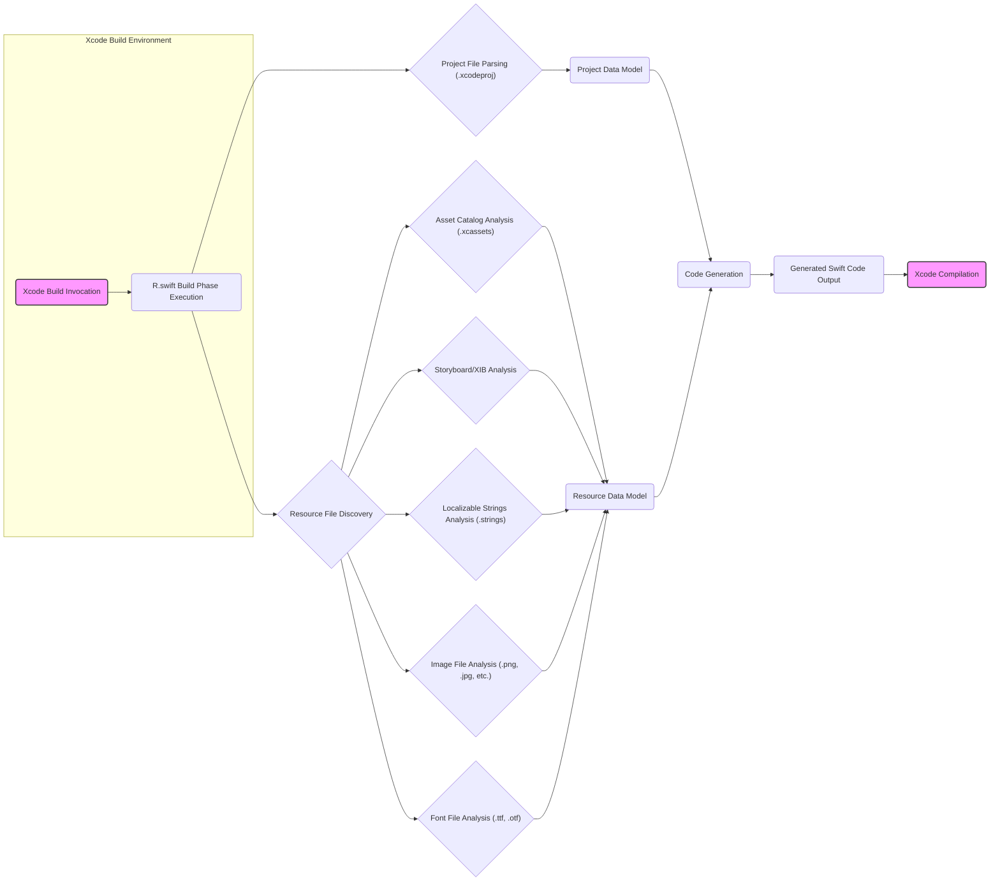
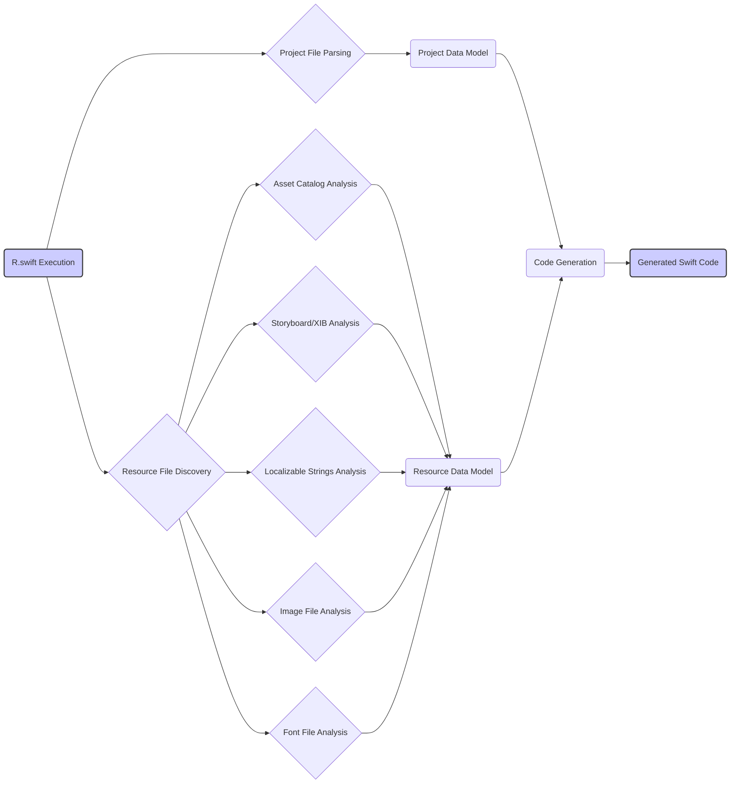

## Project Design Document: R.swift (Improved)

**1. Introduction**

This document provides an enhanced and more detailed design overview of the R.swift project. R.swift is a build tool designed to enhance the safety and convenience of working with resources in Swift projects by generating type-safe resource accessors. This document elaborates on the system's architecture, components, data flow, and key security considerations, serving as a robust foundation for subsequent threat modeling activities.

**2. Goals**

*   Provide a comprehensive and in-depth understanding of the R.swift system's architecture and functionality.
*   Clearly identify and describe the purpose, inputs, outputs, and technologies of each key component.
*   Illustrate the detailed data flow within the system, highlighting transformations and interactions.
*   Serve as a well-defined and detailed basis for identifying potential security vulnerabilities and attack vectors during threat modeling.

**3. Scope**

This document encompasses the complete core functionality of R.swift, focusing on the intricate process of resource analysis, data modeling, and code generation. It thoroughly covers the interaction with Xcode projects, various resource file types, and the generation of Swift code. The scope explicitly excludes the internal implementation details of the Swift compiler and the runtime behavior of the generated code, focusing instead on the R.swift tool itself.

**4. System Overview**

R.swift operates as an integral part of the Xcode build process, typically invoked as a build phase script. It meticulously analyzes the project's structure and a wide array of resource files to generate Swift code that offers type-safe and compile-time verified access to these resources.

**Key Components:**

*   **Xcode Build Environment:** The overarching environment provided by Xcode where the build process takes place and R.swift is executed.
*   **R.swift Build Phase Execution:** The specific invocation of the R.swift command-line tool as a custom build phase within an Xcode target.
*   **Project File Parsing (.xcodeproj):** The process of reading and interpreting the Xcode project file to understand the project's structure, build settings, and file references.
*   **Resource File Discovery:** The step where R.swift identifies all relevant resource files within the project based on the project configuration and file system traversal.
*   **Asset Catalog Analysis (.xcassets):**  The component responsible for parsing `.xcassets` files to extract information about images, colors, data assets, and symbol images.
*   **Storyboard/XIB Analysis:** The component that analyzes `.storyboard` and `.xib` files to extract information about view controllers, segues, reusable views, and other UI elements.
*   **Localizable Strings Analysis (.strings):** The component dedicated to parsing `.strings` files to extract key-value pairs for localized text.
*   **Image File Analysis (.png, .jpg, etc.):** The component that analyzes individual image files to determine their names and potentially other metadata.
*   **Font File Analysis (.ttf, .otf):** The component responsible for identifying and extracting the names of font files.
*   **Project Data Model:** An internal representation of the project's structure and configuration, derived from parsing the `.xcodeproj` file.
*   **Resource Data Model:** An internal, structured representation of all the discovered and analyzed resources, consolidating information from various resource file types.
*   **Code Generation:** The core component that takes the combined Project and Resource Data Models as input and generates Swift code containing type-safe accessors.
*   **Generated Swift Code Output:** The resulting Swift code file(s) produced by R.swift, containing structs and enums that provide type-safe access to project resources.
*   **Xcode Compilation:** The subsequent stage in the Xcode build process where the generated Swift code is compiled along with the rest of the project's source code.

**5. Component Details**

*   **Xcode Build Environment:**
    *   **Function:** Provides the platform and tools for building Apple platform applications.
    *   **Inputs:** Project source code, resource files, build settings, and build scripts.
    *   **Outputs:** Compiled application or framework.
    *   **Key Technologies:** Xcode IDE, `xcodebuild` command-line tool.

*   **R.swift Build Phase Execution:**
    *   **Function:** Executes the R.swift command-line tool with specified arguments during the Xcode build process.
    *   **Inputs:** Project path, target name, build configuration, and other command-line arguments.
    *   **Outputs:** Invocation of R.swift and generation of Swift code.
    *   **Key Technologies:** Shell scripting, command-line interface.

*   **Project File Parsing (.xcodeproj):**
    *   **Function:** Reads and interprets the `.xcodeproj` file to understand the project's organization and settings.
    *   **Inputs:** Path to the `.xcodeproj` file.
    *   **Outputs:** Structured data representing the project's targets, build phases, file references, and build settings.
    *   **Key Technologies:** XML parsing libraries (likely a plist parser).

*   **Resource File Discovery:**
    *   **Function:** Identifies all relevant resource files within the project based on project settings and file system traversal.
    *   **Inputs:** Project structure information from the Project File Parsing component.
    *   **Outputs:** A list of paths to resource files that need to be analyzed.
    *   **Key Technologies:** File system APIs, path manipulation.

*   **Asset Catalog Analysis (.xcassets):**
    *   **Function:** Parses `.xcassets` files to extract information about images, colors, data assets, and symbol images, including variations for different devices and screen scales.
    *   **Inputs:** Path to `.xcassets` directories.
    *   **Outputs:** Data representing the structure and contents of asset catalogs, including image names, color names, and data asset identifiers.
    *   **Key Technologies:**  Potentially custom binary or XML parsing logic for `.xcassets` format.

*   **Storyboard/XIB Analysis:**
    *   **Function:** Analyzes `.storyboard` and `.xib` files to extract information about view controllers, segues, reusable views, identifiers, and connections between UI elements.
    *   **Inputs:** Paths to `.storyboard` and `.xib` files.
    *   **Outputs:** Data representing the UI structure defined in the storyboard and XIB files, including view controller identifiers, segue identifiers, and reusable identifier names.
    *   **Key Technologies:** XML parsing libraries.

*   **Localizable Strings Analysis (.strings):**
    *   **Function:** Parses `.strings` files to extract key-value pairs representing localized text for different languages.
    *   **Inputs:** Paths to `.strings` files.
    *   **Outputs:** Data representing the localized strings, mapping keys to their corresponding values for different locales.
    *   **Key Technologies:** Text parsing, potentially regular expressions.

*   **Image File Analysis (.png, .jpg, etc.):**
    *   **Function:** Analyzes individual image files to determine their names and potentially extract metadata.
    *   **Inputs:** Paths to image files.
    *   **Outputs:** Image file names and potentially other metadata.
    *   **Key Technologies:** Image format libraries (potentially for metadata extraction).

*   **Font File Analysis (.ttf, .otf):**
    *   **Function:** Identifies and extracts the names of font files.
    *   **Inputs:** Paths to font files.
    *   **Outputs:** Font file names.
    *   **Key Technologies:** File system operations.

*   **Project Data Model:**
    *   **Function:** Stores the structured representation of the project's configuration and file organization.
    *   **Inputs:** Data from the Project File Parsing component.
    *   **Outputs:** An in-memory data structure representing the project's structure.
    *   **Key Technologies:** Swift data structures (structs, enums, classes).

*   **Resource Data Model:**
    *   **Function:** Stores the structured representation of all discovered and analyzed resources.
    *   **Inputs:** Data from the Asset Catalog Analysis, Storyboard/XIB Analysis, Localizable Strings Analysis, Image File Analysis, and Font File Analysis components.
    *   **Outputs:** An in-memory data structure representing all project resources.
    *   **Key Technologies:** Swift data structures (structs, enums, classes).

*   **Code Generation:**
    *   **Function:** Generates Swift code based on the Project and Resource Data Models, creating type-safe accessors for resources.
    *   **Inputs:** The Project Data Model and the Resource Data Model.
    *   **Outputs:** String representation of the generated Swift code.
    *   **Key Technologies:** String manipulation, potentially templating engines.

*   **Generated Swift Code Output:**
    *   **Function:** Provides type-safe accessors for project resources, enabling compile-time checking and improved code clarity.
    *   **Inputs:** None (generated by R.swift).
    *   **Outputs:** Swift code files that can be compiled by Xcode.
    *   **Key Technologies:** Swift programming language syntax.

**6. Data Flow (Detailed)**

The data flow within R.swift involves a series of steps to analyze project files and generate type-safe resource accessors:

1. The Xcode build process initiates the R.swift build phase.
2. The R.swift executable is invoked with project-specific arguments.
3. The **Project File Parsing** component reads and interprets the `.xcodeproj` file, extracting information about targets, build settings, and file paths.
4. The **Resource File Discovery** component uses the project information to identify potential resource files (e.g., `.xcassets`, `.storyboard`, `.strings`).
5. For each discovered resource file:
    *   If it's an **Asset Catalog (.xcassets)**, the **Asset Catalog Analysis** component parses its contents to extract image names, color names, data asset identifiers, etc.
    *   If it's a **Storyboard or XIB file**, the **Storyboard/XIB Analysis** component extracts view controller identifiers, segue identifiers, and reusable view identifiers.
    *   If it's a **Localizable Strings file (.strings)**, the **Localizable Strings Analysis** component extracts key-value pairs for localized text.
    *   If it's an **Image file (.png, .jpg, etc.)**, the **Image File Analysis** component extracts the image file name.
    *   If it's a **Font file (.ttf, .otf)**, the **Font File Analysis** component extracts the font file name.
6. The extracted information from the **Project File Parsing** is stored in the **Project Data Model**.
7. The extracted information from the various resource analysis components is aggregated and stored in the **Resource Data Model**.
8. The **Code Generation** component takes the **Project Data Model** and the **Resource Data Model** as input.
9. The **Code Generation** component generates Swift code containing structs and enums that provide type-safe access to the resources defined in the **Resource Data Model**, using information from the **Project Data Model** to organize the generated code appropriately.
10. The **Generated Swift Code Output** is written to one or more Swift files within the project's source directory.
11. The Xcode build process then proceeds with **Xcode Compilation**, compiling the generated Swift code along with the rest of the project's source code.

**7. Security Considerations (Detailed)**

This section outlines potential security considerations and potential vulnerabilities within the R.swift system, providing a basis for threat modeling.

*   **Input Validation and File Parsing Vulnerabilities:**
    *   **Maliciously Crafted Project Files:** The Project File Parsing component relies on parsing `.xcodeproj` files. A maliciously crafted `.xcodeproj` file could exploit vulnerabilities in the XML parsing library or the parsing logic, potentially leading to denial-of-service, arbitrary code execution (if the parser is flawed enough), or information disclosure.
    *   **Maliciously Crafted Resource Files:** The various resource analysis components parse different file formats. Malformed or malicious resource files (e.g., excessively large images, deeply nested storyboards, strings files with format string vulnerabilities) could exploit vulnerabilities in the respective parsing logic, leading to denial-of-service or potentially other issues.
    *   **Path Traversal:** If R.swift doesn't properly sanitize or validate file paths obtained from the project file, an attacker might be able to manipulate the project file to point R.swift to arbitrary files on the system, potentially leading to information disclosure or other unintended consequences.

*   **Code Injection Vulnerabilities:**
    *   **Flawed Code Generation Logic:** Errors or oversights in the Code Generation component could lead to the generation of Swift code that contains vulnerabilities, such as format string bugs or other code injection points, which could be exploited later when the generated code is executed.
    *   **Template Injection:** If R.swift uses a templating engine for code generation, vulnerabilities in the templating engine or its usage could allow an attacker to inject arbitrary code into the generated output.

*   **Dependency Vulnerabilities:**
    *   **Vulnerable Libraries:** R.swift might depend on external libraries for parsing or other functionalities. Vulnerabilities in these dependencies could be indirectly exploitable through R.swift.

*   **Information Disclosure:**
    *   **Verbose Error Messages:**  Detailed error messages generated by R.swift could inadvertently reveal sensitive information about the project structure, file paths, or internal workings, which could be useful to an attacker.
    *   **Logging:** If logging is enabled, sensitive information might be logged, potentially exposing it to unauthorized access.

*   **Build Environment Assumptions:**
    *   **Trust in the Build Environment:** R.swift operates under the assumption that the Xcode build environment is secure. If the build environment is compromised, R.swift could be used as a vector for further attacks.

*   **Configuration Vulnerabilities:**
    *   **Insecure Configuration Options:** If R.swift offers configuration options, insecurely configured options could introduce vulnerabilities.

**8. Deployment**

R.swift is typically deployed as a command-line tool integrated into the Xcode build process. Developers add a "Run Script" build phase to their Xcode targets. This script invokes the R.swift executable, usually passing the project directory as an argument. The generated Swift code is then placed within the project's source tree and subsequently compiled by Xcode.

**9. Future Considerations**

*   **Plugin Architecture for Resource Analysis:** Allowing developers to create custom plugins for analyzing specific resource types. This would introduce new security considerations related to the security and trustworthiness of these plugins.
*   **Code Signing of the R.swift Executable:** Signing the R.swift executable could help ensure its integrity and authenticity.
*   **Sandboxing or Isolation:** Exploring ways to further isolate R.swift's execution within the build process to limit the potential impact of vulnerabilities.
*   **Enhanced Input Sanitization and Validation:** Implementing more robust input validation and sanitization techniques for all parsed files.
*   **Security Audits:** Regularly conducting security audits of the R.swift codebase and its dependencies.

This improved design document provides a more comprehensive and detailed understanding of the R.swift project, laying a solid foundation for a thorough and effective threat modeling process.