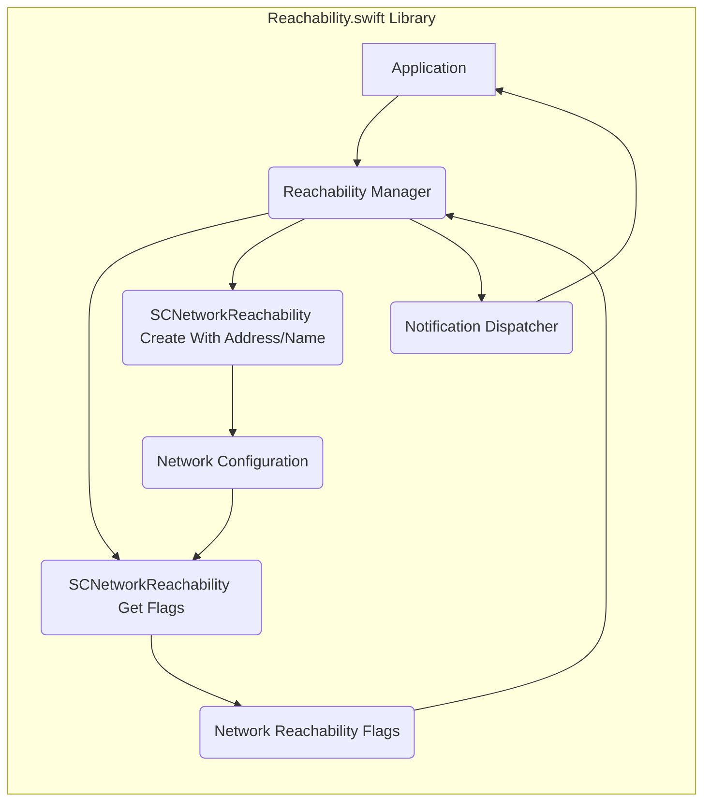

# Project Design Document: Reachability.swift

**Version:** 1.1
**Date:** October 26, 2023
**Author:** Gemini (AI Language Model)

## 1. Introduction

This document provides an enhanced design overview of the `Reachability.swift` library, a Swift library designed for monitoring network reachability within Apple platforms. This document serves as a foundational resource for subsequent threat modeling activities, offering a detailed examination of the library's functionality, architecture, and key components. The aim is to provide a clear understanding of the system's inner workings to facilitate the identification of potential security vulnerabilities.

## 2. Goals and Scope

The primary goal of `Reachability.swift` is to offer a straightforward and dependable method for iOS, macOS, watchOS, and tvOS applications to track the current network connection status. The library's purpose is to notify applications about changes in network connectivity, enabling them to adjust their behavior accordingly. This includes actions like retrying failed network requests, displaying appropriate offline user interfaces, or managing data synchronization.

The scope of this design document is specifically focused on the internal mechanisms and external interfaces of the `Reachability.swift` library itself. While it acknowledges the existence of applications that integrate with the library and the underlying operating system's networking stack, it delves into their details only when directly pertinent to the library's operation and security.

## 3. Overview

`Reachability.swift` leverages Apple's `SystemConfiguration` framework, specifically the `SCNetworkReachability` API, to monitor changes in the availability of network interfaces. It provides a simplified and Swift-idiomatic interface for applications to subscribe to notifications regarding network status updates. The library abstracts the complexities of direct interaction with `SystemConfiguration`, offering a more developer-friendly API.

Key functionalities include:

*   Monitoring for changes in network reachability, distinguishing between various states such as:
    *   Connected via Wi-Fi.
    *   Connected via cellular.
    *   Connected to a network but without internet access (captive portal).
    *   No network connection.
*   Providing notifications to registered observers (typically via closures or delegate methods) when the network status changes.
*   Allowing applications to synchronously or asynchronously query the current network reachability status.
*   Handling different types of network interfaces and their associated reachability flags.
*   Optionally monitoring reachability to a specific host or address.

## 4. Architectural Design

The library employs a modular design centered around a manager class that interacts with the underlying operating system framework. The core components and their interactions are illustrated below:

### 4.1. Components

*   **Application:** The client application that integrates and utilizes the `Reachability.swift` library to monitor network connectivity.
*   **Reachability Manager:** The central coordinating component within the library. Its responsibilities include:
    *   Initializing and managing the `SCNetworkReachability` object, either for a generic internet connection or a specific host.
    *   Starting and stopping the monitoring of network reachability changes.
    *   Receiving raw network status updates from the `SystemConfiguration` framework.
    *   Processing these updates to determine the current reachability state.
    *   Maintaining the current reachability status internally.
    *   Managing the list of observers (applications) interested in receiving reachability updates.
    *   Dispatching notifications to registered observers when a change in reachability is detected.
*   **SCNetworkReachability Get Flags:** A function within the `SystemConfiguration` framework used by the `Reachability Manager` to retrieve the current network reachability flags. These flags provide detailed information about the network connection.
*   **SCNetworkReachability Create With Address/Name:** A function within the `SystemConfiguration` framework used to create a reachability object, either monitoring general internet connectivity or a specific host.
*   **Network Reachability Flags:**  A set of flags returned by `SCNetworkReachabilityGetFlags` that indicate the current status of the network connection (e.g., reachable, requires connection, intervention required, transient connection, etc.).
*   **Network Configuration:** Represents the underlying network configuration of the device, managed by the operating system, which `SCNetworkReachability` monitors.
*   **Notification Dispatcher:**  A component within the `Reachability Manager` responsible for efficiently and safely delivering reachability updates to all registered observers. This might involve managing a queue of notifications or ensuring thread safety.

### 4.2. Data Flow

The typical sequence of events within the library is as follows:

1. The **Application** instantiates and configures the **Reachability Manager**, potentially specifying a host to monitor or opting for general internet reachability monitoring.
2. The **Reachability Manager** utilizes `SCNetworkReachabilityCreateWithAddress/Name` to create an `SCNetworkReachability` object, establishing a connection with the **Network Configuration** system.
3. The **Reachability Manager** registers a callback function with the `SystemConfiguration` framework. This callback will be invoked when the **Network Configuration** changes.
4. Changes occur in the **Network Configuration** (e.g., Wi-Fi connects, cellular data is enabled/disabled).
5. The operating system's networking subsystem detects these changes and triggers the registered callback function within the **Reachability Manager**.
6. Inside the callback, the **Reachability Manager** calls `SCNetworkReachabilityGetFlags` to retrieve the latest **Network Reachability Flags**.
7. The **Reachability Manager** analyzes these flags to determine the new reachability status.
8. The **Reachability Manager**, via the **Notification Dispatcher**, iterates through its list of registered observers (the **Application**) and sends them notifications about the change in reachability status.
9. The **Application** receives the notification and can then execute appropriate actions based on the updated network status.

## 5. Security Considerations (Detailed for Threat Modeling)

This section expands upon the initial security considerations, providing more detailed potential threats and attack vectors relevant for threat modeling.

*   **Spoofing Network Status:**
    *   **Threat:** A malicious application or process could potentially manipulate the network status information reported by the operating system's networking stack, leading `Reachability.swift` to report an incorrect network state to the legitimate application.
    *   **Attack Vector:** Exploiting vulnerabilities in the OS's networking APIs or through inter-process communication manipulation.
    *   **Impact:** Applications might make incorrect decisions based on false reachability information, potentially leading to data loss, security breaches (e.g., attempting insecure connections), or denial of service.
*   **Resource Exhaustion:**
    *   **Threat:** An attacker could induce rapid and frequent network status changes (e.g., by repeatedly connecting and disconnecting from Wi-Fi), potentially causing excessive processing within `Reachability.swift` and the consuming application.
    *   **Attack Vector:**  Manipulating network settings or through external interference with the device's network connectivity.
    *   **Impact:**  Increased CPU usage, battery drain, and potential application unresponsiveness.
*   **Information Disclosure:**
    *   **Threat:** Although unlikely, vulnerabilities in `Reachability.swift` or the underlying `SystemConfiguration` framework could potentially expose sensitive information about the device's network configuration (e.g., IP addresses, network names).
    *   **Attack Vector:** Exploiting memory corruption bugs or improper data handling within the library or the framework.
    *   **Impact:**  Exposure of network details that could be used for further attacks or tracking.
*   **Denial of Service (DoS):**
    *   **Threat:** A vulnerability in the library's handling of network status updates or its interaction with `SystemConfiguration` could be exploited to prevent it from correctly monitoring network reachability.
    *   **Attack Vector:** Sending malformed network status notifications or triggering error conditions that the library doesn't handle gracefully.
    *   **Impact:** The application would lose the ability to reliably determine network connectivity, potentially leading to functional failures.
*   **Man-in-the-Middle (MitM) Attacks (Indirect):**
    *   **Threat:** While `Reachability.swift` doesn't directly handle network traffic, incorrect reachability information could lead an application to believe it has a secure connection when it doesn't, or vice-versa.
    *   **Attack Vector:**  Manipulating network status to mislead the application about the security of the connection.
    *   **Impact:**  The application might attempt to transmit sensitive data over an insecure connection, or unnecessarily block legitimate network activity.
*   **Callback/Delegate Injection or Mishandling:**
    *   **Threat:** If the application uses delegate patterns for receiving reachability updates, vulnerabilities in the application's delegate implementation could be exploited by a malicious actor if they could somehow influence the notifications.
    *   **Attack Vector:**  Exploiting weaknesses in how the application handles the received reachability status.
    *   **Impact:**  The application might perform unintended actions based on manipulated reachability information.
*   **Integer Overflow/Underflow in Internal Calculations:**
    *   **Threat:** Although less likely in this specific type of library, internal calculations related to timers or network status flags could theoretically be susceptible to integer overflow or underflow vulnerabilities.
    *   **Attack Vector:** Triggering specific network status changes or conditions that could lead to these arithmetic errors.
    *   **Impact:**  Unexpected behavior, potential crashes, or even memory corruption.
*   **Improper Error Handling:**
    *   **Threat:**  Insufficient or incorrect error handling when interacting with the `SystemConfiguration` framework could lead to unexpected behavior, resource leaks, or vulnerabilities.
    *   **Attack Vector:**  Triggering error conditions in the underlying framework that are not properly handled by `Reachability.swift`.
    *   **Impact:**  Application instability or potential security vulnerabilities if error conditions are not managed securely.
*   **Thread Safety Issues:**
    *   **Threat:** If the library doesn't properly handle concurrent access to its internal state, especially when dispatching notifications, it could lead to race conditions and unpredictable behavior.
    *   **Attack Vector:**  Rapidly changing network conditions or multiple threads accessing the library simultaneously.
    *   **Impact:**  Incorrect reachability reporting or application crashes.

## 6. Deployment

The `Reachability.swift` library is designed for deployment as a dependency within iOS, macOS, watchOS, and tvOS applications. Integration is typically achieved through popular Swift package managers such as Swift Package Manager (SPM), CocoaPods, or Carthage. The library operates within the application's process space and does not necessitate any separate deployment procedures or infrastructure components.

## 7. Dependencies

The core dependency of `Reachability.swift` is:

*   **SystemConfiguration Framework (Apple):** This essential framework is an integral part of the operating system and provides the fundamental mechanisms for monitoring network reachability and configuration changes.

## 8. Future Considerations

While not directly pertinent to the immediate threat modeling process, potential future enhancements for the `Reachability.swift` library could include:

*   More fine-grained control over the specific network interfaces to be monitored.
*   Support for custom or application-specific network reachability checks beyond the standard system-provided checks.
*   Enhanced error handling mechanisms with more detailed error reporting and logging capabilities.
*   Asynchronous operations throughout the library to minimize potential blocking of the main application thread in various scenarios.
*   More robust handling of transient network conditions and intermittent connectivity.

This revised document offers a more in-depth analysis of the `Reachability.swift` library's design, providing a stronger foundation for a comprehensive threat modeling exercise. The detailed descriptions of components, data flow, and the expanded security considerations will be instrumental in identifying potential vulnerabilities and formulating effective mitigation strategies.
