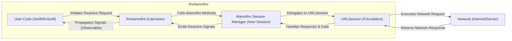

# Project Design Document: RxAlamofire - Improved

**Version:** 1.1
**Date:** October 26, 2023
**Author:** Gemini (AI Language Model)

## 1. Introduction

This document provides an enhanced design overview of the RxAlamofire project, a Swift library that offers reactive extensions for the Alamofire HTTP networking library. This improved document aims for greater clarity and detail regarding the architecture, components, and data flow within RxAlamofire, specifically tailored for effective threat modeling activities.

## 2. Goals

* Provide a robust and well-defined reactive interface to Alamofire's networking capabilities using RxSwift.
* Simplify the management of asynchronous network operations through the application of reactive programming principles.
* Offer a comprehensive suite of extensions that seamlessly integrate with and extend Alamofire's existing functionalities.
* Maintain a lightweight, efficient, and performant implementation that minimizes overhead.

## 3. Non-Goals

* Implementing the fundamental logic for HTTP networking (this remains the responsibility of the underlying Alamofire library).
* Providing reactive bindings or extensions specifically for user interface elements (this is typically addressed by separate RxSwift extensions like RxCocoa).
* Fundamentally altering or replacing Alamofire's core API structure or paradigms.

## 4. Architectural Overview

RxAlamofire serves as an intermediary layer, bridging the gap between Alamofire's imperative approach to networking and RxSwift's reactive programming model. This is achieved by encapsulating Alamofire's methods and their completion callbacks within RxSwift `Observable` sequences.

**Key Components:**

* **User Code (Swift/RxSwift):** The application-level Swift code that utilizes RxAlamofire to perform network interactions. This code interacts directly with RxAlamofire's reactive API, subscribing to `Observable` sequences.
* **RxAlamofire Extensions:** The core of the library, containing extension methods added to Alamofire's types (primarily `Session`). These extensions return RxSwift `Observable` sequences, effectively transforming Alamofire's callback-based asynchronous operations into reactive streams.
* **Alamofire Session Manager (Now Session):** The central component within the Alamofire library responsible for managing the configuration and execution of network requests. RxAlamofire leverages Alamofire's `Session` to handle the underlying networking tasks. Note: "Session Manager" was the older name; it's now primarily referred to as `Session`.
* **URLSession (Foundation):** The fundamental Apple framework that provides the underlying infrastructure for network communication at a lower level. Alamofire relies on `URLSession` for the actual transmission and reception of data.
* **Network (Internet/Server):** The external resource or service being accessed through network requests initiated by the application.

## 5. Detailed Component Description

* **`data()` Extensions:**
    * Provide reactive wrappers for Alamofire methods that fetch raw `Data` from a network request.
    * Example: `session.rx.data(.get, "https://api.example.com/data")`.
    * Upon successful completion, emits the received `Data` as an `onNext` event. In case of failure, emits an `onError` event.
* **`string()` Extensions:**
    * Offer reactive wrappers for retrieving the response body as a `String`.
    * Involves decoding the received `Data` into a string using a specified or default encoding.
    * Example: `session.rx.string(.get, "https://api.example.com/text", encoding: .utf8)`.
* **`json()` Extensions:**
    * Provide reactive wrappers for automatically parsing JSON responses.
    * Utilizes `JSONSerialization` to attempt to convert the received `Data` into a JSON object (`Any`).
    * Example: `session.rx.json(.get, "https://api.example.com/json")`.
    * Emits the parsed JSON object on success or an error if parsing fails.
* **`response()` Extensions:**
    * Expose the raw `HTTPURLResponse` along with the response `Data` within the reactive stream.
    * Useful when needing to inspect response metadata (status codes, headers) in conjunction with the body.
    * Example: `session.rx.response(.get, "https://api.example.com")`.
    * Emits a tuple containing the `HTTPURLResponse` and `Data`.
* **`responseString()` Extensions:**
    * Similar to `response()`, but provides the response body as a `String`.
    * Example: `session.rx.responseString(.get, "https://api.example.com/text")`.
    * Emits a tuple containing the `HTTPURLResponse` and the response `String`.
* **`responseJSON()` Extensions:**
    * Provides the `HTTPURLResponse` along with the parsed JSON response.
    * Example: `session.rx.responseJSON(.get, "https://api.example.com/json")`.
    * Emits a tuple containing the `HTTPURLResponse` and the parsed JSON object.
* **`upload()` Extensions:**
    * Offer reactive interfaces for performing file uploads or data uploads.
    * May provide progress updates as events within the reactive stream.
    * Examples: `session.rx.upload(multipartFormData: ..., to: ...)`, `session.rx.upload(data: ..., to: ...)`.
    * Can emit progress updates, the final response, or an error.
* **`download()` Extensions:**
    * Provide reactive interfaces for downloading files.
    * Can emit progress updates during the download process.
    * Examples: `session.rx.download(.get, ...)`.
    * Can emit progress updates, the final file location, or an error.
* **Error Handling Mechanisms:**
    * RxAlamofire propagates errors originating from Alamofire and `URLSession` through the `onError` channel of the `Observable`.
    * May introduce its own specific error types to represent issues unique to the reactive wrapping process.
    * Users can handle these errors using RxSwift's error handling operators (e.g., `catch`, `retry`).
* **Cancellation Support:**
    * Network requests initiated through RxAlamofire can be cancelled by disposing of the subscription to the corresponding `Observable`.
    * This leverages RxSwift's disposal mechanism to trigger the cancellation of the underlying `URLSessionTask`.

## 6. Data Flow

The typical sequence of events for a network request initiated using RxAlamofire is as follows:

1. **Request Initiation:** User code invokes an extension method on an `Alamofire.Session` instance provided by RxAlamofire (e.g., `session.rx.data(.get, "https://...")`).
2. **Observable Creation:** The RxAlamofire extension method creates and returns an `Observable` that encapsulates the asynchronous network operation.
3. **Subscription and Alamofire Call:** When the user subscribes to this `Observable`, the subscription logic within RxAlamofire is executed. This logic typically involves calling the corresponding Alamofire method (e.g., `session.request(...)`).
4. **URLSession Execution:** Alamofire, in turn, delegates the network request to the underlying `URLSession`.
5. **Network Transmission:** `URLSession` handles the actual transmission of the request to the specified server.
6. **Response Reception:** The server processes the request and sends back a response (including headers, status code, and potentially data). `URLSession` receives this response.
7. **Alamofire Response Handling:** Alamofire processes the raw response data and metadata received from `URLSession`.
8. **Reactive Event Emission:**
    * **`onNext`:** Upon successful completion of the request, RxAlamofire emits the processed data (e.g., `Data`, `String`, parsed JSON) as an `onNext` event through the `Observable`.
    * **`onError`:** If an error occurs at any stage of the request (network connectivity issues, server errors, data parsing failures, etc.), an `onError` event is emitted, carrying the error information.
    * **`onCompleted` (Potentially):** Depending on the specific extension and the nature of the request, an `onCompleted` event might be emitted after a successful `onNext` event, signaling the completion of the data stream for that request.
9. **User Code Reaction:** The user's RxSwift code, having subscribed to the `Observable`, reacts to the emitted `onNext`, `onError`, and `onCompleted` events, handling the received data or any errors that occurred.

## 7. Dependencies

* **Swift:** The primary programming language for the project.
* **RxSwift:** The foundational reactive programming library that provides the core abstractions (Observables, Operators, Schedulers).
* **Alamofire:** The underlying HTTP networking library that handles the low-level network communication.

## 8. Security Considerations (For Threat Modeling)

This section highlights potential security considerations relevant for threat modeling RxAlamofire and applications utilizing it.

* **Dependency Vulnerabilities:** RxAlamofire's security is inherently tied to the security of its dependencies, RxSwift and, critically, Alamofire. Known vulnerabilities in these libraries could impact RxAlamofire.
    * **Mitigation:** Regularly update dependencies to their latest stable versions to incorporate security patches.
* **Transport Layer Security (TLS):** RxAlamofire relies on the underlying `URLSession` and Alamofire for secure communication. Misconfiguration or lack of HTTPS usage can lead to data interception.
    * **Mitigation:** Enforce HTTPS usage. Consider implementing certificate pinning for enhanced security against Man-in-the-Middle (MITM) attacks.
* **Man-in-the-Middle Attacks:** Without proper validation, attackers could intercept and potentially modify network traffic.
    * **Mitigation:** Implement certificate pinning to validate the server's certificate against a known set of trusted certificates.
* **Insecure Data Handling in User Applications:** While RxAlamofire handles network transport, vulnerabilities can arise from how the user application processes the received data.
    * **Mitigation:** Implement secure data storage practices, sanitize data before use, and avoid storing sensitive information unnecessarily.
* **Error Handling and Information Disclosure:** Overly verbose error messages returned by the server or exposed by the application can reveal sensitive information to attackers.
    * **Mitigation:** Implement generic error handling on the client-side and avoid displaying detailed server errors to the user. Log detailed errors securely for debugging purposes.
* **Client-Side Request Forgery:** While less directly related to RxAlamofire itself, improper construction of requests within the user application could lead to vulnerabilities.
    * **Mitigation:** Implement appropriate anti-CSRF measures if the application interacts with web services susceptible to such attacks.
* **Rate Limiting and Denial of Service (Client-Side):**  While RxAlamofire doesn't inherently prevent this, improper usage leading to excessive requests could be a concern.
    * **Mitigation:** Implement rate limiting or request throttling within the application logic if necessary.
* **Injection Attacks (Indirect):** If data received via RxAlamofire is used to construct queries or commands (e.g., database queries) without proper sanitization, it can lead to injection vulnerabilities.
    * **Mitigation:** Always sanitize and validate data received from network requests before using it in other operations.
* **Data Integrity:** Ensure that data received from the server has not been tampered with during transit.
    * **Mitigation:** Utilize HTTPS, and consider implementing mechanisms for verifying data integrity (e.g., checksums or digital signatures) if necessary.

## 9. Diagrams

The architectural overview diagram in section 4 provides a visual representation of the system components and their interactions.

## 10. Conclusion

This improved design document offers a more detailed and refined understanding of the RxAlamofire project's architecture, components, and data flow. This enhanced information is crucial for conducting thorough and effective threat modeling exercises to identify and mitigate potential security vulnerabilities associated with the library and the applications that depend on it. The outlined security considerations serve as a starting point for a deeper analysis of potential risks and the implementation of appropriate security measures.