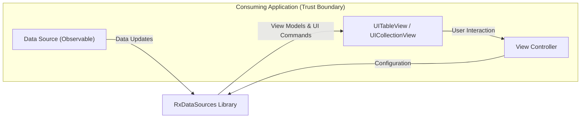
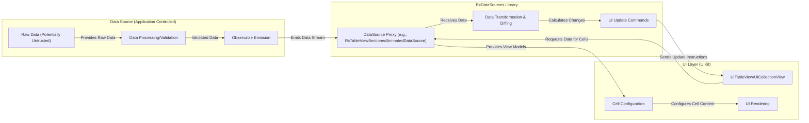

# Project Design Document: RxDataSources (Improved for Threat Modeling)

**Version:** 1.1
**Date:** October 26, 2023
**Author:** AI Software Architect

## 1. Project Overview

RxDataSources is a Swift library designed to streamline the management and display of data within `UITableView` and `UICollectionView` in iOS and macOS applications, leveraging the reactive programming paradigm offered by RxSwift. It simplifies the process of synchronizing observable data streams with the UI, reducing boilerplate and enhancing maintainability.

This document provides a detailed architectural overview of RxDataSources, specifically tailored for threat modeling. It emphasizes key components, data flow pathways, and potential interaction points that could be susceptible to security vulnerabilities. Understanding these aspects is crucial for identifying and mitigating potential threats in applications utilizing this library.

## 2. Goals and Objectives

* **Reactive Data Binding for UI:** Facilitate a declarative and reactive approach to binding observable data sources to `UITableView` and `UICollectionView`.
* **Abstraction of Data Source Complexity:** Abstract away the complexities of managing data updates and animations in table and collection views.
* **Improved Code Structure:** Promote cleaner and more maintainable code by leveraging RxSwift's reactive patterns for data handling in UI layers.
* **Efficient UI Updates:** Enable efficient and animated updates to the UI in response to changes in the underlying data.
* **Reusable Data Source Logic:** Provide reusable components and patterns for common data source scenarios.

## 3. Target Audience

This document is primarily intended for:

* **Security Engineers and Architects:**  Responsible for performing threat modeling and security assessments of applications using RxDataSources.
* **Software Developers:**  Contributing to the development or maintenance of the RxDataSources library itself.
* **Application Developers:**  Utilizing RxDataSources in their iOS and macOS applications and needing a security-focused understanding of its architecture and potential vulnerabilities.

## 4. System Architecture and Trust Boundaries

RxDataSources operates as a client-side library integrated within the application's process. It does not introduce new network endpoints or external services. The primary trust boundary lies between the application code and the RxDataSources library itself. The library relies on the application to provide valid and safe data.

**Key Architectural Components:**

* **Data Source (Observable):**  The origin of the data displayed in the UI. This is an RxSwift `Observable` emitting data items or sections. The security of this component is paramount and is the responsibility of the consuming application.
* **View Controller:**  The application component responsible for configuring RxDataSources and managing the lifecycle of the UI. It acts as the intermediary between the data source and the UI elements.
* **UITableView / UICollectionView:** Standard UIKit components for displaying data. Vulnerabilities in these components are generally handled by Apple, but misuse can introduce risks.
* **RxDataSources Library:**  The core library responsible for transforming and relaying data to the UI. Potential vulnerabilities within this library could impact the application.

## 5. Data Flow (Detailed for Threat Modeling)

Understanding the data flow is crucial for identifying potential points of interception, manipulation, or injection.

**Detailed Data Flow Steps and Potential Threat Points:**

1. **Raw Data (Potentially Untrusted):** Data originates from various sources (network, local storage, user input). **Threat:** If this data is untrusted and not properly validated, it can be a source of injection attacks or lead to unexpected behavior.
2. **Data Processing/Validation:** The application should sanitize and validate data before emitting it through the observable. **Threat:** Failure to validate can propagate malicious data downstream.
3. **Observable Emission:** The RxSwift `Observable` emits the data updates. **Threat:**  While the emission itself is generally safe, the *content* of the emitted data is critical.
4. **DataSource Proxy:** RxDataSources components like `RxTableViewSectionedAnimatedDataSource` subscribe to the observable. **Threat:**  Bugs in the subscription logic could lead to missed updates or unexpected behavior.
5. **Data Transformation & Diffing:** RxDataSources transforms the data into view models and, in the case of animated data sources, calculates the differences between data sets. **Threat:**  Inefficient diffing algorithms or vulnerabilities in the transformation logic could lead to performance issues or crashes.
6. **UI Update Commands:** RxDataSources generates commands for the `UITableView` or `UICollectionView` to insert, delete, move, or reload rows/sections. **Threat:**  Logic errors in generating these commands could lead to UI inconsistencies or crashes.
7. **UITableView/UICollectionView:** The UIKit components receive the update commands. **Threat:** While generally robust, vulnerabilities in UIKit itself are possible (though less likely).
8. **Cell Configuration:** The application's code within the `cellForRowAt` (or similar) method configures the cell's content based on the view model provided by RxDataSources. **Threat:** This is a critical point for potential information disclosure or rendering vulnerabilities if the view model contains sensitive or improperly formatted data.
9. **UI Rendering:** The final step where the UI is displayed to the user. **Threat:**  Rendering vulnerabilities (e.g., displaying malicious HTML in a web view within a cell) are possible if the data is not properly handled during cell configuration.

## 6. Key Components (Detailed for Security Analysis)

* **`SectionModelType` Protocol:** Defines the structure for sections. **Security Relevance:** The data types used within this protocol and how they are handled by the consuming application are crucial. Ensure proper encoding and sanitization of data within section models.
* **`RxTableViewSectionedReloadDataSource` / `RxCollectionViewSectionedReloadDataSource`:** Basic data sources performing full reloads. **Security Relevance:** While simpler, ensure that the data provided to these data sources is validated, as a full reload might mask underlying data issues but not prevent them.
* **`RxTableViewSectionedAnimatedDataSource` / `RxCollectionViewSectionedAnimatedDataSource`:**  Animated data sources using diffing. **Security Relevance:** The diffing process relies on the `IdentifiableType` protocol. Ensure that the identifiers are truly unique and stable to prevent potential manipulation or incorrect updates. Bugs in the diffing algorithm itself could theoretically be exploited, though this is less likely.
* **`IdentifiableType` Protocol:** Requires a unique identifier. **Security Relevance:** The uniqueness and stability of the identifier are critical for the animated data sources. Predictable or easily guessable identifiers could potentially be exploited if an attacker can influence the data source.
* **Custom Cell Configuration (within Consuming Application):**  The code responsible for populating cell content. **Security Relevance:** This is a primary area for potential vulnerabilities. Ensure proper encoding of data to prevent injection attacks (e.g., if displaying web content or formatted text). Avoid displaying sensitive information unnecessarily.

## 7. Security Considerations (Expanded)

* **Data Validation and Sanitization:**  Crucially important before data reaches RxDataSources. Failure to validate input data can lead to various issues, including:
    * **Injection Attacks:** Malicious code injected into the data could be rendered in the UI (e.g., XSS if displaying web content).
    * **Unexpected Behavior:** Invalid data formats could cause crashes or UI glitches.
    * **Data Corruption:**  Incorrectly formatted data could corrupt the application's state.
* **Denial of Service (DoS):**  Large or rapidly changing datasets can strain UI resources.
    * **Mitigation:** Implement pagination, data throttling, and efficient data processing techniques.
* **Information Disclosure:**  Carelessly displaying sensitive data in the UI can lead to exposure.
    * **Mitigation:** Only display necessary information. Consider data masking or redaction for sensitive fields. Be mindful of accessibility features that might expose data.
* **Client-Side Data Manipulation:** While RxDataSources doesn't directly handle data persistence, if the application allows client-side data modification, ensure proper authorization and validation to prevent malicious manipulation.
* **Memory Management:** Improper disposal of RxSwift subscriptions can lead to memory leaks, potentially impacting performance and stability.
    * **Mitigation:** Utilize `DisposeBag` or other resource management techniques provided by RxSwift.
* **Logic Errors in Cell Configuration:**  Bugs in the code that configures cell content can lead to:
    * **Incorrect Data Display:** Showing the wrong information to the user.
    * **Application Crashes:**  Accessing invalid data or performing incorrect operations.
    * **UI Rendering Issues:**  Visual glitches or broken layouts.
* **Trust Boundaries and Data Provenance:** Be aware of the origin of the data being displayed. Data from untrusted sources should be treated with extreme caution and undergo rigorous validation.

## 8. Dependencies

* **RxSwift:** The core reactive programming framework. **Security Relevance:**  While RxSwift is a widely used and generally secure library, staying updated with the latest versions is important to benefit from security patches.

## 9. Deployment Considerations

RxDataSources is integrated directly into the application. Security considerations during deployment primarily revolve around the overall security of the application itself (e.g., code signing, secure distribution).

## 10. Future Considerations (Security Focused)

* **Potential for Side-Channel Attacks:**  Consider if the timing or nature of UI updates could inadvertently leak information (though this is generally a low-risk concern for UI libraries).
* **Integration with Security Frameworks:** Explore potential integrations with security frameworks for data sanitization or input validation.
* **Static Analysis Tooling:**  Utilize static analysis tools to identify potential vulnerabilities in code that uses RxDataSources, particularly in cell configuration logic.

This improved design document provides a more detailed and security-focused perspective on the RxDataSources library. It highlights potential threat areas and emphasizes the importance of secure coding practices in the consuming application. This information is crucial for effective threat modeling and building secure applications that utilize RxDataSources.
