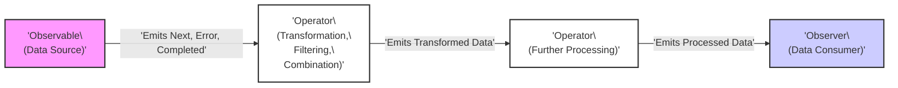

# Project Design Document: RxSwift

**Version:** 1.1
**Date:** October 26, 2023
**Prepared By:** AI Software Architect

## 1. Introduction

This document provides an enhanced and detailed design overview of the RxSwift project, a library for composing asynchronous and event-based programs by using observable sequences in Swift. This document aims to provide a comprehensive understanding of the project's architecture, components, and data flow, with a specific focus on aspects relevant to threat modeling activities. The goal is to provide sufficient information for security professionals to identify potential vulnerabilities and attack vectors.

## 2. Goals and Objectives

The primary goals of the RxSwift project are:

* **Robust Asynchronous Programming:** To offer a resilient and expressive mechanism for managing asynchronous operations in Swift applications.
* **Unified Event Handling:** To provide a consistent and composable approach for handling diverse event sources, including user interface interactions, network responses, sensor data, and internal application events.
* **Declarative Data Stream Management:** To enable developers to define and manipulate data streams over time in a declarative and functional style, improving code readability and maintainability.
* **Powerful Composition and Transformation:** To offer a rich and extensible set of operators for transforming, filtering, combining, and managing observable sequences, enabling complex data processing pipelines.
* **Broad Platform Compatibility:** To ensure usability and consistent behavior across all relevant Apple platforms (iOS, macOS, watchOS, tvOS) and potentially other Swift-supported environments.
* **Adherence to Reactive Principles:** To promote a reactive programming paradigm, leading to applications that are more responsive, resilient, elastic, and message-driven.

## 3. Architectural Overview

RxSwift's architecture is centered around the principles of Reactive Extensions, specifically the concept of **Observables** emitting sequences of items over time. These sequences are consumed by **Observers**, and their flow and transformation are managed by **Operators**. **Schedulers** dictate the execution context for these operations. **Subjects** act as bridges, and **Disposables** manage resource lifetimes.

The core architectural components are:

* **Observable:** The source of asynchronous data or events, representing a stream over time.
* **Observer:** The consumer of the data or events emitted by an Observable.
* **Operator:** Functions that manipulate and transform Observables, creating new Observables.
* **Scheduler:**  Manages the concurrency and threading aspects of Observable emissions and Observer receptions.
* **Subject:** A special type that is both an Observable and an Observer, allowing for multicast scenarios and bridging imperative code.
* **Disposable:** An object representing a cancellable operation or resource, crucial for preventing leaks.

## 4. Component Details

### 4.1. Observable

* **Description:** Represents a sequence of events emitted over time. It's the fundamental source of data in a reactive stream.
* **Key Characteristics:**
    * Emits zero or more `next` events, each carrying a value of a specific type.
    * May emit a single `error` event, signaling a failure and terminating the sequence.
    * May emit a single `completed` event, signaling successful termination of the sequence.
    * Observables are generally immutable; operators return new Observables based on transformations.
* **Examples:**
    * `Observable.just("Hello")`: Emits "Hello" and then completes.
    * `Observable.from([1, 2, 3])`: Emits 1, 2, 3 sequentially, then completes.
    * `Timer.publish(every: .seconds(1), on: .main, in: .common).autoconnect()`: Emits a date every second on the main thread.
    * `URLSession.shared.rx.data(from: url)`: Emits the data from a network request or an error.
* **Potential Security Relevance:**
    * **Exposure of Sensitive Data:** Observables might inadvertently carry sensitive information if not properly managed or if error handling is insufficient.
    * **Unintended Data Emission:**  Logic errors in Observable creation could lead to the emission of incorrect or malicious data.

### 4.2. Observer

* **Description:**  Subscribes to an Observable to receive the emitted events.
* **Key Methods:**
    * `onNext(_:)`: Called when the Observable emits a new value.
    * `onError(_:)`: Called when the Observable emits an error.
    * `onCompleted()`: Called when the Observable completes successfully.
* **Implementation:** Typically implemented using closures provided to the `subscribe` method or by conforming to the `ObserverType` protocol.
* **Potential Security Relevance:**
    * **Vulnerable Data Handling:**  If the `onNext` handler doesn't properly sanitize or validate data, it could lead to vulnerabilities like cross-site scripting (XSS) if the data is used in a web view.
    * **Information Leaks in Error Handling:**  Displaying raw error messages from `onError` to the user could expose sensitive system information.
    * **Resource Exhaustion:**  If the Observer performs resource-intensive operations on each `onNext` event without proper throttling, it could lead to denial-of-service.

### 4.3. Operators

* **Description:** Functions that operate on Observables to transform, filter, combine, or otherwise manipulate the sequence of emitted events. They are the core of RxSwift's data processing capabilities.
* **Categorization (Examples with Security Context):**
    * **Creating Operators:** `just`, `from`, `interval`, `timer`. *Security Context:*  Careless use of `interval` or `timer` with short intervals could lead to excessive resource consumption.
    * **Transforming Operators:** `map`, `flatMap`, `scan`, `buffer`. *Security Context:*  Improper use of `map` could lead to the accidental removal of necessary security-related data. `flatMap` with user-provided input could be a vector for code injection if not handled carefully.
    * **Filtering Operators:** `filter`, `take`, `skip`, `distinctUntilChanged`. *Security Context:*  Incorrect filtering logic could inadvertently allow unauthorized data to pass through.
    * **Combining Operators:** `merge`, `concat`, `zip`, `combineLatest`. *Security Context:*  Combining data streams from untrusted sources without proper validation could introduce vulnerabilities.
    * **Error Handling Operators:** `catch`, `retry`. *Security Context:*  Generic `catch` operators might mask underlying issues, hindering proper security monitoring. Uncontrolled `retry` logic could amplify denial-of-service attacks.
    * **Utility Operators:** `delay`, `timeout`, `debug`. *Security Context:*  Excessive delays could impact the user experience and potentially mask security issues. `debug` operators might inadvertently log sensitive information in production environments.
* **Mechanism:** Operators subscribe to a source Observable and return a new Observable with the transformed sequence.
* **Potential Security Relevance:**
    * **Introduction of Vulnerabilities:**  Custom operators or incorrect usage of built-in operators can introduce security flaws in the data processing pipeline.
    * **Data Manipulation Risks:**  Operators that modify data without proper validation or sanitization can create vulnerabilities.
    * **Concurrency Issues:**  Operators that manage shared state without proper synchronization can lead to race conditions and data corruption.

### 4.4. Scheduler

* **Description:** Controls the execution context (thread or dispatch queue) where Observable emissions and Observer receptions occur. Essential for managing concurrency.
* **Types (Examples):**
    * `MainScheduler`: Executes tasks on the main thread (UI thread).
    * `ConcurrentDispatchQueueScheduler`: Executes tasks on a concurrent dispatch queue.
    * `SerialDispatchQueueScheduler`: Executes tasks on a serial dispatch queue.
    * `OperationQueueScheduler`: Executes tasks on an `OperationQueue`.
* **Importance:**  Crucial for thread safety and responsiveness, especially when dealing with UI updates or background tasks.
* **Potential Security Relevance:**
    * **Thread Safety Violations:** Incorrectly choosing or using schedulers can lead to race conditions and data corruption if shared resources are accessed concurrently without proper synchronization.
    * **UI Freezing (DoS):** Performing long-running or CPU-intensive operations on the `MainScheduler` can freeze the UI, leading to a denial-of-service for the user.
    * **Background Task Abuse:**  Malicious code could potentially use background schedulers to perform unauthorized activities without the user's knowledge.

### 4.5. Subject

* **Description:** A versatile type that acts as both an Observable and an Observer. It can receive values and also emit them to its subscribers, enabling event broadcasting and bridging imperative code.
* **Types (Examples):**
    * `PublishSubject`: Emits only the events that occur *after* subscription.
    * `BehaviorSubject`: Emits the most recent item and subsequent new items to new subscribers.
    * `ReplaySubject`: Buffers a specified number of the latest emitted items and replays them to new subscribers.
    * `AsyncSubject`: Emits only the last `next` event before the `completed` event.
* **Use Cases:** Implementing event buses, managing shared state, and bridging non-reactive code.
* **Potential Security Relevance:**
    * **Uncontrolled Event Broadcasting:**  If not properly secured, Subjects could be used to broadcast sensitive information to unintended recipients.
    * **State Manipulation Vulnerabilities:**  In scenarios where Subjects manage application state, vulnerabilities in their usage could lead to unauthorized state changes.
    * **Replay Attacks:**  `ReplaySubject` could potentially be exploited if the replayed events contain sensitive information that should not be accessible to new subscribers.

### 4.6. Disposable

* **Description:** Represents a resource that needs to be released when an Observable sequence is no longer needed. Crucial for memory management and preventing leaks.
* **Mechanism:** When an Observer subscribes to an Observable, it receives a `Disposable`. Calling `dispose()` on the `Disposable` stops the flow of events and releases associated resources.
* **Importance:** Prevents memory leaks, reduces resource consumption, and ensures proper cleanup.
* **Potential Security Relevance:**
    * **Resource Exhaustion (Memory Leaks):** Failure to dispose of subscriptions can lead to memory leaks, eventually causing application crashes or instability, which can be a form of denial-of-service.
    * **Holding onto Sensitive Data:** If Disposables are not properly managed, they might hold references to sensitive data longer than necessary, increasing the risk of exposure.

## 5. Data Flow

The fundamental data flow in RxSwift involves an Observable emitting events that are processed by a chain of operators and ultimately consumed by Observers. Schedulers dictate the threading context.

**Detailed Flow:**

1. **Observable Instantiation:** An Observable is created, representing the source of data or events. This source can be diverse, including network calls, user input, timers, or data from local storage.
2. **Observer Subscription:** An Observer subscribes to the Observable, establishing a connection to receive emitted events. This subscription returns a `Disposable`.
3. **Event Emission by Observable:** The Observable emits `next` events containing data, potentially followed by an `error` event indicating failure, or a `completed` event indicating successful termination.
4. **Operator Chain Processing:** If operators are involved, each operator subscribes to the preceding Observable in the chain. They transform, filter, or combine the emitted events according to their specific logic, creating a new Observable that emits the modified sequence.
5. **Event Reception by Observer:** The Observer receives the emitted events (potentially transformed by operators) through its `onNext`, `onError`, and `onCompleted` methods. The execution of these methods is governed by the specified Schedulers.
6. **Resource Disposal:** When the Observer no longer needs to receive events (e.g., the Observable completes or errors, or the view is deallocated), the `dispose()` method of the `Disposable` is called to release resources and prevent memory leaks.

## 6. Security Considerations (For Threat Modeling)

RxSwift, while a library, introduces potential security considerations when integrated into applications. Misuse or vulnerabilities can lead to various security issues.

* **Resource Exhaustion:**
    * **Unmanaged Subscriptions:** Failure to call `dispose()` on subscriptions leads to memory leaks and resource exhaustion, potentially causing application crashes or denial-of-service. *Example Threat:* A long-lived subscription to a frequently emitting Observable without disposal could consume excessive memory.
    * **Infinite Streams without Backpressure:** Observables emitting data indefinitely without mechanisms to control the rate of emission can overwhelm consumers. *Example Threat:* A network stream emitting data faster than the application can process it, leading to buffer overflows or performance degradation.
* **Error Handling Vulnerabilities:**
    * **Information Disclosure in Error Messages:**  Propagating raw error details through `onError` can expose sensitive information to attackers. *Example Threat:* A database connection error revealing database credentials in the error message.
    * **Unhandled Errors Leading to Unexpected State:** Failing to handle errors gracefully can leave the application in an inconsistent or vulnerable state. *Example Threat:* An error during authentication not properly handled, allowing unauthorized access.
* **Data Integrity Issues:**
    * **Race Conditions due to Incorrect Scheduler Usage:** Improper use of Schedulers or shared mutable state within operators can lead to race conditions and data corruption. *Example Threat:* Multiple threads updating a shared data structure accessed through an Observable without proper synchronization, leading to inconsistent data.
    * **Side Effects in Operators:** Operators with unintended side effects, especially those modifying shared state, can introduce vulnerabilities. *Example Threat:* An operator that modifies a user's permissions based on an unvalidated input.
* **Concurrency and Threading Risks:**
    * **Thread Safety Violations in Custom Operators:** Custom operators not implemented with thread safety in mind can lead to crashes or data corruption in concurrent environments. *Example Threat:* A custom operator accessing and modifying a shared variable from multiple threads without proper locking.
    * **Performing Blocking Operations on the Main Thread:**  Executing long-running or blocking operations within Observable chains on the `MainScheduler` can freeze the UI, leading to a denial-of-service. *Example Threat:* Performing a large file download on the main thread, making the application unresponsive.
* **Dependency Chain Vulnerabilities:**
    * While RxSwift has direct dependencies like `RxCocoa`, vulnerabilities in these dependencies could indirectly affect applications using RxSwift. *Example Threat:* A security flaw discovered in a specific version of `RxCocoa` that could be exploited in applications using that version.
* **Misuse and Implementation Flaws:**
    * **Incorrect Operator Usage Leading to Logic Errors:** Using operators in unintended ways can create logical vulnerabilities in the application. *Example Threat:* Incorrectly using filtering operators, inadvertently allowing access to restricted data.
    * **Vulnerabilities in Custom Operators:** Security flaws can be introduced in custom operators if they are not implemented with security best practices in mind (e.g., input validation, output encoding). *Example Threat:* A custom operator that processes user input without sanitization, leading to code injection.
* **Denial of Service (DoS) Attacks:**
    * **CPU-Bound Operations in Observable Chains:** Performing computationally intensive tasks within Observable chains without proper offloading can consume excessive CPU resources. *Example Threat:*  Performing complex cryptographic operations on the main thread for every emitted event.
    * **Excessive Network Requests Triggered by Observables:**  Uncontrolled or poorly designed Observable chains can trigger a large number of network requests, potentially overwhelming the application or backend services. *Example Threat:* An Observable that triggers a new network request for every character typed by a user without proper debouncing or throttling.

## 7. Deployment

RxSwift is typically deployed as a library dependency within Swift applications targeting Apple platforms (iOS, macOS, watchOS, tvOS) and other Swift-compatible environments. Integration is commonly achieved using dependency management tools:

* **Swift Package Manager (SPM):** Apple's official dependency management tool.
* **CocoaPods:** A popular dependency manager for Swift and Objective-C projects.
* **Carthage:** A decentralized dependency manager for macOS and iOS.

The security of the deployment process relies on the integrity of the dependency management tools and the repositories from which RxSwift is fetched.

## 8. Dependencies

RxSwift has key dependencies that are important to consider for security assessments:

* **RxCocoa:** Provides reactive bindings for Cocoa and UIKit frameworks, enabling observation of UI events and data binding. Vulnerabilities in RxCocoa could impact applications using RxSwift.
* **RxRelay:** Provides specialized `Subject` types designed for specific use cases, often related to UI state management.

Understanding the transitive dependencies of these libraries is also crucial for a comprehensive security analysis.

## 9. Future Considerations

* **Enhanced Security Audits:**  Regular and thorough security audits of the RxSwift codebase to proactively identify and address potential vulnerabilities.
* **Improved Documentation on Security Best Practices:**  Providing clearer guidance and examples on how to use RxSwift securely, especially regarding error handling, concurrency, and resource management.
* **Consideration of Secure Coding Guidelines:**  Adhering to secure coding principles during development to minimize the introduction of vulnerabilities.
* **Community Engagement on Security:**  Encouraging community contributions and feedback on security-related aspects of the library.

This enhanced design document provides a more detailed and security-focused overview of the RxSwift project. It serves as a valuable resource for threat modeling activities, enabling security professionals to identify and mitigate potential risks associated with its use.