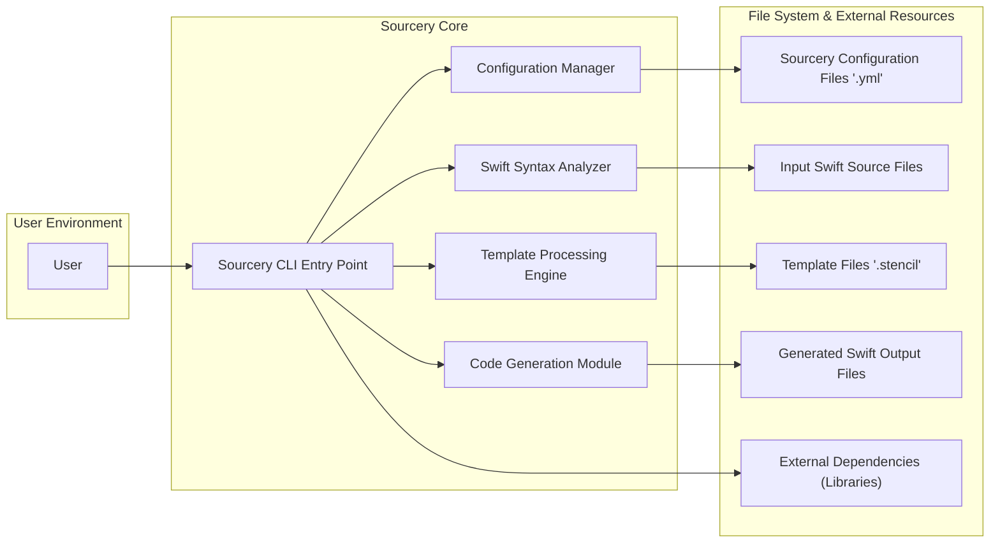
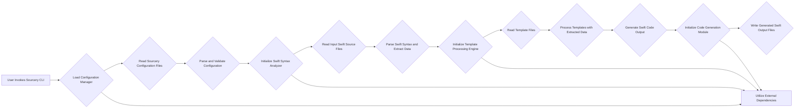

# Project Design Document: Sourcery

**Version:** 1.1
**Date:** October 26, 2023
**Prepared By:** Gemini (AI Language Model)

## 1. Introduction

This document provides an enhanced design overview of the Sourcery project, a Swift code generation tool. This document is specifically tailored to serve as a robust foundation for subsequent threat modeling activities. It offers a detailed outline of the system's architecture, components, data flow, and key interactions, with a focus on elements relevant to security analysis. This information is crucial for identifying potential security vulnerabilities and designing appropriate mitigation strategies.

## 2. Project Overview

Sourcery is a command-line tool designed to automate repetitive coding tasks in Swift development. It achieves this by generating Swift code based on user-defined templates and an analysis of the existing codebase. The tool parses Swift source files, extracts detailed structural information, and utilizes this information to populate templates written in a templating language (like Stencil). This process results in the generation of new Swift code, significantly reducing boilerplate and enhancing developer productivity. Sourcery can be integrated into development workflows through command-line execution or potentially via IDE extensions.

## 3. System Architecture

The following diagram illustrates the refined high-level architecture of Sourcery, emphasizing the flow of data and interactions between components:

### 3.1. Components (Detailed)

*   **User:** The software developer who initiates and utilizes the Sourcery tool. Interaction typically occurs through command-line commands and arguments.
*   **Sourcery CLI Entry Point:** The main executable file that serves as the entry point for the Sourcery application. It handles command-line argument parsing, orchestrates the execution flow, and manages interactions between other components.
*   **Configuration Manager:** This component is responsible for loading, parsing, and validating Sourcery's configuration settings. It reads configuration files (typically `.yml` format) that specify template paths, input/output directories, custom arguments, and other operational parameters. It ensures the configuration is valid before proceeding.
*   **Swift Syntax Analyzer:**  A crucial component responsible for parsing and analyzing the input Swift source code files. It extracts detailed structural information, including class definitions, properties, methods, enums, protocols, and associated metadata (e.g., annotations, inheritance, access modifiers). This component likely leverages a Swift compiler library or a dedicated Swift parsing library.
*   **Template Processing Engine:** This component takes the extracted structural information from the Swift Syntax Analyzer and the content of the template files as input. It utilizes a templating language engine (e.g., Stencil) to process the templates, dynamically generating code based on the extracted data. This involves substituting placeholders in the templates with the actual data.
*   **Code Generation Module:**  Responsible for taking the generated code output from the Template Processing Engine and writing it to the specified output files on the file system. It handles file creation, writing, and potential overwriting of existing files based on configuration settings.
*   **Sourcery Configuration Files ('.yml'):**  YAML-formatted files that define Sourcery's behavior and settings. These files are read by the Configuration Manager.
*   **Input Swift Source Files:** The Swift code files that Sourcery analyzes to extract structural information. These are read by the Swift Syntax Analyzer.
*   **Template Files ('.stencil'):** Files written in a templating language (like Stencil) that define the structure and logic for generating new Swift code. These are read by the Template Processing Engine.
*   **Generated Swift Output Files:** The new Swift code files generated by Sourcery based on the templates and input code. These are written by the Code Generation Module.
*   **External Dependencies (Libraries):** Third-party libraries that Sourcery relies on for various functionalities, such as YAML parsing, Swift code parsing, and template processing.

### 3.2. Data Flow (Detailed)

The following outlines a more granular view of the data flow within Sourcery during a typical code generation process:

1. The **User** initiates the code generation process by invoking the **Sourcery CLI Entry Point** with specific commands and arguments, specifying input files, template paths, and configuration options.
2. The **Sourcery CLI Entry Point** calls upon the **Configuration Manager** to locate and read the **Sourcery Configuration Files ('.yml')**.
3. The **Configuration Manager** parses and validates the configuration data, ensuring all necessary settings are present and correctly formatted.
4. The **Sourcery CLI Entry Point** then instructs the **Swift Syntax Analyzer** to read and parse the specified **Input Swift Source Files**.
5. The **Swift Syntax Analyzer** performs a detailed analysis of the Swift code, extracting structural information and metadata.
6. The extracted structural information is passed from the **Swift Syntax Analyzer** to the **Template Processing Engine**.
7. The **Sourcery CLI Entry Point** provides the paths to the relevant **Template Files ('.stencil')** to the **Template Processing Engine**.
8. The **Template Processing Engine** processes the template files, using the extracted structural information to dynamically generate Swift code.
9. The generated Swift code is then passed to the **Code Generation Module**.
10. The **Code Generation Module** writes the generated code to the specified **Generated Swift Output Files** on the file system.
11. Throughout the process, the **Sourcery CLI Entry Point** may interact with **External Dependencies (Libraries)** for tasks like file system operations, YAML parsing, and template rendering.

This can be visualized with a more detailed flowchart:

## 4. Key Interactions

*   **User - Sourcery CLI Entry Point:** Interaction via command-line arguments, options, and potentially standard input/output streams. This includes specifying input/output paths, configuration files, and execution parameters.
*   **Sourcery CLI Entry Point - Configuration Manager:** Invoking the Configuration Manager to load and manage configuration settings.
*   **Configuration Manager - Sourcery Configuration Files:** Reading and parsing configuration data from YAML files.
*   **Sourcery CLI Entry Point - Swift Syntax Analyzer:** Instructing the analyzer to process Swift source files.
*   **Swift Syntax Analyzer - Input Swift Source Files:** Reading and parsing Swift code to extract structural information.
*   **Sourcery CLI Entry Point - Template Processing Engine:** Providing template file paths and extracted data for processing.
*   **Template Processing Engine - Template Files:** Reading and processing template files using the templating language.
*   **Template Processing Engine - Swift Syntax Analyzer:** Receiving extracted structural information.
*   **Sourcery CLI Entry Point - Code Generation Module:** Instructing the module to write the generated code.
*   **Code Generation Module - Generated Swift Output Files:** Writing the generated Swift code to the file system.
*   **Various Components - External Dependencies:** Utilizing external libraries for tasks like file system operations, YAML parsing, and template rendering.

## 5. Key Security Considerations (Focused on Threat Modeling)

Building upon the initial considerations, here are more targeted security concerns relevant for threat modeling:

*   **Malicious Configuration Injection:**  A compromised or malicious configuration file could be crafted to alter Sourcery's behavior in unintended ways, potentially leading to arbitrary file access, code execution during template processing, or denial of service.
*   **Template Injection Vulnerabilities:** If user-controlled data or data extracted from potentially untrusted Swift files is directly injected into the template engine without proper sanitization or escaping, it could allow attackers to execute arbitrary code within the template engine's context, potentially leading to remote code execution or information disclosure.
*   **Unvalidated Input File Paths:** If Sourcery doesn't properly validate the paths provided for input Swift files or template files, an attacker could potentially provide paths to sensitive files outside the intended project scope, leading to unauthorized information disclosure.
*   **Uncontrolled File System Access:** Vulnerabilities in how Sourcery handles file system operations (reading input, writing output) could be exploited to read or write to arbitrary locations on the file system, potentially leading to data breaches or system compromise.
*   **Dependency Chain Vulnerabilities:**  Vulnerabilities in any of the external libraries used by Sourcery could be exploited. This includes vulnerabilities in YAML parsing libraries, Swift syntax parsing libraries, or the templating engine itself. Supply chain attacks targeting these dependencies are also a concern.
*   **Code Generation of Malicious Code:**  While the intended purpose is code generation, vulnerabilities in the template logic or the templating language could be exploited to generate malicious Swift code that could be inadvertently included in the project.
*   **Information Disclosure through Error Handling:**  Verbose error messages or logging could inadvertently expose sensitive information about the project structure, file paths, or internal workings of Sourcery, which could be valuable to an attacker.
*   **Insufficient Output Sanitization:** If the generated code is not properly sanitized before being written to disk, it could introduce vulnerabilities (e.g., cross-site scripting if the generated code is for a web context, though less likely for Sourcery's primary use case).

## 6. Assumptions and Constraints

*   **User Trust and Responsibility:** It is assumed that the user running Sourcery is a developer with legitimate access to the codebase and understands the implications of running code generation tools.
*   **Standard Operating System Security:** The security of the underlying operating system and file system permissions are relied upon to provide a baseline level of security.
*   **Regular Updates of Dependencies:** It is assumed that the developers of Sourcery actively maintain and update the external dependencies to patch known vulnerabilities.
*   **Command-Line Execution Context:** The primary execution environment is assumed to be a command-line interface, which has its own set of security considerations.

## 7. Future Considerations

*   **Web-Based Interface:** If Sourcery were to introduce a web-based interface for configuration or execution, it would introduce a new attack surface and require careful consideration of web application security principles.
*   **Remote Template Repositories:** Allowing users to fetch templates from remote repositories (e.g., Git repositories) introduces risks related to the integrity and trustworthiness of those remote sources. Measures like signature verification would be necessary.
*   **Plugin Architecture:**  A plugin system would allow for extending Sourcery's functionality but would also introduce the risk of malicious or poorly written plugins compromising the tool or the system. Sandboxing and code signing would be important considerations.
*   **Integration with CI/CD Pipelines:**  As Sourcery is likely to be integrated into CI/CD pipelines, the security of the environment where Sourcery runs in the pipeline becomes critical. Secrets management and secure artifact handling are important.

This enhanced design document provides a more detailed and security-focused overview of the Sourcery project. The refined component descriptions, data flow diagrams, and targeted security considerations will be invaluable for conducting a comprehensive threat modeling exercise and developing effective security mitigations.
