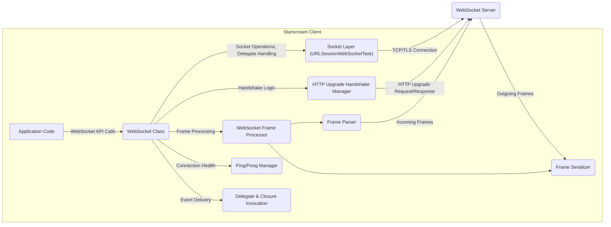
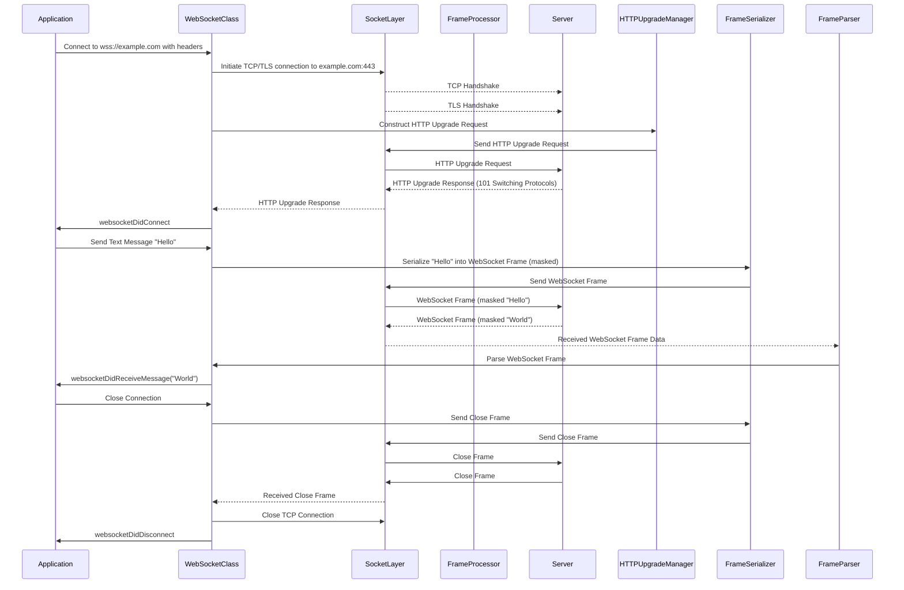

# Project Design Document: Starscream WebSocket Client

**Version:** 1.1
**Date:** October 26, 2023
**Author:** Gemini (AI Language Model)

## 1. Introduction

This document provides an enhanced and detailed design overview of the Starscream WebSocket client library for iOS, macOS, and tvOS. Building upon the previous version, this document further clarifies the architecture, components, and data flow within Starscream, specifically for the purpose of effective threat modeling. It serves as a comprehensive reference for security analysis, vulnerability identification, and understanding the security posture of applications utilizing this library.

## 2. Goals and Objectives

The primary goals of Starscream are to offer:

* A highly reliable and performant WebSocket client implementation tailored for Apple platforms.
* Full compliance with standard WebSocket protocols as defined in RFC 6455.
* Secure communication channels leveraging TLS/SSL encryption.
* Robust connection management capabilities, including establishing, maintaining, gracefully closing, and automatically reconnecting connections.
* Efficient and accurate handling of both textual and binary WebSocket frames.
* A developer-friendly and intuitive API, simplifying the integration of WebSocket functionality into applications.
* Support for widely adopted extensions such as permessage-deflate as specified in RFC 7692 for bandwidth optimization.

This design document is specifically crafted to enable security professionals to:

* Gain a deep understanding of the attack surface presented by applications integrating the Starscream library.
* Identify potential security vulnerabilities residing within the Starscream library itself.
* Thoroughly assess the security ramifications of various configuration options and usage patterns.

## 3. Architectural Overview

Starscream employs a modular, layered architecture, emphasizing a clear separation of concerns in managing WebSocket connections and data transmission. The core components work in concert to establish, maintain the integrity of, and gracefully terminate WebSocket connections with a designated server.

**Key Architectural Elements:**

* **Application Code:** The custom application logic developed by the user, which interacts with the Starscream library through its public API to establish and manage WebSocket communication.
* **WebSocket Class (`WebSocket`):** The central class providing the primary interface for developers. It encapsulates the complexities of WebSocket management, offering methods for connection control, data transmission, and event reception.
* **Socket Layer (`URLSessionWebSocketTask`):**  Leverages Apple's robust `URLSessionWebSocketTask` from the Foundation framework. This layer is responsible for managing the underlying TCP/TLS socket connection, providing asynchronous data transfer capabilities.
* **HTTP Upgrade Handshake Manager:**  Dedicated to handling the initial HTTP handshake process. It constructs the necessary HTTP Upgrade request, including essential headers, and processes the server's response to confirm the successful upgrade to the WebSocket protocol.
* **WebSocket Frame Processor:**  A crucial component responsible for the encoding and decoding of WebSocket frames according to the RFC 6455 specification. It encompasses both the Frame Parser and Frame Serializer.
    * **Frame Parser:**  Handles the interpretation of incoming raw data streams from the socket, segmenting them into individual WebSocket frames, identifying opcodes, and extracting payload data. It also manages the unmasking of payload data received from the server.
    * **Frame Serializer:**  Responsible for constructing outgoing WebSocket frames. This includes setting the appropriate opcode, masking the payload data as required by the protocol for client-sent messages, and handling frame fragmentation when necessary.
* **Ping/Pong Manager:**  Implements the logic for sending and responding to WebSocket Ping and Pong control frames. This mechanism is vital for maintaining connection liveness and detecting network connectivity issues.
* **Delegate & Closure Invocation:**  Provides the mechanisms for delivering events and data received from the WebSocket connection back to the application code, utilizing either the delegate pattern or closure-based callbacks.

## 4. Component Details

This section provides a more in-depth look at the key components within the Starscream library:

* **`WebSocket` Class:**
    * Serves as the primary point of interaction for developers.
    * Offers methods such as `connect(headers:)`, `disconnect()`, `write(string:)`, `write(data:)`, `writePing(pongReceiveHandler:)`, and methods for managing reconnection attempts.
    * Holds crucial configuration parameters, including custom HTTP headers, supported protocols, connection and disconnection timeouts, and SSL settings.
    * Internally manages the `URLSessionWebSocketTask` instance and acts as its delegate (`URLSessionWebSocketDelegate`).
    * Employs a state machine to meticulously track the connection's lifecycle, transitioning through states like `.connecting`, `.open`, `.closing`, and `.closed`. This state management is critical for ensuring correct behavior and preventing race conditions.
* **Socket Management (`URLSessionWebSocketTask`):**
    * Creates and manages the underlying TCP socket connection, leveraging the power and reliability of `URLSessionWebSocketTask`.
    * Automatically handles TLS negotiation when the WebSocket URL uses the `wss://` scheme, ensuring secure communication.
    * Provides asynchronous callbacks for key socket events, including successful connection establishment, connection closure (both graceful and abrupt), and network error notifications.
* **HTTP Upgrade Handshake Manager:**
    * Constructs the initial HTTP Upgrade request with all mandatory and optional headers, including `Upgrade: websocket`, `Connection: Upgrade`, a randomly generated `Sec-WebSocket-Key`, and the `Sec-WebSocket-Version` indicating the supported WebSocket protocol version.
    * Parses the server's HTTP Upgrade response, specifically looking for the `101 Switching Protocols` status code, indicating a successful upgrade.
    * Critically validates the `Sec-WebSocket-Accept` header by ensuring it's a base64-encoded SHA-1 hash of the client's `Sec-WebSocket-Key` concatenated with the magic string "258EAFA5-E914-47DA-95CA-C5B5DC83E2DB". This validation is a fundamental security measure to prevent unauthorized protocol upgrades.
* **Frame Processor:**
    * **Frame Parser:**
        * Receives raw `Data` chunks from the `URLSessionWebSocketTask`'s dataTask delegate methods.
        * Implements the complex logic to parse the WebSocket frame header, identifying the FIN bit, RSV bits, opcode, and mask bit.
        * Determines the length of the payload, handling both short and extended payload lengths.
        * If the mask bit is set (as it should be for server-sent frames), it applies the masking key to unmask the payload data.
        * Handles fragmented messages by buffering incoming fragments and reassembling them into complete messages based on the FIN bit.
        * Validates the frame structure according to RFC 6455, discarding invalid frames and potentially closing the connection upon encountering protocol violations.
    * **Frame Serializer:**
        * Takes outgoing message payloads (either `String` or `Data`) and constructs valid WebSocket frames.
        * Sets the appropriate opcode based on the message type (text or binary).
        * Masks the payload data using a randomly generated masking key, as mandated by the WebSocket protocol for client-sent messages.
        * Handles fragmentation of large messages if necessary, splitting them into multiple frames with the appropriate FIN bit settings.
        * Constructs the frame header, including the FIN bit, RSV bits (for extensions), opcode, mask bit, and payload length.
* **Ping/Pong Manager:**
    * Implements the sending of Ping frames to the server at configurable intervals to ensure the connection remains active.
    * Automatically responds to received Ping frames from the server by sending back Pong frames.
    * Maintains a timer to track the time elapsed since the last Ping was sent. If a Pong is not received within a defined timeout period, it can trigger a reconnection attempt or notify the application of a potential connection issue.
    * Allows the application to send Ping frames manually and receive a callback when the corresponding Pong is received.
* **Delegate & Closure Implementation:**
    * Defines the `WebSocketDelegate` protocol, providing a structured interface for receiving WebSocket events. This includes methods like `websocketDidConnect(_:)`, `websocketDidDisconnect(_:error:)`, `websocketDidReceiveMessage(_:)`, `websocketDidReceiveData(_:)`, and `websocketDidReceiveError(_:)`.
    * Offers closure-based alternatives for handling these events, providing flexibility in how applications integrate with Starscream.
    * Ensures thread safety when invoking delegate methods or closures, typically by dispatching these calls to the main thread to avoid UI-related issues.
* **Extension Handling (e.g., `permessage-deflate`):**
    * Negotiates extensions with the server during the HTTP Upgrade handshake by including the `Sec-WebSocket-Extensions` header in the client's request.
    * Parses the server's `Sec-WebSocket-Extensions` response to determine which extensions were accepted.
    * Implements the logic for compressing outgoing messages before serialization and decompressing incoming messages after parsing if the `permessage-deflate` extension is active. This involves integrating with compression libraries.

## 5. Data Flow

This section provides a more detailed illustration of the data flow during typical WebSocket communication using Starscream.

**Detailed Data Flow Steps:**

* **Connection Establishment:**
    1. The application invokes the `connect(headers:)` method on the `WebSocket` instance, potentially providing custom HTTP headers.
    2. The `WebSocket` class instructs the `SocketLayer` (via `URLSessionWebSocketTask`) to initiate a TCP connection to the specified host and port.
    3. If the URL scheme is `wss://`, the `SocketLayer` automatically performs a TLS handshake to establish a secure connection.
    4. The `WebSocket` class utilizes the `HTTPUpgradeManager` to construct the necessary HTTP Upgrade request, including security-related headers.
    5. The `HTTPUpgradeManager` sends the request through the `SocketLayer`.
    6. The `WebSocket` class awaits the server's HTTP Upgrade response.
    7. Upon receiving a successful response (status code 101), the `WebSocket` class validates the `Sec-WebSocket-Accept` header.
    8. The `WebSocket` class transitions to the `.open` state and notifies the application of the successful connection via the `websocketDidConnect(_:)` delegate method or a completion closure.
* **Sending Data:**
    1. The application calls `write(string:)` or `write(data:)` on the `WebSocket` instance.
    2. The message payload is passed to the `FrameSerializer`.
    3. The `FrameSerializer` constructs a WebSocket frame, masking the payload data as required by the protocol.
    4. The serialized frame is sent to the `SocketLayer`.
    5. The `SocketLayer` transmits the frame over the established socket connection to the server.
* **Receiving Data:**
    1. The `SocketLayer` receives raw data from the server.
    2. The raw data is passed to the `FrameParser`.
    3. The `FrameParser` parses the data stream, identifying individual WebSocket frames and unmasking the payload data.
    4. The parsed frame and its payload are passed back to the `WebSocket` class.
    5. Based on the frame's opcode, the `WebSocket` class delivers the data to the application via the appropriate delegate method or closure (e.g., `websocketDidReceiveMessage(_:)` for text, `websocketDidReceiveData(_:)` for binary).
* **Connection Closure:**
    1. The application calls the `disconnect()` method, or the `WebSocket` class detects a closure initiated by the server.
    2. The `WebSocket` class instructs the `FrameSerializer` to construct and send a WebSocket Close frame to the peer.
    3. The `SocketLayer` sends the Close frame.
    4. The `WebSocket` class waits for a Close frame from the peer.
    5. Once a Close frame is received (or a timeout occurs), the `WebSocket` class instructs the `SocketLayer` to close the underlying TCP connection.
    6. The `WebSocket` class transitions to the `.closed` state and notifies the application of the disconnection via the `websocketDidDisconnect(_:error:)` delegate method or a completion closure.
* **Ping/Pong:**
    1. The `PingPongManager` periodically sends Ping frames to the server.
    2. Upon receiving a Ping frame, the `FrameParser` identifies it, and the `WebSocket` class (or `PingPongManager`) automatically sends a Pong frame back to the server.
    3. The `PingPongManager` monitors for timely Pong responses. If a Pong is not received within the expected timeframe, it may indicate a broken connection, triggering a reconnection attempt or notifying the application.

## 6. Security Considerations

This section provides a more detailed examination of potential security considerations relevant to Starscream, crucial for comprehensive threat modeling.

* **Transport Layer Security (TLS):**
    * Starscream relies heavily on the underlying `URLSession` framework for TLS implementation.
    * **Certificate Pinning:** Consider implementing certificate pinning to further enhance security by ensuring the application only trusts specific certificates, mitigating the risk of man-in-the-middle attacks even if a certificate authority is compromised.
    * **TLS Version Control:**  Ensure the application enforces a minimum TLS version (e.g., TLS 1.2 or higher) to avoid vulnerabilities present in older versions.
    * **Cipher Suite Selection:** While `URLSession` handles cipher suite negotiation, understanding the potential weaknesses of certain cipher suites is important.
    * **Server Name Indication (SNI):**  Verify that SNI is correctly used when connecting to `wss://` endpoints to ensure the correct certificate is presented by the server.
* **WebSocket Handshake:**
    * The correct implementation and validation of the `Sec-WebSocket-Key` and `Sec-WebSocket-Accept` headers are paramount to prevent unauthorized protocol upgrades, which could be exploited by attackers.
    * **Origin Validation:** While Starscream itself doesn't enforce origin validation, developers should implement server-side origin validation to prevent cross-site WebSocket hijacking attacks.
* **Data Masking:**
    * Strict adherence to the WebSocket protocol's requirement for clients to mask all frames sent to the server is essential to prevent certain types of proxy-related attacks. Verify that Starscream consistently masks outgoing frames.
    * Ensure that Starscream correctly handles unmasked frames received from the server, as per the protocol.
* **Frame Handling Vulnerabilities:**
    * **Malformed Frame Handling:**  Thoroughly test Starscream's ability to gracefully handle malformed or intentionally crafted malicious frames from the server without crashing or exhibiting unexpected behavior. This includes testing various invalid header combinations, incorrect payload lengths, and invalid opcodes.
    * **Large Frame and Fragmentation Attacks:**  Assess the library's resilience to denial-of-service attacks involving the transmission of excessively large or highly fragmented messages. Implement and test resource limits to prevent memory exhaustion or excessive CPU usage.
    * **Control Frame Injection:** While less of a direct client-side vulnerability, ensure that the application logic correctly handles unexpected or malicious control frames (Ping, Pong, Close) received from the server.
* **Denial of Service (DoS):**
    * **Connection Flooding:** While primarily a server-side concern, evaluate how Starscream handles rapid connection and disconnection attempts. Ensure its reconnection logic doesn't inadvertently amplify a DoS attack against the server. Implement backoff strategies for reconnection attempts.
    * **Resource Exhaustion:**  Carefully review Starscream's memory management, particularly when handling large volumes of incoming data or managing multiple concurrent connections, to prevent resource exhaustion on the client device.
* **Cross-Site WebSocket Hijacking (CSWSH):**
    * While not a direct vulnerability within Starscream, developers must be acutely aware of CSWSH risks.
    * **Authentication and Authorization:**  Emphasize the importance of implementing robust authentication and authorization mechanisms at the application level to verify the identity of the user initiating the WebSocket connection. Avoid relying solely on HTTP cookies for authentication in WebSocket contexts.
    * **Synchronizer Tokens:** Consider using synchronizer tokens or other anti-CSRF techniques to protect against CSWSH attacks.
* **Extension Vulnerabilities:**
    * When using extensions like `permessage-deflate`, ensure the underlying compression and decompression libraries are up-to-date and not susceptible to known compression-related attacks like CRIME or BREACH.
    * Carefully evaluate the security implications of any other WebSocket extensions that might be supported in the future.
* **Error Handling and Logging:**
    * Implement comprehensive error handling within the application to gracefully manage WebSocket connection errors and avoid exposing sensitive information in error messages.
    * Ensure that logging mechanisms do not inadvertently log sensitive data.
* **Memory Management:**
    * Conduct thorough memory leak analysis to ensure Starscream correctly manages memory allocation and deallocation, especially when dealing with large messages or long-lived connections.
* **Third-Party Dependencies:**
    * Regularly review any third-party dependencies (even if minimal) for known security vulnerabilities and update them promptly.

## 7. Deployment Considerations

Starscream is typically integrated as a library directly within iOS, macOS, or tvOS applications. The overall security of the application utilizing Starscream is paramount.

* **Secure Coding Practices:** Developers must adhere to secure coding practices when implementing application logic that interacts with Starscream to prevent vulnerabilities such as injection flaws or insecure data handling.
* **Network Permissions:** Ensure the application requests and is granted the necessary network permissions to establish WebSocket connections. Minimize the scope of requested permissions.
* **Configuration Management:**  Properly configure Starscream with appropriate connection timeouts, HTTP headers, supported protocols, and SSL settings. Avoid insecure or default configurations.
* **Regular Updates:** Encourage users to keep the application updated to benefit from the latest security patches and bug fixes in Starscream and its underlying dependencies.

## 8. Threat Model Inputs

This design document serves as a foundational input for threat modeling the Starscream library and applications that utilize it. Key areas to focus on during threat modeling include:

* **Entry Points:** The `connect()` method and the handling of incoming data from the socket are primary entry points for potential attacks.
* **Exit Points:**  Data sent via the `write()` methods and the delivery of received data to the application delegate/closures are key exit points.
* **Data Flows:**  Analyze the flow of data during connection establishment, data transmission, and connection closure, paying close attention to data transformation and validation steps.
* **Components:**  Each component described in this document represents a potential area for vulnerabilities. Focus on the interactions between components and the security responsibilities of each.
* **Trust Boundaries:**  The boundary between the application code and the Starscream library, as well as the boundary between the client and the server, are critical trust boundaries to consider.
* **Assumptions:**  Document any assumptions made about the security of the underlying platform or the WebSocket server.

By carefully considering these inputs, security professionals can effectively identify potential threats and vulnerabilities associated with the use of the Starscream WebSocket client.

## 9. Future Considerations

* **Enhanced Error Handling and Logging:** Implement more granular and informative error reporting and logging mechanisms to aid in debugging and security incident analysis, while ensuring sensitive information is not logged.
* **More Granular Control over TLS Configuration:** Provide developers with more fine-grained control over TLS settings, such as specifying allowed cipher suites or enabling/disabling specific TLS features.
* **Support for Additional WebSocket Extensions:** Evaluate and potentially add support for other relevant and widely adopted WebSocket extensions, while carefully considering their security implications.
* **Performance Optimization:** Continuously analyze and optimize the performance of Starscream to minimize resource consumption and improve responsiveness.
* **Formal Security Audit:**  Consider a formal third-party security audit to identify potential vulnerabilities and gain an independent assessment of the library's security posture.

This enhanced document provides a more comprehensive and detailed design overview of the Starscream WebSocket client, with a strong emphasis on security considerations. It is intended to be a valuable resource for security professionals conducting threat modeling and for developers seeking to understand the security implications of using this library.