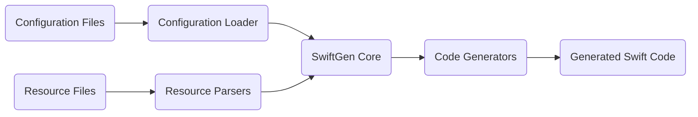
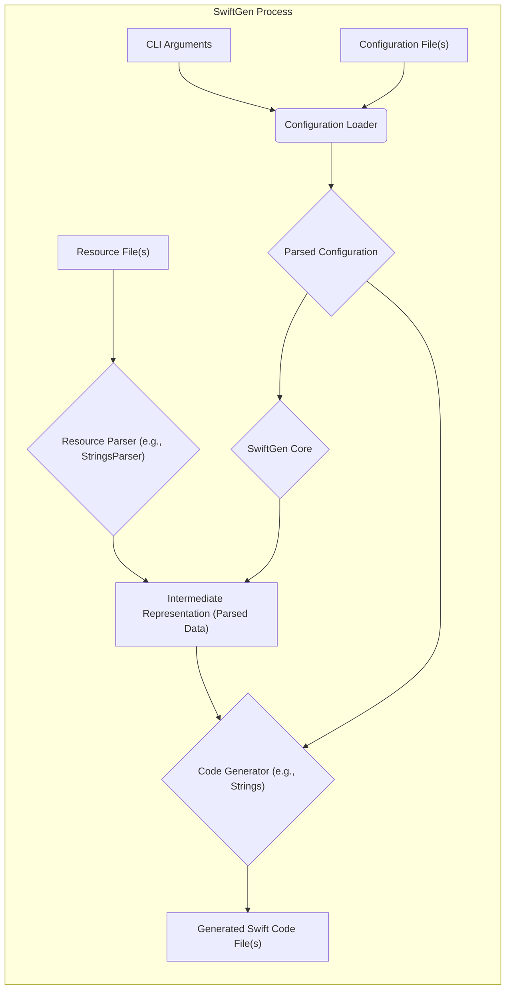

# Project Design Document: SwiftGen

**Version:** 1.1
**Date:** October 26, 2023
**Author:** AI Software Architect

## 1. Introduction

This document provides a detailed design overview of the SwiftGen project, a command-line tool that automates the generation of Swift code for various project resources. This automation enhances type safety, improves code maintainability, and boosts developer productivity by eliminating the need for manually managing string-based resource references. This document is specifically crafted to facilitate subsequent threat modeling by clearly outlining SwiftGen's architecture, component interactions, and data flow.

## 2. Goals and Objectives

The primary goals of SwiftGen are:

* **Enforce Type Safety:** Replace error-prone string literals with compile-time verified types for accessing resources.
* **Improve Code Maintainability:** Centralize resource definitions, ensuring that code automatically reflects changes in resource files.
* **Increase Developer Productivity:** Reduce boilerplate code associated with resource access, allowing developers to focus on application logic.
* **Reduce Runtime Errors:** Catch resource-related errors at compile time rather than at runtime.

This design document aims to:

* Clearly define the distinct components within the SwiftGen architecture.
* Detail the interactions and dependencies between these components.
* Precisely illustrate the flow of data through the SwiftGen process.
* Identify all significant data inputs and outputs, including their formats and sources.
* Establish a solid foundation for identifying potential security vulnerabilities and attack vectors during threat modeling exercises.

## 3. Target Audience

This document is intended for individuals involved in the security and development lifecycle of projects utilizing SwiftGen:

* **Security Engineers:** Responsible for performing threat modeling, security audits, and penetration testing of systems incorporating SwiftGen.
* **Software Developers:**  Seeking a deeper understanding of SwiftGen's internal workings for debugging, extending, or contributing to the project.
* **DevOps Engineers:**  Involved in the deployment, configuration, and maintenance of SwiftGen within CI/CD pipelines and development environments.

## 4. Scope

This document comprehensively covers the core functionalities of SwiftGen, including:

* **Configuration Management:** Loading, parsing, and validating configuration settings.
* **Resource Parsing:**  The process of reading and interpreting various resource file formats.
* **Intermediate Representation:** The internal data structures used to represent parsed resource information.
* **Code Generation:**  The transformation of parsed resource data into Swift code using templates.
* **Command-Line Interface (CLI):**  The interface through which users interact with SwiftGen.

This document explicitly excludes:

* **Specific Template Implementations:** The detailed logic within individual Stencil templates used for code generation.
* **Low-Level Parser Implementation Details:**  The intricate code within specific parsers beyond their general function and data extraction responsibilities.
* **The Content of Generated Swift Code:** The specific syntax and structure of the Swift code produced by SwiftGen.

## 5. High-Level Architecture

SwiftGen operates as a command-line tool, processing configuration and resource files to generate Swift code. The high-level architecture can be visualized as follows:

* **"Configuration Files"**: YAML files that define the parsers and generators to be used, along with input and output paths for resources and generated code.
* **"Resource Files"**: The actual resource files that SwiftGen processes, such as `.strings` files for localizations, `.xcassets` folders for images and colors, and `.storyboard` files for UI definitions.
* **"Configuration Loader"**: The component responsible for reading, parsing, and validating the YAML configuration files. It ensures the configuration adheres to the expected schema.
* **"Resource Parsers"**: A collection of modules, each dedicated to parsing a specific type of resource file. They extract relevant information from these files into an intermediate representation.
* **"SwiftGen Core"**: The central orchestrator of the SwiftGen process. It manages the flow of data between the configuration loader, resource parsers, and code generators.
* **"Code Generators"**: Modules responsible for transforming the intermediate representation of parsed resources into Swift code. They utilize templates to define the structure of the generated code.
* **"Generated Swift Code"**: The output of SwiftGen, consisting of Swift files containing type-safe accessors for the defined resources.

## 6. Component Details

This section provides a more detailed breakdown of each key component within SwiftGen:

* **"Configuration Loader"**:
    * **Functionality:** Reads configuration from YAML files specified via command-line arguments or default locations.
    * **Validation:**  Performs schema validation to ensure the configuration file adheres to the expected structure and contains valid values. Reports errors for invalid configurations.
    * **Error Handling:**  Implements mechanisms to gracefully handle errors during file reading and parsing, providing informative error messages to the user.
    * **Output:** Provides a structured representation of the configuration to the "SwiftGen Core".
* **"Resource Parsers"**:
    * **Modularity:**  Designed with a modular architecture, allowing for the addition of new parsers for different resource types.
    * **Specific Parsers:**
        * **"StringsParser"**: Parses `.strings` files, extracting key-value pairs for localized strings.
        * **"AssetsCatalogParser"**: Parses `.xcassets` directories, extracting information about images, colors, and data assets, including their names and organization.
        * **"InterfaceBuilderParser"**: Parses `.storyboard` and `.xib` files, extracting identifiers for view controllers, segues, and other UI elements.
        * **"FontsParser"**: Reads font files (e.g., `.ttf`, `.otf`) to extract font family and style names.
        * **"ColorsParser"**: Parses files defining color palettes (e.g., `.clr`, custom formats), extracting color names and their corresponding color values.
    * **Data Extraction:** Each parser extracts relevant data and transforms it into a standardized intermediate representation.
    * **Error Handling:** Implements error handling for malformed or invalid resource files, providing informative error messages.
* **"SwiftGen Core"**:
    * **Orchestration:**  Manages the overall workflow, coordinating the execution of parsers and generators based on the loaded configuration.
    * **Dependency Management:**  While not explicitly managing external dependencies in the traditional sense, it manages the dependencies between parsing and generation steps.
    * **Error Propagation:**  Collects and propagates errors from parsers and generators to provide a comprehensive error report to the user.
    * **Intermediate Data Handling:**  Receives the intermediate representation of parsed resources from the parsers and passes it to the appropriate generators.
* **"Code Generators"**:
    * **Template-Based Generation:**  Utilizes templating engines (typically Stencil) to define the structure and logic of the generated Swift code.
    * **Specific Generators:**
        * **`strings` Generator:** Generates Swift code with enums or structs providing type-safe access to localized strings.
        * **`assets` Generator:** Generates Swift code for accessing images, colors, and data assets from asset catalogs.
        * **`storyboards` Generator:** Generates Swift code for instantiating view controllers and performing segues.
        * **`fonts` Generator:** Generates Swift code with enums for accessing font names.
        * **`colors` Generator:** Generates Swift code with enums or structs for accessing defined colors.
    * **Customization:**  Allows for customization of the generated code through the use of different templates or template options.
    * **Output:** Writes the generated Swift code to the specified output files.
* **"Command-Line Interface (CLI)"**:
    * **User Interaction:** Provides the primary interface for users to interact with SwiftGen.
    * **Argument Parsing:**  Uses a library (like Commandant) to parse command-line arguments, including paths to configuration files, output directories, and specific commands.
    * **Command Handling:**  Dispatches execution to the appropriate SwiftGen functionality based on the provided commands (e.g., `config`, `run`).
    * **Feedback and Logging:**  Provides feedback to the user through console output, including success messages, warnings, and error messages.

## 7. Data Flow

The following diagram illustrates the detailed flow of data within the SwiftGen process:

Detailed data flow steps:

1. **"CLI Arguments"**: The user invokes the `swiftgen` command in the terminal, providing arguments such as the path to the configuration file and specific commands.
2. **"Configuration Loader"**: The "Configuration Loader" reads the "Configuration File(s)" specified in the CLI arguments.
3. **"Parsed Configuration"**: The "Configuration Loader" parses the YAML configuration file, validating its structure and content. The result is a structured representation of the configuration.
4. **"Resource Parser (e.g., StringsParser)"**: Based on the "Parsed Configuration", the "SwiftGen Core" invokes the appropriate "Resource Parser" (e.g., "StringsParser" for `.strings` files). The parser is provided with the location of the "Resource File(s)".
5. **"Intermediate Representation (Parsed Data)"**: The "Resource Parser" reads and processes the "Resource File(s)", extracting relevant information and transforming it into an "Intermediate Representation". This representation is a structured data format (e.g., dictionaries, arrays) that captures the essential information from the resource file.
6. **Data Transfer to Core**: The "Intermediate Representation" is passed to the "SwiftGen Core".
7. **"Code Generator (e.g., Strings)"**: The "SwiftGen Core", based on the "Parsed Configuration", selects and invokes the appropriate "Code Generator" (e.g., the `strings` generator). The generator receives the "Intermediate Representation" and the "Parsed Configuration".
8. **Code Generation**: The "Code Generator" uses the "Intermediate Representation" and potentially templates to generate Swift code.
9. **"Generated Swift Code File(s)"**: The "Code Generator" writes the generated Swift code to the specified output file(s).

## 8. Security Considerations

This section outlines potential security considerations relevant to SwiftGen, providing a basis for future threat modeling activities:

* **Configuration File Handling:**
    * **Threat:** Maliciously crafted configuration files could exploit vulnerabilities in the configuration loader, potentially leading to arbitrary code execution or denial of service.
    * **Mitigation:** Implement robust schema validation to prevent the loading of unexpected or malicious configurations. Restrict file system access for the SwiftGen process.
* **Resource File Parsing:**
    * **Threat:** Parsers might be vulnerable to specially crafted resource files designed to exploit parsing logic, potentially leading to crashes, information disclosure, or even code execution if vulnerabilities exist in the parsing libraries.
    * **Mitigation:** Implement thorough input validation and sanitization within each parser. Utilize well-tested and secure parsing libraries. Implement error handling to prevent crashes and provide informative error messages without revealing sensitive information. Consider sandboxing or isolating the parsing process.
* **Code Generation Templates:**
    * **Threat:** If templates are sourced from untrusted locations or can be modified by unauthorized users, they could be manipulated to inject malicious code into the generated Swift files. This could lead to code injection vulnerabilities in the consuming application.
    * **Mitigation:**  Store templates in secure locations with restricted access. Implement mechanisms to verify the integrity of templates. Consider using a templating engine with security features to prevent code injection.
* **Output File Handling:**
    * **Threat:** If the output directory for generated code is not properly secured, malicious actors could potentially tamper with the generated files, injecting malicious code.
    * **Mitigation:** Ensure appropriate file system permissions are set for the output directory, restricting write access to authorized users and processes.
* **Dependency Management:**
    * **Threat:** SwiftGen relies on third-party libraries. Vulnerabilities in these dependencies could be exploited if not properly managed and updated.
    * **Mitigation:** Regularly update dependencies to their latest secure versions. Utilize dependency scanning tools to identify and address known vulnerabilities.
* **Command-Line Interface (CLI):**
    * **Threat:**  If SwiftGen is used in automated scripts or CI/CD pipelines, vulnerabilities in the CLI could be exploited through carefully crafted command-line arguments.
    * **Mitigation:**  Sanitize and validate any user-provided input used in conjunction with the SwiftGen CLI. Follow the principle of least privilege when granting permissions to execute SwiftGen.

## 9. Deployment

SwiftGen is typically deployed as a command-line tool integrated into the development workflow. Common deployment methods include:

* **Installation via Package Managers:**
    * **Homebrew (macOS):** `brew install swiftgen` - A popular package manager for macOS.
    * **Mint:** `mint install SwiftGen/SwiftGen` - A tool for managing Swift command-line tools.
    * **Asdf:** Can be managed via asdf plugins for Swift.
* **Direct Download:** Downloading pre-built binaries from the SwiftGen releases page on GitHub.
* **Building from Source:** Cloning the SwiftGen repository and building the tool locally using Swift Package Manager.
* **Integration with Xcode Build Phases:** Adding a "Run Script" build phase to the Xcode project that executes the `swiftgen` command during the build process. This ensures that resources are always up-to-date.
* **CI/CD Pipelines:** Integrating SwiftGen into CI/CD pipelines to automatically generate resource accessors whenever code or resources change.

## 10. Future Considerations

Potential future enhancements and areas for further design considerations include:

* **Plugin Architecture:**  Developing a robust plugin architecture to allow developers to create and integrate custom parsers and generators, extending SwiftGen's functionality.
* **GUI Interface:**  Exploring the possibility of a graphical user interface for configuring and running SwiftGen, potentially making it more accessible to users less familiar with command-line tools.
* **Improved Error Reporting and Diagnostics:** Enhancing error messages to provide more context and guidance for resolving issues. Implementing more comprehensive logging and debugging capabilities.
* **Caching Mechanisms:** Implementing caching mechanisms to improve performance by avoiding redundant parsing of unchanged resource files.
* **Support for More Resource Types:** Expanding the range of supported resource file types and formats.

This document provides a comprehensive and detailed design overview of the SwiftGen project, specifically tailored to facilitate threat modeling. It outlines the architecture, components, data flow, and preliminary security considerations, providing a solid foundation for identifying and mitigating potential vulnerabilities.
