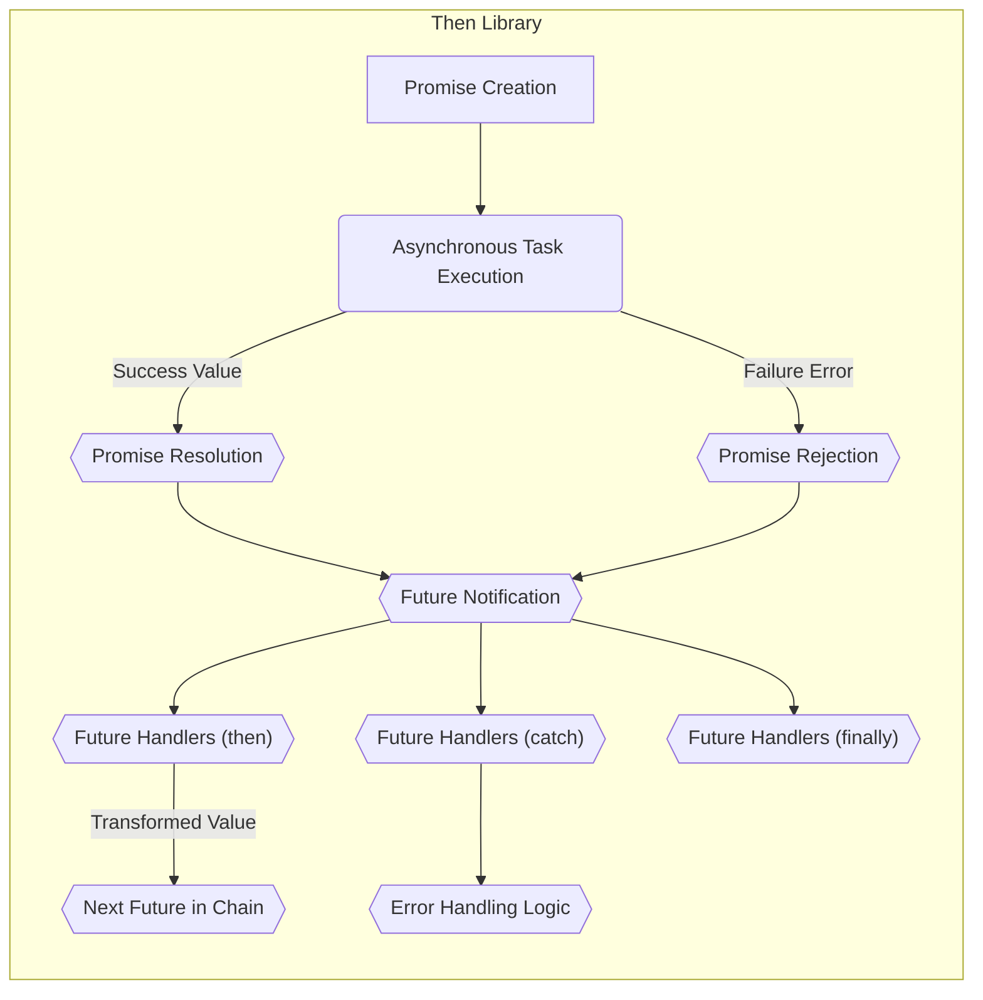

# Project Design Document: Then - Asynchronous Code Simplification Library

**Version:** 1.1
**Date:** October 26, 2023
**Author:** Gemini (AI Language Model)

## 1. Introduction

This document provides a detailed design overview of the "Then" library, a Swift library designed to make asynchronous code more readable and manageable. This document is specifically intended to serve as the foundation for subsequent threat modeling activities. It outlines the library's core functionalities, architecture, data flow, and key considerations relevant to security, with a focus on identifying potential attack surfaces.

## 2. Goals and Scope

The primary goal of the "Then" library is to simplify asynchronous operations in Swift by providing a fluent and chainable interface for working with promises and futures. This design document focuses specifically on the internal architecture and functionality of the "Then" library itself. It does not cover the applications that *use* the "Then" library in detail, although the interaction points and potential misuse scenarios are considered from a library design perspective.

## 3. Overview

"Then" provides a set of types and functions that facilitate the creation, manipulation, and composition of asynchronous operations. It abstracts away some of the complexities of traditional callback-based asynchronous programming, making code easier to reason about and maintain. The core concepts revolve around `Promise` and `Future` types, enabling a more declarative style for handling asynchronous tasks.

## 4. Architectural Design

The "Then" library is structured around a few key components that work together to manage asynchronous operations and their lifecycle.

### 4.1. Core Components

*   **`Promise<Success, Failure: Error>`:** Represents the producer side of an asynchronous operation with explicit success and failure types.
    *   Provides methods to `resolve(_:)` with a successful value of type `Success`.
    *   Provides methods to `reject(_:)` with an error conforming to the `Failure` type.
    *   Once resolved or rejected, the promise's state becomes final and immutable. Subsequent attempts to resolve or reject are typically ignored or result in an error (depending on the implementation).
*   **`Future<Success, Failure: Error>`:** Represents the read-only, consumer side of an asynchronous operation. It allows observation of the eventual outcome (success or failure).
    *   Offers methods like `then(_:)` to execute code when the future resolves successfully, transforming the success value.
    *   Offers methods like `catch(_:)` to handle errors when the future is rejected, potentially recovering from the error.
    *   Offers methods like `finally(_:)` to execute code regardless of whether the future resolves or rejects.
    *   Futures are typically created from Promises. Multiple futures can be derived from a single promise.
*   **Chaining and Composition Mechanisms:** Futures provide methods to chain asynchronous operations sequentially (`then`) or combine them in parallel (less directly supported by the core "Then" but achievable through extensions or user code). The output of one future can be used as input for the next.
*   **Error Handling and Propagation:** "Then" facilitates error propagation through the chain of futures. Unhandled errors continue down the chain until a `catch` handler is encountered. This allows for centralized or specific error handling.
*   **Internal Synchronization:** The library internally utilizes synchronization primitives (e.g., dispatch queues, locks) to ensure thread safety when managing the state of promises and futures, especially when resolution or rejection occurs from different threads. These are generally not directly exposed to the user.

### 4.2. Data Flow

The typical data flow within "Then" involves the following steps, highlighting the movement and transformation of data:

1. A `Promise` is instantiated, representing an asynchronous operation that will eventually produce a value of type `Success` or an error of type `Failure`.
2. The associated asynchronous task (e.g., network request, computation) is initiated.
3. One or more `Future` instances are derived from the `Promise`. These futures represent the observable outcome of the operation.
4. When the asynchronous task completes, the `Promise` is either resolved with a value of type `Success` or rejected with an error of type `Failure`.
5. The resolution or rejection of the `Promise` triggers notifications to all associated `Future` instances.
6. Handlers attached to the `Future` instances (via `then`, `catch`, `finally`) are executed.
    *   `then` handlers receive the `Success` value as input.
    *   `catch` handlers receive the `Failure` error as input.
    *   `finally` handlers are executed without any specific input from the outcome.
7. If futures are chained using `then`, the transformed value from the preceding future's `then` handler becomes the input for the subsequent future's handler. Errors propagate down the chain until a `catch` handler is encountered that can handle the specific error type.

### 4.3. Dependencies

The "Then" library aims to be lightweight and generally has minimal external dependencies. The primary dependencies are:

*   **Swift Standard Library:** Provides fundamental data types, protocols, and functionalities essential for the library's operation.
*   **Foundation Framework (Potentially):** Depending on the specific implementation, "Then" might utilize types or utilities from the Foundation framework, such as `DispatchQueue` for managing concurrency.

## 5. Security Considerations for Threat Modeling

This section outlines security considerations relevant to the "Then" library, framed as potential threats or vulnerabilities that could be exploited.

*   **Information Disclosure through Error Handling:**
    *   **Threat:**  Verbose or improperly sanitized error messages propagated through rejected promises could expose sensitive information about the application's internal state or data.
    *   **Consideration:** Ensure that error types and messages used with `reject` do not inadvertently leak confidential data.
*   **Resource Exhaustion due to Unmanaged Promises/Futures:**
    *   **Threat:**  Strong reference cycles involving promises or futures could lead to memory leaks, eventually causing the application to crash or become unresponsive.
    *   **Consideration:**  Analyze scenarios where promises and futures might not be deallocated correctly, especially in complex chaining scenarios or when dealing with long-lived asynchronous operations.
*   **Race Conditions in Handler Execution:**
    *   **Threat:**  Although "Then" likely uses internal synchronization, subtle race conditions might exist in the execution of `then`, `catch`, or `finally` handlers, especially if these handlers modify shared mutable state without proper synchronization.
    *   **Consideration:**  Examine the internal mechanisms for scheduling and executing handlers to identify potential race conditions.
*   **Unintended Side Effects in Handlers:**
    *   **Threat:**  Malicious or poorly written code within `then`, `catch`, or `finally` handlers could perform unintended actions, potentially compromising the application's integrity or security. This is primarily a concern for the *users* of the library, but the library's design should not make such misuse easy or unavoidable.
    *   **Consideration:**  While the library cannot prevent all misuse, consider if its design encourages or complicates secure usage patterns.
*   **Vulnerabilities in Dependencies:**
    *   **Threat:**  If "Then" relies on external libraries (even the Swift Standard Library or Foundation), vulnerabilities in those dependencies could indirectly affect the security of applications using "Then".
    *   **Consideration:**  Keep track of the dependencies and their known vulnerabilities.
*   **Denial of Service through Asynchronous Operations:**
    *   **Threat:**  An attacker might be able to trigger a large number of asynchronous operations using "Then", potentially overloading the system's resources (e.g., threads, network connections).
    *   **Consideration:**  While "Then" itself doesn't initiate these operations, its use might amplify the impact of such attacks if not used carefully.
*   **Type Confusion or Casting Issues:**
    *   **Threat:**  If the generic types of promises and futures are not handled correctly, there might be potential for type confusion or unsafe casting, leading to unexpected behavior or vulnerabilities.
    *   **Consideration:**  Review the implementation to ensure type safety and prevent unintended type conversions.
*   **Unhandled Rejections:**
    *   **Threat:**  If promises are rejected but no `catch` handlers are attached to the corresponding futures, the error might go unhandled, potentially leading to unexpected application states or crashes. While not a direct vulnerability in the library, it's a security-relevant concern for developers using it.
    *   **Consideration:**  Emphasize the importance of proper error handling in the library's documentation.

## 6. Deployment Considerations

The "Then" library is typically integrated into Swift projects using dependency management tools like Swift Package Manager (SPM) or CocoaPods. The security posture of an application using "Then" depends on both the security of the "Then" library itself and how the application utilizes it.

## 7. Assumptions and Constraints

*   It is assumed that the underlying operating system and hardware are functioning as intended and are not compromised.
*   The security of user-provided closures passed to `then`, `catch`, and `finally` is the responsibility of the application developer. "Then" provides the mechanism for execution but does not inherently validate the safety of the code within these closures.
*   The focus of this document is on the security of the "Then" library's implementation, not on the security of specific use cases or applications built with it.

## 8. Future Considerations

*   **Improved Cancellation Mechanisms:**  Providing more robust and standardized ways to cancel pending promises and futures could enhance resource management and prevent unnecessary computations.
*   **Context Propagation:**  Mechanisms for propagating security-relevant context (e.g., user identity, authorization tokens) through asynchronous operations could be beneficial for secure application development.
*   **Formal Security Audits:**  Future security audits of the "Then" library's codebase could identify potential vulnerabilities not apparent through design review alone.

## 9. Conclusion

This improved design document provides a more detailed and security-focused overview of the "Then" library. By outlining the core components, data flow, and specific security considerations framed as potential threats, this document serves as a solid foundation for conducting a thorough threat modeling exercise. Understanding these aspects is crucial for identifying and mitigating potential vulnerabilities in both the library itself and applications that utilize it.
