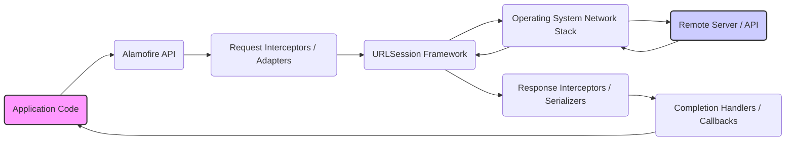

# Project Design Document: Alamofire Network Library (Security Focused)

**Version:** 1.1
**Date:** October 26, 2023
**Author:** Gemini (AI Language Model)

## 1. Introduction

This document provides a detailed design overview of the Alamofire networking library for Swift, specifically tailored for threat modeling. It outlines the key architectural components, data flow, and functionalities with a strong emphasis on security considerations. This document serves as a foundation for security engineers, developers, and architects to assess potential security risks in applications utilizing Alamofire.

## 2. Goals and Objectives

*   Provide a clear and concise description of Alamofire's architecture and core components.
*   Illustrate the typical data flow during network requests and responses, highlighting potential security-relevant points.
*   Identify key areas and components within Alamofire that require focused security analysis and threat modeling.
*   Serve as a reference for understanding how Alamofire interacts with the underlying operating system and external services from a security perspective.

## 3. Target Audience

*   Security engineers responsible for threat modeling and security assessments of applications using Alamofire.
*   Software developers integrating and utilizing Alamofire, needing to understand its security implications.
*   System architects designing applications that rely on network communication facilitated by Alamofire.

## 4. Architectural Overview

Alamofire acts as a Swift-based HTTP networking client, simplifying network interactions by providing a higher-level abstraction over Apple's `URLSession`. Its primary goal is to offer a more user-friendly and feature-rich API for common networking tasks.



**Key Architectural Layers (Security Perspective):**

*   **"Application Code"**: The application utilizing Alamofire. Security vulnerabilities here can impact how Alamofire is used.
*   **"Alamofire API"**: The public interface. Incorrect usage or understanding can lead to security issues.
*   **"Request Interceptors / Adapters"**:  Crucial for adding authentication, authorization, and modifying requests. Potential point for injecting malicious data.
*   **"URLSession Framework"**: Apple's underlying framework. Security relies on its correct implementation and configuration by Alamofire.
*   **"Operating System Network Stack"**: The OS's network handling. Security depends on the OS and its configuration.
*   **"Remote Server / API"**: External entity. Security depends on the server's implementation and the communication channel's integrity.
*   **"Response Interceptors / Serializers"**: Responsible for processing responses. Vulnerabilities here can lead to data corruption or exploitation.
*   **"Completion Handlers / Callbacks"**: Where the application receives data. Improper handling can lead to security issues.

## 5. Key Components and Modules (Security Focus)

*   **`Session`**: Manages network requests and configurations.
    *   Security Relevance:  Configuration options (e.g., `serverTrustManager`) directly impact security.
*   **`Request` (and subclasses like `DataRequest`, `DownloadRequest`, `UploadRequest`)**: Represents an active network request.
    *   Security Relevance: Exposes methods for cancellation, potentially useful for DoS mitigation, but also a target for manipulation.
*   **`RequestInterceptor` / `RequestAdapter`**: Modifies requests before sending.
    *   Security Relevance:  Critical for adding authentication tokens, API keys. Vulnerable if not implemented securely.
*   **`ResponseInterceptor` / `ResponseSerializer`**: Processes responses.
    *   Security Relevance:  Handles data deserialization. Vulnerabilities here can lead to injection attacks if not properly validated.
*   **`ParameterEncoding`**: Defines how request parameters are encoded.
    *   Security Relevance: Incorrect encoding can lead to vulnerabilities if the server expects a specific format.
*   **`HTTPHeaders`**: Manages HTTP headers.
    *   Security Relevance:  Incorrect or missing security headers can expose vulnerabilities.
*   **`ServerTrustManager`**: Handles server certificate validation.
    *   Security Relevance:  Essential for preventing Man-in-the-Middle attacks over HTTPS. Misconfiguration is a critical vulnerability.
    *   Includes options for certificate pinning, which adds an extra layer of security.
*   **`SessionDelegate`**: Provides fine-grained control over `URLSession` behavior.
    *   Security Relevance: Allows customization of security-related events, but improper use can weaken security.
*   **`Result`**: Represents the outcome of a request.
    *   Security Relevance:  Error handling logic based on the `Result` needs to avoid leaking sensitive information.

## 6. Data Flow for a Typical Request (Security Perspective)

This section outlines the data flow, highlighting potential points where security vulnerabilities could be introduced or exploited.

```mermaid
graph TD
    A("Application initiates request\n(Sensitive Data?)") --> B("`Session` creates `URLRequest`");
    B --> C("`Request Interceptors` modify request\n(Add Auth Tokens, Headers)");
    C --> D("`URLSession` sends request\n(Potential Interception Point)");
    D --> E("Operating System Network Stack\n(OS Security Policies)");
    E --> F("Network Transmission\n(Encryption Required - HTTPS)");
    F --> G("Remote Server / API\n(Server-Side Security)");
    G --> H("Network Transmission\n(Encryption Required - HTTPS)");
    H --> I("Operating System Network Stack");
    I --> J("`URLSession` receives response");
    J --> K("`Response Interceptors` inspect response");
    K --> L("`Response Serializers` process data\n(Vulnerability if not secure)");
    L --> M("`Completion Handler` executes\n(Handle data securely)");
    M --> N("Application receives response\n(Sanitize and Validate)");
    style A fill:#f9f,stroke:#333,stroke-width:2px
    style G fill:#ccf,stroke:#333,stroke-width:2px
    subgraph "Client-Side"
    direction LR
    A --- B --- C --- D --- E
    end
    subgraph "Server-Side"
    direction LR
    G
    end
```

**Detailed Steps (Security Highlights):**

1. **"Application initiates request (Sensitive Data?)"**: The application prepares the request. Consider if sensitive data is included and how it's handled before reaching Alamofire.
2. **"`Session` creates `URLRequest`"**: Alamofire constructs the request object. No inherent security risks here, but the initial configuration is important.
3. **"`Request Interceptors` modify request (Add Auth Tokens, Headers)"**: This is a critical point.
    *   **Threat:**  Insecure storage or handling of authentication tokens can lead to unauthorized access.
    *   **Mitigation:**  Use secure storage mechanisms (Keychain), avoid hardcoding secrets.
4. **"`URLSession` sends request (Potential Interception Point)"**: The request is handed off to the OS.
    *   **Threat:** Without HTTPS, data is transmitted in plaintext and vulnerable to interception.
    *   **Mitigation:** Enforce HTTPS.
5. **"Operating System Network Stack (OS Security Policies)"**: The OS handles the network transmission. Security relies on the OS's integrity.
6. **"Network Transmission (Encryption Required - HTTPS)"**: The request travels over the network.
    *   **Threat:** Man-in-the-Middle (MitM) attacks if HTTPS is not used or properly configured.
    *   **Mitigation:**  Enforce HTTPS, implement proper certificate validation (using `ServerTrustManager`).
7. **"Remote Server / API (Server-Side Security)"**: The external server processes the request. Security is the responsibility of the server.
8. **"Network Transmission (Encryption Required - HTTPS)"**: The response travels back. Same threats and mitigations as outbound transmission.
9. **"Operating System Network Stack"**: The OS receives the response.
10. **"`URLSession` receives response"**: The response is received by Alamofire's underlying framework.
11. **"`Response Interceptors` inspect response"**:  Interceptors can inspect and potentially modify the response.
    *   **Threat:** Malicious interceptors could tamper with data.
    *   **Mitigation:**  Carefully vet and control the use of response interceptors.
12. **"`Response Serializers` process data (Vulnerability if not secure)"**:  The response data is deserialized.
    *   **Threat:** Vulnerabilities in serializers can lead to injection attacks if malicious data is crafted by the server.
    *   **Mitigation:** Use well-vetted serializers and implement robust input validation on the application side.
13. **"`Completion Handler` executes (Handle data securely)"**: The application's completion handler is called.
    *   **Threat:** Improper handling of the response data can lead to vulnerabilities (e.g., displaying untrusted HTML).
    *   **Mitigation:** Sanitize and validate data before using it.
14. **"Application receives response (Sanitize and Validate)"**: The application receives the processed data. This is the final point for client-side security measures.

## 7. Security Considerations and Potential Threat Areas

This section details potential security risks associated with Alamofire and how it's used.

*   **Man-in-the-Middle (MitM) Attacks:**
    *   **Threat:** Attackers intercept communication and potentially steal or modify data.
    *   **Alamofire Relevance:**  Proper use of `ServerTrustManager` is crucial to prevent this. Weak or disabled certificate validation makes applications vulnerable.
    *   **Example:**  Disabling certificate validation for testing and forgetting to re-enable it in production.
*   **Insecure Data Transmission:**
    *   **Threat:** Sensitive data transmitted over unencrypted connections (HTTP).
    *   **Alamofire Relevance:**  Applications must enforce HTTPS. Alamofire provides tools for this, but the application developer is responsible for configuration.
*   **Client-Side Injection Attacks:**
    *   **Threat:** Malicious servers sending crafted responses that exploit vulnerabilities in response serializers.
    *   **Alamofire Relevance:** While Alamofire handles serialization, vulnerabilities in underlying libraries or custom serializers can be exploited. Applications should validate received data.
*   **Insecure Credential Storage and Handling:**
    *   **Threat:** Authentication tokens or API keys stored insecurely on the device.
    *   **Alamofire Relevance:**  `RequestInterceptor`s are often used to add credentials. Developers must use secure storage (Keychain) and avoid hardcoding.
*   **Improper Input Validation:**
    *   **Threat:**  Applications not validating data received from the server, leading to vulnerabilities (e.g., displaying malicious content).
    *   **Alamofire Relevance:**  Alamofire facilitates data retrieval, but the application is responsible for validating the data after it's received.
*   **Dependency Vulnerabilities:**
    *   **Threat:**  Vulnerabilities in Alamofire itself or its dependencies.
    *   **Alamofire Relevance:**  Keeping Alamofire updated is crucial. Regularly check for security advisories.
*   **Denial of Service (DoS):**
    *   **Threat:**  Malicious actors overwhelming the application with requests.
    *   **Alamofire Relevance:**  While Alamofire doesn't directly prevent DoS, understanding its request mechanisms is important for implementing rate limiting or other defensive measures.
*   **Information Disclosure through Error Handling:**
    *   **Threat:**  Error responses revealing sensitive information about the server or application.
    *   **Alamofire Relevance:**  Carefully handle errors returned by Alamofire and avoid displaying verbose error messages to the user in production.
*   **Third-Party Interceptor Risks:**
    *   **Threat:**  Malicious or poorly written third-party `RequestInterceptor`s or `ResponseInterceptor`s.
    *   **Alamofire Relevance:**  Thoroughly vet any third-party code integrated with Alamofire.

## 8. Deployment Considerations

Deploying applications using Alamofire doesn't introduce unique security vulnerabilities directly related to the library itself. However, general secure deployment practices apply:

*   Ensure the application is deployed in a secure environment.
*   Protect API keys and other sensitive configuration data.
*   Regularly update the application and its dependencies, including Alamofire.

## 9. Future Considerations (Security)

*   Further analysis of specific configuration options within `Session` and their security implications.
*   Detailed examination of the security of custom `RequestInterceptor` and `ResponseInterceptor` implementations.
*   Investigation of potential security enhancements within Alamofire itself, such as built-in mechanisms for common security tasks.
*   Analysis of how Alamofire interacts with different authentication schemes and their security best practices.

This security-focused design document provides a basis for understanding the potential security implications of using Alamofire. By carefully considering the architecture, data flow, and potential threat areas, developers and security engineers can build more secure applications.