## Project Design Document: Alamofire HTTP Networking Library

**Project Name:** Alamofire

**Project Repository:** [https://github.com/alamofire/alamofire](https://github.com/alamofire/alamofire)

**Document Version:** 1.1

**Date:** 2023-10-27

**Author:** AI Software Architect

### 1. Project Overview

Alamofire is a robust and widely-used HTTP networking library written in Swift, designed for iOS, macOS, watchOS, and tvOS platforms. It significantly simplifies the complexities of making network requests and managing responses within Swift applications. Alamofire is built upon Apple's foundational `URLSession` framework, offering developers a more intuitive, streamlined, and feature-rich API.

**Key Features:**

*   **Elegant and Chainable API:** Provides a highly readable and expressive syntax, enabling developers to construct and execute network requests in a fluent, chainable manner.
*   **Automatic Request and Response Serialization:**  Intelligently handles the serialization of request parameters into various formats and deserialization of response data into usable Swift types (JSON, XML, Plist, String, Images, etc.).
*   **Flexible Parameter Encoding:** Supports a wide range of parameter encoding strategies, including JSON encoding, URL-encoded forms, and custom encoding implementations.
*   **Comprehensive Authentication Handling:** Offers built-in mechanisms and extensibility for managing diverse authentication schemes such as Basic Authentication, Digest Authentication, OAuth 1.0a and 2.0, and API key authentication.
*   **Leverages Secure TLS/SSL:** Inherits and utilizes `URLSession`'s industry-standard TLS/SSL implementation, ensuring secure and encrypted communication channels by default.
*   **Powerful Request and Response Interceptors:** Allows developers to implement custom logic to intercept and modify requests before they are sent and responses immediately after they are received. This is useful for tasks like adding authentication headers, logging, and response transformations.
*   **Detailed Upload and Download Progress Tracking:** Provides granular callbacks and progress closures for monitoring the real-time progress of data uploads and downloads, enhancing user experience and providing feedback.
*   **Robust Response Validation:** Enables declarative validation of response status codes, MIME types, and custom validation logic to ensure the integrity and correctness of server responses.
*   **Highly Extensible Architecture:** Designed with extensibility in mind, allowing developers to customize and extend Alamofire's functionality to meet the specific and evolving needs of their applications through custom adapters, interceptors, and serializers.

**Target Audience:**

*   Primarily aimed at iOS, macOS, watchOS, and tvOS developers who require efficient and reliable network communication capabilities within their Swift-based applications.
*   Developers seeking a higher-level, more developer-friendly, and less verbose API compared to working directly with the lower-level `URLSession` framework.
*   Teams and individuals looking for a well-documented, actively maintained, and community-supported networking library for their Swift projects.

**Use Cases:**

*   Fetching and consuming data from RESTful APIs and backend services.
*   Uploading files, images, and other data to servers and cloud storage.
*   Downloading resources such as images, videos, documents, and application updates from the internet.
*   Implementing client-server communication patterns in mobile, desktop, and wearable applications.
*   Seamlessly integrating with backend services, web applications, and microservice architectures.
*   Building applications that rely on real-time data synchronization and communication with remote servers.

### 2. System Architecture

The following diagram illustrates the high-level architecture of Alamofire, focusing on the request lifecycle and key components involved in processing a network request. It highlights the interaction between the application code, Alamofire's core components, and the underlying `URLSession` framework.

```mermaid
graph LR
    subgraph "Application Code"
        A["'Application Request'"] --> B["'Alamofire.Session'"];
    end

    subgraph "Alamofire Core"
        B --> C["'Request Creation & Configuration'"];
        C --> D["'Request Interceptors'"];
        D --> E["'URLSession Task Creation'"];
        E --> F["'URLSession'"];
        F --> G["'Network Communication (TLS)'"];
        G --> F;
        F --> H["'URLSession Delegate Callbacks'"];
        H --> I["'Response Handling'"];
        I --> J["'Response Interceptors'"];
        J --> K["'Response Validation'"];
        K --> L["'Response Serialization'"];
        L --> M["'Completion Handler'"];
    end

    subgraph "Application Code"
        M --> N["'Application Response Handling'"];
    end

    style A fill:#f9f,stroke:#333,stroke-width:2px
    style N fill:#f9f,stroke:#333,stroke-width:2px
    style F fill:#ccf,stroke:#333,stroke-width:2px
```

**Architecture Components:**

*   **Application Request:** Represents the initial network request initiated by the application code through Alamofire's user-friendly API. This is where developers define the request URL, HTTP method, parameters, headers, and other request-specific details.
*   **Alamofire.Session:** The central and most crucial component within Alamofire. It acts as the request manager, responsible for orchestrating the entire lifecycle of network requests. It encapsulates and configures the underlying `URLSession` instance, managing settings like timeouts, caching behavior, security policies (including TLS configuration and server trust evaluation via `ServerTrustManager`), and request dispatching. `Session` is configured using `URLSessionConfiguration`, allowing fine-grained control over network behavior.
*   **Request Creation & Configuration:** This component takes the high-level request parameters provided by the application and translates them into a concrete `URLRequest` object. This involves constructing the URL, setting the HTTP method (GET, POST, PUT, DELETE, etc.), encoding parameters into the request body or URL query string based on the specified encoding type, and adding necessary HTTP headers.
*   **Request Interceptors:** A powerful feature allowing for the interception and modification of the `URLRequest` *before* it is handed off to `URLSession`. Interceptors can be chained and are executed in order. Common use cases include:
    *   Adding authentication headers (e.g., Bearer tokens, API keys).
    *   Logging request details for debugging and monitoring.
    *   Dynamically modifying request parameters based on application state.
    *   Implementing request retries or circuit breaker patterns.
*   **URLSession Task Creation:** Based on the fully configured `URLRequest`, this component creates the appropriate `URLSessionTask` subclass (e.g., `URLSessionDataTask` for general data requests, `URLSessionUploadTask` for file uploads, `URLSessionDownloadTask` for file downloads). The task represents the actual network operation that will be performed by `URLSession`.
*   **URLSession:** Apple's foundational framework for handling network requests. Alamofire leverages `URLSession` for the low-level network communication, benefiting from its robust implementation, performance optimizations, and system-level integration. `URLSession` handles connection pooling, caching, cookie management, and security protocols.
*   **Network Communication (TLS):** Represents the actual network interaction performed by `URLSession`. This includes:
    *   DNS resolution to translate hostnames into IP addresses.
    *   Establishing TCP connections with the server.
    *   Performing the TLS/SSL handshake to establish a secure, encrypted channel (when using HTTPS).
    *   Sending the HTTP request to the server.
    *   Receiving the HTTP response from the server.
*   **URLSession Delegate Callbacks:** `URLSession` utilizes delegate methods to communicate events and data back to Alamofire throughout the network request lifecycle. These callbacks inform Alamofire about:
    *   Data being received incrementally.
    *   Upload and download progress updates.
    *   Redirection events.
    *   Authentication challenges.
    *   Errors encountered during the request.
    *   Request completion.
*   **Response Handling:** This component processes the raw response received from `URLSession`. It involves:
    *   Parsing the HTTP status code to determine success or failure.
    *   Extracting response headers.
    *   Handling potential errors reported by `URLSession`.
    *   Passing the raw response data to the next stage (Response Interceptors).
*   **Response Interceptors:** Similar to request interceptors, response interceptors allow for interception and modification of the `DataResponse` *after* it's received from `URLSession` but *before* further processing. Response interceptors can be used for:
    *   Logging response details.
    *   Decrypting encrypted response bodies.
    *   Handling global error conditions based on response status codes.
    *   Refreshing authentication tokens based on specific response headers or status codes.
*   **Response Validation:** This stage performs validation of the HTTP response to ensure it meets the expected criteria. Validation can include:
    *   Checking the HTTP status code against a set of acceptable codes (e.g., 200-299 for success).
    *   Validating the response MIME type to ensure it matches the expected content type.
    *   Applying custom validation logic based on response headers or body content.
*   **Response Serialization:** Converts the raw response `Data` into a more readily usable Swift type based on the requested `ResponseSerializer`. Alamofire provides built-in serializers for common formats like:
    *   JSON (serialized into `[String: Any]` or `[Any]`).
    *   Strings (UTF-8 encoded).
    *   Images (`UIImage` or `NSImage`).
    *   Data (raw `Data` object).
    *   PropertyList (serialized from Plist format).
    *   Custom serializers can be implemented to handle specific data formats.
*   **Completion Handler:** The final stage in the Alamofire request lifecycle. The completion handler is a closure provided by the application when initiating the request. It is executed after response serialization and validation are complete. The completion handler receives a `Result` type, encapsulating either:
    *   `.success`: Containing the serialized response data.
    *   `.failure`: Containing an `Error` object describing any errors that occurred during the request or processing.
*   **Application Response Handling:** The application code receives the `Result` from the completion handler and processes the response. In case of `.success`, the application uses the serialized data. In case of `.failure`, the application handles the error appropriately (e.g., displaying an error message to the user, retrying the request, or logging the error).

### 3. Component Description

This section provides a detailed description of key components within Alamofire, focusing on their functionality, configuration options, and relevance to security.

*   **`Session`:**
    *   **Functionality:** As the central request manager, `Session` is responsible for creating, configuring, and executing network requests. It manages the underlying `URLSession` and provides the primary API for interacting with Alamofire.
    *   **Security Relevance:** `Session` is paramount for security configuration. It allows setting up critical security parameters through its `configuration` property (of type `URLSessionConfiguration`) and the `serverTrustManager` property. Key security-related configurations include:
        *   **`serverTrustManager`:** Enables custom server trust evaluation, allowing for techniques like certificate pinning. This is crucial for mitigating Man-in-the-Middle (MITM) attacks by ensuring that the application only trusts connections to known and verified servers, even if a Certificate Authority is compromised. Example: Using `PinnedCertificatesTrustManager` to pin specific certificates or public keys.
        *   **`configuration` (URLSessionConfiguration):** Provides extensive control over `URLSession`'s behavior, including:
            *   **`TLSMinimumSupportedProtocolVersion` and `TLSMaximumSupportedProtocolVersion`:**  Allows specifying the minimum and maximum TLS protocol versions to be used, enforcing the use of strong and up-to-date TLS versions and preventing downgrade attacks. Example: Setting `TLSMinimumSupportedProtocolVersion` to `.TLSv12`.
            *   **`timeoutIntervalForRequest` and `timeoutIntervalForResource`:**  Setting appropriate timeouts prevents indefinite hangs and potential Denial-of-Service (DoS) scenarios.
            *   **`httpAdditionalHeaders`:**  Allows setting default HTTP headers for all requests made through the session. Be cautious about adding sensitive headers here, consider using request interceptors instead for request-specific headers.
            *   **`requestCachePolicy`:** Controls caching behavior. Choose appropriate caching policies to prevent accidental caching of sensitive data. Consider `.reloadIgnoringLocalCacheData` or `.reloadIgnoringCacheData` for sensitive requests.
            *   **`connectionProxyDictionary`:**  Allows configuring proxy settings. Use with caution and only when necessary, as proxies can introduce security risks if not properly managed.
            *   **`multipathServiceType`:** Controls multipath TCP usage. While generally beneficial for performance, understand the security implications in specific network environments.
        *   **`redirectHandler`:** Controls how HTTP redirects are handled. While generally automatic, custom redirect handling might be necessary in specific security-sensitive scenarios to prevent open redirects or to log redirect chains.
    *   **Inputs:** `URLSessionConfiguration` object, `ServerTrustManager` object, request parameters from the application.
    *   **Outputs:** `Request` objects, `DataResponse` objects.

*   **`Request`:**
    *   **Functionality:** Represents a single, configured network request ready to be executed. It encapsulates all the necessary information for a request, including the `URLRequest`, parameters, HTTP method, headers, encoding strategy, and response serializers.
    *   **Security Relevance:** The `Request` object is central to defining the security context of a network operation.
        *   **Parameter Encoding:** Choosing the correct parameter encoding is crucial. Incorrect encoding can lead to data being misinterpreted by the server or even introduce vulnerabilities if not handled properly on the server-side. Alamofire provides options like `JSONEncoding`, `URLEncoding`, and `PropertyListEncoding`. Always select the encoding that matches the server's expectations and ensure data is properly escaped and formatted to prevent injection vulnerabilities on the server-side.
        *   **Headers:** HTTP headers can carry sensitive information, such as API keys, authentication tokens (e.g., `Authorization` header), and session identifiers. Securely managing and transmitting headers is vital. Avoid including sensitive information in headers unnecessarily. Use HTTPS to encrypt headers in transit.
        *   **URL:** The target URL must be carefully validated to prevent unintended requests to malicious or unauthorized endpoints. While Server-Side Request Forgery (SSRF) is primarily a server-side vulnerability, client-side applications should still validate URLs to prevent accidental or malicious redirection to untrusted domains. Be wary of user-provided URLs and always validate them against a whitelist or use URL parsing and validation libraries.
    *   **Inputs:** URL string, HTTP method, request parameters (as a `Parameters` dictionary), HTTP headers (as a `HTTPHeaders` dictionary), parameter encoding type, `ResponseSerializer`.
    *   **Outputs:** `DataResponse` object upon request completion.

*   **`Interceptor` (RequestInterceptor & ResponseInterceptor):**
    *   **Functionality:** Interceptors provide a powerful mechanism to intercept and modify requests and responses at different stages of the request lifecycle. `RequestInterceptor` operates on `URLRequest` *before* sending, and `ResponseInterceptor` operates on `DataResponse` *after* receiving.
    *   **Security Relevance:** Interceptors are powerful but require careful implementation to avoid introducing security vulnerabilities.
        *   **Request Interceptors:** Can be used for security-critical tasks like:
            *   **Adding Authentication Headers:** Securely inject authentication tokens (OAuth Bearer tokens, API keys) into requests. Ensure tokens are retrieved from secure storage (Keychain) and not hardcoded.
            *   **Request Body Encryption:** Encrypt sensitive data in the request body before transmission. Use established encryption libraries and algorithms.
            *   **Logging and Auditing:** Log request details for security monitoring and auditing purposes. Ensure logging is secure and does not expose sensitive information in logs. Consider redacting sensitive data before logging.
            *   **Rate Limiting and Throttling:** Implement client-side rate limiting or throttling logic to prevent abuse or DoS attacks against the server.
            *   **Potential Pitfalls:** Improperly implemented interceptors can expose sensitive information if logging is not secure, if modifications introduce vulnerabilities (e.g., incorrect header manipulation), or if error handling within interceptors is flawed, potentially masking security issues.
        *   **Response Interceptors:** Can be used for:
            *   **Response Body Decryption:** Decrypt encrypted response bodies. Use corresponding decryption algorithms and keys.
            *   **Global Error Handling:** Implement centralized error handling logic based on response status codes or headers. Be careful not to expose sensitive error details to the user in production.
            *   **Authentication Token Refresh:** Automatically refresh authentication tokens based on specific response status codes (e.g., 401 Unauthorized) or headers. Ensure token refresh mechanisms are secure and prevent replay attacks.
            *   **Response Validation and Sanitization:** Perform additional validation or sanitization of the response data beyond basic status code checks.
            *   **Potential Pitfalls:** Incorrect error handling in response interceptors could mask security issues, lead to unexpected application behavior, or expose sensitive information in error messages. Ensure robust error handling and avoid exposing internal error details to users.
    *   **Inputs:** `URLRequest` (for `RequestInterceptor`), `DataResponse` (for `ResponseInterceptor`).
    *   **Outputs:** Modified `URLRequest` (for `RequestInterceptor`), Modified `DataResponse` (for `ResponseInterceptor`).

*   **`ResponseSerializer`:**
    *   **Functionality:** Responsible for transforming the raw `Data` received in an HTTP response into a more structured and usable Swift type. Alamofire provides built-in serializers for common formats like JSON, String, Image, etc. Developers can also create custom serializers for specific data formats.
    *   **Security Relevance:** Response serialization is a critical stage where vulnerabilities can be introduced if not handled securely.
        *   **Data Deserialization Vulnerabilities:** Using custom or insecure serializers can introduce vulnerabilities.
            *   **Injection Attacks:** If deserializing untrusted data into code (e.g., using `eval()`-like functionality, which is generally not applicable in Swift but the principle applies to unsafe deserialization practices), it can lead to arbitrary code execution. While less direct in Swift, vulnerabilities can arise if deserialization logic is flawed and allows manipulation of application state in unintended ways.
            *   **Denial-of-Service (DoS) Attacks:** Maliciously crafted data in the response can be designed to exploit vulnerabilities in the deserialization process, causing excessive resource consumption (CPU, memory) and leading to DoS. Example: XML External Entity (XXE) attacks (less common in JSON but similar principles apply to other formats).
            *   **Data Corruption and Misinterpretation:** Flawed deserialization logic can lead to data corruption or misinterpretation, potentially causing application errors or security vulnerabilities if the application relies on the integrity of the deserialized data for security decisions.
        *   **Data Integrity:** Ensuring the integrity of the deserialized data is crucial. While TLS protects data in transit, vulnerabilities in deserialization logic can still compromise data integrity after it's received.
        *   **Example Vulnerabilities (though less directly applicable to typical Alamofire serializers, the concepts are important):**
            *   **JSON Deserialization Issues:** While Swift's `JSONDecoder` is generally safe, vulnerabilities can arise if custom deserialization logic is implemented incorrectly, especially when dealing with nested or complex JSON structures.
            *   **XML External Entity (XXE) Injection (relevant if using XML serializers):** If using XML serializers and not properly configured to disable external entity processing, XXE vulnerabilities can occur, allowing attackers to read local files or perform Server-Side Request Forgery (SSRF) from the client (less common but theoretically possible if the client processes XML responses).
        *   **Mitigation:**
            *   **Use Secure and Well-Vetted Serializers:** Prefer Alamofire's built-in serializers, which are generally secure and well-tested. If using third-party serializers, choose reputable and actively maintained libraries.
            *   **Validate and Sanitize Deserialized Data:** After deserialization, validate and sanitize the data before using it in the application logic. Implement schema validation to ensure the response data conforms to the expected structure and data types.
            *   **Avoid Deserializing Untrusted Data into Executable Code:** Never deserialize untrusted data directly into executable code.
            *   **Implement Robust Error Handling:** Implement proper error handling in custom serializers to gracefully handle malformed or malicious data and prevent application crashes or unexpected behavior.
    *   **Inputs:** Raw `Data` from the HTTP response.
    *   **Outputs:** Serialized data object (e.g., `[String: Any]`, `String`, `UIImage`) or an `Error` if serialization fails.

*   **`URLSessionTask` (DataTask, UploadTask, DownloadTask):**
    *   **Functionality:** Represents the low-level network operation performed by `URLSession`. Alamofire uses `URLSessionTask` subclasses to execute different types of requests: `URLSessionDataTask` for general data retrieval, `URLSessionUploadTask` for uploading data, and `URLSessionDownloadTask` for downloading files.
    *   **Security Relevance:** While `URLSessionTask` is a lower-level component, its configuration and execution are fundamental to security. `URLSession` handles TLS negotiation, certificate validation (unless overridden by `ServerTrustManager`), and other low-level security aspects based on the `URLSessionConfiguration` provided by Alamofire's `Session`. The security posture of `URLSessionTask` is primarily determined by the configuration of the `URLSession` it belongs to. Ensure that the `URLSessionConfiguration` used by Alamofire's `Session` is configured with security best practices (as described in the `Session` component description).
    *   **Inputs:** `URLRequest`.
    *   **Outputs:** Raw response data, response metadata (headers, status code), and errors reported by `URLSession`.

### 4. Data Flow

The following diagram illustrates the detailed data flow for a typical HTTP request using Alamofire, emphasizing the path of data transformation and potential security touchpoints at each stage.

```mermaid
graph LR
    subgraph "Application"
        A["'Request Parameters (URL, Method, Headers, Body)'"] --> B["'Alamofire Request API'"];
    end

    subgraph "Alamofire"
        B --> C["'Request Encoding (Parameter Serialization)'"];
        C --> D["'Header Construction & Merging'"];
        D --> E["'Request Interceptors (Modification, Logging)'"];
        E --> F["'Constructed URLRequest Object'"];
        F --> G["'URLSession Task Creation (Data, Upload, Download)'"];
        G --> H["'URLSession (TLS Configuration from Session)'"];
    end

    subgraph "Network (Encrypted Channel - TLS)"
        H --> I["'Network Request (Encrypted via TLS)'"];
        I --> H;
        I --> J["'Network Response (Encrypted via TLS)'"];
    end

    subgraph "Alamofire"
        J --> K["'URLSession Delegate (Response Data, Metadata)'"];
        K --> L["'Response Handling (Status Code, Headers)'"];
        L --> M["'Response Interceptors (Modification, Logging, Error Handling)'"];
        M --> N["'Response Validation (Status, MIME Type, Custom)'"];
        N --> O["'Response Serialization (Data to Swift Type)'"];
        O --> P["'Completion Handler (Result<SerializedData, Error>)'"];
    end

    subgraph "Application"
        P --> Q["'Processed Response Data or Error Handling'"];
    end

    style A fill:#f9f,stroke:#333,stroke-width:2px
    style Q fill:#f9f,stroke:#333,stroke-width:2px
    style H fill:#ccf,stroke:#333,stroke-width:2px
    style I fill:#ccf,stroke:#333,stroke-width:2px
    style J fill:#ccf,stroke:#333,stroke-width:2px
```

**Data Flow Description:**

1.  **Request Parameters (URL, Method, Headers, Body):** The application initiates a request by providing parameters to Alamofire's API. This includes the target URL, HTTP method (GET, POST, etc.), HTTP headers, and request body data (if applicable).
2.  **Request Encoding (Parameter Serialization):** Alamofire encodes the request parameters into the appropriate format based on the specified encoding type (e.g., URL encoding for GET requests, JSON encoding for POST requests with JSON bodies). This step serializes the parameters into a format suitable for transmission over HTTP.
3.  **Header Construction & Merging:** Alamofire constructs the final set of HTTP headers for the request. This involves merging any default headers configured in the `Session` with headers provided specifically for this request by the application.
4.  **Request Interceptors (Modification, Logging):** Request interceptors are executed in a chain. Each interceptor can inspect and modify the `URLRequest` object. Common actions include adding authentication headers, logging request details, or transforming request parameters.
5.  **Constructed URLRequest Object:** A fully formed `URLRequest` object is created, containing the URL, HTTP method, headers, and encoded body data. This object is now ready to be passed to `URLSession`.
6.  **URLSession Task Creation (Data, Upload, Download):** Alamofire creates the appropriate `URLSessionTask` (e.g., `URLSessionDataTask`, `URLSessionUploadTask`, `URLSessionDownloadTask`) based on the `URLRequest` and the type of request being performed.
7.  **URLSession (TLS Configuration from Session):** `URLSession` takes over the network operation. It uses the `URLSessionConfiguration` provided by Alamofire's `Session` to configure its behavior, including TLS settings, timeouts, and caching policies. Crucially, TLS encryption is negotiated and enforced at this stage if HTTPS is used.
8.  **Network Request (Encrypted via TLS):** The `URLSessionTask` initiates the network request. If the URL is HTTPS, a TLS handshake is performed to establish an encrypted channel before the HTTP request is sent. All data transmitted during the request is encrypted via TLS.
9.  **Network Response (Encrypted via TLS):** The server responds to the request. The response is received over the encrypted TLS channel, ensuring confidentiality and integrity of the data in transit.
10. **URLSession Delegate (Response Data, Metadata):** `URLSession`'s delegate methods are invoked as the response is received. These callbacks provide Alamofire with chunks of response data, response headers, and the HTTP status code.
11.  **Response Handling (Status Code, Headers):** Alamofire processes the initial response metadata, including the HTTP status code and headers. It checks for errors reported by `URLSession` and prepares the raw response data for further processing.
12. **Response Interceptors (Modification, Logging, Error Handling):** Response interceptors are executed in a chain. They can inspect and modify the `DataResponse` object. Common actions include logging response details, handling global errors, decrypting response bodies, or refreshing authentication tokens.
13. **Response Validation (Status, MIME Type, Custom):** Response validation is performed to ensure the response meets the expected criteria. This includes validating the HTTP status code, MIME type, and potentially applying custom validation logic to the response body or headers.
14. **Response Serialization (Data to Swift Type):** The raw response `Data` is deserialized into a usable Swift type (e.g., JSON, String, Image) using the configured `ResponseSerializer`. This step transforms the raw bytes into structured data that the application can easily work with.
15. **Completion Handler (Result<SerializedData, Error>):** The completion handler closure, provided by the application when initiating the request, is executed. It receives a `Result` enum, indicating either success (`.success` with the serialized data) or failure (`.failure` with an `Error` object).
16. **Processed Response Data or Error Handling:** The application code receives the `Result` from the completion handler. In the success case, it processes the serialized response data. In the failure case, it handles the error appropriately, potentially retrying the request, displaying an error message, or logging the error.

### 5. Security Considerations

Based on the architecture, component descriptions, and data flow, here are detailed security considerations for Alamofire and applications that utilize it. This section expands on potential threats and provides more specific mitigation strategies.

**Potential Threats:**

*   **Man-in-the-Middle (MITM) Attacks:**
    *   **Description:** Attackers position themselves between the client application and the server, intercepting network communication. This allows them to eavesdrop on sensitive data transmitted in both directions (requests and responses) and potentially manipulate data in transit. Common scenarios include attackers on public Wi-Fi networks or compromised network infrastructure. A successful MITM attack can compromise confidentiality and integrity of data.
    *   **Alamofire Relevance:** Applications using Alamofire are vulnerable to MITM attacks if TLS/SSL is not correctly implemented or if certificate validation is bypassed or weakened. If an attacker can successfully perform a MITM attack, they can intercept API keys, authentication tokens, user credentials, and other sensitive data transmitted via Alamofire.
    *   **Mitigation:**
        *   **Enforce HTTPS:** **Always use HTTPS** for all sensitive communications. Ensure that all API endpoints and server URLs used in Alamofire requests start with `https://`. This ensures that TLS/SSL encryption is used by default.
        *   **Implement Certificate Pinning:** Utilize Alamofire's `ServerTrustManager` and certificate pinning to **validate the server's certificate against a known set of trusted certificates or public keys**. This provides a strong defense against MITM attacks, even if a Certificate Authority is compromised. Use `PinnedCertificatesTrustManager` and include the server's certificate or public key within the application bundle. Regularly update pinned certificates as needed.
        *   **Strict TLS Configuration:** Configure `URLSessionConfiguration` within Alamofire's `Session` to enforce **strong TLS protocol versions** (e.g., TLS 1.2 or higher) and **disable weak or insecure cipher suites**. Set `TLSMinimumSupportedProtocolVersion` to `.TLSv12` or higher.
        *   **Avoid Disabling TLS Verification:** **Never disable TLS certificate verification in production applications.** Disabling verification completely negates the security benefits of HTTPS and makes the application highly vulnerable to MITM attacks. If you need to bypass verification for testing or development purposes, use conditional compilation flags and ensure it's never enabled in release builds.
        *   **Regularly Review Server Certificates:** Monitor and regularly review the server certificates used by your backend services. Ensure certificates are valid, issued by trusted CAs, and haven't expired.

*   **Insecure Data Storage:**
    *   **Description:** Sensitive data obtained through Alamofire requests (e.g., API keys, authentication tokens, user profile information, PII) is stored insecurely on the device's file system, in shared preferences, or in unencrypted databases. If an attacker gains physical access to the device or exploits vulnerabilities to access the device's storage, they can retrieve this sensitive data.
    *   **Alamofire Relevance:** Alamofire itself does not handle data storage, but applications using Alamofire often need to store data received from network requests. If this data is sensitive and stored insecurely, it becomes a vulnerability. For example, storing API keys or OAuth tokens in plain text in UserDefaults or application files.
    *   **Mitigation:**
        *   **Use Keychain for Credentials:** Store sensitive credentials like API keys, OAuth tokens, and user passwords in the **iOS Keychain or macOS Keychain**. Keychain provides secure, encrypted storage managed by the operating system and is designed for storing sensitive information. Use the `SwiftKeychainWrapper` or similar libraries to simplify Keychain access in Swift.
        *   **Encrypt Sensitive Data at Rest:** For other sensitive data that needs to be stored locally (e.g., user profile information, encrypted backups), use **encryption at rest**. Employ encryption libraries like `CryptoKit` (iOS 13+) or `CommonCrypto` to encrypt data before storing it and decrypt it when needed. Use strong encryption algorithms (e.g., AES-256) and securely manage encryption keys (ideally using Keychain).
        *   **Minimize Local Data Storage:** **Reduce the amount of sensitive data stored locally whenever possible.** If data is not absolutely necessary to be stored on the device, avoid storing it altogether. Fetch data from the server only when needed and avoid persistent local caching of sensitive information.
        *   **Secure Temporary Storage:** If sensitive data needs to be stored temporarily (e.g., during processing), use secure temporary storage mechanisms and ensure that temporary files are securely deleted after use. Avoid storing sensitive data in easily accessible temporary directories.
        *   **Implement Data Protection at the OS Level:** Leverage iOS and macOS data protection features. Mark sensitive files and Keychain items with appropriate data protection levels (e.g., "Complete Protection" or "Complete Until First User Authentication") to ensure they are encrypted even when the device is locked.

*   **Data Injection Vulnerabilities (in Custom Serializers):**
    *   **Description:** Attackers exploit vulnerabilities in custom `ResponseSerializer` implementations to inject malicious data that is then processed by the application in an unintended way. This can lead to various security issues, including code execution, data corruption, or Denial-of-Service.
    *   **Alamofire Relevance:** If applications implement custom `ResponseSerializer` classes to handle specific data formats, vulnerabilities can be introduced if the deserialization logic is not carefully designed and implemented. For example, if a custom serializer attempts to deserialize untrusted data into executable code (which is generally not a typical use case for Alamofire serializers but illustrates the principle). More realistically, vulnerabilities can arise from improper handling of complex data structures or edge cases in deserialization logic, leading to DoS or data corruption.
    *   **Mitigation:**
        *   **Prefer Built-in Serializers:** **Use Alamofire's built-in `ResponseSerializer` implementations whenever possible** (JSON, String, Image, Data, PropertyList). These serializers are generally well-tested and secure.
        *   **Thoroughly Review and Test Custom Serializers:** If custom serializers are necessary, **design and implement them with security in mind**. Conduct thorough code reviews and security testing of custom serializer logic. Pay close attention to error handling, input validation, and resource management within serializers.
        *   **Input Validation and Sanitization in Serializers:** Within custom serializers, **validate and sanitize the raw response data** before deserialization. Check for unexpected data types, formats, or sizes. Implement robust error handling to gracefully handle malformed or potentially malicious data.
        *   **Avoid Unsafe Deserialization Practices:** **Never deserialize untrusted data into executable code** within serializers. Be cautious about using dynamic deserialization techniques that could be exploited to inject malicious code.
        *   **Resource Limits in Serializers:** Implement resource limits within custom serializers to prevent DoS attacks. For example, limit the size of data structures being deserialized or the amount of memory allocated during deserialization.
        *   **Security Audits of Serializers:** Periodically conduct security audits of custom `ResponseSerializer` implementations to identify and address potential vulnerabilities.

*   **Insufficient Input Validation (in Application Code Using Alamofire):**
    *   **Description:** Application code that consumes data received from Alamofire requests fails to properly validate and sanitize this data before using it in application logic or displaying it to users. This can lead to vulnerabilities like Cross-Site Scripting (XSS) if response data is rendered in web views without proper encoding, or other application logic vulnerabilities if assumptions are made about the format and content of the response data.
    *   **Alamofire Relevance:** Alamofire delivers the deserialized response data to the application. However, Alamofire is not responsible for validating the *content* of this data. It is the **application developer's responsibility to implement proper input validation** on all data received from network requests before using it.
    *   **Mitigation:**
        *   **Validate All Input Data:** **Validate all data received from Alamofire requests** before using it in application logic, displaying it to users, or storing it locally. Implement validation rules based on the expected data type, format, range, and business logic requirements.
        *   **Schema Validation:** Use schema validation techniques (e.g., JSON Schema) to **validate that the response data conforms to the expected structure and data types**. Libraries like `JSONSchema` can be used in Swift to validate JSON responses against a predefined schema.
        *   **Sanitize Output Data:** When displaying data received from network requests in UI elements (especially web views), **sanitize the data to prevent Cross-Site Scripting (XSS) vulnerabilities**. Use appropriate encoding techniques (e.g., HTML encoding, URL encoding) to escape potentially malicious characters before rendering data in web views or other UI components.
        *   **Defensive Programming:** Practice defensive programming principles when handling response data. **Avoid making assumptions about the format or content of the data**. Implement robust error handling to gracefully handle unexpected or invalid data.
        *   **Regular Security Testing:** Conduct regular security testing of the application, including input validation testing, to identify and address potential vulnerabilities related to insufficient input validation.

*   **Logging Sensitive Information:**
    *   **Description:** Sensitive information, such as API keys, authentication tokens, user credentials, request/response bodies containing PII, or session identifiers, is inadvertently logged by the application or by Alamofire interceptors. If logs are not properly secured, attackers who gain access to log files (e.g., through device access, log aggregation services, or insecure logging infrastructure) can retrieve this sensitive information.
    *   **Alamofire Relevance:** Logging can be implemented in Alamofire interceptors (request and response interceptors) or in application code that uses Alamofire. If logging is not implemented securely, sensitive data can be exposed. For example, logging the entire `URLRequest` or `DataResponse` objects without redaction.
    *   **Mitigation:**
        *   **Avoid Logging Sensitive Data:** **Minimize logging of sensitive information.** Carefully review logging statements in interceptors and application code and remove any logging of API keys, authentication tokens, passwords, PII, or other confidential data.
        *   **Redact Sensitive Data in Logs:** If logging of requests or responses is necessary for debugging or auditing, **redact or mask sensitive information before logging**. For example, truncate API keys, mask parts of authentication tokens, or remove PII from request/response bodies before logging.
        *   **Secure Logging Infrastructure:** Ensure that logging infrastructure is secure. **Restrict access to log files** to authorized personnel only. Use secure log aggregation and storage services that provide access control and encryption.
        *   **Use Structured Logging:** Use structured logging formats (e.g., JSON logs) that make it easier to programmatically process and redact sensitive data before logging.
        *   **Conditional Logging:** Implement conditional logging that is **enabled only in development or debugging builds** and disabled in production builds. Use preprocessor directives or build configurations to control logging levels.
        *   **Regular Log Review:** Periodically review application logs and logging configurations to ensure that sensitive information is not being logged inadvertently and that logging practices are secure.

*   **Denial of Service (DoS) Attacks (Through Maliciously Crafted Requests/Responses):**
    *   **Description:** Attackers attempt to overwhelm the application or backend server with a large volume of requests or by sending maliciously crafted requests or responses that consume excessive resources (CPU, memory, network bandwidth). This can lead to application slowdowns, crashes, or service unavailability.
    *   **Alamofire Relevance:** While Alamofire itself is not directly vulnerable to DoS attacks, applications using Alamofire can be targeted. Maliciously crafted responses from the server could potentially cause excessive resource consumption during response deserialization if custom serializers are not robust or if application code is not resilient to unexpected response formats.
    *   **Mitigation:**
        *   **Server-Side Rate Limiting and Throttling:** **Implement rate limiting and request throttling on the backend server-side** to limit the number of requests from a single client or IP address within a given time period. This is the primary defense against DoS attacks.
        *   **Client-Side Timeouts:** Configure appropriate **timeouts for network requests in Alamofire's `Session` configuration** (`timeoutIntervalForRequest`, `timeoutIntervalForResource`). Setting timeouts prevents the application from hanging indefinitely if a server is slow to respond or becomes unresponsive due to a DoS attack.
        *   **Robust Error Handling and Resource Management:** Implement **robust error handling in application code and custom serializers** to gracefully handle unexpected responses, malformed data, or server errors. Prevent resource leaks and ensure efficient resource management to minimize the impact of DoS attempts.
        *   **Input Validation and Sanitization (Client-Side):** Implement client-side input validation to **filter out potentially malicious or oversized requests** before sending them to the server. This can help reduce the load on the server and prevent certain types of DoS attacks.
        *   **Response Size Limits:** Consider implementing **response size limits** in application code or custom serializers to prevent processing excessively large responses that could consume excessive memory or processing time.
        *   **Content Delivery Networks (CDNs):** Use CDNs to distribute static content and cache responses closer to users. CDNs can help absorb some of the traffic during DoS attacks and reduce the load on the origin server.

**Security Best Practices Checklist when using Alamofire:**

*   [x] **Always use HTTPS for sensitive communications.**
*   [x] **Implement certificate pinning using `ServerTrustManager` (e.g., `PinnedCertificatesTrustManager`) for enhanced MITM protection.**
*   [x] **Carefully configure `URLSessionConfiguration` for security:**
    *   [x] Set `TLSMinimumSupportedProtocolVersion` to `.TLSv12` or higher.
    *   [x] Use appropriate timeouts (`timeoutIntervalForRequest`, `timeoutIntervalForResource`).
    *   [ ] Review and configure `requestCachePolicy` to avoid caching sensitive data.
    *   [ ] Avoid using proxies unless absolutely necessary and manage proxy configurations securely.
*   [x] **Use secure and well-vetted response serializers. Prefer Alamofire's built-in serializers.**
*   [x] **Validate and sanitize all data received from network requests in application code.** Implement schema validation where applicable.
*   [x] **Implement secure data storage for sensitive information using Keychain and encryption at rest.** Minimize local storage of sensitive data.
*   [x] **Follow secure logging practices and avoid logging sensitive data. Redact sensitive information if logging is necessary.**
*   [x] **Regularly update Alamofire to the latest version to benefit from security patches and improvements.**
*   [x] **Perform security testing and threat modeling for applications using Alamofire to identify and mitigate potential vulnerabilities.** Include input validation testing, MITM testing (with and without pinning), and review of data storage practices.
*   [x] **Implement client-side timeouts to prevent indefinite hangs and potential DoS scenarios.**
*   [x] **Implement robust error handling in application code and custom serializers to gracefully handle unexpected responses and prevent crashes.**

This improved design document provides a more comprehensive and detailed analysis of Alamofire's architecture and security considerations. It serves as a solid foundation for conducting thorough threat modeling and implementing secure applications using Alamofire. Remember to continuously review and update security practices as threats evolve and new vulnerabilities are discovered.