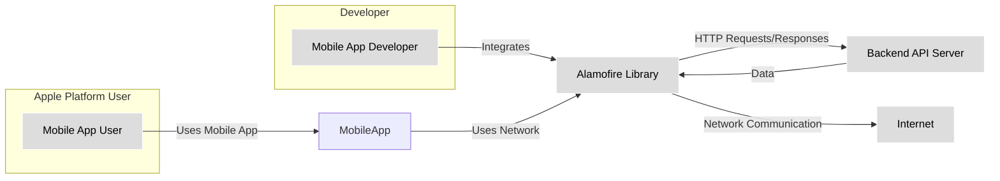
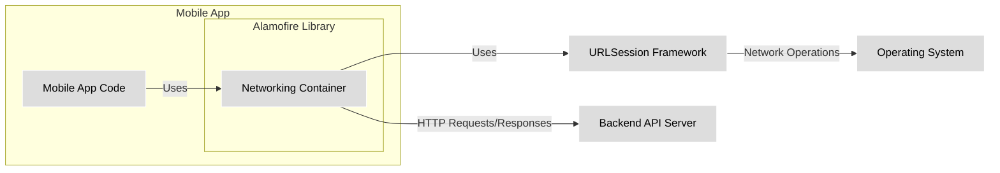

# BUSINESS POSTURE

This project, Alamofire, is a popular HTTP networking library written in Swift. It simplifies the process of making network requests in applications for Apple platforms (iOS, macOS, watchOS, tvOS).

Business priorities for a library like Alamofire are focused on developer productivity and application reliability. Developers choose Alamofire to reduce development time and ensure robust network communication in their applications.

Business goals for Alamofire are:
- Provide a simple and intuitive API for making HTTP requests.
- Offer comprehensive features for common networking tasks (e.g., request and response handling, parameter encoding, authentication).
- Ensure high performance and reliability in network operations.
- Maintain compatibility with the latest Swift and Apple platform versions.
- Foster a strong community and provide good documentation and support.

Most important business risks associated with Alamofire are:
- Security vulnerabilities in Alamofire could be exploited in applications that depend on it, potentially leading to data breaches or application compromise.
- Bugs or performance issues in Alamofire could negatively impact the reliability and user experience of applications using it.
- Lack of maintenance or slow response to security issues could deter developers from using Alamofire, impacting its adoption and community.
- Incompatibility with new platform versions or Swift updates could require significant rework for applications using Alamofire.

# SECURITY POSTURE

Existing security controls for Alamofire project:
- security control: Code is hosted on GitHub, providing transparency and enabling community review. (Implemented: GitHub Repository)
- security control: Public issue tracker on GitHub allows users to report bugs and security vulnerabilities. (Implemented: GitHub Issues)
- security control: Unit and integration tests are included in the repository, aiming to ensure code correctness and prevent regressions. (Implemented: Repository 'Tests' directory and CI configuration)
- security control: Continuous Integration (CI) using GitHub Actions is configured to run tests on code changes. (Implemented: GitHub Workflows in '.github/workflows')
- security control: Swift Package Manager is used for dependency management, which helps in managing and potentially auditing dependencies. (Implemented: `Package.swift` file)

Accepted risks for Alamofire project:
- accepted risk: Reliance on community contributions for identifying and reporting security vulnerabilities.
- accepted risk: Security audits are not explicitly mentioned as a regular practice, so potential vulnerabilities might be missed.
- accepted risk: Open-source nature means vulnerabilities are publicly disclosed once found, potentially creating a window of opportunity for exploitation before fixes are widely deployed.

Recommended security controls for Alamofire project:
- security control: Implement automated dependency scanning to detect known vulnerabilities in third-party dependencies used by Alamofire.
- security control: Integrate static analysis security testing (SAST) tools into the CI pipeline to automatically identify potential security flaws in the code.
- security control: Consider performing periodic security audits by external security experts to proactively identify and address vulnerabilities.
- security control: Establish a clear process for handling security vulnerability reports, including response time expectations and communication strategy.
- security control: Generate and publish Software Bill of Materials (SBOM) to enhance transparency and allow users to easily track dependencies.

Security requirements for Alamofire project:
- Authentication: Alamofire should correctly implement and support various HTTP authentication schemes (e.g., Basic, Bearer, Digest) used by applications.
- Authorization: Alamofire itself does not enforce authorization, but it must not interfere with application-level authorization mechanisms. It should correctly handle authorization headers and responses.
- Input Validation: While Alamofire primarily handles network requests and responses, it should perform basic validation of inputs to prevent unexpected behavior or crashes. For example, handling invalid URLs or malformed headers gracefully. More extensive input validation is the responsibility of applications using Alamofire.
- Cryptography: Alamofire relies on the underlying operating system's TLS/SSL implementation for secure communication (HTTPS). It is crucial that Alamofire correctly utilizes these cryptographic libraries and supports modern, secure protocols and cipher suites. It should avoid insecure cryptographic practices.

# DESIGN

## C4 CONTEXT



Context Diagram Elements:

- 1. Name: Mobile App User
    - 2. Type: Person
    - 3. Description: End-user who interacts with mobile applications built using Alamofire.
    - 4. Responsibilities: Uses mobile applications to access services and data.
    - 5. Security controls: Device security controls (OS updates, screen lock, app permissions), application-level security controls (authentication within the app).

- 1. Name: Mobile App Developer
    - 2. Type: Person
    - 3. Description: Software developer who uses Alamofire library to build network communication features into mobile applications.
    - 4. Responsibilities: Integrates Alamofire into mobile applications, writes code that uses Alamofire to make network requests, and handles responses.
    - 5. Security controls: Secure development practices, code review, using secure coding guidelines when integrating and using Alamofire.

- 1. Name: Alamofire Library
    - 2. Type: Software System
    - 3. Description: Open-source Swift library that simplifies HTTP networking for Apple platforms. Provides an abstraction layer over URLSession and offers a convenient API for making network requests.
    - 4. Responsibilities: Handles HTTP request construction, execution, and response processing. Provides features like parameter encoding, response serialization, request retries, and authentication handling.
    - 5. Security controls: Input validation (basic URL and header validation), reliance on OS-level TLS for secure communication, adherence to secure coding practices in library development.

- 1. Name: Backend API Server
    - 2. Type: Software System
    - 3. Description: Server-side application that provides data and services to mobile applications via APIs. Alamofire is used to communicate with these APIs.
    - 4. Responsibilities: Hosts APIs, processes requests from mobile applications, manages data, and enforces its own security controls.
    - 5. Security controls: Server-side authentication and authorization, input validation, secure API design, protection of backend data, rate limiting, DDoS protection.

- 1. Name: Internet
    - 2. Type: Environment
    - 3. Description: Public network over which mobile applications communicate with backend API servers.
    - 4. Responsibilities: Provides network connectivity.
    - 5. Security controls: Network security controls are outside the scope of Alamofire, but secure communication protocols (HTTPS) are essential when transmitting data over the internet.

## C4 CONTAINER



Container Diagram Elements:

- 1. Name: Networking Container (Alamofire Library)
    - 2. Type: Library
    - 3. Description: This container represents the Alamofire library itself. It encapsulates the core networking logic and provides the API for mobile application developers.
    - 4. Responsibilities:
        - Abstracting URLSession API.
        - Handling request construction and execution.
        - Managing request and response lifecycle.
        - Providing features like parameter encoding, response serialization, and request interception.
    - 5. Security controls:
        - Input validation within the library (e.g., URL validation).
        - Secure handling of network operations using URLSession.
        - Adherence to secure coding practices.

- 1. Name: Mobile App Code
    - 2. Type: Application Code
    - 3. Description: This represents the application-specific code that utilizes the Alamofire library to perform network operations.
    - 4. Responsibilities:
        - Defining network requests using Alamofire API.
        - Handling responses and errors from network requests.
        - Implementing application-level authentication and authorization logic.
        - Processing data received from backend APIs.
    - 5. Security controls:
        - Application-level input validation and sanitization of data received from APIs.
        - Secure storage of sensitive data (if any).
        - Implementation of application-specific authentication and authorization.

- 1. Name: URLSession Framework
    - 2. Type: Operating System Framework
    - 3. Description: Apple's built-in framework for handling network requests. Alamofire is built on top of URLSession.
    - 4. Responsibilities:
        - Performing low-level network operations.
        - Managing network connections.
        - Handling TLS/SSL encryption.
        - Providing APIs for network configuration and control.
    - 5. Security controls:
        - Operating system-level security controls.
        - TLS/SSL implementation for secure communication.
        - Protection against network-level attacks by the OS.

- 1. Name: Backend API Server
    - 2. Type: External System
    - 3. Description: The remote server that the mobile application communicates with using HTTP requests made via Alamofire.
    - 4. Responsibilities:
        - Hosting APIs and providing data and services.
        - Authenticating and authorizing requests.
        - Processing requests and generating responses.
    - 5. Security controls:
        - Server-side security controls (authentication, authorization, input validation, etc.).
        - API security best practices.
        - Infrastructure security.

- 1. Name: Operating System
    - 2. Type: Environment
    - 3. Description: The operating system (iOS, macOS, etc.) on which the mobile application and Alamofire library are running.
    - 4. Responsibilities:
        - Providing the runtime environment for the application and libraries.
        - Managing system resources.
        - Enforcing security policies.
    - 5. Security controls:
        - OS-level security features (sandboxing, permissions, etc.).
        - Security updates and patching.

## DEPLOYMENT

Deployment of Alamofire is as a library integrated into mobile applications. There isn't a separate deployment of Alamofire itself. The applications using Alamofire are deployed to end-user devices (smartphones, tablets, computers).

Deployment Diagram (Conceptual - focusing on library integration):

```mermaid
flowchart LR
    subgraph "Developer Environment"
        A[Developer Machine]
        B[Swift Package Manager]
    end
    subgraph "Build Environment"
        C[CI/CD System]
        D[Build Artifacts (Library)]
    end
    subgraph "Target Environment (User Device)"
        E[Mobile Application]
        F[Alamofire Library (Integrated)]
        G[Operating System (iOS, macOS, etc.)]
    end

    A -->|Adds Dependency| B
    B -->|Downloads| D
    C -->|Builds & Packages| D
    D -->|Included in App| E
    E -->|Uses| F
    F -->|Runs on| G

    classDef plain fill:#ddd,stroke:#fff,stroke-width:1px,color:#000
    class A,B,C,D,E,F,G plain
```

Deployment Diagram Elements:

- 1. Name: Alamofire Library (Integrated)
    - 2. Type: Software Library
    - 3. Description: The Alamofire library as it exists within a deployed mobile application. It's not deployed independently but as part of the application bundle.
    - 4. Responsibilities: Same as the 'Networking Container' in the Container Diagram - handling network requests for the application.
    - 5. Security controls: Inherits security controls from the library development process and is subject to the application's runtime environment security.

- 1. Name: Mobile Application
    - 2. Type: Application
    - 3. Description: The final mobile application that is deployed to end-user devices. It includes the integrated Alamofire library and application-specific code.
    - 4. Responsibilities: Providing application functionality to the user, including network communication via Alamofire.
    - 5. Security controls: Application-level security controls, OS-level sandboxing, user permissions, code signing, app store review processes.

- 1. Name: Operating System (iOS, macOS, etc.)
    - 2. Type: Operating System
    - 3. Description: The operating system on the user's device where the mobile application and Alamofire library run.
    - 4. Responsibilities: Providing the runtime environment, managing resources, enforcing security policies.
    - 5. Security controls: OS-level security features, kernel security, sandboxing, permission management, security updates.

- 1. Name: Developer Machine
    - 2. Type: Development Environment
    - 3. Description: Developer's local machine where they write code and integrate Alamofire into their applications.
    - 4. Responsibilities: Code development, dependency management, local testing.
    - 5. Security controls: Developer machine security practices (OS security, software updates, malware protection), secure coding practices.

- 1. Name: Swift Package Manager
    - 2. Type: Dependency Management Tool
    - 3. Description: Tool used to manage dependencies in Swift projects, including downloading and integrating Alamofire library.
    - 4. Responsibilities: Resolving and downloading dependencies, managing package versions.
    - 5. Security controls: Package integrity checks (checksums), secure download channels (HTTPS).

- 1. Name: CI/CD System
    - 2. Type: Automation System
    - 3. Description: Continuous Integration and Continuous Delivery system used to build, test, and package the Alamofire library (and potentially applications using it).
    - 4. Responsibilities: Automated building, testing, and packaging of software.
    - 5. Security controls: Secure CI/CD pipeline configuration, access controls, build environment security, secure artifact storage.

- 1. Name: Build Artifacts (Library)
    - 2. Type: Software Artifact
    - 3. Description: The compiled and packaged Alamofire library, ready to be integrated into applications.
    - 4. Responsibilities: Providing the distributable form of the Alamofire library.
    - 5. Security controls: Code signing (if applicable), secure storage and distribution of artifacts.

## BUILD

Build Process for Alamofire Library:

```mermaid
flowchart LR
    A[Developer] -->|Code Commit| B(GitHub Repository);
    B -->|Webhook Trigger| C[GitHub Actions CI];
    C -->|Checkout Code| D[Build Environment];
    D -->|Dependency Resolution (SwiftPM)| E[Dependencies];
    D -->|Compilation & Testing| F[Build Artifacts (Library)];
    F -->|Publish (e.g., GitHub Releases, CocoaPods)| G[Package Managers/Distribution];

    subgraph "Build Environment (GitHub Actions)"
        D
        E
        F
    end

    classDef plain fill:#ddd,stroke:#fff,stroke-width:1px,color:#000
    class A,B,C,D,E,F,G plain
```

Build Process Security Controls:

- Supply Chain Security:
    - security control: Dependencies are managed using Swift Package Manager, which helps in version control and dependency resolution. (Implemented: `Package.swift`)
    - security control: Dependency integrity is implicitly checked by Swift Package Manager during resolution and build process. (Implicitly Implemented: SwiftPM)
    - security control: GitHub is used as the primary code repository, providing version control and history tracking. (Implemented: GitHub)

- Build Automation:
    - security control: GitHub Actions is used for CI, automating the build, test, and potentially release process. (Implemented: GitHub Workflows)
    - security control: Automated testing (unit and integration tests) is part of the CI pipeline to ensure code quality and prevent regressions. (Implemented: GitHub Actions workflows running tests)

- Security Checks During Build:
    - security control: Static analysis tools and linters could be integrated into the CI pipeline to automatically detect potential code quality and security issues. (Recommended: Integrate SAST tools in GitHub Actions)
    - security control: Dependency scanning tools could be integrated into the CI pipeline to identify vulnerable dependencies. (Recommended: Integrate dependency scanning in GitHub Actions)
    - security control: Code review process (though not explicitly automated in the build, it's a recommended practice for code changes before merging). (Recommended: Enforce code review process)

- Artifact Security:
    - security control: Build artifacts (compiled library) are produced by the CI system. (Implemented: GitHub Actions builds)
    - security control: Secure storage and distribution of build artifacts (e.g., GitHub Releases, package managers). (Implemented: GitHub Releases, CocoaPods, Swift Package Registry)

# RISK ASSESSMENT

Critical business process we are trying to protect:
- Secure and reliable network communication in applications that depend on Alamofire. This includes ensuring confidentiality, integrity, and availability of data transmitted over the network.

Data we are trying to protect and their sensitivity:
- Data transmitted via Alamofire is application-specific. Alamofire itself is a transport mechanism. The sensitivity of data depends entirely on the applications using Alamofire.
- Sensitive data could include:
    - User credentials (passwords, API keys, tokens).
    - Personal Identifiable Information (PII).
    - Financial data.
    - Proprietary business data.
- The sensitivity level ranges from low (publicly available data) to high (highly confidential user or business data), depending on the application context.

# QUESTIONS & ASSUMPTIONS

Questions:
- What are the typical use cases and application domains where Alamofire is primarily used? Understanding the common use cases will help in focusing threat modeling efforts.
- Are there any specific regulatory compliance requirements that applications using Alamofire might need to adhere to (e.g., GDPR, HIPAA)?
- What is the process for reporting and handling security vulnerabilities in Alamofire? Is there a dedicated security team or contact?
- Are there any known common misconfigurations or insecure usage patterns of Alamofire by developers that should be considered during threat modeling?

Assumptions:
- BUSINESS POSTURE: The primary business goal of Alamofire is to provide a reliable and efficient HTTP networking library for Swift developers, enhancing their productivity and application quality. Security is a critical non-functional requirement for the library.
- SECURITY POSTURE: While Alamofire project implements basic security controls like public issue reporting and CI testing, there is room for improvement in proactive security measures like automated security scanning, regular security audits, and a formalized vulnerability handling process.
- DESIGN: Alamofire is designed as a Swift library that relies on the underlying OS's URLSession framework for network operations. Its security posture is heavily influenced by the security of URLSession and the OS itself. The deployment model is library integration into mobile applications, and the build process uses standard open-source practices with GitHub Actions for CI.