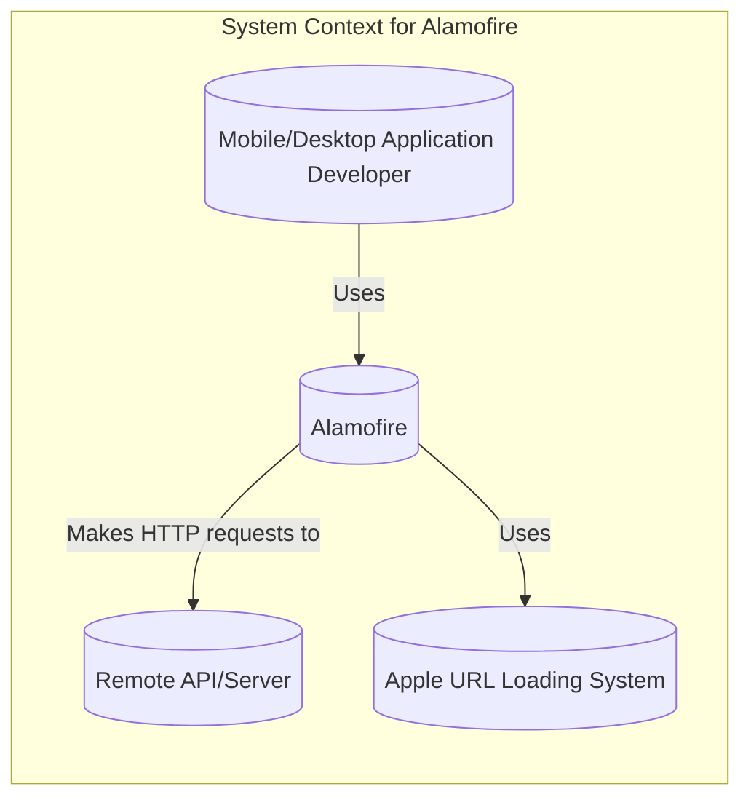
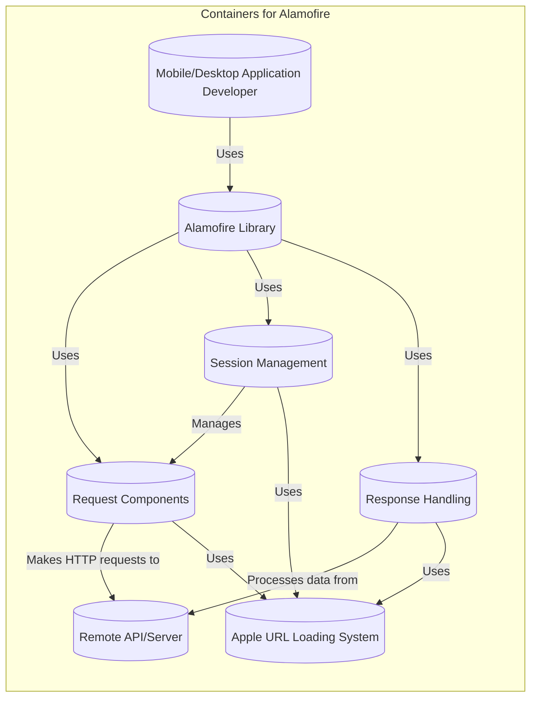
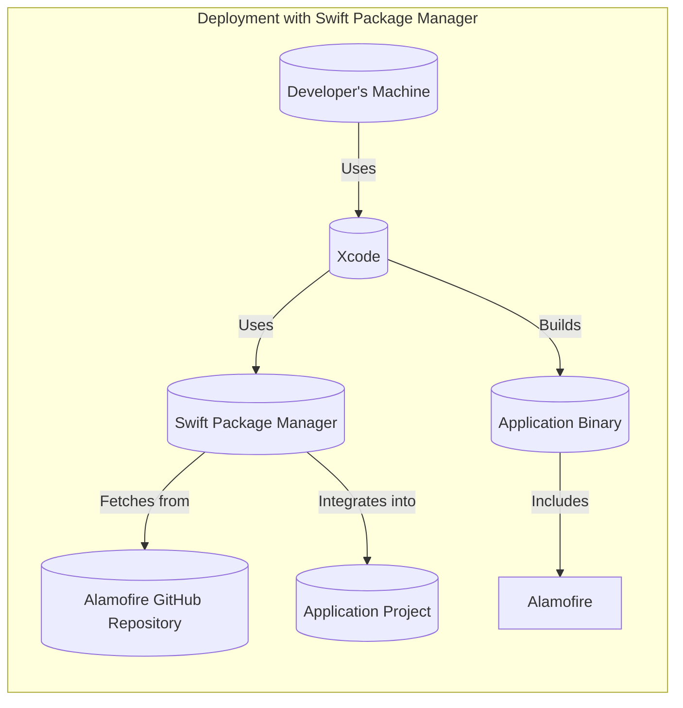
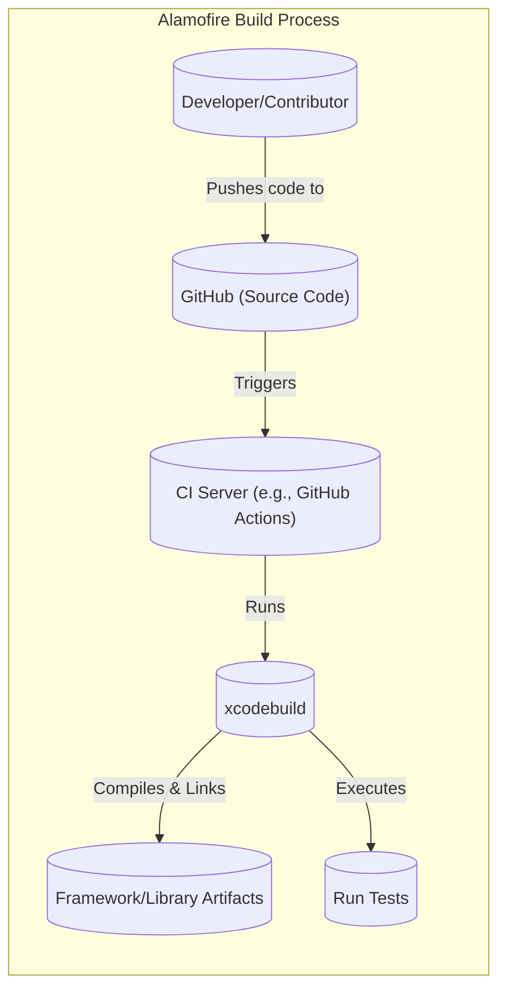

# BUSINESS POSTURE

Alamofire is a very popular open-source Swift-based HTTP networking library for iOS and macOS. It provides an elegant interface on top of Apple's URL Loading System. Given its widespread use, the primary business priorities and goals likely revolve around:

*   Maintaining a robust, reliable, and performant networking library.
*   Ensuring ease of use and adoption for developers.
*   Providing comprehensive features to handle common networking tasks.
*   Maintaining compatibility with the latest Swift and Apple platform updates.
*   Fostering a strong community and ecosystem around the library.
*   Protecting the reputation of the project and its maintainers.

The most important business risks that need to be addressed are:

*   Security vulnerabilities in the library that could be exploited in applications using Alamofire. This is the highest priority risk, as a vulnerability could impact a vast number of applications and users.
*   Performance issues or bugs that could disrupt the functionality of applications using the library.
*   Lack of compatibility with new Swift versions or Apple platform changes, leading to developer frustration and abandonment.
*   Inability to keep up with evolving networking standards and best practices.
*   Negative community perception due to unaddressed issues or lack of responsiveness from maintainers.

# SECURITY POSTURE

Existing security controls (based on the GitHub repository and common practices):

*   security control: Code reviews: Pull requests are used, suggesting a code review process before merging changes. (evident in the contribution guidelines and pull request activity).
*   security control: Community vigilance: A large and active community helps identify and report potential security issues. (evident in the issues and discussions).
*   security control: Use of Swift: Swift, as a memory-safe language, inherently offers some protection against common vulnerabilities like buffer overflows.
*   security control: Dependency on Apple's URL Loading System: Relies on the underlying security features and updates provided by Apple's frameworks (Foundation, specifically `URLSession`).
*   security control: Automated testing: The project includes a comprehensive test suite, which helps identify regressions and potential issues. (evident in the `Tests` directory).
*   security control: Fuzz testing: The project mentions fuzz testing, which is a security testing technique.

Accepted risks:

*   accepted risk: Reliance on third-party dependencies: While Alamofire itself is well-vetted, it might indirectly depend on other libraries, introducing potential supply chain risks. This is a common risk for most software projects.
*   accepted risk: Evolving threat landscape: New vulnerabilities and attack vectors are constantly emerging. Continuous monitoring and updates are necessary to mitigate this risk.
*   accepted risk: User implementation errors: While Alamofire provides a secure interface, developers using the library can still introduce vulnerabilities in their own code (e.g., improper handling of sensitive data, insecure server configurations).

Recommended security controls:

*   Implement a formal Security Development Lifecycle (SDL) process, including threat modeling, static analysis, and regular security audits.
*   Integrate Software Composition Analysis (SCA) tools to identify and manage vulnerabilities in third-party dependencies.
*   Consider implementing a bug bounty program to incentivize security researchers to find and report vulnerabilities.
*   Provide clear security documentation and guidelines for developers using Alamofire.

Security Requirements:

*   Authentication:
    *   The library should support standard authentication mechanisms, including Basic Auth, Bearer Tokens, and API Keys.
    *   It should provide mechanisms for securely storing and managing credentials (e.g., using the Keychain on iOS/macOS).
    *   It should support OAuth 2.0/OIDC flows.
*   Authorization:
    *   While Alamofire primarily handles the transport layer, it should facilitate the implementation of authorization checks by providing easy access to response headers and status codes.
*   Input Validation:
    *   The library should validate user-provided URLs and parameters to prevent common injection vulnerabilities.
    *   It should provide mechanisms for escaping and encoding data to prevent cross-site scripting (XSS) and other injection attacks.
*   Cryptography:
    *   The library should use secure default settings for TLS/SSL connections (e.g., enforcing HTTPS, using strong cipher suites).
    *   It should provide options for customizing TLS/SSL settings, such as certificate pinning, to enhance security.
    *   It should not implement its own cryptographic algorithms but rely on the secure implementations provided by the underlying platform.

# DESIGN

## C4 CONTEXT

Element Descriptions:

*   Element:
    *   Name: Mobile/Desktop Application Developer
    *   Type: Person
    *   Description: A developer building an iOS or macOS application that needs to communicate with a remote API or server.
    *   Responsibilities: Integrates Alamofire into their application, configures requests, handles responses, and manages data.
    *   Security controls: Implements secure coding practices in their application, securely manages credentials, and follows Alamofire's security guidelines.

*   Element:
    *   Name: Alamofire
    *   Type: Software System
    *   Description: The Swift-based HTTP networking library.
    *   Responsibilities: Provides a high-level interface for making HTTP requests, handling responses, managing sessions, and performing other networking tasks.
    *   Security controls: Uses secure default settings, validates inputs, relies on Apple's secure URL Loading System, and provides mechanisms for secure configuration.

*   Element:
    *   Name: Remote API/Server
    *   Type: Software System
    *   Description: The external API or server that the application communicates with.
    *   Responsibilities: Processes requests from the application, returns data, and enforces its own security policies.
    *   Security controls: Implements authentication, authorization, input validation, and other security measures to protect its resources.

*   Element:
    *   Name: Apple URL Loading System
    *   Type: Software System
    *   Description: The underlying Apple framework (Foundation, specifically `URLSession`) that provides the core networking functionality.
    *   Responsibilities: Handles low-level network communication, manages connections, and enforces system-level security policies.
    *   Security controls: Implements TLS/SSL, certificate validation, and other security features provided by the operating system.

## C4 CONTAINER

Element Descriptions:

*   Element:
    *   Name: Mobile/Desktop Application Developer
    *   Type: Person
    *   Description: A developer building an iOS or macOS application.
    *   Responsibilities: Integrates and uses the Alamofire library.
    *   Security controls: Secure coding practices, credential management.

*   Element:
    *   Name: Alamofire Library
    *   Type: Library
    *   Description: The main entry point for developers using the library.
    *   Responsibilities: Provides a simplified interface for common networking tasks.
    *   Security controls: Secure defaults, input validation.

*   Element:
    *   Name: Request Components
    *   Type: Component
    *   Description: Handles the creation and configuration of HTTP requests.
    *   Responsibilities: Building URLs, setting headers, encoding parameters, managing timeouts.
    *   Security controls: URL validation, parameter encoding.

*   Element:
    *   Name: Session Management
    *   Type: Component
    *   Description: Manages network sessions and configurations.
    *   Responsibilities: Creating and managing `URLSession` instances, handling cookies, caching.
    *   Security controls: Secure session configuration, TLS/SSL settings.

*   Element:
    *   Name: Response Handling
    *   Type: Component
    *   Description: Processes responses from the server.
    *   Responsibilities: Parsing data, handling errors, validating status codes.
    *   Security controls: Response validation, error handling.

*   Element:
    *   Name: Remote API/Server
    *   Type: Software System
    *   Description: The external API or server.
    *   Responsibilities: Processing requests, returning data.
    *   Security controls: Authentication, authorization, input validation.

*   Element:
    *   Name: Apple URL Loading System
    *   Type: Framework
    *   Description: Apple's Foundation framework (`URLSession`).
    *   Responsibilities: Low-level network communication.
    *   Security controls: TLS/SSL, certificate validation.

## DEPLOYMENT

Alamofire is a library, not a standalone application, so deployment in the traditional sense doesn't apply. Instead, it's *integrated* into other applications. However, we can describe how it's distributed and integrated:

Possible Distribution Methods:

1.  CocoaPods: A dependency manager for Swift and Objective-C Cocoa projects.
2.  Carthage: A decentralized dependency manager for Cocoa.
3.  Swift Package Manager (SPM): The official package manager for Swift.
4.  Manual Integration: Downloading the source code and directly adding it to a project.

Chosen Method (for detailed description): Swift Package Manager (SPM)

SPM is the recommended and most modern approach.

Element Descriptions:

*   Element:
    *   Name: Developer's Machine
    *   Type: Device
    *   Description: The developer's computer where the application is being built.
    *   Responsibilities: Hosts the development environment and source code.
    *   Security controls: Standard development machine security practices.

*   Element:
    *   Name: Xcode
    *   Type: IDE
    *   Description: Apple's integrated development environment.
    *   Responsibilities: Provides tools for coding, building, and debugging.
    *   Security controls: Code signing, sandboxing.

*   Element:
    *   Name: Swift Package Manager
    *   Type: Tool
    *   Description: The package manager for Swift.
    *   Responsibilities: Fetches, builds, and integrates dependencies.
    *   Security controls: Dependency verification (checksums).

*   Element:
    *   Name: Alamofire GitHub Repository
    *   Type: Repository
    *   Description: The source code repository for Alamofire.
    *   Responsibilities: Hosts the source code and releases.
    *   Security controls: Access controls, branch protection.

*   Element:
    *   Name: Application Project
    *   Type: Project
    *   Description: The developer's application project.
    *   Responsibilities: Contains the application's code and resources.
    *   Security controls: Application-specific security measures.

*   Element:
    *   Name: Application Binary
    *   Type: Binary
    *   Description: The compiled application.
    *   Responsibilities: Runs the application's logic.
    *   Security controls: Code signing, runtime protections.

## BUILD

The build process for Alamofire itself (not the application using it) involves compiling the Swift source code into a framework. This is typically automated using Xcode's build system and, increasingly, Swift Package Manager.

Security Controls in the Build Process:

*   Continuous Integration (CI): Alamofire uses GitHub Actions for CI, which automates the build and testing process on every commit and pull request. This helps ensure that changes don't introduce regressions or security vulnerabilities.
*   Automated Testing: The CI process includes running a comprehensive test suite, which helps identify bugs and potential security issues.
*   Static Analysis: While not explicitly mentioned in the repository, it's highly recommended to integrate static analysis tools (e.g., SwiftLint, SonarQube) into the CI pipeline to detect code quality and potential security issues.
*   Dependency Management: Using SPM, CocoaPods, or Carthage helps manage dependencies and ensure that the correct versions are used.  SCA tools should be used to monitor for vulnerabilities in these dependencies.
*   Code Signing:  While not directly part of the *library's* build, applications *using* Alamofire will typically be code-signed, ensuring their integrity and authenticity.

# RISK ASSESSMENT

*   Critical Business Processes:
    *   Providing a reliable and secure networking library for developers.
    *   Maintaining the trust and reputation of the Alamofire project.
    *   Enabling developers to build secure and functional applications.

*   Data Protection:
    *   Alamofire itself does not directly handle or store sensitive user data. It primarily deals with the *transmission* of data.  The *sensitivity* of the data depends entirely on the *application* using Alamofire.
    *   However, Alamofire *must* ensure the *secure transmission* of data, protecting it from eavesdropping and tampering (e.g., through proper TLS/SSL implementation).
    *   Types of data that *could* be transmitted using Alamofire (depending on the application) include:
        *   Personally Identifiable Information (PII): Names, addresses, email addresses, etc. (High sensitivity)
        *   Financial Data: Credit card numbers, bank account details, etc. (High sensitivity)
        *   Authentication Credentials: Usernames, passwords, API keys, tokens. (High sensitivity)
        *   Health Information: Medical records, health status. (High sensitivity)
        *   Location Data: User's location. (Medium to High sensitivity)
        *   Application-Specific Data: Any other data used by the application. (Sensitivity varies)

# QUESTIONS & ASSUMPTIONS

*   Questions:
    *   Are there any specific compliance requirements (e.g., HIPAA, GDPR) that applications using Alamofire commonly need to meet? This would influence recommendations for security controls.
    *   What is the current process for handling reported security vulnerabilities? Is there a security contact or reporting mechanism?
    *   Are there any plans to implement more advanced security features, such as certificate pinning, by default?
    *   Is there a formal process for reviewing and approving changes to the library's core networking logic?

*   Assumptions:
    *   Business Posture: The primary goal is to provide a secure and reliable networking library, prioritizing security and stability over rapid feature development.
    *   Security Posture: The maintainers are committed to following security best practices and addressing vulnerabilities promptly.
    *   Design: The library is designed to be modular and extensible, allowing developers to customize its behavior and integrate it with other security tools. The library relies on Apple's URL Loading System for the core networking functionality and security.
    *   The project uses GitHub Actions for continuous integration.
    *   Developers using Alamofire are responsible for implementing appropriate security measures in their own applications.