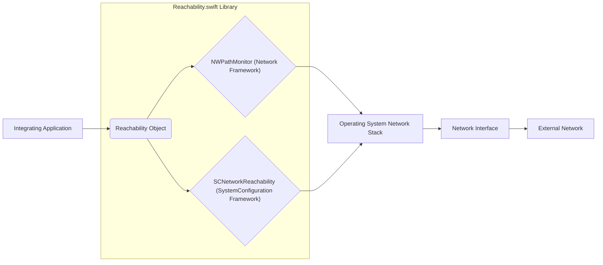
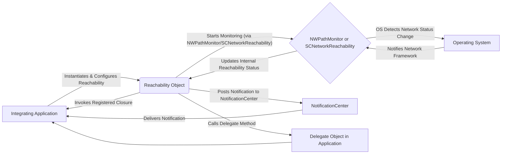

## Project Design Document: Reachability.swift (Improved)

**1. Introduction**

This document provides an enhanced and detailed architectural design for the `reachability.swift` project, a Swift library designed for detecting network connectivity changes across Apple platforms (iOS, macOS, watchOS, tvOS). This document is intended to be a comprehensive resource for subsequent threat modeling exercises, clearly outlining the system's components, data flow mechanisms, and key interactions. The focus is on providing sufficient detail to identify potential vulnerabilities and attack vectors.

**2. Goals**

The primary goals of the `reachability.swift` library are:

* **Precise Network Status Determination:** To offer a reliable and accurate assessment of the current network connectivity status, distinguishing between various states such as connected via Wi-Fi, connected via cellular, or completely disconnected.
* **Broad Platform Support:** To ensure compatibility and consistent behavior across a wide spectrum of Apple operating systems.
* **Simple Integration API:** To provide developers with an intuitive and straightforward API for incorporating network reachability monitoring into their applications.
* **Minimal Resource Impact:** To operate efficiently, minimizing battery consumption and overall resource utilization on the device.
* **Configurable Monitoring:** To allow developers to tailor the reachability monitoring behavior to their specific needs, such as monitoring specific hostnames.

**3. Architecture Overview**

The `reachability.swift` library acts as an intermediary, abstracting away the complexities of the underlying operating system's network monitoring capabilities. It primarily interfaces with Apple's `Network.framework` (on contemporary systems) or the legacy `SystemConfiguration` framework. The library offers a streamlined and unified interface for applications to subscribe to network status change notifications.

**4. Component Details**

* **`Reachability` Class:** This central class is the core of the library, encapsulating the logic for monitoring network reachability. Its key responsibilities include:
    * **Initialization Methods:** Providing various initializers to set up the network monitoring mechanism, allowing specification of a host to monitor or defaulting to general internet connectivity.
    * **Status Tracking Properties:** Maintaining the current network reachability status, typically represented by an enum or a set of boolean flags indicating different connection types.
    * **Notification Management:** Offering mechanisms for registering and unregistering listeners for network status changes, including closures, `NotificationCenter` notifications, and delegate protocols.
    * **Configuration Options:** Allowing customization of monitoring behavior, such as specifying a hostname for targeted reachability checks.
    * **Error Handling Mechanisms:**  Managing and potentially exposing errors encountered during the network monitoring process.
    * **Start and Stop Monitoring Functions:** Providing methods to explicitly start and stop the network monitoring process, controlling resource usage.
    * **Internal State Management:** Managing the internal state related to the underlying framework being used and the current reachability status.

* **`NWPathMonitor` (Network Framework):** Employed on newer iOS, macOS, watchOS, and tvOS versions, this framework offers a modern and efficient approach to monitoring network path changes.
    * **Path Monitoring Initiation:**  Responsible for initiating the monitoring of network paths.
    * **Path Update Handling:** Receiving notifications from the operating system about changes in network path availability, connectivity type (Wi-Fi, cellular, etc.), and other characteristics.
    * **Interface Information Provision:** Providing details about the network interface currently in use.
    * **Status Evaluation:** Determining the reachability status based on the path updates received.

* **`SCNetworkReachability` (SystemConfiguration Framework):** Utilized on older systems or when specific compatibility with legacy systems is required. It provides a C-based API for assessing the reachability of hosts or network addresses.
    * **Reachability Context Creation:** Setting up a context for the reachability monitoring.
    * **Callback Function Registration:** Registering a callback function to be invoked when the reachability status changes.
    * **Schedule on Run Loop:** Scheduling the reachability monitoring on a run loop to receive notifications.
    * **Status Querying:**  Allowing direct querying of the current reachability status.

* **Notification Mechanisms:** The library offers several distinct methods for applications to receive updates regarding network reachability:
    * **Closure-Based Notifications:** Allowing the registration of closures that are executed when the reachability status changes, providing a concise and direct way to handle updates.
    * **`NotificationCenter` Notifications:** Posting `Notification` objects to the shared `NotificationCenter` when the reachability status changes. This enables a decoupled observer pattern where multiple components can listen for updates without direct dependencies. The notification typically includes information about the new reachability status in its `userInfo` dictionary.
    * **Delegate Protocol:** Defining a delegate protocol with methods that are invoked when the reachability status changes. This pattern allows for a more structured approach to handling updates, particularly in object-oriented designs.

**5. Data Flow**

The typical sequence of events for network reachability monitoring unfolds as follows:

**Detailed Steps:**

1. **Initialization and Configuration:** The integrating application creates an instance of the `Reachability` class, potentially configuring it to monitor a specific hostname or selecting a preferred notification mechanism (closure, notification, or delegate).
2. **Monitoring Initiation:** The application instructs the `Reachability` object to start monitoring. Internally, `Reachability` initializes either `NWPathMonitor` or `SCNetworkReachability` based on the operating system version and configuration.
3. **Operating System Monitoring:** The underlying operating system frameworks actively monitor network interface states and connectivity status.
4. **Network Status Change Detection:** The operating system detects a change in network connectivity, such as a transition from Wi-Fi to cellular or a complete loss of connection.
5. **Framework Notification:** The operating system informs the relevant network framework (`NWPathMonitor` or `SCNetworkReachability`) about the detected change.
6. **Reachability Object Update:** The network framework updates the internal state of the `Reachability` object to reflect the new network status.
7. **Notification to Application:** The `Reachability` object, based on its configured notification mechanism, informs the integrating application about the change:
    * **Closure Invocation:** If a closure was registered, it is executed with the updated reachability status.
    * **Notification Posting:** If notifications are used, a notification is posted to the `NotificationCenter`, which then delivers it to any registered observers (including the integrating application).
    * **Delegate Method Call:** If a delegate was set, the appropriate delegate method is called on the delegate object within the integrating application.
8. **Application Handling:** The integrating application receives the reachability update and can then perform necessary actions, such as displaying an alert to the user, attempting to reconnect, or adjusting its network-dependent functionality.

**6. Security Considerations (for Threat Modeling)**

When conducting threat modeling for applications utilizing `reachability.swift`, consider the following potential security implications and attack vectors:

* **Information Disclosure:**
    * **Exposure of Network Configuration:** Could vulnerabilities in the library or its integration expose information about the device's network interfaces, connected networks (SSID), or IP addresses to unauthorized parties?
    * **Reachability Status Leakage:** Could an attacker intercept reachability notifications or observe the application's behavior based on reachability changes to infer sensitive information about the user's environment or activities?
* **Denial of Service (DoS):**
    * **Resource Exhaustion:** Could an attacker manipulate network conditions or send crafted network signals that cause the `Reachability` library or the integrating application to consume excessive resources (CPU, memory, battery), leading to a denial of service?
    * **Notification Flooding:** Could an attacker trigger a rapid series of spurious network status changes, causing a flood of notifications that overwhelm the application's processing capabilities?
* **Spoofing and Tampering:**
    * **Reachability Status Manipulation:** Could an attacker spoof network events or tamper with the data provided by the underlying operating system frameworks to provide incorrect reachability information to the application, leading to incorrect application behavior? For example, falsely reporting connectivity to prevent an application from attempting a necessary reconnection.
* **Privacy Implications:**
    * **Passive Network Monitoring:** While `reachability.swift` itself doesn't inherently collect personal data, its usage could contribute to broader network monitoring within an application. Consider if the application logs or transmits reachability status in a way that could be privacy-invasive.
* **API Misuse:**
    * **Improper Error Handling:** Developers might not properly handle errors returned by the `Reachability` library or the underlying frameworks, potentially leading to unexpected behavior or vulnerabilities.
    * **Ignoring Reachability Changes:** Applications might not react appropriately to reachability changes, leading to security issues like attempting to transmit data over an unavailable network.
* **Dependency Vulnerabilities:**
    * **Underlying Framework Flaws:** Vulnerabilities within the `Network.framework` or `SystemConfiguration` framework could be indirectly exploitable through the `Reachability` library. Keeping up-to-date with system updates is crucial.
* **Man-in-the-Middle Attacks:**
    * While `reachability.swift` doesn't directly handle network traffic, if an attacker performs a MITM attack, they could potentially influence the network conditions reported to the operating system, thus affecting the reachability status reported by the library.

**7. Dependencies**

* **Swift Standard Library:** The fundamental building blocks of the Swift language.
* **Foundation Framework:** Provides essential utility classes, data structures, and operating system services.
* **Network Framework (on iOS 12+, macOS 10.14+, watchOS 5+, tvOS 12+):** Apple's modern framework for network programming, offering more advanced features and better performance.
* **SystemConfiguration Framework (on older systems):** Apple's legacy framework for accessing system configuration information, including network reachability.

**8. Deployment**

The `reachability.swift` library is typically integrated into Xcode projects using one of the following methods:

* **Swift Package Manager (SPM):**  The recommended approach for modern Swift projects. Developers add the library's Git repository URL as a dependency in their `Package.swift` file.
* **CocoaPods:** A dependency manager for Swift and Objective-C projects. Developers specify the library in their `Podfile` and run `pod install`.
* **Carthage:** A decentralized dependency manager for macOS and iOS. Developers list the library in their `Cartfile` and run `carthage update`.
* **Manual Integration:** Developers can download the source code and manually add the `.swift` files to their Xcode project. This approach is generally not recommended due to the lack of dependency management.

Once integrated, developers can import the `Reachability` module and instantiate the `Reachability` class to begin monitoring network connectivity within their application code.

**9. Future Considerations**

* **Improved Granularity of Status Updates:** Providing more detailed information about the network connection, such as signal strength or connection quality.
* **Reactive Programming Integration (Combine/Async-Await):** Offering more idiomatic integration with modern asynchronous programming paradigms in Swift.
* **Enhanced Testing and Code Coverage:** Continuously improving the test suite to ensure robustness and reliability across different network conditions and platform versions.
* **Modularization:**  Potentially breaking down the library into smaller, more focused components for better maintainability and testability.
* **Documentation Enhancements:** Providing more comprehensive documentation, including examples and best practices for secure and efficient usage.

This improved design document provides a more detailed and nuanced understanding of the `reachability.swift` project's architecture, data flow, and security considerations. This enhanced information will be valuable for conducting thorough threat modeling exercises and identifying potential vulnerabilities.