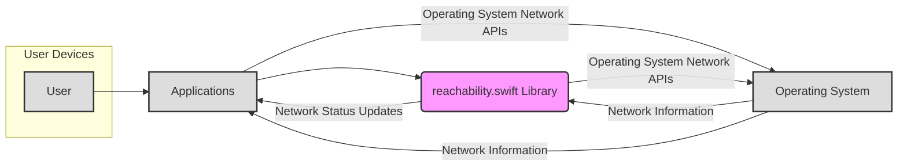
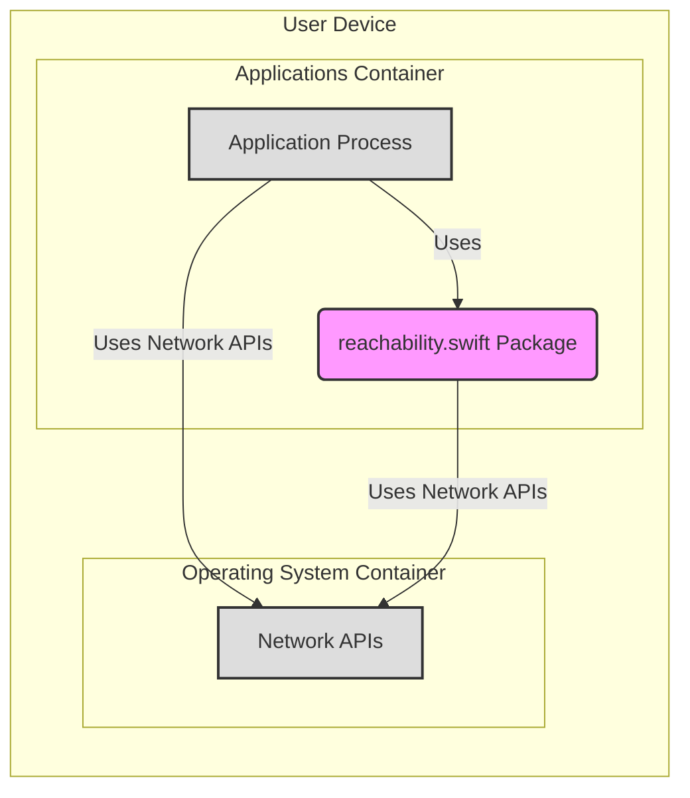
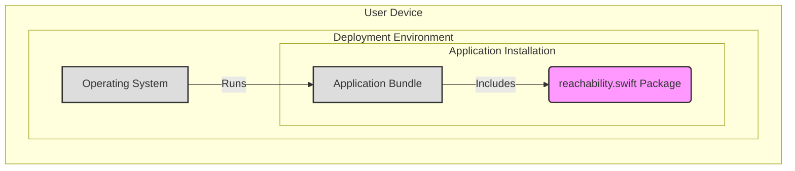

# BUSINESS POSTURE

- Business Priorities and Goals:
  - The primary business priority is to enhance the user experience of applications by providing reliable network reachability information.
  - The goal is to allow applications to gracefully handle network connectivity changes, improving application reliability and user satisfaction. This is especially important for applications that heavily rely on network access for their core functionality, such as social media, communication, e-commerce, and cloud-based services.

- Business Risks:
  - Incorrect network reachability information provided by the library could lead to application malfunction, degraded user experience, and potentially loss of revenue for businesses relying on these applications.
  - Security vulnerabilities within the `reachability.swift` library could be exploited by malicious actors if widely adopted, potentially impacting a large number of applications and their users.
  - As an external dependency, the library introduces supply chain risks. If the library is compromised or becomes unavailable, it could affect applications that depend on it.
  - Lack of ongoing maintenance and updates to the library could lead to compatibility issues with newer operating system versions or security vulnerabilities remaining unpatched.

# SECURITY POSTURE

- Existing Security Controls:
  - security control: Open Source Codebase - The library is hosted on GitHub and is open source, allowing for public review of the code by the community. (Implemented: GitHub repository)
  - security control: Swift Language - The library is written in Swift, a modern language with built-in memory safety features, reducing the risk of certain types of vulnerabilities like buffer overflows. (Implemented: Language choice)

- Accepted Risks:
  - accepted risk: Dependency on External Library - Relying on an external, open-source library introduces a dependency risk. The security and maintenance of the library are dependent on the maintainers.
  - accepted risk: Potential Vulnerabilities - Like any software, `reachability.swift` may contain undiscovered security vulnerabilities.

- Recommended Security Controls:
  - security control: Regular Security Audits - Conduct periodic security audits of the `reachability.swift` library code to identify and address potential vulnerabilities.
  - security control: Dependency Scanning - Implement dependency scanning tools to monitor for known vulnerabilities in any external dependencies the library might use (though it appears to have minimal external dependencies).
  - security control: Secure Development Practices - Encourage and verify that the library maintainers follow secure development practices, including code reviews, automated testing, and timely patching of reported vulnerabilities.
  - security control: Input Validation and Error Handling - Ensure robust input validation and error handling within the library to prevent unexpected behavior or crashes when encountering unusual network conditions or API responses.

- Security Requirements:
  - Authentication: Not applicable. `reachability.swift` is a library and does not handle user authentication.
  - Authorization: Not applicable. `reachability.swift` is a library and does not handle user authorization.
  - Input Validation: The library should robustly handle various network states and system responses without crashing or exhibiting unexpected behavior. It should validate inputs from system network APIs to prevent issues arising from malformed or unexpected data.
  - Cryptography: Not applicable. `reachability.swift` is primarily focused on network reachability detection and does not inherently involve cryptographic operations. If future enhancements involve network communication for reachability checks, secure communication protocols should be considered.

# DESIGN

## C4 CONTEXT



- Context Diagram Elements:
  - Element:
    - Name: User
    - Type: Person
    - Description: End-users who use applications on their devices.
    - Responsibilities: Interact with applications that utilize network connectivity.
    - Security controls: User devices are assumed to have standard device security controls (passcodes, biometrics, OS security features).

  - Element:
    - Name: Applications
    - Type: System
    - Description: Applications (iOS, macOS, watchOS, tvOS) that integrate the `reachability.swift` library to monitor network reachability.
    - Responsibilities: Provide functionality to users, rely on network connectivity, use `reachability.swift` to adapt to network changes.
    - Security controls: Application-level security controls (authentication, authorization, data protection, input validation within the application logic).

  - Element:
    - Name: reachability.swift Library
    - Type: System
    - Description: The `reachability.swift` library itself, providing network reachability monitoring capabilities to applications.
    - Responsibilities: Monitor network reachability status, provide updates to applications, abstract away OS-specific network APIs.
    - Security controls: Code reviews, vulnerability scanning (recommended), secure coding practices during development and maintenance.

  - Element:
    - Name: Operating System
    - Type: External System
    - Description: The operating system (iOS, macOS, watchOS, tvOS) on user devices, providing network APIs.
    - Responsibilities: Manage network connections, provide network status information to applications and libraries.
    - Security controls: Operating system level security controls (kernel security, network stack security, API access controls).

## C4 CONTAINER



- Container Diagram Elements:
  - Element:
    - Name: Application Process
    - Type: Container
    - Description: The running application process on the user's device that integrates and utilizes the `reachability.swift` library.
    - Responsibilities: Execute application logic, interact with the user, use `reachability.swift` for network monitoring, handle network connectivity changes.
    - Security controls: Application-level security controls, process isolation provided by the OS.

  - Element:
    - Name: reachability.swift Package
    - Type: Container
    - Description: The `reachability.swift` library packaged as a Swift Package, integrated into the application.
    - Responsibilities: Provide network reachability monitoring functionality, encapsulate network API interactions.
    - Security controls: Code within the package, subject to code reviews and potential vulnerability scanning.

  - Element:
    - Name: Network APIs
    - Type: Container
    - Description: Operating System provided Network APIs that `reachability.swift` and Applications use to get network status.
    - Responsibilities: Provide interfaces for applications and libraries to interact with the network subsystem, manage network connections.
    - Security controls: Operating system level security controls on network APIs, access control mechanisms within the OS.

## DEPLOYMENT

- Deployment Architecture:
  - The `reachability.swift` library is deployed as part of applications distributed through app stores (Apple App Store for iOS, macOS, watchOS, tvOS). There isn't a separate deployment of the library itself, it's embedded within each application that uses it.



- Deployment Diagram Elements:
  - Element:
    - Name: Operating System
    - Type: Deployment Environment
    - Description: The target operating system environment (iOS, macOS, watchOS, tvOS) on user devices where applications are deployed.
    - Responsibilities: Provide runtime environment for applications, manage system resources, enforce security policies.
    - Security controls: OS-level security features, sandboxing of applications, permission management.

  - Element:
    - Name: Application Bundle
    - Type: Software
    - Description: The packaged application ready for deployment, containing the application code and integrated libraries, including `reachability.swift`.
    - Responsibilities: Deliver application functionality to users, include all necessary components for execution.
    - Security controls: Application signing, code integrity checks by the OS, app store review processes.

  - Element:
    - Name: reachability.swift Package
    - Type: Software Component
    - Description: The `reachability.swift` library as a component within the application bundle.
    - Responsibilities: Provide network reachability monitoring within the deployed application.
    - Security controls: Security of the library code itself, as deployed within the application.

## BUILD

- Build Process:
  - The build process for applications using `reachability.swift` typically involves using Xcode and the Swift Package Manager (SPM). The `reachability.swift` library is added as a dependency to the application's Swift package manifest.

```mermaid
flowchart LR
    A[Developer] --> B{Code Changes (reachability.swift & Application Code)}
    B --> C[Source Code Repository (GitHub)]
    C --> D[CI/CD System (e.g., GitHub Actions, Xcode Cloud)]
    D --> E{Build Process (Swift Package Manager, Xcode Build)}
    E --> F[Security Checks (Linting, Static Analysis - Recommended)]
    F --> G[Build Artifacts (Application Bundle)]
    G --> H[Distribution (App Store, TestFlight)]
    style C fill:#ccf,stroke:#333,stroke-width:2px
    style F fill:#ffc,stroke:#333,stroke-width:2px
    classDef plain fill:#ddd,stroke:#333,stroke-width:2px,color:#333
    class A,B,D,E,G,H plain
```

- Build Process Elements:
  - Element:
    - Name: Developer
    - Type: Person
    - Description: Software developers who write and modify code for applications and potentially contribute to `reachability.swift`.
    - Responsibilities: Write secure code, commit code changes, participate in code reviews.
    - Security controls: Developer workstations security, secure coding training, code review processes.

  - Element:
    - Name: Source Code Repository (GitHub)
    - Type: System
    - Description: Version control system (GitHub) hosting the source code for `reachability.swift` and applications using it.
    - Responsibilities: Securely store and manage source code, track changes, facilitate collaboration.
    - Security controls: Access controls, authentication, audit logging, branch protection, vulnerability scanning (GitHub Advanced Security).

  - Element:
    - Name: CI/CD System (e.g., GitHub Actions, Xcode Cloud)
    - Type: System
    - Description: Automated CI/CD system used to build, test, and potentially deploy applications.
    - Responsibilities: Automate build process, run tests, perform security checks, create build artifacts.
    - Security controls: Secure pipeline configuration, access controls, secrets management, build environment security.

  - Element:
    - Name: Build Process (Swift Package Manager, Xcode Build)
    - Type: Process
    - Description: The actual build process using Swift Package Manager and Xcode build tools to compile code and create application bundles.
    - Responsibilities: Compile source code, link libraries, package application resources.
    - Security controls: Use of trusted build tools, dependency management, secure build configurations.

  - Element:
    - Name: Security Checks (Linting, Static Analysis - Recommended)
    - Type: Process
    - Description: Security checks integrated into the build process, such as code linting and static analysis, to identify potential code quality and security issues.
    - Responsibilities: Identify potential vulnerabilities and code defects early in the development lifecycle.
    - Security controls: Static analysis tools, linters, security rulesets, automated reporting.

  - Element:
    - Name: Build Artifacts (Application Bundle)
    - Type: Software
    - Description: The resulting application bundle produced by the build process, ready for distribution.
    - Responsibilities: Package application for distribution, contain all necessary components.
    - Security controls: Code signing, artifact integrity checks, secure storage of build artifacts.

  - Element:
    - Name: Distribution (App Store, TestFlight)
    - Type: System
    - Description: Platforms used to distribute applications to end-users (Apple App Store, TestFlight for beta testing).
    - Responsibilities: Distribute applications to users, manage application updates, enforce app store policies.
    - Security controls: App store review process, application signing verification, platform security features.

# RISK ASSESSMENT

- Critical Business Processes:
  - Application functionality that relies on network connectivity is the critical business process being supported and potentially impacted by `reachability.swift`. This includes features like data synchronization, online content delivery, communication services, and e-commerce transactions within applications.

- Data to Protect and Sensitivity:
  - `reachability.swift` itself does not directly handle sensitive user data. However, incorrect reachability information or vulnerabilities in the library could indirectly impact applications that do handle sensitive data. For example, if reachability is incorrectly reported, an application might attempt to transmit sensitive data over an insecure network or fail to properly secure data due to a perceived lack of network connectivity.
  - Data Sensitivity: Low to Medium. The sensitivity is indirect and depends on the applications using the library. If applications using `reachability.swift` handle highly sensitive data (e.g., financial or health information), then the indirect impact of issues in `reachability.swift` could be significant. For applications handling less sensitive data, the impact would be lower.

# QUESTIONS & ASSUMPTIONS

- Questions:
  - What are the specific performance requirements for reachability checks in typical use cases? Are there latency or resource consumption constraints?
  - Are there any specific regulatory compliance requirements that applications using `reachability.swift` need to adhere to regarding network monitoring or data handling?
  - What is the intended scope of network reachability monitoring? Is it limited to internet connectivity, or does it also include local network reachability?
  - What is the process for reporting and addressing security vulnerabilities in `reachability.swift`?

- Assumptions:
  - The primary use case for `reachability.swift` is within mobile and desktop applications developed for Apple platforms (iOS, macOS, watchOS, tvOS).
  - The library's main function is to provide accurate and timely network reachability status to applications.
  - `reachability.swift` is intended to be a lightweight library with minimal overhead on application performance and resource usage.
  - The library does not collect or transmit any user data itself; it only provides network status information to the integrating application.
  - The security of applications using `reachability.swift` is a shared responsibility, with application developers responsible for implementing application-level security controls and the library maintainers responsible for the security of the library code itself.