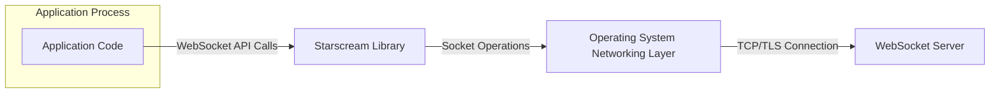
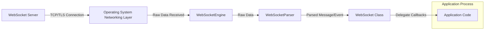

# Project Design Document: Starscream WebSocket Library

**Version:** 1.1
**Date:** October 26, 2023
**Prepared By:** Gemini (AI Language Model)

## 1. Introduction

This document provides a detailed architectural design for the Starscream WebSocket library ([https://github.com/daltoniam/starscream](https://github.com/daltoniam/starscream)). This design aims to provide a comprehensive understanding of the library's structure, components, and data flow, which will serve as a robust foundation for future threat modeling activities. The document focuses on the core functionality and key architectural elements directly relevant to security considerations and potential vulnerabilities.

## 2. Project Goals

The primary goals of the Starscream library are:

* To provide a reliable and performant WebSocket client implementation for Swift across various Apple platforms.
* To offer a developer-friendly and intuitive API for establishing, maintaining, and managing WebSocket connections.
* To abstract the complexities of the RFC 6455 WebSocket protocol, including handshaking, framing, control frames, and error handling.
* To seamlessly support secure WebSocket connections (WSS) leveraging TLS/SSL.
* To provide a clear mechanism for handling asynchronous connection events (open, close, error) and message reception (text and binary).
* To be resource-efficient and minimize overhead on the client device.

## 3. Target Audience

This document is intended for:

* Security engineers responsible for identifying and mitigating potential security risks associated with the Starscream library and applications that utilize it.
* Software developers who require a deep understanding of the library's internal architecture for debugging, extending its functionality, or integrating it into their projects.
* System architects who need to understand how Starscream functions and interacts with other components within a larger system design, particularly concerning network communication and security.

## 4. Scope

This document details the architectural design of the Starscream library itself, focusing on its internal components and their interactions. The scope includes:

* Implementation of the core WebSocket protocol as defined in RFC 6455.
* Handling of underlying TCP/TLS socket connections, including connection establishment and management.
* WebSocket message framing and deframing, including handling of fragmentation and control frames.
* Management of the WebSocket connection state lifecycle (connecting, open, closing, closed).
* The public API exposed to developers for interacting with the library.
* Key internal interfaces and data structures.

The following are explicitly outside the scope of this document:

* Specific applications that utilize the Starscream library.
* Server-side WebSocket implementations or the security of those servers.
* Detailed performance benchmarks or optimization strategies.
* Implementation details of the underlying operating system's networking libraries beyond their interaction with Starscream.

## 5. Architecture Overview

Starscream acts as a client-side library, enabling Swift applications to communicate with WebSocket servers. It encapsulates the intricacies of the WebSocket protocol, presenting a simplified API to developers.



* **"Application Code"**: The Swift application code that utilizes the Starscream library to initiate and manage WebSocket communication.
* **"Starscream Library"**: The core component, responsible for implementing the WebSocket protocol and managing the connection lifecycle.
* **"Operating System Networking Layer"**: The underlying networking services provided by the operating system (e.g., `URLSessionWebSocketTask` on newer Apple platforms, or lower-level socket APIs).
* **"WebSocket Server"**: The remote server that adheres to the WebSocket protocol and communicates with the Starscream library.

## 6. Component Design

The Starscream library can be logically broken down into the following key components, each with specific responsibilities:

* **"WebSocket" Class:** The primary interface for developers to interact with the library. It manages the overall WebSocket connection lifecycle and provides the public API.
    * Responsibilities:
        * Creating and configuring WebSocket connections using a provided URL and optional configuration parameters.
        * Initiating the WebSocket handshake process.
        * Providing methods for sending text and binary data over the established connection.
        * Handling and propagating connection lifecycle events (open, close, error) to the delegate.
        * Managing the `WebSocketEngine` and `WebSocketParser` instances.
        * Implementing reconnection logic (if configured).
    * Inputs: WebSocket URL, connection configuration options (e.g., headers, protocols, timeouts).
    * Outputs: Connection status updates, received messages, error notifications.
    * Dependencies: "WebSocketEngine", "WebSocketParser", "WebSocketDelegate".

* **"WebSocketEngine"**: Responsible for managing the underlying network connection and the raw data transfer.
    * Responsibilities:
        * Establishing and maintaining the TCP/TLS connection to the WebSocket server.
        * Utilizing operating system networking APIs (e.g., `URLSessionWebSocketTask`) for socket operations.
        * Reading raw data from the socket and passing it to the "WebSocketParser".
        * Writing raw data received from the "WebSocketWriter" to the socket.
        * Handling low-level socket events (connection establishment, closure, errors).
        * Managing connection timeouts and implementing keep-alive mechanisms.
    * Inputs: Socket connection details, raw data to send.
    * Outputs: Raw data received from the socket, socket connection status.
    * Dependencies: Operating system networking APIs.

* **"WebSocketParser"**: Responsible for parsing incoming raw data according to the WebSocket protocol specification (RFC 6455).
    * Responsibilities:
        * Deframing incoming WebSocket messages by identifying frame boundaries and headers.
        * Handling control frames (ping, pong, close) and triggering appropriate actions.
        * Validating the integrity of the WebSocket frame structure (e.g., reserved bits, opcode validity).
        * Decoding the message payload based on the frame's opcode (text or binary).
        * Handling fragmented messages by buffering and reassembling them.
        * Detecting and handling protocol violations.
    * Inputs: Raw data received from the "WebSocketEngine".
    * Outputs: Parsed WebSocket messages (opcode, payload, isFinal), connection control events.
    * Dependencies: None (primarily logic-based implementation of the WebSocket protocol).

* **"WebSocketWriter"**: Responsible for framing outgoing data according to the WebSocket protocol specification.
    * Responsibilities:
        * Framing outgoing messages by constructing WebSocket frame headers.
        * Setting the appropriate opcode for text or binary data.
        * Implementing masking of the payload for client-to-server messages.
        * Handling message fragmentation if necessary based on message size or configuration.
        * Constructing control frames (ping, pong, close).
    * Inputs: Data to send (text or binary), control frame instructions.
    * Outputs: Raw framed data ready to be sent by the "WebSocketEngine".
    * Dependencies: None (primarily logic-based implementation of the WebSocket protocol).

* **"WebSocketFrame"**: A data structure representing a single WebSocket frame.
    * Responsibilities:
        * Encapsulating the different components of a WebSocket frame: FIN, RSV1-3, Opcode, Mask, Payload Length, Masking Key, and Payload Data.
        * Providing methods for accessing and manipulating frame components.
    * Inputs: Raw data representing a frame or individual frame components.
    * Outputs: Structured representation of a WebSocket frame.
    * Dependencies: None.

* **"WebSocketDelegate" (Protocol):** Defines the interface (protocol) that the application implements to receive notifications about WebSocket events and messages.
    * Responsibilities:
        * Receiving callbacks for connection lifecycle events: `websocketDidConnect`, `websocketDidDisconnect`, `websocketDidReceiveError`.
        * Receiving callbacks for incoming messages: `websocketDidReceiveMessage(string:)`, `websocketDidReceiveMessage(data:)`.
    * Inputs: Events and messages originating from the "WebSocket" class.
    * Outputs: Actions taken by the application based on received events and messages.
    * Dependencies: "WebSocket" class.

## 7. Data Flow

The following illustrates the typical flow of data when sending and receiving messages:

**Sending a Message:**

```mermaid
graph LR
    subgraph "Application Process"
        A["Application Code"]
    end
    B["WebSocket Class"]
    C["WebSocketWriter"]
    D["WebSocketEngine"]
    E["Operating System Networking Layer"]
    F["WebSocket Server"]

    A -- "send(string:)" / "send(data:)" --> B
    B -- "Frame Data" --> C
    C -- "Raw Frame Data" --> D
    D -- "Send over Socket" --> E
    E -- "TCP/TLS Connection" --> F
```

1. The "Application Code" calls a send method on the "WebSocket" class with the data to be sent.
2. The "WebSocket" class forwards the data to the "WebSocketWriter".
3. The "WebSocketWriter" constructs the appropriate WebSocket frame(s) according to the protocol.
4. The raw framed data is passed to the "WebSocketEngine".
5. The "WebSocketEngine" utilizes the "Operating System Networking Layer" to send the raw data over the established TCP/TLS connection.
6. The data is transmitted to the "WebSocket Server".

**Receiving a Message:**



1. The "WebSocket Server" sends data over the TCP/TLS connection.
2. The "Operating System Networking Layer" delivers the raw data to the "WebSocketEngine".
3. The "WebSocketEngine" passes the raw data to the "WebSocketParser".
4. The "WebSocketParser" deframes and parses the data according to the WebSocket protocol, identifying message payloads or control frames.
5. The parsed message or control event is passed to the "WebSocket" class.
6. The "WebSocket" class invokes the appropriate methods on its "WebSocketDelegate" to notify the "Application Code" of the received message or event.

## 8. Security Considerations

This section details potential security considerations based on the architectural design of the Starscream library:

* **Transport Layer Security (TLS):**
    * Starscream relies on the underlying operating system's networking capabilities for TLS/SSL implementation when using WSS.
    * **Threat:** Vulnerabilities in the OS's TLS implementation (e.g., protocol weaknesses, insecure cipher suites) could be exploited, leading to eavesdropping or man-in-the-middle attacks. Improper configuration or lack of certificate validation could also expose the connection.
    * **Mitigation:** Ensure the underlying OS and networking libraries are up-to-date with security patches. Provide options for configuring TLS settings (e.g., specifying minimum TLS version, preferred cipher suites) where appropriate. Enforce strict certificate validation by default.

* **WebSocket Handshake Security:**
    * The library implements the client-side of the WebSocket handshake.
    * **Threat:**  Man-in-the-middle attacks during the handshake could potentially downgrade the connection to an insecure WebSocket (WS) protocol if not strictly enforced. Failure to properly validate the `Sec-WebSocket-Accept` header could indicate a compromised connection.
    * **Mitigation:**  Enforce the use of WSS by default or through explicit configuration. Thoroughly validate the `Sec-WebSocket-Accept` header against the expected value derived from the `Sec-WebSocket-Key`.

* **Data Validation and Sanitization (Parsing):**
    * The "WebSocketParser" is crucial for correctly interpreting incoming data.
    * **Threat:** Maliciously crafted WebSocket frames with invalid headers, opcodes, or masking could potentially cause parsing errors, unexpected behavior, or even denial-of-service if not handled robustly.
    * **Mitigation:** Implement strict adherence to the WebSocket protocol specification in the "WebSocketParser". Implement robust error handling for invalid frames, preventing crashes or exploitable states. Avoid making assumptions about the format or content of incoming messages beyond the protocol requirements.

* **Denial of Service (DoS) Vulnerabilities:**
    * The library handles incoming data streams and message fragmentation.
    * **Threat:** A malicious server could send a large volume of data, excessively fragmented messages, or control frames (e.g., continuous ping frames) to overwhelm the client's resources (CPU, memory, network bandwidth), leading to a denial of service.
    * **Mitigation:** Implement limits on incoming message sizes and the number of allowed fragments. Implement timeouts for receiving data and completing fragmented messages. Rate-limit the processing of control frames.

* **Message Injection and Interpretation:**
    * While Starscream handles the WebSocket protocol, the interpretation of message payloads is the responsibility of the application.
    * **Threat:** If the application logic does not properly validate or sanitize messages received from the WebSocket server, it could be vulnerable to injection attacks or misinterpretation of malicious commands.
    * **Mitigation:** This is primarily the responsibility of the application developer. However, Starscream should provide clear documentation emphasizing the importance of input validation and secure handling of received data.

* **Resource Management and Memory Safety:**
    * The library manages network connections, buffers for incoming data, and internal state.
    * **Threat:** Memory leaks, improper buffer management, or failure to release resources when connections are closed could lead to resource exhaustion and potential crashes.
    * **Mitigation:** Employ safe memory management practices throughout the library. Ensure proper allocation and deallocation of resources. Implement mechanisms to limit buffer sizes and prevent unbounded memory growth.

* **Error Handling and Information Disclosure:**
    * The library needs to handle various network and protocol-level errors.
    * **Threat:** Insufficient error handling could lead to unexpected application behavior or security vulnerabilities. Overly verbose error messages could potentially leak sensitive information about the client or the connection.
    * **Mitigation:** Implement comprehensive error handling and provide informative error messages to the application through the delegate. Avoid exposing sensitive internal details in error messages.

* **Configuration Security:**
    * The library might offer configuration options that have security implications (e.g., allowing insecure protocols, disabling certificate validation).
    * **Threat:**  Misconfiguration of the library could weaken its security posture and expose the application to risks.
    * **Mitigation:**  Provide secure defaults for configuration options. Clearly document the security implications of different configuration settings.

## 9. Deployment Considerations

When deploying applications using the Starscream library, consider the following security aspects:

* **Dependency Management:** Ensure that the version of Starscream included in the application is the latest stable release and does not contain known security vulnerabilities. Utilize secure dependency management practices.
* **Application Security Hardening:** Implement secure coding practices within the application to properly handle data received from the WebSocket connection and prevent vulnerabilities like injection attacks.
* **Network Security:** Ensure that network firewalls and security groups are configured to restrict communication to authorized WebSocket servers. Consider using network monitoring to detect suspicious activity.

## 10. Technology Stack

* **Programming Language:** Swift
* **Core Networking:** Primarily utilizes Foundation's networking APIs, specifically `URLSessionWebSocketTask` on iOS 13+/macOS 10.15+ and potentially lower-level socket APIs for compatibility with older platforms.

## 11. Future Considerations

* **Extensibility for Protocol Extensions:** Design the library to be more easily extensible to support future WebSocket protocol extensions or custom subprotocols.
* **Advanced Security Features:** Explore the possibility of adding features like built-in support for message encryption or authentication mechanisms beyond basic TLS.
* **Enhanced Testing and Fuzzing:** Implement more comprehensive unit, integration, and security testing, including fuzzing, to identify potential vulnerabilities.

## 12. Glossary

* **WebSocket:** A communication protocol that provides full-duplex communication channels over a single TCP connection. Defined in RFC 6455.
* **WSS (WebSocket Secure):** The secure version of the WebSocket protocol, which uses TLS encryption for secure communication.
* **TLS (Transport Layer Security):** A cryptographic protocol that provides communication security over a network.
* **SSL (Secure Sockets Layer):** A predecessor to TLS.
* **Handshake:** The initial negotiation process between the client and server to establish a WebSocket connection.
* **Frame:** The basic unit of data transmission in the WebSocket protocol.
* **Opcode:** A code within a WebSocket frame header that indicates the type of data being transmitted (e.g., text, binary, control frame).
* **Payload:** The actual data being transmitted within a WebSocket frame.
* **Fragmentation:** The process of dividing a large message into smaller frames for transmission.
* **Deframing:** The process of reassembling fragmented messages.
* **Control Frame:** WebSocket frames used for connection management and control (e.g., ping, pong, close).
* **Masking:** A security measure in the WebSocket protocol where the client-to-server message payload is XORed with a masking key.
* **Man-in-the-Middle (MitM) Attack:** An attack where an attacker secretly relays and potentially alters the communication between two parties who believe they are directly communicating with each other.
* **Denial of Service (DoS) Attack:** An attack intended to make a machine or network resource unavailable to its intended users.