# Project Design Document: Starscream Websocket Library

**Version:** 1.1
**Date:** 2023-10-27
**Author:** AI Software Architect

## 1. Project Overview

### 1.1. Project Name

Starscream Websocket Library

### 1.2. Project Description

Starscream is a widely adopted open-source WebSocket client library implemented in Swift. It is designed to provide Swift applications (across iOS, macOS, watchOS, tvOS, and Linux platforms) with a reliable and straightforward mechanism for establishing and maintaining WebSocket connections with servers. Starscream supports both text and binary message formats, secure connections via SSL/TLS (WSS), and adheres to standard WebSocket protocol specifications. This design document details the architecture and key components of Starscream to facilitate comprehensive threat modeling and security assessments.

### 1.3. Project Goals

*   To deliver a robust and performant WebSocket client implementation in Swift.
*   To fully support standard WebSocket protocols as defined by RFC 6455 and related specifications.
*   To offer a developer-friendly and intuitive API for seamless integration into Swift projects.
*   To maintain optimal performance and efficient resource utilization.
*   To prioritize security and resilience in WebSocket communication.
*   To be easily integrable and deployable across all Apple platforms and Linux.

### 1.4. Target Audience

This document is intended for:

*   Cybersecurity professionals conducting threat modeling and security audits.
*   Software developers utilizing or contributing to the Starscream library.
*   System architects designing applications that leverage WebSocket communication in Swift environments.
*   Quality assurance and testing teams validating the security and functionality of systems using Starscream.

### 1.5. License

Starscream is released under the Apache License 2.0.

## 2. System Architecture

### 2.1. Architecture Diagram

```mermaid
graph LR
    subgraph "Client Application"
        A["'Application Code'"] -- "Uses Starscream API" --> B["'Starscream Library'"];
    end

    subgraph "Starscream Library"
        B -- "Manages WebSocket Connection" --> C["'WebSocket Protocol Handler'"];
        C -- "Handles Framing/Unframing (RFC6455)" --> D["'Network Connection Handler'"];
        D -- "Establishes/Maintains TCP Socket" --> E["'Underlying Socket (TCP)'"];
        D -- "Handles TLS/SSL (Optional, TLS 1.2+)" --> F["'TLS/SSL Layer'"];
        F -- "Encrypts/Decrypts Data" --> E;
    end

    subgraph "Network"
        E -- "Network Communication (TCP/IP)" --> G["'Network Interface'"];
    end

    subgraph "WebSocket Server"
        G -- "Receives/Sends WebSocket Frames" --> H["'WebSocket Server Application'"];
    end

    style A fill:#f9f,stroke:#333,stroke-width:2px
    style B fill:#ccf,stroke:#333,stroke-width:2px
    style C fill:#ccf,stroke:#333,stroke-width:2px
    style D fill:#ccf,stroke:#333,stroke-width:2px
    style E fill:#eee,stroke:#333,stroke-width:2px
    style F fill:#eee,stroke:#333,stroke-width:2px
    style G fill:#eee,stroke:#333,stroke-width:2px
    style H fill:#f9f,stroke:#333,stroke-width:2px

    classDef component fill:#ccf,stroke:#333,stroke-width:2px;
    class B,C,D component;
```

### 2.2. Component Description

*   **"Application Code"**: Represents the Swift application that integrates and interacts with the Starscream library. Its responsibilities include:
    *   Instantiation and configuration of the `WebSocket` object provided by Starscream.
    *   Initiating and terminating WebSocket connections via the Starscream API.
    *   Sending and receiving both text and binary messages through the established WebSocket connection.
    *   Handling asynchronous WebSocket events, such as connection open/close, message reception, and error conditions, typically through delegate methods or closures.
    *   Implementing application-specific logic based on real-time WebSocket communication, including data processing, UI updates, and business workflows.
    *   Potentially implementing application-level security measures on top of Starscream, such as message encryption or authentication schemes.

*   **"Starscream Library"**: This is the core WebSocket client library, encapsulating all WebSocket protocol handling and connection management logic. Key responsibilities are:
    *   Providing a user-friendly Swift API for WebSocket operations, abstracting away low-level protocol details.
    *   Managing the complete WebSocket connection lifecycle, from initial connection attempts to graceful disconnection and error recovery.
    *   Orchestrating the WebSocket handshake negotiation with the server, including sending the upgrade request and validating the server's response.
    *   Implementing the full WebSocket protocol as defined in RFC 6455, including framing, control frames (ping, pong, close), and data transfer mechanisms.
    *   Providing methods for sending and receiving text and binary data in a non-blocking, asynchronous manner.
    *   Handling WebSocket control frames for connection health management (ping/pong) and graceful closure.
    *   Managing connection timeouts, network errors, and WebSocket protocol violations, and reporting these events to the application.
    *   Optionally enabling and managing TLS/SSL encryption for secure WebSocket connections (WSS), ensuring data confidentiality and integrity.
    *   Performing basic validation of incoming WebSocket frames to prevent protocol-level attacks.

*   **"WebSocket Protocol Handler"**: This internal component within Starscream is dedicated to the intricacies of the WebSocket protocol. Its primary functions are:
    *   Implementing the WebSocket protocol framing and unframing algorithms as specified in RFC 6455.
    *   Encoding outgoing messages into properly formatted WebSocket frames, including header construction, payload masking (for client-to-server messages), and fragmentation if necessary.
    *   Decoding incoming WebSocket frames, parsing frame headers, unmasking payload data, and reassembling fragmented messages.
    *   Handling different WebSocket frame types, including data frames (text and binary) and control frames (ping, pong, close).
    *   Managing message fragmentation and defragmentation to support messages larger than a single frame.
    *   Enforcing WebSocket protocol rules and performing basic validation of frame structure and content to detect protocol violations or potential attacks.

*   **"Network Connection Handler"**: This component is responsible for managing the underlying TCP network connection that forms the basis of the WebSocket communication. Its responsibilities include:
    *   Establishing and maintaining a persistent TCP socket connection to the specified WebSocket server address and port.
    *   Handling low-level network events such as socket connection establishment, data availability on the socket, connection closure (both graceful and abrupt), and network-related errors.
    *   Providing an abstraction layer over the raw TCP socket, offering a simplified interface for higher-level components to send and receive data streams.
    *   Integrating seamlessly with the optional TLS/SSL layer to enable secure communication over WSS, managing the encryption and decryption of data transmitted over the socket.
    *   Managing socket timeouts and connection keep-alive mechanisms to ensure connection stability and responsiveness.

*   **"TLS/SSL Layer"**: This optional security component provides transport layer encryption for WebSocket connections when WSS is used. When enabled, it is responsible for:
    *   Initiating and completing the TLS/SSL handshake with the WebSocket server to establish a secure, encrypted channel.
    *   Encrypting all outgoing data before it is transmitted over the TCP socket, ensuring confidentiality.
    *   Decrypting all incoming data received from the network, restoring the original message content.
    *   Performing server certificate validation to authenticate the server's identity and prevent man-in-the-middle attacks. This may involve standard certificate chain validation and potentially certificate pinning for enhanced security.
    *   Negotiating and utilizing strong TLS protocols (TLS 1.2 or higher recommended) and secure cipher suites to provide robust encryption.

*   **"Underlying Socket (TCP)"**: Represents the raw TCP socket provided by the operating system's networking stack. Starscream uses this socket through the "Network Connection Handler" to send and receive byte streams over the network. TCP provides reliable, ordered, and connection-oriented communication.

*   **"Network Interface"**: This represents the physical or virtual network interface card (NIC) and the underlying network infrastructure (routers, switches, etc.) that enable network communication between the client and the server. It handles the physical transmission and reception of data packets.

*   **"WebSocket Server Application"**: This is the remote server-side application that Starscream connects to. It is responsible for:
    *   Listening for incoming WebSocket connection requests on a designated port.
    *   Handling WebSocket handshake requests from clients, validating them, and sending back handshake responses.
    *   Sending and receiving WebSocket messages to and from connected clients.
    *   Implementing server-side application logic that utilizes real-time WebSocket communication.
    *   Implementing server-side security measures, such as authentication, authorization, and input validation, to protect the WebSocket endpoint and backend systems.
    *   Managing WebSocket connection lifecycle on the server side, including handling connection closures and errors.

## 3. Data Flow Description

### 3.1. Connection Establishment (WSS Example)

1.  The **"Application Code"** initiates a secure WebSocket connection (WSS) by creating a `WebSocket` object with a `wss://` URL and invoking the `connect()` method.
2.  The **"Starscream Library"** instructs the **"Network Connection Handler"** to establish a TCP socket connection to the server's address and port specified in the URL.
3.  The **"Network Connection Handler"** initiates a TLS/SSL handshake with the server through the **"TLS/SSL Layer"**. This involves certificate exchange and cipher suite negotiation to establish a secure channel.
4.  Upon successful TLS handshake, the **"Starscream Library"** constructs a WebSocket handshake request (HTTP Upgrade request) containing necessary headers (e.g., `Upgrade`, `Connection`, `Sec-WebSocket-Key`, `Sec-WebSocket-Version`, optional subprotocols and extensions). This request is sent to the server via the **"Network Connection Handler"** and **"Underlying Socket"**, encrypted by the **"TLS/SSL Layer"**.
5.  The **"WebSocket Server Application"** receives the encrypted handshake request, decrypts it via its TLS layer, processes the request, and generates a WebSocket handshake response.
6.  The **"WebSocket Server Application"** sends the handshake response (HTTP 101 Switching Protocols) back to the client, including headers like `Upgrade`, `Connection`, `Sec-WebSocket-Accept`, and potentially `Sec-WebSocket-Protocol`. This response is encrypted by the server's TLS layer and transmitted over the network.
7.  The **"Starscream Library"** receives the encrypted handshake response via the **"Network Connection Handler"**, decrypts it using the **"TLS/SSL Layer"**, and the **"WebSocket Protocol Handler"** validates the response headers (verifying `Upgrade`, `Connection`, `Sec-WebSocket-Accept` against the sent `Sec-WebSocket-Key`). If validation is successful, the WebSocket connection is considered established, and the `websocketDidConnect` delegate method is invoked in the **"Application Code"**.

### 3.2. Message Sending (Client to Server - Text Message)

1.  The **"Application Code"** calls a send method on the `WebSocket` object, such as `write(string:)`, to transmit a text message.
2.  The **"Starscream Library"** passes the text message to the **"WebSocket Protocol Handler"**.
3.  The **"WebSocket Protocol Handler"** encodes the text message into one or more WebSocket data frames (text frame type), adding necessary headers and applying masking (if client-to-server masking is required by the protocol or configuration).
4.  The **"Network Connection Handler"** receives the WebSocket frames and sends them through the **"Underlying Socket"**. If TLS/SSL is enabled, the **"TLS/SSL Layer"** encrypts the frames before transmission.
5.  The **"Network Interface"** transmits the encrypted data over the network to the **"WebSocket Server Application"**.
6.  The **"WebSocket Server Application"** receives the encrypted WebSocket frames, decrypts them, and the server's WebSocket protocol handler decodes the frames to reconstruct the original text message for processing by the server application logic.

### 3.3. Message Receiving (Server to Client - Binary Message)

1.  The **"WebSocket Server Application"** prepares a binary message to send to the client.
2.  The server's WebSocket protocol handler encodes the binary message into one or more WebSocket data frames (binary frame type).
3.  The server sends the WebSocket frames through its network interface. If WSS is used, these frames are encrypted by the server's TLS layer.
4.  The encrypted data is transmitted over the network via the **"Network Interface"**.
5.  The **"Network Connection Handler"** on the client side receives data from the **"Underlying Socket"**. If TLS/SSL is enabled, the **"TLS/SSL Layer"** decrypts the incoming data.
6.  The **"Network Connection Handler"** passes the decrypted data (WebSocket frames) to the **"WebSocket Protocol Handler"**.
7.  The **"WebSocket Protocol Handler"** decodes the incoming WebSocket frames, verifies frame integrity, unmasks the payload (if masked), and reconstructs the original binary message.
8.  The **"Starscream Library"** delivers the received binary message to the **"Application Code"** by invoking the `websocketDidReceiveData` delegate method, providing the binary data to the application for further processing.

### 3.4. Connection Closure (Client Initiated)

1.  The **"Application Code"** initiates connection closure by calling the `disconnect()` method on the `WebSocket` object.
2.  The **"Starscream Library"** instructs the **"WebSocket Protocol Handler"** to create a WebSocket close frame.
3.  The **"WebSocket Protocol Handler"** generates a close frame with a status code and optional reason, and sends it to the **"Network Connection Handler"**.
4.  The **"Network Connection Handler"** sends the close frame through the **"Underlying Socket"** (encrypted if WSS).
5.  Upon receiving the close frame, the **"WebSocket Server Application"** typically responds with its own close frame to complete the WebSocket close handshake.
6.  The **"Starscream Library"** receives the server's close frame (if sent) and the **"Network Connection Handler"** closes the underlying TCP socket connection.
7.  Finally, the `websocketDidDisconnect` delegate method is called in the **"Application Code"**, signaling that the WebSocket connection has been successfully closed.

## 4. Security Considerations

### 4.1. Input Validation

*   **WebSocket Handshake Response Validation**: Starscream performs critical validation of the WebSocket handshake response from the server. This includes:
    *   Verifying the HTTP status code is `101 Switching Protocols`.
    *   Checking for the presence and correct values of essential headers: `Upgrade: websocket`, `Connection: Upgrade`, and `Sec-WebSocket-Accept`.
    *   Validating the `Sec-WebSocket-Accept` header value against the `Sec-WebSocket-Key` sent in the client handshake request to prevent handshake manipulation.
    *   Optionally validating the `Sec-WebSocket-Protocol` header if specific subprotocols are expected.
    *   Handling invalid or missing headers, and rejecting the connection if validation fails to prevent exploitation of handshake vulnerabilities.
*   **Incoming WebSocket Frame Validation**: The **"WebSocket Protocol Handler"** rigorously validates all incoming WebSocket frames to ensure protocol compliance and prevent attacks:
    *   Checking for valid frame opcodes (data frames, control frames, continuation frames).
    *   Verifying frame header fields, including reserved bits, payload length, and masking bit (client frames should be masked).
    *   Enforcing maximum frame size limits to prevent resource exhaustion attacks.
    *   Validating control frame payloads (e.g., close frame status codes).
    *   Handling invalid or malformed frames by closing the connection to mitigate potential vulnerabilities.
*   **Message Data Validation**: While Starscream focuses on WebSocket protocol handling, applications using Starscream must implement their own validation of the *content* of received messages. This is crucial to prevent application-level vulnerabilities such as:
    *   Injection attacks (e.g., command injection, SQL injection if message content is used in backend queries).
    *   Cross-site scripting (XSS) if message content is displayed in web views or user interfaces.
    *   Deserialization vulnerabilities if messages contain serialized data.
    *   Buffer overflows or other memory corruption issues if message processing is not carefully implemented.

### 4.2. Output Encoding

*   **WebSocket Frame Encoding**: The **"WebSocket Protocol Handler"** ensures correct encoding of outgoing messages into valid WebSocket frames:
    *   Properly setting frame opcodes based on message type (text, binary, control).
    *   Calculating and setting the payload length correctly.
    *   Applying masking to client-to-server messages as mandated by the WebSocket protocol (using a randomly generated masking key).
    *   Handling message fragmentation when necessary and setting continuation frame flags appropriately.
    *   Ensuring correct construction of frame headers according to RFC 6455.
*   **Data Encoding**: Applications should ensure that data sent over WebSocket is encoded correctly:
    *   Using UTF-8 encoding for text messages to ensure proper character representation and prevent encoding-related vulnerabilities.
    *   Handling binary data appropriately and ensuring that the server-side application correctly interprets the binary format.

### 4.3. Encryption (TLS/SSL)

*   **Mandatory Transport Layer Security (WSS)**: For any application handling sensitive data, using WSS (WebSocket Secure) is **strongly recommended and should be considered mandatory**. WSS provides end-to-end encryption of WebSocket communication using TLS/SSL, protecting data confidentiality and integrity during transit.
*   **Strong TLS Configuration**: Ensure that both the client (Starscream and the underlying OS TLS libraries) and the server are configured to use:
    *   **TLS 1.2 or TLS 1.3**: Avoid outdated and insecure TLS versions like TLS 1.0 and TLS 1.1.
    *   **Strong Cipher Suites**: Prefer cipher suites that provide forward secrecy (e.g., ECDHE-RSA-AES_GCM-SHA384) and avoid weak or export-grade ciphers.
    *   **Disable SSLv3 and earlier**: These protocols are known to be vulnerable and should be disabled.
*   **Server Certificate Validation**: Starscream, through the underlying OS TLS libraries, performs server certificate validation by default. Ensure that:
    *   The server presents a valid SSL/TLS certificate signed by a trusted Certificate Authority (CA).
    *   Certificate validation is not disabled or weakened in application configuration unless absolutely necessary and with full understanding of the security implications.
    *   Consider implementing **certificate pinning** for enhanced security in high-security environments. Certificate pinning involves hardcoding or securely storing the expected server certificate or its public key in the client application and verifying the server's certificate against this pinned certificate during the TLS handshake. This mitigates risks from compromised CAs or man-in-the-middle attacks even if a rogue CA issues a certificate for the server's domain.

### 4.4. Authentication and Authorization

*   **Out-of-Band Authentication**: WebSocket itself does not define built-in authentication mechanisms. Authentication and authorization are typically handled out-of-band, often during or before the WebSocket handshake. Common approaches include:
    *   **HTTP Headers in Handshake Request**: Starscream allows setting custom headers in the WebSocket handshake request. This can be used to send authentication credentials, such as:
        *   **API Keys**: Sending an API key in a custom header (e.g., `X-API-Key: <your_api_key>`).
        *   **Bearer Tokens (OAuth 2.0, JWT)**: Including an OAuth 2.0 bearer token or a JSON Web Token (JWT) in the `Authorization` header (e.g., `Authorization: Bearer <your_token>`).
        *   **Basic Authentication**: Using HTTP Basic Authentication by encoding username and password in the `Authorization` header (less secure over non-HTTPS).
    *   **Cookies**: While less common for WebSocket authentication, cookies can be used if the WebSocket connection is established after an initial HTTP session where authentication cookies are set.
    *   **Query Parameters in WebSocket URL**: Authentication tokens or API keys can be passed as query parameters in the WebSocket URL (e.g., `wss://example.com/ws?apiKey=<your_api_key>`). However, this method is generally less secure than using headers as query parameters might be logged or visible in browser history.
*   **Server-Side Authorization**: Authentication only verifies the identity of the client. **Authorization** is crucial to control what actions a client is permitted to perform after successful authentication. The **"WebSocket Server Application"** is responsible for implementing authorization logic:
    *   Verifying user roles and permissions based on the authenticated identity.
    *   Enforcing access control policies to restrict access to specific WebSocket endpoints or functionalities based on user roles.
    *   Validating user actions and data access requests within the WebSocket communication flow.
*   **No Built-in Authentication in Starscream**: Starscream itself provides mechanisms to *transmit* authentication credentials (via headers), but it does not enforce or implement any specific authentication protocol. Application developers must implement authentication and authorization logic in both the client application (using Starscream to send credentials) and the server-side application (to verify credentials and enforce access control).

### 4.5. Denial of Service (DoS) Protection

*   **Frame Size Limits**: Starscream should enforce reasonable limits on the maximum size of incoming WebSocket frames to prevent resource exhaustion attacks where malicious actors send extremely large frames to consume server memory or processing power.
*   **Connection Limits and Rate Limiting**: Both the client application and the **"WebSocket Server Application"** should implement connection limits and rate limiting to mitigate DoS attacks:
    *   **Client-Side Connection Management**: Limit the number of concurrent WebSocket connections established by the client application to prevent excessive resource consumption on the client device and the network.
    *   **Server-Side Connection Limits**: The server should enforce limits on the number of concurrent connections from a single client IP address or authenticated user to prevent connection flooding attacks.
    *   **Server-Side Rate Limiting**: Implement rate limiting on incoming messages to prevent message flooding attacks where a large volume of messages is sent in a short period to overwhelm the server.
*   **Resource Management**: Starscream is designed to be efficient in resource usage. However, ensure that:
    *   Memory allocation and deallocation are handled properly to prevent memory leaks.
    *   CPU usage is optimized to avoid excessive processing overhead, especially during frame processing and encryption/decryption.
    *   File descriptor usage (for sockets) is managed efficiently to prevent exhaustion.
*   **Error Handling and Connection Termination**: Implement robust error handling in both Starscream and the application to gracefully handle unexpected events, network errors, and protocol violations. In case of suspicious activity or repeated errors from a client, consider implementing mechanisms to temporarily or permanently disconnect the client to prevent DoS attacks.

### 4.6. Protocol Compliance

*   **Strict RFC 6455 Compliance**: Starscream is designed to strictly adhere to the WebSocket protocol specification (RFC 6455) and relevant extensions. Maintaining protocol compliance is crucial for security and interoperability. Deviations from the protocol can introduce vulnerabilities or lead to unexpected behavior.
*   **Regular Security Updates**: Keep Starscream updated to the latest version to benefit from security patches, bug fixes, and improvements. Monitor for security advisories and promptly apply updates when available.
*   **Vulnerability Monitoring**: Subscribe to security mailing lists or vulnerability databases related to Swift and WebSocket technologies to stay informed about potential security threats that might affect Starscream or its dependencies.

### 4.7. Dependency Security

*   **Third-Party Libraries**: While Starscream's core functionality is implemented in Swift, it might rely on system libraries or potentially third-party dependencies for specific functionalities (though it aims to minimize external dependencies). If any third-party libraries are used, ensure:
    *   These dependencies are from reputable sources and actively maintained.
    *   Dependencies are regularly updated to the latest versions to patch known vulnerabilities.
    *   Dependency security is assessed as part of the overall security assessment of Starscream.
*   **System Libraries**: Starscream relies on operating system-provided libraries for networking (e.g., Foundation framework in Swift, socket APIs) and TLS/SSL. Ensure that:
    *   The underlying operating system is kept up-to-date with security patches.
    *   System TLS/SSL libraries are configured securely and are not vulnerable to known exploits.

### 4.8. Error Handling and Logging

*   **Secure Error Handling**: Implement secure error handling throughout Starscream and the application. Avoid exposing sensitive information in error messages that could be exploited by attackers. Handle errors gracefully and prevent error conditions from leading to security vulnerabilities (e.g., denial of service, information disclosure).
*   **Security Logging**: Implement comprehensive security logging to record relevant security events, such as:
    *   WebSocket connection establishment and closure events.
    *   Authentication attempts (successful and failed).
    *   Authorization failures.
    *   WebSocket protocol violations or invalid frames received.
    *   TLS/SSL handshake errors or certificate validation failures.
    *   Error conditions and exceptions encountered during WebSocket communication.
    *   Logs should be stored securely and access to logs should be restricted to authorized personnel.
    *   Consider using structured logging formats (e.g., JSON) for easier analysis and integration with security information and event management (SIEM) systems.
    *   **Avoid logging sensitive data** in logs, such as passwords, API keys, or personally identifiable information (PII). If logging sensitive data is absolutely necessary for debugging, ensure that logs are securely protected and access is strictly controlled, and consider redacting or masking sensitive information in logs.

## 5. Technology Stack

*   **Programming Language**: Swift
*   **Networking Framework**: Foundation framework (primarily `URLSession` and potentially `Network` framework for newer features and performance optimizations).
*   **TLS/SSL**: Leverages the operating system's native TLS/SSL libraries:
    *   **Apple Platforms (iOS, macOS, watchOS, tvOS)**: Secure Transport framework.
    *   **Linux**: OpenSSL or other system-provided TLS libraries.
*   **Build System/Dependency Management**: Swift Package Manager (SPM) is the primary build system and dependency manager for Swift projects, including Starscream.

## 6. Deployment Environment

Starscream is designed for client-side deployment in applications running on a variety of platforms:

*   **Apple Ecosystem**:
    *   **iOS**: Mobile applications for iPhones and iPads.
    *   **macOS**: Desktop applications for macOS computers.
    *   **watchOS**: Applications for Apple Watch devices.
    *   **tvOS**: Applications for Apple TV devices.
*   **Linux**: Server-side applications, desktop applications, and embedded systems running Linux distributions.

Applications utilizing Starscream typically establish WebSocket connections with server-side WebSocket applications. These servers can be hosted in diverse environments, including:

*   **Cloud Platforms**: Cloud providers like AWS, Azure, Google Cloud, etc., offering WebSocket services or infrastructure for deploying custom WebSocket servers.
*   **Data Centers**: Traditional on-premises data centers hosting WebSocket server infrastructure.
*   **Edge Computing Environments**: Deployments in edge locations, closer to data sources or end-users, for low-latency WebSocket communication.

The overall security of a system employing Starscream depends on a holistic approach encompassing:

*   **Client-Side Security**: Secure development practices for the application using Starscream, including input validation, secure data handling, and proper error handling.
*   **Starscream Library Security**: Ensuring Starscream is up-to-date and free from known vulnerabilities.
*   **Server-Side Security**: Robust security measures implemented in the **"WebSocket Server Application"**, including authentication, authorization, input validation, rate limiting, and secure server configuration.
*   **Network Security**: Secure network infrastructure and configurations to protect WebSocket communication channels, especially when WSS is not used end-to-end (though WSS is highly recommended).
*   **Deployment Environment Security**: Securing the underlying infrastructure where both client and server applications are deployed.

This comprehensive design document serves as a solid foundation for conducting thorough threat modeling and security analysis of systems that incorporate the Starscream WebSocket library. Further in-depth analysis should involve code reviews of Starscream itself, penetration testing of applications using Starscream, and ongoing monitoring for emerging security threats and vulnerabilities.