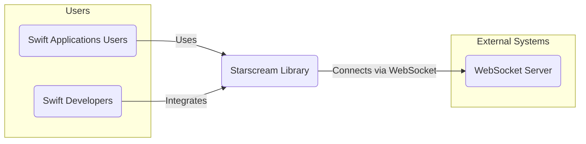
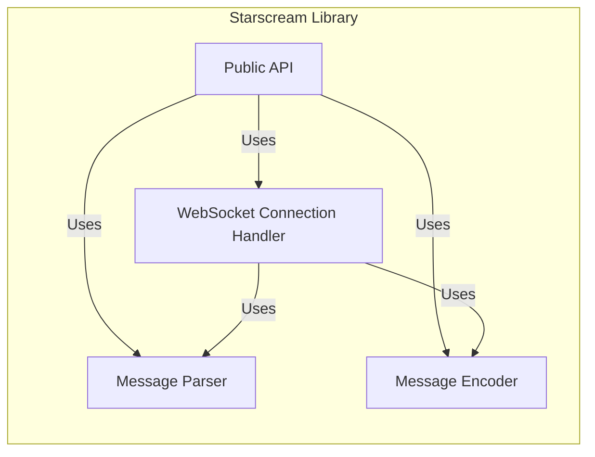
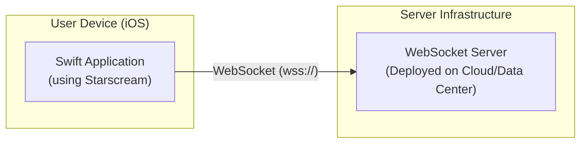
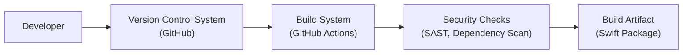

# BUSINESS POSTURE

The Starscream project is a Swift WebSocket client library. Its primary business priority is to provide a robust, efficient, and easy-to-use WebSocket client for Swift developers. This enables developers to build real-time communication features into their applications for various use cases, such as chat applications, live data streaming, and interactive games. The success of Starscream is tied to its adoption by the Swift developer community, which in turn depends on its reliability, performance, and security.

Key business goals for Starscream include:

*   Providing a stable and reliable WebSocket client library.
*   Maintaining compatibility with the latest Swift versions and platforms.
*   Ensuring good performance and low resource consumption.
*   Offering a simple and intuitive API for developers.
*   Building a strong community around the library.

The most important business risks that need to be addressed are:

*   Security vulnerabilities in the library that could be exploited by malicious actors, leading to data breaches or application compromise in applications using Starscream.
*   Instability or bugs in the library that could cause application crashes or unreliable communication, damaging the reputation and adoption of Starscream.
*   Lack of maintenance or updates, leading to incompatibility with newer Swift versions or security vulnerabilities remaining unpatched, which would discourage developers from using Starscream.

# SECURITY POSTURE

Existing security controls for the Starscream project are primarily those inherent in open-source software development and the Swift ecosystem:

*   security control: Code is publicly available on GitHub, allowing for community review and scrutiny. Implemented: GitHub repository.
*   security control: Issue tracking on GitHub allows users to report bugs and potential security vulnerabilities. Implemented: GitHub issue tracker.
*   security control: Dependency management is handled by Swift Package Manager, which helps in managing and updating dependencies. Implemented: Swift Package Manager manifest (Package.swift).
*   accepted risk: Reliance on community contributions for security vulnerability identification and patching.
*   accepted risk: Potential vulnerabilities in dependencies that Starscream uses.
*   accepted risk: Security vulnerabilities might exist in the code that are not yet discovered.

Recommended security controls to implement:

*   recommended security control: Implement automated Static Application Security Testing (SAST) in the CI/CD pipeline to detect potential vulnerabilities in the code.
*   recommended security control: Regularly update dependencies and perform dependency vulnerability scanning to identify and address vulnerabilities in third-party libraries.
*   recommended security control: Establish a clear process for handling security vulnerability reports, including a security policy and dedicated communication channel.
*   recommended security control: Conduct periodic security focused code reviews, potentially involving external security experts.

Security requirements for Starscream:

*   Authentication:
    *   Requirement: Starscream should support WebSocket authentication mechanisms, such as HTTP Authentication or custom authentication schemes, to allow applications to establish secure WebSocket connections with authenticated servers.
    *   Existing security control: TLS/SSL encryption for WebSocket connections (wss://) provides transport layer security and server authentication. Implemented: Within the networking layer of the library, leveraging platform capabilities.
*   Authorization:
    *   Requirement: Starscream itself does not handle authorization, as it is a client-side library. Authorization logic resides in the application using Starscream and the WebSocket server. Starscream should provide mechanisms to pass authorization tokens or credentials to the server during connection establishment.
    *   Existing security control:  Applications using Starscream are responsible for implementing authorization logic based on their specific needs. Implemented: Application code using Starscream.
*   Input Validation:
    *   Requirement: Starscream must perform robust input validation on data received from the WebSocket server to prevent vulnerabilities such as injection attacks or denial-of-service. This includes validating message formats, data types, and sizes.
    *   Existing security control: Basic input validation is likely present within the library to handle WebSocket protocol messages correctly. Implemented: Within the WebSocket message processing logic of the library.
*   Cryptography:
    *   Requirement: Starscream must use strong cryptography for secure WebSocket connections (wss://) using TLS/SSL. It should support modern TLS versions and cipher suites and avoid deprecated or weak cryptographic algorithms.
    *   Existing security control: TLS/SSL encryption is supported for secure WebSocket connections. Implemented:  Leveraging platform provided TLS/SSL libraries.

# DESIGN

## C4 CONTEXT

### C4 Context Elements

*   List item:
    *   Name: Starscream Library
    *   Type: Software System
    *   Description: A Swift library providing WebSocket client functionality for Swift applications. It handles WebSocket connection management, message sending and receiving, and protocol handling.
    *   Responsibilities:
        *   Establishing and maintaining WebSocket connections.
        *   Sending and receiving WebSocket messages.
        *   Handling WebSocket protocol handshake and framing.
        *   Providing a Swift API for developers to interact with WebSockets.
    *   Security controls:
        *   security control: TLS/SSL encryption for secure WebSocket connections (wss://). Implemented: Networking layer.
        *   security control: Input validation on received WebSocket messages. Implemented: Message processing logic.

*   List item:
    *   Name: Swift Applications Users
    *   Type: Person
    *   Description: End-users who use Swift applications that incorporate the Starscream library to enable real-time communication features.
    *   Responsibilities:
        *   Using Swift applications that rely on WebSocket communication.
        *   Implicitly trusting the security of the applications they use, including the WebSocket communication.
    *   Security controls:
        *   security control: Rely on the security measures implemented by the Swift application and the WebSocket server. Implemented: Application and server side security controls.

*   List item:
    *   Name: Swift Developers
    *   Type: Person
    *   Description: Software developers who integrate the Starscream library into their Swift applications to add WebSocket functionality.
    *   Responsibilities:
        *   Integrating Starscream library into Swift applications.
        *   Using Starscream API correctly and securely.
        *   Implementing application-level security measures for WebSocket communication, such as authentication and authorization.
    *   Security controls:
        *   security control: Responsible for secure integration and usage of the Starscream library. Implemented: Developer practices and application code.

*   List item:
    *   Name: WebSocket Server
    *   Type: Software System
    *   Description: A server application that implements the WebSocket protocol and communicates with Swift applications using Starscream. This server handles business logic, data processing, and potentially user authentication and authorization for WebSocket connections.
    *   Responsibilities:
        *   Accepting WebSocket connections from clients.
        *   Handling WebSocket messages and implementing application logic.
        *   Enforcing security policies, including authentication and authorization.
        *   Sending WebSocket messages back to clients.
    *   Security controls:
        *   security control: Server-side authentication and authorization mechanisms. Implemented: Server application logic.
        *   security control: Input validation and sanitization of data received from WebSocket clients. Implemented: Server application logic.
        *   security control: TLS/SSL encryption for secure WebSocket connections (wss://). Implemented: Server infrastructure and configuration.

## C4 CONTAINER

### C4 Container Elements

*   List item:
    *   Name: Public API
    *   Type: Library Interface
    *   Description: The public interface of the Starscream library that Swift developers use to interact with WebSocket functionality. It provides methods for connecting, disconnecting, sending messages, and handling events.
    *   Responsibilities:
        *   Providing a user-friendly API for WebSocket operations.
        *   Abstracting the complexities of the WebSocket protocol.
        *   Handling user requests and delegating them to internal components.
    *   Security controls:
        *   security control: API design aimed at preventing misuse and promoting secure coding practices. Implemented: API design and documentation.
        *   security control: Input validation on parameters passed to the API methods. Implemented: API input validation logic.

*   List item:
    *   Name: WebSocket Connection Handler
    *   Type: Module
    *   Description: This module is responsible for managing the WebSocket connection lifecycle, including establishing connections, maintaining connection state, handling connection errors, and managing TLS/SSL handshake for secure connections.
    *   Responsibilities:
        *   Establishing and closing WebSocket connections.
        *   Managing connection state (connecting, connected, disconnecting, disconnected).
        *   Handling TLS/SSL handshake for wss:// connections.
        *   Managing network sockets and data streams.
    *   Security controls:
        *   security control: TLS/SSL implementation for secure connections. Implemented: Networking and security libraries used by the module.
        *   security control: Handling of connection errors and preventing information leakage through error messages. Implemented: Error handling logic.

*   List item:
    *   Name: Message Parser
    *   Type: Module
    *   Description: This module is responsible for parsing incoming WebSocket messages from the server, decoding the message format (e.g., text, binary), and extracting relevant data. It also handles WebSocket protocol framing and control frames.
    *   Responsibilities:
        *   Parsing incoming WebSocket messages according to the WebSocket protocol.
        *   Decoding message payloads (text, binary).
        *   Handling WebSocket framing and control frames (e.g., ping, pong, close).
        *   Validating message format and structure.
    *   Security controls:
        *   security control: Input validation on incoming message format and structure to prevent injection attacks or malformed data handling. Implemented: Message parsing logic.
        *   security control: Handling of potentially malicious or oversized messages to prevent denial-of-service. Implemented: Message size limits and processing logic.

*   List item:
    *   Name: Message Encoder
    *   Type: Module
    *   Description: This module is responsible for encoding outgoing messages into the WebSocket protocol format before sending them to the server. It handles message framing and encoding of different message types (text, binary).
    *   Responsibilities:
        *   Encoding outgoing messages into WebSocket protocol format.
        *   Handling message framing for outgoing messages.
        *   Encoding different message types (text, binary) for sending.
    *   Security controls:
        *   security control: Encoding messages correctly to prevent protocol manipulation or injection vulnerabilities. Implemented: Message encoding logic.

## DEPLOYMENT

Starscream library itself is not deployed as a standalone application. It is integrated into Swift applications which are then deployed to various environments depending on the application type (iOS, macOS, etc.).

Deployment Architecture for Swift Application using Starscream (Example: iOS Application)

### Deployment Elements

*   List item:
    *   Name: User Device (iOS)
    *   Type: Deployment Environment
    *   Description: Represents the end-user's iOS device (iPhone, iPad) where the Swift application using Starscream is installed and running.
    *   Responsibilities:
        *   Running the Swift application.
        *   Providing network connectivity for WebSocket communication.
        *   Executing the Starscream library code within the application context.
    *   Security controls:
        *   security control: Operating system level security controls on the user device (e.g., sandboxing, permissions). Implemented: iOS operating system.
        *   security control: Application sandboxing provided by iOS. Implemented: iOS operating system.

*   List item:
    *   Name: Swift Application (using Starscream)
    *   Type: Software Component (Deployed Application)
    *   Description: The Swift application that incorporates the Starscream library to provide WebSocket functionality. This application is deployed on the user's iOS device.
    *   Responsibilities:
        *   Implementing application logic that utilizes WebSocket communication via Starscream.
        *   Managing user authentication and authorization (if applicable) for WebSocket connections.
        *   Handling data received via WebSockets and presenting it to the user.
    *   Security controls:
        *   security control: Application-level security controls, such as secure data handling, input validation, and secure storage of credentials. Implemented: Application code.
        *   security control: Secure communication via wss:// using Starscream. Implemented: Starscream library and application code.

*   List item:
    *   Name: WebSocket Server (Deployed on Cloud/Data Center)
    *   Type: Deployment Environment & Software System
    *   Description: The WebSocket server application that the Swift application connects to. It is deployed in a server infrastructure, which could be a cloud environment or a traditional data center.
    *   Responsibilities:
        *   Hosting the WebSocket server application.
        *   Handling WebSocket connections from clients.
        *   Implementing server-side application logic and security controls.
        *   Providing network infrastructure for WebSocket communication.
    *   Security controls:
        *   security control: Server-side security controls, including network security, operating system hardening, and application security measures. Implemented: Server infrastructure and application code.
        *   security control: TLS/SSL termination and secure WebSocket endpoint configuration. Implemented: Server infrastructure and application configuration.

## BUILD

### Build Elements

*   List item:
    *   Name: Developer
    *   Type: Person
    *   Description: A software developer who writes and modifies the Starscream library code.
    *   Responsibilities:
        *   Writing and maintaining the Starscream library code.
        *   Performing local testing and development.
        *   Committing code changes to the Version Control System.
    *   Security controls:
        *   security control: Secure coding practices followed by the developer. Implemented: Developer training and guidelines.
        *   security control: Code review process (implicit in open source and pull requests). Implemented: GitHub pull request workflow.

*   List item:
    *   Name: Version Control System (GitHub)
    *   Type: Tool & System
    *   Description: GitHub repository hosting the Starscream source code. It manages code versions, tracks changes, and facilitates collaboration.
    *   Responsibilities:
        *   Storing and managing the source code of Starscream.
        *   Tracking code changes and history.
        *   Controlling access to the codebase.
        *   Triggering CI/CD pipelines on code changes.
    *   Security controls:
        *   security control: Access control to the repository (authentication and authorization). Implemented: GitHub access control features.
        *   security control: Audit logging of code changes and access. Implemented: GitHub audit logs.
        *   security control: Branch protection rules to enforce code review and prevent direct commits to main branches. Implemented: GitHub branch protection rules.

*   List item:
    *   Name: Build System (GitHub Actions)
    *   Type: CI/CD System
    *   Description: An automated build system, likely GitHub Actions, used to compile, test, and package the Starscream library.
    *   Responsibilities:
        *   Automating the build process.
        *   Compiling the Swift code.
        *   Running unit tests and integration tests.
        *   Packaging the library as a Swift Package.
        *   Potentially running security checks.
    *   Security controls:
        *   security control: Secure configuration of CI/CD pipelines to prevent unauthorized modifications. Implemented: GitHub Actions configuration and access control.
        *   security control: Use of secure build environments and dependencies. Implemented: GitHub Actions environment configuration and dependency management.

*   List item:
    *   Name: Security Checks (SAST, Dependency Scan)
    *   Type: Security Tooling
    *   Description: Automated security scanning tools integrated into the build pipeline to detect potential vulnerabilities in the code and dependencies. This could include Static Application Security Testing (SAST) and dependency vulnerability scanning.
    *   Responsibilities:
        *   Performing automated security analysis of the codebase.
        *   Identifying potential security vulnerabilities and weaknesses.
        *   Generating reports of security findings.
        *   Failing the build if critical vulnerabilities are found (optional, depending on configuration).
    *   Security controls:
        *   security control: Integration of SAST tools to detect code-level vulnerabilities. Implemented: GitHub Actions workflow configuration and SAST tool integration.
        *   security control: Dependency scanning to identify vulnerabilities in third-party libraries. Implemented: GitHub Actions workflow configuration and dependency scanning tool integration.

*   List item:
    *   Name: Build Artifact (Swift Package)
    *   Type: Software Artifact
    *   Description: The packaged Starscream library, distributed as a Swift Package, ready for integration into Swift applications.
    *   Responsibilities:
        *   Providing a distributable package of the Starscream library.
        *   Including necessary metadata for Swift Package Manager.
    *   Security controls:
        *   security control: Integrity of the build artifact (e.g., checksums, signing - if applicable for Swift Packages). Implemented: Build process and Swift Package Manager features.
        *   security control: Distribution through trusted channels (e.g., GitHub Releases, Swift Package Registry). Implemented: Release and distribution process.

# RISK ASSESSMENT

Critical business process we are trying to protect:

*   Reliable and secure real-time communication in applications using Starscream. Disruption or compromise of this process can lead to application malfunction, data breaches, and reputational damage.

Data we are trying to protect and their sensitivity:

*   Data transmitted over WebSocket connections using Starscream. The sensitivity of this data depends entirely on the application using the library. It could range from public information to highly sensitive personal or financial data.
*   Source code of the Starscream library itself. While publicly available, unauthorized modification or injection of malicious code could compromise the library and applications using it.

# QUESTIONS & ASSUMPTIONS

Questions:

*   What are the typical use cases for Starscream in applications? Understanding the common use cases will help to better tailor security recommendations and threat modeling.
*   Are there any specific compliance requirements that applications using Starscream need to adhere to (e.g., GDPR, HIPAA)? This would influence the required security controls.
*   What is the expected level of security expertise of developers who will be using Starscream? This will help determine the level of detail and guidance needed in security documentation and recommendations.

Assumptions:

*   BUSINESS POSTURE: It is assumed that the primary business goal is to provide a secure and reliable WebSocket client library for the Swift community.
*   SECURITY POSTURE: It is assumed that while basic security practices are in place (open source review, issue reporting), there is room for improvement in automated security checks and formalized security processes.
*   DESIGN: It is assumed that the current design of Starscream is modular and allows for the implementation of security controls at different levels (connection handling, message parsing, API). It is also assumed that developers using Starscream are responsible for implementing application-level security measures.