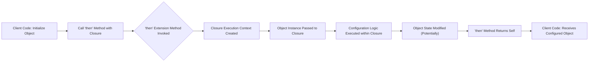

# Project Design Document: Then - Fluent Configuration in Swift

**Version:** 1.1
**Date:** October 26, 2023
**Author:** AI Software Architect

## 1. Introduction

This document provides an enhanced design overview of the `Then` Swift library, located at [https://github.com/devxoul/then](https://github.com/devxoul/then). This revision aims to provide even greater clarity and detail regarding the library's architecture, components, and functionalities, specifically for the purpose of informed threat modeling. This document will serve as a comprehensive resource for security engineers and developers to understand potential security implications and attack surfaces.

## 2. Goals

The primary goals of this design document are to:

*   Provide a highly detailed and unambiguous understanding of the `Then` library's functionality and underlying architecture.
*   Clearly identify all key components, their responsibilities, and their interactions within the library's execution flow.
*   Thoroughly describe the data flow and execution paths involved in using the `Then` library.
*   Proactively highlight potential areas of security concern and potential vulnerabilities that should be considered during threat modeling.
*   Serve as a definitive and easily understandable reference point for developers, security engineers, and auditors interacting with the `Then` library.

## 3. Overview of the "Then" Library

The `Then` library is a lightweight yet powerful Swift utility that facilitates the fluent configuration of objects. It introduces a simple protocol and associated extension methods, enabling developers to apply a sequence of configuration steps to an object in a highly readable and chainable manner. At its core, `Then` offers a syntactic sugar for object initialization and modification, promoting cleaner and more maintainable code.

## 4. Detailed Design

### 4.1. Core Components

*   **`Then` Protocol:**
    *   Acts as a marker protocol. Any Swift type conforming to `Then` gains access to the `then` extension methods.
    *   It has no inherent methods or properties that need to be implemented by conforming types. Its sole purpose is to enable the extension functionality.
    *   Conforming to `Then` is the explicit opt-in mechanism for a type to utilize the library's features.

*   **`then` Extension Methods (on `Then` protocol):**
    *   These are the primary interaction points with the library. They provide the fluent configuration capability.
    *   The core `then` method has the following signature (simplified): `func then(_ mutation: (Self) -> Void) -> Self`
        *   It accepts a single closure as an argument.
        *   This closure takes the object itself (`Self`) as an `inout` parameter (implicitly, though the declaration doesn't show `inout` explicitly). This allows direct modification of the object within the closure.
        *   The closure has a `Void` return type, signifying that its primary purpose is to mutate the object.
        *   The `then` method returns the modified object (`Self`), enabling method chaining.
    *   The library also provides an alias: `func then(setup: (Self) -> Void) -> Self`, which is semantically equivalent and offers improved readability in certain contexts.

### 4.2. Workflow and Data Flow

The typical usage pattern involves initializing an object that conforms to the `Then` protocol, followed by invoking the `then` method with a closure containing the configuration logic.



**Detailed Data Flow Description:**

*   **Client Code initializes an Object:** An instance of a class, struct, or enum that conforms to the `Then` protocol is instantiated.
*   **Call 'then' Method with Closure:** The `then` method is called on the newly created object instance. A closure containing the desired configuration steps is passed as an argument.
*   **'then' Extension Method Invoked:** The appropriate extension method defined on the `Then` protocol is executed.
*   **Closure Execution Context Created:**  A new execution context is established for the provided closure.
*   **Object Instance Passed to Closure:**  A reference to the object instance on which `then` was called is passed as the sole argument to the closure. Crucially, within the closure, `self` refers to this object instance.
*   **Configuration Logic Executed within Closure:** The code within the closure is executed. This code typically involves accessing and modifying the properties or calling methods of the object instance passed to it.
*   **Object State Modified (Potentially):**  The primary purpose of the closure is to mutate the state of the object. This involves directly setting properties or invoking methods that alter the object's internal data.
*   **'then' Method Returns Self:** After the closure has finished executing, the `then` method returns the object instance itself (the same instance that was passed to the closure). This allows for chaining multiple `then` calls.
*   **Client Code Receives Configured Object:** The client code receives the configured object, which now reflects the modifications made within the provided closure.

### 4.3. Code Example (Detailed)

```swift
import Then

class ConfigurationExample {
    var name: String?
    var version: String?
    var isEnabled: Bool = false

    init() {}
}

let config = ConfigurationExample().then {
    $0.name = "My Application"
    $0.version = "1.0.0"
    $0.isEnabled = true
    print("Configuration applied within the closure: \($0.name ?? "N/A")") // Example of side effect
}

print("Final configuration: \(config.name ?? "N/A"), \(config.version ?? "N/A"), isEnabled: \(config.isEnabled)")
```

In this example:

*   `ConfigurationExample` implicitly conforms to `Then` as it's a class (and all classes implicitly conform).
*   The `then` method is used to set the `name`, `version`, and `isEnabled` properties.
*   The closure demonstrates a side effect by printing the configuration within its scope.

### 4.4. Key Design Decisions and Considerations

*   **Implicit Conformance for Classes:**  All Swift classes implicitly conform to the `Then` protocol. This simplifies usage for classes but is important to note for threat modeling as it means any class instance can potentially be used with `then`.
*   **Explicit Conformance for Structs and Enums:** Structs and enums must explicitly declare conformance to the `Then` protocol to use its functionality. This provides more control over which value types utilize `then`.
*   **Closure's Mutating Power:** The closure passed to `then` has the ability to directly mutate the object. This is a powerful feature but also a point of consideration for security, as the closure's logic is executed within the object's context.
*   **No Error Handling within `then`:** The `then` method itself does not provide any specific error handling mechanisms. Any errors within the configuration closure would need to be handled within the closure itself or might propagate outwards.

## 5. Security Considerations (For Threat Modeling)

The simplicity of the `Then` library belies several important security considerations when it's used within a larger application:

*   **Risk of Unintended Side Effects in Configuration Closures:**
    *   **Description:** Closures have full access to the object's state and can execute arbitrary code. Malicious or poorly written closures could introduce unintended side effects beyond just configuring the object's intended properties. This could include logging sensitive data, triggering network requests, or modifying unrelated parts of the application state.
    *   **Example:** A closure might inadvertently log sensitive user data or call a function that has security implications.
    *   **Mitigation Strategies:** Code reviews, clear separation of concerns, and avoiding complex logic within `then` closures.

*   **Potential for Information Disclosure through Closures:**
    *   **Description:** If the object being configured holds sensitive information, the closure could unintentionally leak this information (e.g., through logging or external communication).
    *   **Example:** A closure configuring a user object might inadvertently log the user's password.
    *   **Mitigation Strategies:** Careful review of closure code, ensuring no sensitive data is accessed or logged unnecessarily.

*   **Abuse of Implicit Class Conformance:**
    *   **Description:** Since all classes implicitly conform to `Then`, developers might unknowingly use `then` in contexts where it's not intended, potentially leading to unexpected behavior or security vulnerabilities if the configuration logic is not carefully controlled.
    *   **Example:** Using `then` to modify a security-critical object in a way that bypasses intended security checks.
    *   **Mitigation Strategies:**  Clear coding guidelines and code reviews to ensure `then` is used appropriately.

*   **Indirect Code Injection Risks (Through Configuration Data):**
    *   **Description:** While `Then` itself doesn't execute arbitrary code directly from untrusted sources, if the data used to configure the object within the `then` closure originates from an untrusted source, it could lead to vulnerabilities in the configured object if that object interprets the data as code (e.g., in web views or scripting engines).
    *   **Example:** Configuring a web view with untrusted HTML content using `then`.
    *   **Mitigation Strategies:** Input validation and sanitization of all data used within `then` closures, especially if the data comes from external sources.

*   **Impact of Closure Capture:**
    *   **Description:** Closures can capture variables from their surrounding scope. If these captured variables contain sensitive information or references to mutable state, the closure's execution within `then` could lead to unintended access or modification of that data.
    *   **Example:** A closure capturing a reference to a database connection and using it to perform unauthorized operations.
    *   **Mitigation Strategies:** Minimize the amount of data captured by closures and be mindful of the lifecycle and mutability of captured variables.

## 6. Deployment Considerations

The `Then` library is a lightweight, compile-time dependency. Its inclusion primarily affects build times, especially in large projects where it's used extensively. There are no specific runtime deployment considerations unique to `Then`. The library itself does not introduce any new runtime dependencies or complexities.

## 7. Dependencies

The `Then` library has zero external dependencies beyond the Swift standard library. This minimizes the risk of transitive dependencies introducing vulnerabilities.

## 8. Future Considerations

*   Potential for introducing more specific `then` methods with type constraints to limit their applicability to certain types or scenarios, enhancing safety.
*   Exploring static analysis rules or linters that could detect potentially problematic usage patterns of `then` closures.

## 9. Conclusion

The `Then` library offers a valuable tool for enhancing code readability and conciseness in Swift. However, its flexibility and the power of closures necessitate careful consideration of potential security implications. This enhanced design document provides a more detailed understanding of the library's architecture and highlights key areas of concern for threat modeling. Security engineers and developers should pay close attention to the potential for unintended side effects, information disclosure, and indirect code injection when using `Then` within their applications. Employing secure coding practices and thorough code reviews are crucial for mitigating these risks.