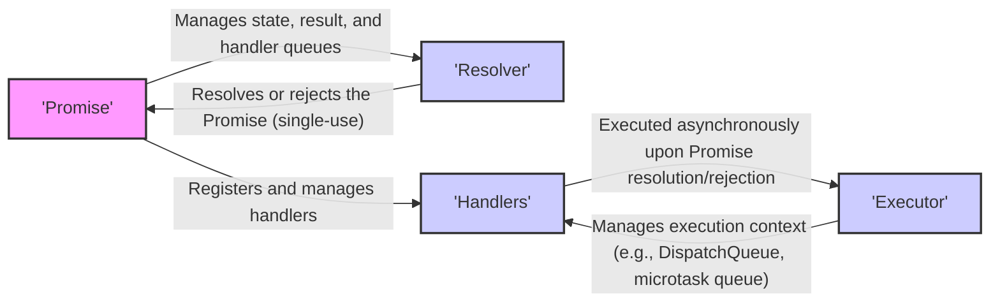

# Project Design Document: `then` Swift Promise Library

**Project Name:** `then` Swift Promise Library

**Project Repository:** [https://github.com/devxoul/then](https://github.com/devxoul/then)

**Version:** (Design based on the current state of the repository as of October 26, 2023)

**Document Version:** 1.1

**Author:** Gemini (AI Expert in Software, Cloud, and Cybersecurity Architecture)

**Date:** October 27, 2023

## 1. Introduction

This document provides a detailed design overview of the `then` Swift Promise library. It is intended to be used as a foundation for threat modeling and security analysis of projects that integrate the `then` library. The document outlines the architecture, key components, data flow, and security considerations to facilitate understanding the library's functionality and potential security implications within a broader application context.

`then` is a lightweight Swift library implementing the Promises/A+ specification. Promises are a powerful design pattern for managing asynchronous operations, enhancing code clarity and maintainability by representing the eventual outcome of asynchronous tasks. This library offers a clean and intuitive API for leveraging promises in Swift development.

## 2. Project Overview

The primary objective of the `then` library is to deliver a robust, performant, and user-friendly promise implementation in Swift.  It aims to:

* **Simplify Asynchronous Programming:**  Make asynchronous code easier to write, understand, and maintain, reducing complexity associated with traditional callback approaches.
* **Improve Asynchronous Error Handling:** Provide a structured and centralized mechanism for managing errors in asynchronous workflows, leading to more resilient applications.
* **Enhance Code Readability and Structure:** Promote a more linear and less nested coding style, improving code comprehension and reducing cognitive load.
* **Ensure Interoperability:** Adhere strictly to the Promises/A+ specification, guaranteeing compatibility and seamless integration with other Promises/A+ compliant libraries and systems.

Key benefits of using the `then` library include:

* **Promise Composition:** Enables building complex asynchronous workflows by chaining and combining promises.
* **Clear Asynchronous Control Flow:** Provides a structured way to manage asynchronous operations, making the flow of execution explicit and easier to follow.
* **Improved Error Propagation:** Facilitates consistent and predictable error handling across asynchronous operations.
* **Enhanced Testability:** Simplifies testing of asynchronous code by providing a predictable and manageable structure.
* **Reduced Callback Hell:**  Avoids deeply nested callbacks, leading to cleaner and more maintainable code.

## 3. System Architecture

The `then` library's architecture is centered around the `Promise` object and its interactions with resolvers and handlers. The following diagram illustrates the high-level architectural components:

### 3.1. Component Description

* **Promise:**
    * **Responsibility:** Represents a future value or the possibility of an error. It is an immutable object representing the eventual result of an asynchronous operation.
    * **Design Aspects:**
        * **State Management:**  Maintains its internal state (pending, fulfilled, rejected) and transitions between these states based on the resolver's actions.
        * **Result Storage:** Stores the resolved value (on fulfillment) or the rejection reason (on rejection).
        * **Handler Queue:**  Maintains an ordered queue of `then`, `catch`, and `finally` handlers to be executed when the promise resolves or rejects.
        * **Immutability:** Once a promise is resolved or rejected, its state and result are immutable.
        * **Event-Driven:** Operates on an event-driven model, triggering handler execution upon state transitions.

* **Resolver:**
    * **Responsibility:**  Provides the controlled mechanism to settle a `Promise`. It is a single-use object given to the executor of the asynchronous operation to resolve or reject the associated promise.
    * **Design Aspects:**
        * **Single-Use:** Designed to be used only once to resolve or reject a promise. Subsequent calls have no effect, preventing accidental state changes.
        * **Controlled Settlement:**  Provides the only authorized way to transition a promise from the pending state to fulfilled or rejected.
        * **Encapsulation:**  Hides the promise's internal state from the external asynchronous operation, providing a clean interface for settlement.

* **Handlers:**
    * **Responsibility:** Define the actions to be performed when a `Promise` is fulfilled or rejected. They are functions registered with the promise using `then`, `catch`, and `finally` methods.
    * **Design Aspects:**
        * **Asynchronous Execution:** Handlers are designed to be executed asynchronously, typically within a microtask queue or dispatch queue, ensuring non-blocking behavior.
        * **Chaining Mechanism:** `then` handlers can return new promises, enabling promise chaining and sequential asynchronous workflows.
        * **Error Handling Separation:** `catch` handlers provide a dedicated mechanism for handling promise rejections, promoting clear separation of success and error paths.
        * **Guaranteed Execution (finally):** `finally` handlers ensure that cleanup or finalization logic is executed regardless of the promise's outcome.
        * **Microtask Queue:** Handlers are typically added to a microtask queue and executed after the current call stack is clear, ensuring predictable execution order within the asynchronous flow.

* **Executor:**
    * **Responsibility:** Manages the asynchronous execution context for both the initial asynchronous operation and the subsequent promise handlers.
    * **Design Aspects:**
        * **Concurrency Management:**  Leverages Swift's concurrency features, likely using Grand Central Dispatch (GCD) or similar mechanisms to manage asynchronous tasks and thread pools.
        * **Dispatch Queues:**  Utilizes dispatch queues (e.g., main queue, background queues, custom queues) to control where asynchronous operations and handlers are executed.
        * **Microtask Queue Integration:**  Likely incorporates a microtask queue (or emulates its behavior) to ensure Promises/A+ compliant handler execution order.
        * **Non-Blocking Operations:**  Ensures that promise operations and handler executions are non-blocking, maintaining responsiveness of the application.

## 4. Data Flow

The data flow in `then` revolves around the propagation of results and errors through promise chains. The following diagram illustrates a typical asynchronous operation and promise resolution flow:

```mermaid
graph LR
    A["'Start Asynchronous Operation'"] --> B["'Executor provides Resolver'"];
    B --> C["'Asynchronous Task (e.g., Network Request)'"];
    C -- "Completes with Result or Error" --> D["'Resolver.resolve(result)' or 'Resolver.reject(error)'"];
    D --> E["'Promise State Transition (Fulfilled or Rejected)'"];
    E --> F{{"Microtask Queue"}};
    F -- "Enqueue Handlers" --> G["'Execute Handlers (then, catch, finally)'"];
    G -- "Handler returns Value or Promise" --> H["'Next Promise in Chain (if any)'"];
    style A fill:#f9f,stroke:#333,stroke-width:2px
    style B fill:#ccf,stroke:#333,stroke-width:2px
    style C fill:#f9f,stroke:#333,stroke-width:2px
    style D fill:#ccf,stroke:#333,stroke-width:2px
    style E fill:#f9f,stroke:#333,stroke-width:2px
    style F fill:#eef,stroke:#333,stroke-width:2px,stroke-dasharray: 5 5
    style G fill:#ccf,stroke:#333,stroke-width:2px
    style H fill:#f9f,stroke:#333,stroke-width:2px
```

### 4.1. Data Flow Description

1. **Initiate Asynchronous Operation:** An asynchronous operation is started, and a new `Promise` is created to represent its eventual result. The executor is provided with a `Resolver` object.
2. **Asynchronous Task Execution:** The asynchronous task (e.g., network request, file I/O, background computation) is executed.
3. **Operation Completion and Resolver Invocation:** Upon completion of the asynchronous task:
    * **Success:** If successful, the `Resolver.resolve(result)` method is called with the resulting value.
    * **Failure:** If an error occurs, the `Resolver.reject(error)` method is called with the error reason.
4. **Promise State Transition:** The `Promise` receives the resolution or rejection signal from the `Resolver` and updates its internal state to fulfilled or rejected, respectively, storing the result or error.
5. **Microtask Queue Enqueue:**  Instead of immediately executing handlers, the `then`, `catch`, and `finally` handlers associated with the promise are enqueued into a microtask queue. This ensures handlers are executed asynchronously but in a predictable order after the current synchronous execution context.
6. **Handler Execution from Microtask Queue:**  The event loop processes the microtask queue. Handlers are dequeued and executed one by one.
    * **`then` Handlers (Success Path):** Executed if the promise is fulfilled. They receive the resolved value.
    * **`catch` Handlers (Error Path):** Executed if the promise is rejected. They receive the rejection reason (error).
    * **`finally` Handlers:** Executed regardless of fulfillment or rejection, after `then` or `catch` handlers.
7. **Promise Chaining and Propagation:** If a `then` or `catch` handler returns a value, it implicitly resolves the next promise in the chain with that value. If a handler returns a new promise, the chain waits for that promise to settle before proceeding. Errors propagate down the chain until a `catch` handler is encountered.

## 5. Security Considerations (For Threat Modeling)

When using `then` within applications, consider the following security aspects during threat modeling. These are categorized for clarity and include potential threat modeling questions.

### 5.1. Availability Risks

* **Unhandled Promise Rejections leading to Application Instability:**
    * **Risk:** Unhandled rejections can lead to silent failures, unexpected application states, or crashes if errors are not gracefully managed.
    * **Threat Modeling Questions:**
        * Are all promise chains in critical workflows properly terminated with a `catch` handler or a global rejection handler?
        * What is the application's behavior when a promise rejection occurs in a core asynchronous operation? Are there fallback mechanisms or error reporting in place?
        * Could unhandled rejections lead to resource leaks or deadlocks, impacting application availability?

* **Denial of Service (DoS) through Asynchronous Task Abuse:**
    * **Risk:**  Malicious or unintentional creation of a large number of promises or excessively long promise chains could exhaust resources (memory, threads), leading to DoS.
    * **Threat Modeling Questions:**
        * Are there any uncontrolled inputs that could trigger the creation of a large number of promises?
        * Are there limits on the depth or complexity of promise chains that can be created?
        * How does the application handle resource exhaustion scenarios related to promise usage? Are there safeguards against runaway promise creation?

### 5.2. Integrity Risks

* **Data Corruption due to Race Conditions in Handlers:**
    * **Risk:** If promise handlers access and modify shared mutable state without proper synchronization, race conditions can occur, leading to data corruption or inconsistent application state.
    * **Threat Modeling Questions:**
        * Do promise handlers access shared mutable state? If so, what synchronization mechanisms are in place to prevent race conditions?
        * Are the asynchronous operations wrapped by promises thread-safe if they interact with shared resources?
        * Could a malicious actor manipulate the timing of asynchronous operations to exploit potential race conditions in promise handlers?

* **Error Handling Bypass or Manipulation:**
    * **Risk:**  Improperly implemented error handling in promise chains could allow errors to be bypassed or manipulated, potentially leading to incorrect application behavior or security vulnerabilities.
    * **Threat Modeling Questions:**
        * Are error handling paths in promise chains thoroughly tested and validated?
        * Could a malicious actor intentionally trigger or suppress errors in asynchronous operations to bypass security checks or manipulate application logic?
        * Is error information logged and monitored appropriately for security auditing and incident response?

### 5.3. Confidentiality Risks

* **Information Disclosure through Error Messages:**
    * **Risk:**  Error messages or rejection reasons propagated through promise chains might inadvertently expose sensitive information (e.g., internal paths, database connection strings, user data) if not carefully sanitized, especially in client-facing applications.
    * **Threat Modeling Questions:**
        * Are error messages and rejection reasons sanitized before being presented to users or logged in production environments?
        * Do error messages contain sensitive information that could be exploited by an attacker?
        * Is there a mechanism to control the level of detail in error messages based on the environment (e.g., detailed errors in development, generic errors in production)?

* **Dependency Vulnerabilities:**
    * **Risk:** Although less directly related to the design of `then`, vulnerabilities in `then` itself or its dependencies could introduce security risks into applications using it.
    * **Threat Modeling Questions:**
        * Is the `then` library regularly updated to address known vulnerabilities?
        * Are dependency checks performed to identify and mitigate potential vulnerabilities in the library's dependencies (if any)?
        * What is the process for responding to and patching security vulnerabilities discovered in the `then` library?

## 6. Deployment Considerations

`then` is deployed as a Swift library integrated into Swift applications. Deployment considerations are standard for Swift library integration.

* **Dependency Management Integration:** Utilize Swift Package Manager (SPM), CocoaPods, or Carthage to manage the `then` library dependency within your Swift project.
* **Swift Runtime Environment:** Ensure the target deployment environment supports the Swift runtime version compatible with the `then` library.
* **Binary Size Impact:** Be mindful of the potential impact of including the `then` library on the final binary size of your application, especially for resource-constrained environments.
* **Testing and Compatibility:** Thoroughly test applications using `then` across all target platforms and Swift versions to ensure compatibility and proper functionality.

## 7. Technology Stack

* **Programming Language:** Swift
* **Concurrency Framework:**  Leverages Swift's concurrency features, primarily built upon Grand Central Dispatch (GCD) for asynchronous task management and execution.
* **Promises Specification:** Implements the Promises/A+ specification.
* **Dependency Management Support:**  Designed for integration using Swift Package Manager, CocoaPods, and Carthage.

## 8. Conclusion

This improved design document provides a more detailed and structured overview of the `then` Swift Promise library, specifically tailored for threat modeling purposes. It elaborates on the architecture, data flow, and critically, expands on security considerations by categorizing risks and providing actionable threat modeling questions. This document serves as a valuable resource for security assessments and for developers to build more secure and resilient applications utilizing the `then` promise library for asynchronous programming.