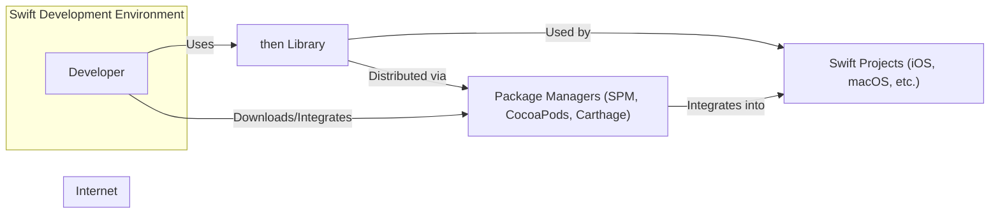
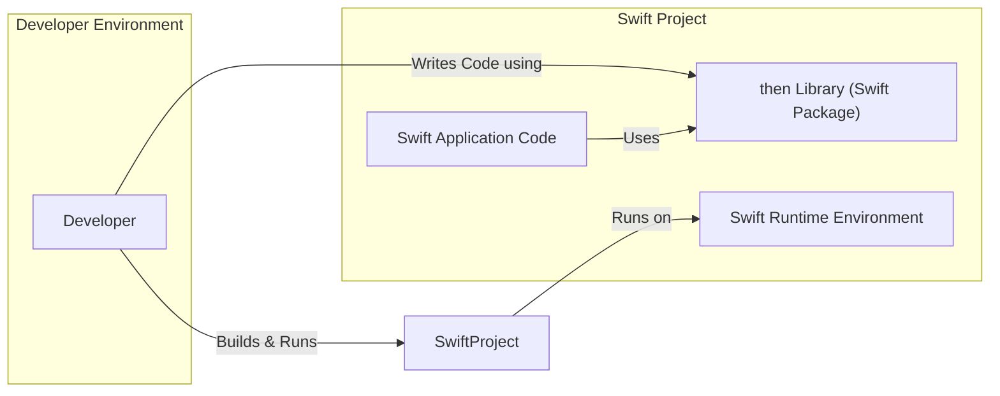
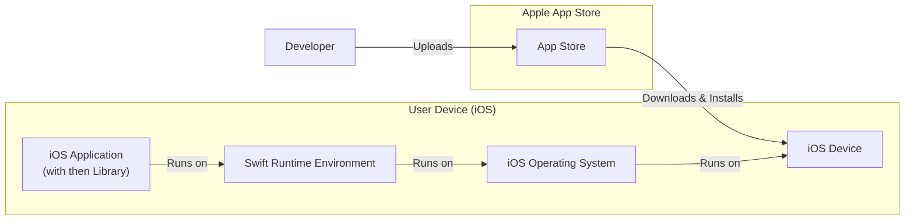
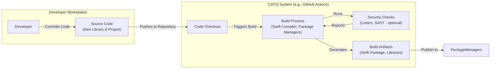

# BUSINESS POSTURE

- Business Priorities and Goals:
  - Improve developer productivity by simplifying asynchronous code in Swift.
  - Enhance code readability and maintainability in Swift projects dealing with asynchronous operations.
  - Provide a robust and reliable promise implementation for Swift.

- Business Risks:
  - Dependency risk: Relying on an external, open-source library introduces a dependency that needs to be managed and maintained.
  - Security vulnerabilities: Potential vulnerabilities in the library could impact applications that depend on it.
  - Compatibility issues: The library might have compatibility issues with different Swift versions, platforms, or other libraries.
  - Maintainability risk: Long-term maintenance and support of the library depend on the open-source community and the primary maintainers.
  - Adoption risk: Developers might not adopt the library if it is not well-documented, easy to use, or if better alternatives exist.

# SECURITY POSTURE

- Existing Security Controls:
  - security control: Open Source Code - The source code is publicly available on GitHub, allowing for community review and scrutiny. Implemented: GitHub repository.
  - security control: Version Control - Git version control system is used to track changes and manage releases. Implemented: GitHub repository.
  - security control: Issue Tracking - GitHub Issues are used for bug reports, feature requests, and discussions. Implemented: GitHub repository.

- Accepted Risks:
  - accepted risk: Reliance on external library - Projects using this library are dependent on its security and maintenance.
  - accepted risk: Potential vulnerabilities - As with any software, there is a risk of vulnerabilities being discovered in the library.

- Recommended Security Controls:
  - security control: Dependency Scanning - Implement dependency scanning tools in projects that use this library to identify known vulnerabilities in dependencies, including `then`.
  - security control: Regular Updates - Keep the `then` library updated to the latest version to benefit from bug fixes and security patches.
  - security control: Code Review - Conduct code reviews for projects using `then` to ensure proper and secure usage of the library.

- Security Requirements:
  - Authentication: Not applicable to a library. Authentication is relevant for applications that use this library, but not for the library itself.
  - Authorization: Not applicable to a library. Authorization is relevant for applications that use this library, but not for the library itself.
  - Input Validation: While `then` is a library for promise management and not directly handling user inputs, it should be designed to handle internal inputs and operations safely to prevent unexpected behavior or crashes. Input validation within applications using `then` is crucial.
  - Cryptography: Not directly applicable to this library. Cryptographic operations are the responsibility of the applications using this library, not the library itself. If applications using `then` require cryptography, they should implement it separately and use `then` for managing asynchronous cryptographic operations if needed.

# DESIGN

## C4 CONTEXT

- Context Diagram Elements:
  - Element:
    - Name: Developer
    - Type: Person
    - Description: Software developers who use the `then` library in their Swift projects.
    - Responsibilities: Writes Swift code, integrates and uses the `then` library to manage asynchronous operations, builds and tests Swift applications.
    - Security controls: Code review, secure coding practices in projects using `then`.
  - Element:
    - Name: then Library
    - Type: Software System
    - Description: An open-source Swift library providing a promise implementation to simplify asynchronous programming.
    - Responsibilities: Provides promise-based API for asynchronous operations in Swift, improves code readability and maintainability for asynchronous tasks.
    - Security controls: Open source code, version control, community review, dependency scanning (in projects using it).
  - Element:
    - Name: Swift Projects
    - Type: Software System
    - Description: iOS, macOS, or other Swift applications that integrate and use the `then` library.
    - Responsibilities: Utilize the `then` library to manage asynchronous operations within the application logic, provide application functionality to end-users.
    - Security controls: Input validation, authorization, authentication, data protection, dependency management (including `then`).
  - Element:
    - Name: Package Managers (SPM, CocoaPods, Carthage)
    - Type: Software System
    - Description: Tools used to distribute and manage Swift libraries, including `then`, for Swift projects. Examples include Swift Package Manager, CocoaPods, and Carthage.
    - Responsibilities: Package and distribute the `then` library, manage dependencies for Swift projects, facilitate integration of `then` into Swift projects.
    - Security controls: Package integrity checks, repository security (for package managers themselves), HTTPS for downloads.

## C4 CONTAINER

- Container Diagram Elements:
  - Element:
    - Name: Swift Application Code
    - Type: Application
    - Description: The Swift code of a project that utilizes the `then` library to implement application-specific logic, including asynchronous operations.
    - Responsibilities: Implements application features, handles user interactions, manages data, uses `then` for asynchronous tasks.
    - Security controls: Input validation, authorization, authentication, secure coding practices, dependency management.
  - Element:
    - Name: then Library (Swift Package)
    - Type: Library
    - Description: The `then` library packaged as a Swift Package (or distributed via other package managers), providing promise-based asynchronous programming functionalities.
    - Responsibilities: Provides promise API, manages asynchronous operations, offers utility functions for promise manipulation.
    - Security controls: Open source code, version control, community review, dependency scanning (in projects using it).
  - Element:
    - Name: Swift Runtime Environment
    - Type: Runtime Environment
    - Description: The Swift runtime environment on target platforms (iOS, macOS, etc.) where the Swift application and `then` library execute.
    - Responsibilities: Executes Swift code, manages memory, provides system resources, handles platform-specific functionalities.
    - Security controls: Operating system security, platform security features, sandboxing (on mobile platforms).

## DEPLOYMENT

- Deployment Options:
  - Option 1: iOS App Deployment - Deployed as part of an iOS application distributed through the Apple App Store or enterprise distribution.
  - Option 2: macOS App Deployment - Deployed as part of a macOS application distributed through the Apple Mac App Store or direct download.
  - Option 3: Swift Command Line Tool - Deployed as a command-line tool for macOS or Linux environments (if applicable, though less common for UI-focused libraries like this).

- Selected Deployment Architecture: iOS App Deployment (most common use case)

- Deployment Diagram Elements:
  - Element:
    - Name: iOS Device
    - Type: Device
    - Description: User's iPhone or iPad device where the iOS application is installed and executed.
    - Responsibilities: Runs the iOS application, provides user interface, interacts with the user, stores application data.
    - Security controls: Device passcode/biometrics, operating system security features, app sandboxing, data encryption at rest.
  - Element:
    - Name: iOS Operating System
    - Type: Operating System
    - Description: Apple's iOS operating system running on the user's device.
    - Responsibilities: Manages device resources, provides system services, enforces security policies, isolates applications.
    - Security controls: Kernel security, system integrity protection, application sandboxing, permission management.
  - Element:
    - Name: Swift Runtime Environment
    - Type: Runtime Environment
    - Description: Swift runtime environment on iOS that executes the Swift application code and the `then` library.
    - Responsibilities: Executes Swift code, manages memory, provides Swift-specific functionalities.
    - Security controls: Memory safety features of Swift, runtime security checks.
  - Element:
    - Name: iOS Application (with then Library)
    - Type: Application
    - Description: The compiled iOS application that includes the `then` library and application-specific code.
    - Responsibilities: Provides application functionalities to the user, uses `then` for asynchronous operations, interacts with iOS system services.
    - Security controls: Application sandboxing, code signing, secure coding practices, input validation, authorization, authentication (if applicable).
  - Element:
    - Name: Apple App Store
    - Type: Platform
    - Description: Apple's official app distribution platform for iOS applications.
    - Responsibilities: Hosts and distributes iOS applications, performs app review process, handles app updates.
    - Security controls: App review process, code signing enforcement, platform security, secure distribution channels.

## BUILD

- Build Process Elements:
  - Element:
    - Name: Developer
    - Type: Person
    - Description: Software developer who writes and commits code for the `then` library or projects using it.
    - Responsibilities: Writes code, performs local builds and tests, commits code to version control.
    - Security controls: Secure coding practices, code review, workstation security.
  - Element:
    - Name: Source Code (then Library & Project)
    - Type: Data Store
    - Description: The source code repository for the `then` library and projects that use it, typically hosted on GitHub.
    - Responsibilities: Stores source code, tracks changes, manages versions, facilitates collaboration.
    - Security controls: Access control (GitHub permissions), version control history, branch protection.
  - Element:
    - Name: CI/CD System (e.g., GitHub Actions)
    - Type: Automation System
    - Description: Automated system for building, testing, and potentially publishing the `then` library. Examples include GitHub Actions, Jenkins, etc.
    - Responsibilities: Automates build process, runs tests, performs security checks, generates build artifacts, potentially publishes artifacts.
    - Security controls: Secure CI/CD pipeline configuration, access control to CI/CD system, secrets management, build environment security.
  - Element:
    - Name: Code Checkout
    - Type: Process
    - Description: Step in the CI/CD pipeline where the source code is retrieved from the repository.
    - Responsibilities: Retrieves the latest code from the repository, ensures code integrity.
    - Security controls: Secure connection to repository (HTTPS, SSH), access control to repository.
  - Element:
    - Name: Build Process (Swift Compiler, Package Managers)
    - Type: Process
    - Description: Step in the CI/CD pipeline where the Swift code is compiled and packaged using Swift compiler and package managers (like Swift Package Manager).
    - Responsibilities: Compiles Swift code, resolves dependencies, generates build artifacts (libraries, packages).
    - Security controls: Use of trusted build tools (Swift compiler, package managers), dependency integrity checks.
  - Element:
    - Name: Security Checks (Linters, SAST - optional)
    - Type: Process
    - Description: Optional step in the CI/CD pipeline to perform security checks on the code, such as linting and Static Application Security Testing (SAST).
    - Responsibilities: Identifies potential code quality issues and security vulnerabilities in the code.
    - Security controls: Configuration of security scanning tools, vulnerability reporting.
  - Element:
    - Name: Artifacts (Swift Package, Libraries)
    - Type: Data Store
    - Description: The output of the build process, which includes compiled libraries, Swift packages, and other build artifacts.
    - Responsibilities: Stores build artifacts, makes artifacts available for distribution or deployment.
    - Security controls: Artifact integrity checks, secure storage of artifacts, access control to artifacts.
  - Element:
    - Name: Package Managers
    - Type: Distribution System
    - Description: Package managers like Swift Package Manager, CocoaPods, Carthage used to distribute the `then` library.
    - Responsibilities: Distribute the `then` library to developers, manage library versions, facilitate integration into Swift projects.
    - Security controls: Package integrity checks, repository security, HTTPS for downloads.

# RISK ASSESSMENT

- Critical Business Processes:
  - Software development using Swift: The library aims to improve the efficiency and quality of Swift software development. Any issues with the library could impact development processes.

- Data Sensitivity:
  - Data handled by the library itself: The `then` library itself does not directly handle sensitive business data. It is a utility library for managing asynchronous operations.
  - Data handled by applications using the library: Applications that use the `then` library may handle sensitive data. Vulnerabilities in the library could indirectly impact the security of this data if exploited within an application. The sensitivity of data depends on the specific applications using the library, ranging from low to high depending on the application's purpose. In general, the direct data sensitivity related to the `then` library is low, but the indirect impact on applications using it can vary.

# QUESTIONS & ASSUMPTIONS

- Questions:
  - What are the primary use cases for applications that will use the `then` library? (e.g., mobile apps, server-side applications, etc.)
  - Are there specific security compliance requirements for applications that will use this library (e.g., HIPAA, PCI DSS, GDPR)?
  - Is there a dedicated security team or process for reviewing and addressing security vulnerabilities in open-source dependencies used in projects?

- Assumptions:
  - BUSINESS POSTURE: The primary goal is to enhance developer productivity and code quality in Swift projects. Security is important but not the absolute top priority compared to functionality and ease of use for a utility library.
  - SECURITY POSTURE: Current security controls rely mainly on the open-source nature of the project and standard GitHub features. Projects using this library are expected to implement their own security measures and dependency management practices.
  - DESIGN: The library is designed as a standalone Swift package intended to be integrated into various Swift projects. Deployment is primarily through package managers and integration into application deployments. The build process is assumed to be automated using CI/CD practices.