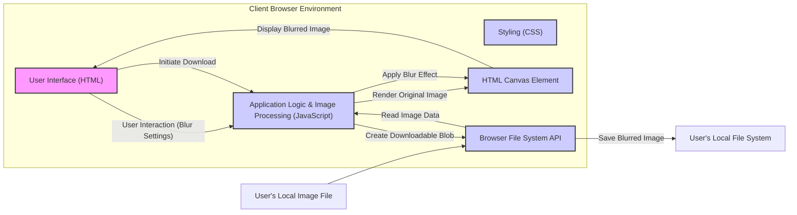

## Project Design Document: Blurable (Improved)

**1. Project Overview**

*   **Project Name:** Blurable
*   **Project Repository:** [https://github.com/flexmonkey/blurable](https://github.com/flexmonkey/blurable)
*   **Project Description:** Blurable is a client-side web application designed to enable users to apply various blurring effects to images directly within their web browser. The application offers a user-friendly interface for image selection, real-time preview of blur effects, customization of blur parameters, and downloading the processed image. The core functionality relies on client-side JavaScript for image manipulation, eliminating the need for a backend server for image processing.

**2. System Architecture**

**3. Component Descriptions**

*   **User Interface (HTML):**
    *   **Responsibility:** Provides the structural foundation of the web application's visual interface. It defines the elements for:
        *   Image input (`<input type="file">`) allowing users to select images from their local system.
        *   Displaying the original and processed images (likely using `` or the Canvas element).
        *   Controls (e.g., sliders, dropdowns, text fields) for adjusting blur parameters such as blur radius, blur type (e.g., Gaussian, box), and potentially other effect-specific settings.
        *   A download button to trigger the saving of the blurred image.
    *   **Technology:** HTML5.

*   **Styling (CSS):**
    *   **Responsibility:**  Handles the visual presentation and layout of the user interface elements, ensuring a user-friendly and aesthetically pleasing experience. This includes defining styles for:
        *   Positioning of elements.
        *   Appearance of controls.
        *   Responsiveness across different screen sizes.
    *   **Technology:** CSS3.

*   **Application Logic & Image Processing (JavaScript):**
    *   **Responsibility:**  Contains the core logic of the application, including:
        *   Handling user interactions from the UI.
        *   Reading image data from the selected file using the Browser File System API.
        *   Implementing the image blurring algorithms. This might involve:
            *   Direct manipulation of pixel data on the Canvas.
            *   Utilizing browser APIs for image processing (if available).
            *   Employing a third-party JavaScript image processing library.
        *   Rendering the original and blurred images onto the HTML Canvas Element.
        *   Generating a downloadable file (Blob) of the processed image.
    *   **Technology:** JavaScript, potentially leveraging browser APIs like the Canvas API, `FileReader`, and `URL.createObjectURL()`.

*   **HTML Canvas Element:**
    *   **Responsibility:**  A rectangular area within the HTML document where the images are drawn and manipulated. It serves as the primary surface for:
        *   Displaying the initially loaded image.
        *   Rendering the blurred image after processing.
        *   Providing access to the underlying pixel data for manipulation by JavaScript.
    *   **Technology:** HTML `<canvas>` element and its associated JavaScript APIs (Canvas API).

*   **Browser File System API:**
    *   **Responsibility:** Enables the JavaScript code to interact with the user's local file system in a secure and controlled manner. This is used for:
        *   Allowing the user to select an image file.
        *   Reading the contents of the selected image file into the browser's memory for processing.
        *   Facilitating the download of the processed image back to the user's file system.
    *   **Technology:**  Browser APIs like `FileReader` and potentially the `showSaveFilePicker` API for more controlled download experiences.

*   **User's Local Image File:**
    *   **Responsibility:** The original image file residing on the user's computer that the user intends to blur.
    *   **Technology:** Any image format supported by web browsers (e.g., JPEG, PNG, GIF, WebP).

*   **User's Local File System (Blurred Image):**
    *   **Responsibility:** The location on the user's computer where the downloaded blurred image is saved.
    *   **Technology:** The user's operating system's file system.

**4. Data Flow**

1. The user interacts with the **User Interface (HTML)** to select an **User's Local Image File**.
2. The browser's **File System API** allows JavaScript in **Application Logic & Image Processing (JavaScript)** to read the image data.
3. The **Application Logic & Image Processing (JavaScript)** renders the original image onto the **HTML Canvas Element**.
4. The user interacts with the **User Interface (HTML)** to adjust blur parameters.
5. Based on the user's input, the **Application Logic & Image Processing (JavaScript)** applies the chosen blurring algorithm to the image data on the **HTML Canvas Element**.
6. The blurred image is displayed on the **HTML Canvas Element**, updating the **User Interface (HTML)**.
7. The user initiates the download process through the **User Interface (HTML)**.
8. The **Application Logic & Image Processing (JavaScript)** creates a downloadable Blob object containing the blurred image data (potentially extracted from the **HTML Canvas Element**).
9. The **Browser File System API** facilitates the saving of the Blob as a new file to the **User's Local File System (Blurred Image)**.

**5. Technology Stack**

*   HTML5
*   CSS3
*   JavaScript (ECMAScript 6 or later)
*   Browser APIs: Canvas API, File API, Blob API, URL API
*   Potentially a JavaScript image processing library (e.g.,  `StackBlur.js`, `GaussianBlur.js`, or a more comprehensive library like `Fabric.js` or `Konva.js` if more advanced features are included).

**6. Deployment Environment**

*   **Target Environment:** Modern web browsers (Chrome, Firefox, Safari, Edge, etc.) supporting the necessary HTML5, CSS3, and JavaScript features.
*   **Deployment Method:** The application can be deployed as static files (HTML, CSS, JavaScript, and any necessary assets) on any web server or a Content Delivery Network (CDN). Since it's a client-side application, no server-side rendering or backend processing is required for the core functionality.

**7. Key Dependencies**

*   **Web Browser:** The primary dependency is the user's web browser, which provides the execution environment for the application.
*   **Potentially a JavaScript Image Processing Library:** If a specific third-party library is used for blur effects, that library becomes a dependency that needs to be included with the application.

**8. Security Considerations (Detailed)**

*   **Client-Side Execution and Trust:** The application runs entirely within the user's browser. This means the security relies heavily on the browser's security model. Users implicitly trust the code they download and execute.
*   **Data Handling (Local Only):** Image data is processed locally within the browser and is not transmitted to any external servers. This significantly reduces the risk of data breaches during transmission. However, vulnerabilities in the client-side code could still expose data within the user's browser environment.
*   **Cross-Site Scripting (XSS) - Reduced Risk:** In a purely static client-side application, the risk of traditional server-side XSS is minimal. However, if the application were extended to include features that dynamically generate HTML based on user input (e.g., displaying filenames without proper sanitization), client-side XSS could become a concern.
*   **Client-Side Logic Tampering:** Since the entire application logic resides in the browser, malicious actors could potentially inspect and modify the JavaScript code. This could lead to:
    *   **Altering Blur Effects:**  Changing the blur algorithms or parameters.
    *   **Exfiltrating Data (if extended):** If the application were to handle more sensitive data in the future, tampered code could attempt to send this data to external locations.
    *   **Introducing Malicious Functionality:** Injecting code to perform unintended actions within the user's browser.
*   **Denial of Service (Client-Side):**
    *   **Resource Exhaustion:** Processing extremely large images or applying computationally intensive blur algorithms could lead to browser performance issues, crashes, or freezing. Consider implementing safeguards like limiting the maximum image size or providing progress indicators.
    *   **Malicious Input:**  Crafted image files could potentially exploit vulnerabilities in the image decoding or processing logic, leading to crashes.
*   **Content Security Policy (CSP):** Implementing a strong CSP is crucial for mitigating client-side risks. It allows developers to control the resources the browser is allowed to load, reducing the impact of potential XSS vulnerabilities by restricting the sources from which scripts and other resources can be loaded.
*   **Input Validation and Sanitization (Client-Side):** While the application primarily deals with image files, any user input (e.g., blur radius values) should be validated and sanitized on the client-side to prevent unexpected behavior or potential exploits if the application were to be extended.
*   **Dependency Management:** If third-party libraries are used, ensure they are from trusted sources and are kept up-to-date to patch any known vulnerabilities. Regularly scan dependencies for security vulnerabilities.
*   **Secure Download Implementation:** Ensure the download process uses secure methods to prevent manipulation of the downloaded file. Using the Blob API and `URL.createObjectURL()` is generally a safe approach.
*   **Regular Security Audits:** If the application becomes more complex or handles sensitive data in the future, consider performing regular security audits and penetration testing to identify potential vulnerabilities.
