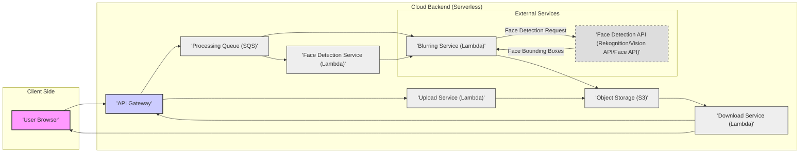
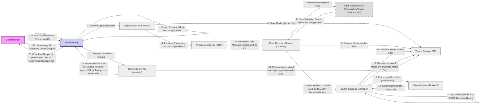

## Project Design Document: Blurable (Improved)

### 1. Project Overview

#### 1.1. Project Goals

*   **Primary Goal:** To deliver a robust, user-friendly, and privacy-centric service for automatically anonymizing faces in user-uploaded images and videos. The core functionality is to effectively blur detected faces, safeguarding the privacy of individuals depicted in visual media before it is shared or processed further.
*   **Secondary Goals:**
    *   **Scalability and Cost-Efficiency:** Architect the backend using serverless technologies to ensure automatic scaling based on demand, minimizing operational costs and simplifying maintenance.
    *   **User Experience:** Provide a simple, intuitive, and responsive web interface for users to easily upload media and quickly receive anonymized outputs.
    *   **Accuracy and Effectiveness:** Achieve a high degree of accuracy in face detection and blurring to guarantee effective anonymization while minimizing false positives and negatives.
    *   **Extensibility and Future-Proofing:** Design the system with modularity and clear interfaces to facilitate future enhancements, such as incorporating diverse anonymization techniques (pixelization, masking), supporting new media formats, or offering API access for developers.
    *   **Data Minimization and Privacy by Design:** Implement principles of data minimization and privacy by design throughout the system, ensuring minimal data retention and secure handling of user media.

#### 1.2. Target Users (Detailed)

*   **Individuals:**
    *   **Social Media Users:** Individuals who regularly share photos and videos on social media platforms and want to protect the privacy of friends, family, or bystanders captured in their content.
    *   **Bloggers and Content Creators:** Individuals who publish content online and need to anonymize faces in images or videos used in their blogs, vlogs, or articles to comply with privacy norms and regulations.
    *   **Citizen Journalists and Activists:** Individuals documenting events or situations where privacy is paramount and need to anonymize faces of individuals in their recordings before sharing them publicly.
*   **Organizations:**
    *   **Media and News Outlets:** Organizations that need to process and publish visual media containing faces while adhering to journalistic ethics and privacy laws.
    *   **Security and Surveillance Companies:** Organizations that handle surveillance footage and need to anonymize faces for privacy compliance or internal review processes.
    *   **Research Institutions and Academia:** Researchers who work with visual data containing faces and need to anonymize it for ethical reasons or to comply with research ethics guidelines.
    *   **Government Agencies and Public Sector:** Public sector organizations that process visual data and need to ensure citizen privacy in accordance with data protection regulations.
    *   **Educational Institutions:** Schools and universities that may need to anonymize faces in photos and videos used for internal communications, promotional materials, or online learning platforms.
*   **Developers (Future Target):**
    *   Software developers who want to integrate face blurring capabilities into their own applications, platforms, or workflows via an API. This could include developers of social media apps, video editing software, security systems, or privacy-focused tools.

#### 1.3. Project Scope (Refined)

*   **In Scope:**
    *   **Web Application Frontend:** Development of a user-friendly web interface for media upload, processing status monitoring, and download of anonymized media.
    *   **Serverless Backend Services:** Implementation of all backend functionalities as serverless functions, including:
        *   Secure API Gateway for request handling and routing.
        *   Dedicated Upload Service for media reception, validation, and temporary storage.
        *   Asynchronous Processing Queue for reliable job management.
        *   Face Detection Service leveraging a cloud-based face detection API.
        *   Blurring Service for applying blurring to detected faces in images and videos.
        *   Download Service for secure delivery of anonymized media to users.
        *   Basic logging and error handling for operational monitoring and debugging.
    *   **Cloud Infrastructure Deployment:** Deployment of all components to a chosen cloud platform (e.g., AWS) using Infrastructure-as-Code principles for repeatability and maintainability.
    *   **Support for Common Media Formats:** Initial support for widely used image formats (JPEG, PNG) and video formats (MP4, MOV).
    *   **Basic Rate Limiting:** Implementation of rate limiting at the API Gateway to protect against abuse and ensure service availability.
*   **Out of Scope (Explicitly):**
    *   **Advanced Anonymization Techniques:** Techniques beyond basic blurring, such as pixelization, face swapping, or generative adversarial network (GAN)-based anonymization.
    *   **Real-time Video Processing:** Live video stream processing or real-time blurring. Focus is on processing uploaded media files.
    *   **User Authentication and Authorization (Initial Phase):** While considered for future iterations, user accounts, login systems, and access control are not part of the initial scope. The service will be designed for public use without user registration in the first version.
    *   **Detailed User Management and Profiles:** Features like user profiles, history of processed media, or user-specific settings are out of scope for the initial release.
    *   **Payment Processing and Monetization:** No payment gateways or subscription models will be implemented in the initial phase.
    *   **Comprehensive Monitoring and Alerting:** Advanced monitoring dashboards, custom alerts, and detailed performance metrics are not included in the initial scope, beyond basic logging.
    *   **Integration with External Storage Services (Beyond Primary Cloud Storage):** Focus is on using the primary cloud provider's object storage. Integration with other storage solutions is out of scope initially.
    *   **Support for less common or specialized media formats.**

### 2. System Architecture

#### 2.1. High-Level Architecture Diagram (Improved)

#### 2.2. Architecture Description (Enhanced)

The Blurable system is designed as a serverless application hosted in the cloud, prioritizing scalability, cost-efficiency, and operational simplicity. The architecture is event-driven and loosely coupled, leveraging managed cloud services to minimize infrastructure management overhead.

*   **Client Side (Web Application):**
    *   **Technology:** HTML, CSS, JavaScript, potentially using a modern JavaScript framework (React, Vue, Angular) for enhanced user interface development and maintainability.
    *   **Responsibilities:**
        *   Provides the user interface for interacting with the Blurable service.
        *   Handles media file uploads from the user's browser.
        *   Communicates with the backend API Gateway using HTTPS for secure communication.
        *   Displays processing status updates to the user.
        *   Provides a mechanism for users to download the anonymized media.
        *   Implements client-side input validation to improve user experience and reduce backend load.

*   **Cloud Backend (Serverless Components):**
    *   **API Gateway:**
        *   **Technology:** Managed API Gateway service (e.g., AWS API Gateway).
        *   **Responsibilities:**
            *   Acts as the single point of entry for all client requests.
            *   Provides REST API endpoints for upload, download, and potentially status checks (if implemented in future).
            *   Handles request routing to appropriate backend services.
            *   Enforces rate limiting to protect against abuse and ensure fair usage.
            *   Manages TLS/SSL termination for secure HTTPS communication.
            *   Can be configured for future authentication and authorization mechanisms.
    *   **Upload Service (Serverless Function - e.g., AWS Lambda):**
        *   **Technology:** Serverless function runtime (e.g., Python, Node.js).
        *   **Responsibilities:**
            *   Receives media upload requests from the API Gateway.
            *   Performs server-side validation of uploaded media (file type, size limits, basic content checks).
            *   Generates a unique identifier for each processing request.
            *   Stores the original uploaded media file in Object Storage (S3) using the unique identifier as the object key.
            *   Publishes a message to the Processing Queue (SQS) containing the media file identifier to trigger the asynchronous processing workflow.
            *   Returns a success response to the API Gateway with the processing ID.
    *   **Processing Queue (Managed Message Queue - e.g., AWS SQS):**
        *   **Technology:** Managed message queue service (e.g., AWS SQS).
        *   **Responsibilities:**
            *   Acts as an asynchronous communication channel between the Upload Service and processing services.
            *   Decouples upload and processing, improving system responsiveness and resilience.
            *   Ensures reliable message delivery and message persistence.
            *   Enables scaling of processing services independently of upload volume.
    *   **Face Detection Service (Serverless Function - e.g., AWS Lambda):**
        *   **Technology:** Serverless function runtime.
        *   **Responsibilities:**
            *   Subscribes to the Processing Queue and consumes processing job messages.
            *   Retrieves the media file from Object Storage (S3) using the file identifier from the message.
            *   Invokes a cloud-based Face Detection API (e.g., AWS Rekognition, Google Cloud Vision API, Azure Face API) to detect faces in the media.
            *   Parses the API response to extract face bounding box coordinates.
            *   Passes the original media and face bounding box data to the Blurring Service, or stores the bounding box data temporarily in Object Storage for the Blurring Service to retrieve.
    *   **Blurring Service (Serverless Function - e.g., AWS Lambda):**
        *   **Technology:** Serverless function runtime, image/video processing libraries (e.g., OpenCV, Pillow).
        *   **Responsibilities:**
            *   Receives media and face bounding box data from the Face Detection Service (or retrieves bounding box data from Object Storage).
            *   Retrieves the original media file from Object Storage (S3).
            *   Applies a blurring algorithm to the regions of the media defined by the face bounding boxes.
            *   Generates the anonymized media file.
            *   Stores the anonymized media file in Object Storage (S3), potentially in a designated output location or with a modified filename.
    *   **Object Storage (Managed Object Storage - e.g., AWS S3):**
        *   **Technology:** Managed object storage service (e.g., AWS S3).
        *   **Responsibilities:**
            *   Provides scalable and durable storage for:
                *   Temporarily uploaded media files.
                *   Intermediate processing data (optional, e.g., face detection results).
                *   Final anonymized media files.
            *   Offers features like versioning, lifecycle management, and access control for data management and security.
    *   **Download Service (Serverless Function - e.g., AWS Lambda):**
        *   **Technology:** Serverless function runtime.
        *   **Responsibilities:**
            *   Receives download requests from the API Gateway, typically identified by the processing ID.
            *   Retrieves the anonymized media file from Object Storage (S3) using the processing ID (or derived object key).
            *   Generates a pre-signed URL for secure, time-limited access to the anonymized media file in S3, or directly streams the file content through the API Gateway.
            *   Returns the pre-signed URL or file content to the API Gateway for delivery to the client.

### 3. Component Design (Detailed)

#### 3.1. Client Application (Web Frontend)

*   **Functionality:**
    *   **Media Upload:** Drag-and-drop interface or file selection button for uploading images (JPEG, PNG) and videos (MP4, MOV).
    *   **Progress Indication:** Visual progress bar during file upload and processing stages.
    *   **Status Display:** Clear display of processing status (e.g., "Uploading...", "Processing...", "Ready for Download", "Error"). Real-time updates if feasible, or polling mechanism.
    *   **Download Link:** Prominent and easily accessible download link for the anonymized media upon successful processing.
    *   **Error Handling:** User-friendly error messages for common issues (e.g., invalid file type, file size exceeded, processing failure).
    *   **Responsive Design:**  Adaptable layout for different screen sizes (desktop, mobile, tablet).
*   **Technology:**
    *   **Frontend Framework (Recommended):** React, Vue.js, or Angular for component-based architecture, state management, and efficient UI updates. Alternatively, plain JavaScript for a simpler implementation.
    *   **HTML5, CSS3:** For structuring content and styling the user interface.
    *   **JavaScript (ES6+):** For client-side logic, API interactions (using `fetch` or `axios`), and UI manipulation.
    *   **Bundler/Transpiler (if using framework):** Webpack, Parcel, or similar tools for bundling JavaScript modules, transpiling code, and optimizing assets.
*   **Security Considerations:**
    *   **Client-Side Input Validation:** Implement basic validation (file type, size) to prevent obvious errors and potentially malicious uploads from reaching the backend.
    *   **HTTPS Enforcement:** Ensure all communication with the API Gateway is over HTTPS to protect data in transit.
    *   **XSS Prevention:**  Sanitize user inputs and encode outputs to prevent Cross-Site Scripting (XSS) vulnerabilities. Use a framework that provides built-in XSS protection.
    *   **Content Security Policy (CSP):** Implement CSP headers to further mitigate XSS risks by controlling the sources from which the browser is allowed to load resources.

#### 3.2. API Gateway (Managed Service)

*   **Functionality:**
    *   **Request Routing:** Routes incoming requests to the appropriate backend services based on URL paths (e.g., `/upload` to Upload Service, `/download` to Download Service).
    *   **Rate Limiting:** Configurable rate limits to prevent abuse and ensure service availability for all users. Define limits based on requests per second/minute/hour.
    *   **TLS/SSL Termination:** Handles HTTPS termination, ensuring secure communication.
    *   **Request Transformation (Optional):** Can transform request/response formats if needed between client and backend services.
    *   **Authentication/Authorization (Future):** Placeholder for future implementation of API key authentication, OAuth 2.0, or other authentication mechanisms.
*   **Technology:**
    *   **Managed API Gateway Service:** AWS API Gateway, Azure API Management, Google Cloud API Gateway. Choose based on cloud provider preference and feature set.
*   **Security Considerations:**
    *   **API Security Best Practices:** Follow API security best practices (OWASP API Security Top 10) during configuration and development.
    *   **Rate Limiting Configuration:** Properly configure rate limits to balance security and usability. Monitor rate limit effectiveness and adjust as needed.
    *   **HTTPS Enforcement:**  Strictly enforce HTTPS for all API endpoints. Disable HTTP access.
    *   **Protection against API Attacks:** Configure Web Application Firewall (WAF) if available with the API Gateway service to protect against common web attacks (SQL injection, cross-site scripting, etc.).
    *   **Access Control (Future):** Plan for future implementation of authentication and authorization to control access to API endpoints and backend services.

#### 3.3. Upload Service (Serverless Function)

*   **Functionality:**
    *   **Request Handling:** Receives upload requests from the API Gateway.
    *   **Input Validation:**
        *   **File Type Validation:** Verify that the uploaded file is of an allowed type (JPEG, PNG, MP4, MOV).
        *   **File Size Validation:** Enforce maximum file size limits to prevent resource exhaustion and DoS attacks.
        *   **Basic Content Scanning (Optional):** Consider basic content scanning for malware or malicious content if feasible and necessary.
    *   **Unique ID Generation:** Generate a unique identifier (UUID) for each upload request.
    *   **Object Storage Upload:** Store the uploaded media file in Object Storage (S3) using the generated UUID as the object key. Configure S3 for secure storage (encryption at rest, access control).
    *   **Queue Message Enqueue:** Create a message containing the UUID and any relevant metadata (e.g., file type) and enqueue it into the Processing Queue (SQS).
    *   **Response to API Gateway:** Send a success response back to the API Gateway, including the processing ID (UUID).
*   **Technology:**
    *   **Serverless Function Runtime:** Python, Node.js, or other suitable runtime supported by the chosen cloud provider.
    *   **Cloud Provider SDK:** AWS SDK for Python (Boto3) or AWS SDK for Node.js for interacting with S3 and SQS.
*   **Security Considerations:**
    *   **Robust Input Validation:** Implement comprehensive input validation to prevent malicious file uploads and injection attacks.
    *   **Secure Object Storage Interaction:** Use IAM roles with least privilege to grant the Upload Service function only necessary permissions to write to the designated S3 bucket.
    *   **S3 Bucket Security:** Configure S3 bucket policies to restrict access and enable encryption at rest and in transit.
    *   **Error Handling and Logging:** Implement secure error handling to avoid leaking sensitive information in error responses. Log all upload attempts, validation failures, and storage operations for auditing and debugging.

#### 3.4. Processing Queue (Managed Message Queue)

*   **Functionality:**
    *   **Message Queuing:** Provides a reliable and durable queue for processing jobs.
    *   **Asynchronous Processing:** Decouples upload and processing, enabling asynchronous workflows.
    *   **Message Persistence:** Ensures messages are persisted and not lost in case of service failures.
    *   **Scalability:** Managed service scales automatically based on message volume.
*   **Technology:**
    *   **Managed Message Queue Service:** AWS SQS, Azure Queue Storage, Google Cloud Pub/Sub. Choose based on cloud provider preference. AWS SQS is used in the example architecture.
*   **Security Considerations:**
    *   **Queue Access Control:** Configure queue access policies to restrict access to authorized services only (Upload Service and Face Detection Service). Use IAM roles for serverless functions to manage access.
    *   **Encryption (If Supported):** Enable encryption for messages in transit and at rest if supported by the chosen queue service (e.g., SQS supports server-side encryption).
    *   **Queue Monitoring:** Monitor queue depth and dead-letter queue (DLQ) to detect potential processing issues and message failures. Configure alerts for anomalies.

#### 3.5. Face Detection Service (Serverless Function)

*   **Functionality:**
    *   **Queue Message Consumption:** Listens to the Processing Queue and consumes messages containing media file identifiers.
    *   **Object Storage Retrieval:** Retrieves the media file from Object Storage (S3) using the identifier.
    *   **Face Detection API Invocation:** Calls a cloud-based Face Detection API (e.g., AWS Rekognition, Google Cloud Vision API, Azure Face API) to detect faces in the media.
    *   **Bounding Box Extraction:** Parses the API response to extract face bounding box coordinates.
    *   **Data Passing to Blurring Service:** Passes the original media and face bounding box data to the Blurring Service, either directly in memory (if serverless function execution environment allows) or by storing bounding box data temporarily in Object Storage (S3) with a link to the original media.
*   **Technology:**
    *   **Serverless Function Runtime:** Python, Node.js, or other suitable runtime.
    *   **Cloud Provider SDK:** AWS SDK, Google Cloud SDK, Azure SDK for interacting with Object Storage and the chosen Face Detection API.
    *   **Face Detection API Client Library:** Client library for the chosen Face Detection API (e.g., `boto3` for AWS Rekognition).
*   **Security Considerations:**
    *   **Secure API Key Management:** Securely store and manage API keys for the Face Detection API. Use environment variables or a secrets management service (e.g., AWS Secrets Manager) to avoid hardcoding API keys in code.
    *   **Least Privilege IAM Roles:** Grant the Face Detection Service function only the necessary IAM permissions to read from S3, write to S3 (if storing bounding boxes), and invoke the Face Detection API.
    *   **Data Privacy with Face Detection API:** Review the data processing and privacy policies of the chosen Face Detection API provider. Ensure compliance with data privacy regulations. Consider data minimization and anonymization techniques before sending media to the external API if possible.
    *   **Error Handling and Logging:** Implement robust error handling for API calls and object storage operations. Log API requests, responses (without sensitive data), and errors for debugging and monitoring.

#### 3.6. Blurring Service (Serverless Function)

*   **Functionality:**
    *   **Data Retrieval:** Receives media and face bounding box data from the Face Detection Service (or retrieves bounding box data from Object Storage). Retrieves the original media from Object Storage (S3).
    *   **Blurring Algorithm Application:** Implements a blurring algorithm (e.g., Gaussian blur, pixelization) to apply to the regions defined by the face bounding boxes in the media. Use appropriate image/video processing libraries.
    *   **Anonymized Media Generation:** Creates the anonymized media file with blurred faces.
    *   **Object Storage Storage:** Stores the anonymized media file in Object Storage (S3), potentially in a separate output bucket or directory, or with a modified filename to distinguish it from the original.
*   **Technology:**
    *   **Serverless Function Runtime:** Python, Node.js, or other suitable runtime.
    *   **Image/Video Processing Libraries:** OpenCV (cv2 in Python), Pillow (PIL in Python), or equivalent libraries in Node.js (e.g., `jimp`, `ffmpeg-node`).
    *   **Cloud Provider SDK:** AWS SDK, etc., for interacting with Object Storage.
*   **Security Considerations:**
    *   **Secure Media Handling:** Handle media files securely in memory and during processing. Avoid writing sensitive intermediate files to disk if possible.
    *   **Blurring Algorithm Effectiveness:** Choose and implement a blurring algorithm that effectively anonymizes faces while maintaining usability of the media. Test and evaluate the effectiveness of the blurring.
    *   **Resource Management:** Optimize the blurring algorithm and serverless function configuration to prevent timeouts and excessive resource consumption. Set appropriate memory limits and timeouts for the serverless function.
    *   **Output Validation (Optional):** Consider adding basic validation to the anonymized media to ensure the blurring process was successful and the output file is valid.
    *   **Least Privilege IAM Roles:** Grant the Blurring Service function only necessary IAM permissions to read from S3 and write to S3.

#### 3.7. Storage Service (Object Storage)

*   **Functionality:**
    *   **Scalable Storage:** Provides highly scalable and durable object storage for media files and potentially intermediate data.
    *   **Object Management:** Supports object-based storage with key-value access.
    *   **Data Security Features:** Offers features like versioning, lifecycle management, access control, and encryption.
*   **Technology:**
    *   **Managed Object Storage Service:** AWS S3, Azure Blob Storage, Google Cloud Storage. AWS S3 is used in the example architecture.
*   **Security Considerations:**
    *   **Bucket Policies and ACLs:** Configure restrictive bucket policies and Access Control Lists (ACLs) to control access to S3 buckets. Implement least privilege principles.
    *   **Encryption at Rest:** Enable server-side encryption for S3 buckets to protect data at rest. Use KMS managed keys for enhanced security and control.
    *   **Encryption in Transit:** Enforce HTTPS for all access to S3 buckets to protect data in transit.
    *   **Versioning and Lifecycle Management:** Enable S3 versioning for data recovery and implement lifecycle policies to automatically delete temporary files after a defined period to minimize data retention.
    *   **Regular Security Audits:** Conduct periodic security audits of S3 bucket configurations and access policies.

#### 3.8. Download Service (Serverless Function)

*   **Functionality:**
    *   **Download Request Handling:** Receives download requests from the API Gateway, identified by processing ID.
    *   **Anonymized Media Retrieval:** Retrieves the anonymized media file from Object Storage (S3) using the processing ID (or derived object key).
    *   **Pre-signed URL Generation (Recommended):** Generates a pre-signed URL for secure, time-limited access to the anonymized media file in S3. This is the preferred method for secure download.
    *   **Direct File Streaming (Alternative):** Alternatively, can stream the file content directly in the response through the API Gateway, but pre-signed URLs are generally more secure and scalable for object storage downloads.
    *   **Response to API Gateway:** Returns the pre-signed URL or file content to the API Gateway for delivery to the client.
*   **Technology:**
    *   **Serverless Function Runtime:** Python, Node.js, or other suitable runtime.
    *   **Cloud Provider SDK:** AWS SDK, etc., for interacting with Object Storage to generate pre-signed URLs or retrieve file content.
*   **Security Considerations:**
    *   **Secure Pre-signed URL Generation:** Generate pre-signed URLs with appropriate expiration times (short-lived) and restrict access to the specific anonymized media object.
    *   **Authorization (Future):** In future iterations with authentication, implement authorization checks to ensure only authorized users can download specific files.
    *   **HTTPS Enforcement:** Ensure pre-signed URLs (and direct file streaming if used) are served over HTTPS.
    *   **Least Privilege IAM Roles:** Grant the Download Service function only necessary IAM permissions to read from S3 and generate pre-signed URLs.

### 4. Data Flow (Detailed)

#### 4.1. Data Flow Diagram (Improved with Data Types)

#### 4.2. Data Flow Description (Enhanced with Security Notes)

1.  **Upload Request (Media File: Image/Video):** The user initiates media upload via the Client Application. The media file (image or video) is sent to the API Gateway over HTTPS. **Security Note:** HTTPS ensures confidentiality and integrity of the media file during transmission.
2.  **Forward Upload Request:** The API Gateway routes the upload request to the Upload Service.
3.  **Store Media (Media File):** The Upload Service validates the media, generates a unique ID, and securely stores the original media file in Object Storage (S3). **Security Note:** S3 encryption at rest protects the stored media. Access to S3 is controlled by IAM roles.
4.  **Enqueue Processing Job (Message: File ID):** The Upload Service enqueues a message containing the unique file ID into the Processing Queue (SQS). **Security Note:** SQS access is restricted to authorized services. Message encryption can be enabled if needed.
5.  **Processing Job Message (Message: File ID):** The Face Detection Service retrieves a processing job message from the Processing Queue.
6.  **Retrieve Media (Media File):** The Face Detection Service retrieves the original media file from Object Storage (S3) using the file ID from the message. **Security Note:** Access to S3 is controlled by IAM roles, ensuring only the Face Detection Service can access the media.
7.  **Detect Faces (Media File):** The Face Detection Service sends the media file to the chosen Face Detection API (e.g., Rekognition) for face detection. **Security Note:** Data privacy considerations apply when sending media to a third-party API. Ensure compliance with API provider's terms and data processing agreements. Minimize data sent if possible.
8.  **Face Detection Results (JSON: Bounding Boxes):** The Face Detection API returns face detection results, typically in JSON format, including bounding box coordinates for detected faces. **Security Note:** API responses should be parsed securely to prevent injection vulnerabilities.
9.  **Pass Results & Media (Media File, JSON: Bounding Boxes):** The Face Detection Service passes the original media file and the face detection results (bounding boxes) to the Blurring Service.
10. **Retrieve Media (Media File):** The Blurring Service retrieves the original media file from Object Storage (S3). (If not already passed from the Face Detection Service).
11. **Apply Blur (Media File, JSON: Bounding Boxes):** The Blurring Service applies the blurring algorithm to the face regions in the media file based on the bounding box coordinates.
12. **Store Anonymized Media (Anonymized Media File):** The Blurring Service stores the anonymized media file back into Object Storage (S3). **Security Note:** Ensure the anonymized media is stored securely in S3, potentially in a separate location or with different access controls than the original media.
13. **Processing Complete (Notification) & 14. Status Confirmation (Optional):** (Optional) The Blurring Service might send a notification upon completion.
14. **Processing ID Response (Processing ID):** The Upload Service sends a response back to the Client Application via the API Gateway, including the processing ID.
15. **Download Request (Processing ID):** The user initiates a download request through the Client Application, using the processing ID. This request is sent to the API Gateway.
16. **Forward Download Request:** The API Gateway routes the download request to the Download Service.
17. **Retrieve Anonymized Media (Anonymized Media File):** The Download Service retrieves the anonymized media file from Object Storage (S3). **Security Note:** Access to S3 is controlled by IAM roles.
18. **Generate Download URL/Serve File (Pre-signed URL or Anonymized Media File):** The Download Service generates a pre-signed URL for secure download or streams the file content. **Security Note:** Pre-signed URLs should be time-limited and scoped to the specific file.
19. **Download Response (Pre-signed URL or Anonymized Media File):** The API Gateway sends the download response (pre-signed URL or file content) back to the Client Application. **Security Note:** Ensure download links are served over HTTPS.

### 5. Technology Stack (Specific)

#### 5.1. Frontend Technologies

*   **Languages:** HTML5, CSS3, JavaScript (ES6+)
*   **Framework/Library:** React v18 (or latest stable version) - for component-based UI and efficient updates.
*   **Bundler/Transpiler:** Webpack v5 (or latest stable version) with Babel v7 for JavaScript transpilation and module bundling.
*   **HTTP Client:** `axios` library for making HTTP requests to the API Gateway.

#### 5.2. Backend Technologies (AWS Specific)

*   **Serverless Functions:** AWS Lambda - Runtime: Python 3.9 (or latest supported Python version).
*   **API Gateway:** AWS API Gateway - REST API.
*   **Face Detection API:** AWS Rekognition - `boto3` Python SDK.
*   **Message Queue:** AWS SQS - Standard Queue.
*   **Object Storage:** AWS S3 - Standard Storage Class.
*   **Image/Video Processing Libraries (within Lambda Functions):**
    *   Python: OpenCV-Python (`cv2`), Pillow (PIL). Installable as Lambda layers.
*   **Infrastructure as Code:** AWS CDK (Cloud Development Kit) - Python.

#### 5.3. Infrastructure Technologies

*   **Cloud Provider:** Amazon Web Services (AWS).
*   **Operating System (for development/testing):** Any OS supporting Node.js, Python, and AWS CLI/CDK (e.g., macOS, Linux, Windows with WSL).
*   **Logging and Monitoring:** AWS CloudWatch Logs, AWS CloudWatch Metrics.

### 6. Deployment Architecture (Detailed)

#### 6.1. Deployment Model

*   **Fully Serverless:** All backend components are deployed as serverless functions (AWS Lambda) and managed services (API Gateway, SQS, S3). No server management required.
*   **Infrastructure as Code (IaC):** AWS CDK will be used to define and deploy the entire infrastructure, including API Gateway, Lambda functions, SQS queue, S3 buckets, and IAM roles. This ensures repeatable and consistent deployments.
*   **CI/CD Pipeline (Recommended):** Implement a CI/CD pipeline (e.g., using AWS CodePipeline and CodeBuild) to automate the build, test, and deployment process.
*   **Publicly Accessible Frontend:** The Client Application (web frontend) will be deployed to a static website hosting service (e.g., AWS S3 or AWS CloudFront) and made publicly accessible via a domain name. API Gateway will also be publicly accessible.

#### 6.2. Environment Details

*   **Environments:** Recommended to have at least two environments:
    *   **Development/Staging:** For development, testing, and staging before production release.
    *   **Production:** For the live, user-facing Blurable service.
*   **Region:** Choose an AWS region based on target user location, data residency requirements, and service availability. Consider regions with AWS Rekognition service availability.
*   **Scalability and Resiliency:** Serverless architecture inherently provides automatic scalability. AWS Lambda, API Gateway, SQS, and S3 will automatically scale based on demand. AWS managed services are designed for high availability and fault tolerance.
*   **Monitoring and Logging:** AWS CloudWatch Logs will be used for logging from Lambda functions and API Gateway. CloudWatch Metrics can be used for monitoring performance and error rates. Basic dashboards can be created in CloudWatch.
*   **Disaster Recovery (Basic):** Leverage AWS S3's data durability and redundancy. For critical components, consider multi-AZ deployments if applicable and implement backup and recovery procedures for configuration and code.

### 7. Security Considerations (Comprehensive)

#### 7.1. Confidentiality

*   **Threat:** Unauthorized access to user-uploaded media, anonymized media, and intermediate processing data.
*   **Mitigation:**
    *   **Encryption at Rest:** Enable server-side encryption for all S3 buckets storing media and data. Use KMS managed keys for enhanced control.
    *   **Encryption in Transit:** Enforce HTTPS for all communication channels: Client-API Gateway, API Gateway-Backend Services, Backend Services-S3, and communication with external Face Detection API.
    *   **Access Control (IAM):** Implement strict IAM roles and policies for all serverless functions and API Gateway to ensure least privilege access to S3 buckets, SQS queues, and other AWS resources.
    *   **Secure API Key Management:** Securely store and manage API keys for the Face Detection API using AWS Secrets Manager or environment variables with appropriate access controls.
    *   **Data Minimization:** Minimize the amount of data stored and retained. Implement lifecycle policies to automatically delete temporary files and anonymized media after a reasonable download period.

#### 7.2. Integrity

*   **Threat:** Tampering with user-uploaded media, anonymized media, or processing logic. Data corruption or unauthorized modification.
*   **Mitigation:**
    *   **HTTPS:** Use HTTPS for all communication to prevent man-in-the-middle attacks and ensure data integrity during transmission.
    *   **Input Validation:** Implement robust input validation at all layers (client-side and backend) to prevent injection attacks and ensure data conforms to expected formats.
    *   **Immutable Infrastructure (IaC):** Use Infrastructure-as-Code (AWS CDK) to define and deploy infrastructure in a repeatable and immutable manner, reducing the risk of configuration drift and unauthorized changes.
    *   **Code Reviews and Security Testing:** Conduct regular code reviews and security testing (static and dynamic analysis) to identify and fix potential vulnerabilities in the application code and infrastructure configuration.
    *   **Logging and Auditing:** Implement comprehensive logging of all critical operations (uploads, processing, downloads, access attempts) for auditing and incident response.

#### 7.3. Availability

*   **Threat:** Service disruption, Denial of Service (DoS) attacks, system failures leading to unavailability of the Blurable service.
*   **Mitigation:**
    *   **Serverless Architecture:** Leverage the inherent scalability and high availability of serverless services (AWS Lambda, API Gateway, SQS, S3).
    *   **Rate Limiting and Throttling:** Configure rate limiting and throttling at the API Gateway to protect backend services from DoS attacks and abuse.
    *   **Fault Tolerance:** Design backend services to be stateless and fault-tolerant. Utilize message queues (SQS) for asynchronous processing and retries in case of transient failures.
    *   **Monitoring and Alerting:** Implement monitoring of service health, performance metrics, and error rates using AWS CloudWatch. Set up alerts to notify administrators of potential issues and service disruptions.
    *   **Disaster Recovery Planning:** Define basic disaster recovery procedures, including data backup and recovery strategies for configuration and code. Leverage S3's data durability and redundancy.

#### 7.4. Authentication and Authorization (Future Enhancement)

*   **Threat:** Unauthorized access to administrative functions or user data (if user accounts are implemented in the future).
*   **Mitigation (Future):**
    *   **API Key Authentication:** Implement API key authentication for the API Gateway to control access to backend API endpoints.
    *   **User Authentication (OAuth 2.0/OpenID Connect):** Integrate a user authentication system (e.g., using OAuth 2.0 or OpenID Connect) for the web application to identify and authenticate users if user accounts are added.
    *   **Role-Based Access Control (RBAC):** Implement RBAC to control access to specific functionalities and data based on user roles or permissions.
    *   **Multi-Factor Authentication (MFA):** Consider enabling MFA for administrative accounts and potentially for user accounts for enhanced security.

#### 7.5. Data Privacy and Compliance

*   **Threat:** Violation of data privacy regulations (e.g., GDPR, CCPA) and user privacy expectations.
*   **Mitigation:**
    *   **Privacy by Design:** Implement privacy by design principles throughout the system development lifecycle.
    *   **Data Minimization:** Minimize the collection and retention of personal data. Only store necessary data for processing and service operation.
    *   **Transparency and User Consent:** Provide clear privacy policies and terms of service to users, explaining data processing practices. Obtain user consent where required.
    *   **Data Processing Agreements (with Face Detection API Provider):** Review and ensure compliance with data processing agreements with the chosen Face Detection API provider. Understand their data retention and usage policies.
    *   **Secure Data Handling:** Implement secure data handling practices throughout the system, including encryption, access control, and secure deletion.
    *   **Data Retention and Deletion Policies:** Define and implement clear data retention and deletion policies for user-uploaded media, anonymized media, and any logs or metadata. Automatically delete data after a defined period.
    *   **Regular Privacy Reviews:** Conduct regular privacy reviews and assessments to ensure ongoing compliance with data privacy regulations and best practices.

This improved design document provides a more detailed and comprehensive blueprint for the Blurable project, incorporating enhanced security considerations and specific technology choices. It is now better suited for threat modelling exercises and further development.