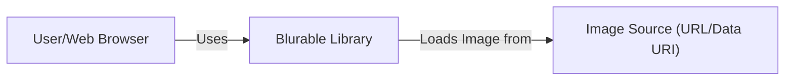
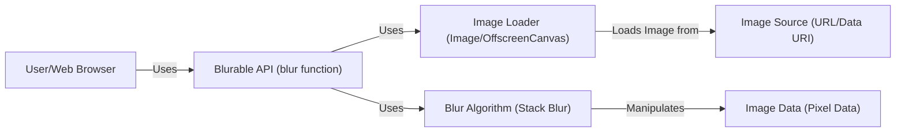
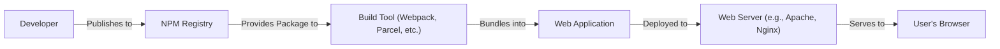
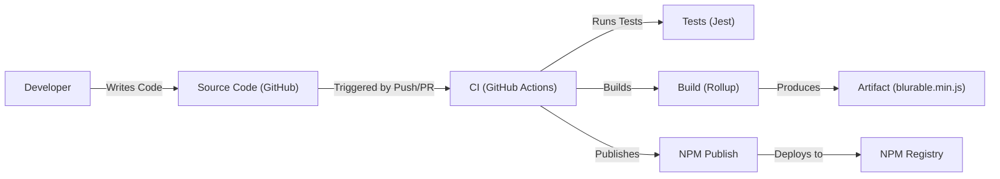

Okay, let's create a design document for the `blurable` project.

# BUSINESS POSTURE

Business Priorities and Goals:

*   Provide a simple, easy-to-use, and performant way to apply a blur effect to images in web applications.
*   Offer a lightweight solution that minimizes external dependencies.
*   Support a range of blur intensity levels.
*   Ensure cross-browser compatibility.
*   Provide a solution that can be easily integrated into existing projects.
*   Open-source the project to foster community contributions and transparency.

Most Important Business Risks:

*   Performance bottlenecks: Inefficient blurring algorithms could lead to slow image processing and a poor user experience, especially on lower-powered devices or with large images.
*   Compatibility issues: Lack of support for certain image formats or browser inconsistencies could limit the project's usability.
*   Security vulnerabilities: While seemingly simple, image processing can introduce vulnerabilities if not handled carefully (e.g., buffer overflows, denial-of-service).
*   Maintainability: Poor code quality or lack of documentation could make it difficult to maintain and extend the project in the future.
*   Lack of adoption: If the project is not perceived as useful or easy to integrate, it may not gain traction.

# SECURITY POSTURE

Existing Security Controls:

*   security control: Input validation: The code checks if the provided `src` is a string and if `radius` is a number. (index.js)
*   security control: Limited scope: The library focuses solely on blurring and doesn't handle image uploading, storage, or other potentially risky operations. (Project scope)
*   security control: No external dependencies: Reduces the risk of supply chain attacks. (package.json)
*   security control: Use of `OffscreenCanvas` where available: Improves performance and potentially reduces the attack surface by offloading work to a separate context. (index.js)
*   security control: MIT License: Permissive license that encourages scrutiny and contributions.

Accepted Risks:

*   accepted risk: The library assumes the input image data is trustworthy. It does not perform any sanitization or validation of the image content itself.
*   accepted risk: The library does not implement any specific countermeasures against denial-of-service attacks that might be triggered by excessively large images or blur radii.
*   accepted risk: The library does not currently have comprehensive security testing (e.g., fuzzing) in place.

Recommended Security Controls:

*   security control: Implement a maximum image size and/or blur radius limit to mitigate potential denial-of-service risks.
*   security control: Add fuzzing tests to the test suite to identify potential vulnerabilities related to image processing.
*   security control: Consider adding a Content Security Policy (CSP) if the library is used in a context where it can be controlled.

Security Requirements:

*   Authentication: Not applicable (N/A) - This library does not handle authentication.
*   Authorization: N/A - This library does not handle authorization.
*   Input Validation:
    *   The `src` parameter must be a valid string representing a URL or a data URI.
    *   The `radius` parameter must be a non-negative number.
    *   Implement maximum limits for image dimensions and blur radius.
*   Cryptography: N/A - This library does not directly use cryptography.
*   Output Encoding: N/A - The library outputs a canvas element, not encoded text.

# DESIGN

## C4 CONTEXT

Element List:

*   Element:
    *   Name: User/Web Browser
    *   Type: User
    *   Description: The user's web browser, which hosts the web application using Blurable.
    *   Responsibilities:
        *   Renders the web page.
        *   Executes JavaScript code.
        *   Displays the blurred image.
    *   Security controls:
        *   Browser's built-in security mechanisms (e.g., same-origin policy, CSP).

*   Element:
    *   Name: Blurable Library
    *   Type: Library
    *   Description: The JavaScript library that provides the blurring functionality.
    *   Responsibilities:
        *   Takes an image source and blur radius as input.
        *   Applies the blur effect.
        *   Returns a canvas element with the blurred image.
    *   Security controls:
        *   Input validation.
        *   Limited scope.
        *   No external dependencies.

*   Element:
    *   Name: Image Source (URL/Data URI)
    *   Type: External Resource
    *   Description: The source of the image to be blurred, either a URL or a data URI.
    *   Responsibilities:
        *   Provides the image data.
    *   Security controls:
        *   None implemented by Blurable. Relies on the security of the image source itself.

## C4 CONTAINER

Element List:

*   Element:
    *   Name: User/Web Browser
    *   Type: User
    *   Description: The user's web browser.
    *   Responsibilities: Renders the web page, executes JavaScript, displays the blurred image.
    *   Security controls: Browser's built-in security mechanisms.

*   Element:
    *   Name: Blurable API (blur function)
    *   Type: API
    *   Description: The public API of the Blurable library, exposed as the `blur` function.
    *   Responsibilities: Provides the entry point for blurring images.
    *   Security controls: Input validation.

*   Element:
    *   Name: Image Loader (Image/OffscreenCanvas)
    *   Type: Component
    *   Description: Handles loading the image from the provided source. Uses either an `Image` object or an `OffscreenCanvas` for improved performance.
    *   Responsibilities: Loads the image data into a usable format.
    *   Security controls: None specific, relies on browser's image loading security.

*   Element:
    *   Name: Blur Algorithm (Stack Blur)
    *   Type: Component
    *   Description: Implements the stack blur algorithm to apply the blurring effect.
    *   Responsibilities: Performs the pixel manipulation to achieve the blur.
    *   Security controls: None specific, but should be carefully reviewed for potential vulnerabilities (e.g., buffer overflows).

*   Element:
    *   Name: Image Source (URL/Data URI)
    *   Type: External Resource
    *   Description: The source of the image data.
    *   Responsibilities: Provides the image data.
    *   Security controls: None implemented by Blurable.

*   Element:
    *   Name: Image Data (Pixel Data)
    *   Type: Data
    *   Description: The raw pixel data of the image.
    *   Responsibilities: Stores the image's color information.
    *   Security controls: None.

## DEPLOYMENT

Possible Deployment Solutions:

1.  **NPM Package:** Publish the library as an NPM package for easy integration into JavaScript projects using build tools like Webpack, Parcel, or Rollup.
2.  **CDN:** Host the library on a Content Delivery Network (CDN) for direct inclusion in web pages via a `<script>` tag.
3.  **Direct Download:** Offer the library as a standalone JavaScript file for download and manual inclusion in projects.

Chosen Solution (NPM Package):

Element List:

*   Element:
    *   Name: Developer
    *   Type: Person
    *   Description: The developer of the Blurable library.
    *   Responsibilities: Writes code, publishes the package.
    *   Security controls: Developer account security.

*   Element:
    *   Name: NPM Registry
    *   Type: Service
    *   Description: The public NPM registry.
    *   Responsibilities: Stores and distributes NPM packages.
    *   Security controls: NPM's security measures (e.g., two-factor authentication, package signing).

*   Element:
    *   Name: Build Tool (Webpack, Parcel, etc.)
    *   Type: Tool
    *   Description: A JavaScript build tool used to bundle the library into a web application.
    *   Responsibilities: Downloads, bundles, and optimizes the library.
    *   Security controls: Dependency management, code signing (if configured).

*   Element:
    *   Name: Web Application
    *   Type: Application
    *   Description: The web application that uses the Blurable library.
    *   Responsibilities: Integrates and uses the Blurable library.
    *   Security controls: Application-specific security measures.

*   Element:
    *   Name: Web Server (e.g., Apache, Nginx)
    *   Type: Server
    *   Description: The web server that hosts the web application.
    *   Responsibilities: Serves the web application to users.
    *   Security controls: Web server security configuration (e.g., HTTPS, firewalls).

*   Element:
    *   Name: User's Browser
    *   Type: Client
    *   Description: The user's web browser.
    *   Responsibilities: Downloads and runs the web application.
    *   Security controls: Browser's built-in security mechanisms.

## BUILD

Build Process Description:

1.  **Development:** Developers write code and push changes to the GitHub repository.
2.  **Continuous Integration (CI):** GitHub Actions is used as the CI system.  A push or pull request to the repository triggers the CI workflow.
3.  **Testing:** The CI workflow runs the test suite using Jest. This ensures that the code functions as expected and helps prevent regressions.
4.  **Building:**  Rollup is used to bundle the code into a minified JavaScript file (`blurable.min.js`). This creates the distributable artifact.
5.  **Publishing:**  If the tests pass and the build is successful, the CI workflow publishes the package to the NPM registry.

Security Controls:

*   security control: **CI/CD Pipeline:** Automates the build and testing process, ensuring consistency and reducing the risk of manual errors. (GitHub Actions)
*   security control: **Automated Testing:**  The test suite (Jest) helps catch bugs and vulnerabilities early in the development process.
*   security control: **Dependency Management:** NPM is used to manage dependencies, and the `package-lock.json` file ensures consistent builds.
*   security control: **Code Review:** Pull requests require review before merging, providing an opportunity for security checks. (GitHub)
*   security control: **NPM Registry Security:**  Relies on NPM's security features (e.g., two-factor authentication for publishing).

# RISK ASSESSMENT

Critical Business Processes:

*   Image blurring functionality: The core process is providing the blur effect itself. If this fails, the library is useless.
*   Integration with web applications: The library must be easy to integrate into various web development workflows.

Data to Protect and Sensitivity:

*   Image data: The library processes image data, which *could* contain sensitive information, although Blurable doesn't know or care about the content. Sensitivity depends entirely on the images used by the integrating application. Blurable itself treats all image data as opaque binary data.
*   No user data or credentials are handled by the library itself.

# QUESTIONS & ASSUMPTIONS

Questions:

*   Are there any specific performance requirements or limitations (e.g., maximum image size, target frame rates)?
*   Are there any specific browser compatibility requirements beyond the currently supported browsers?
*   Are there any plans to extend the library's functionality beyond blurring (e.g., other image effects)?
*   What is the expected usage volume (e.g., number of images processed per day)? This helps assess the potential impact of denial-of-service attacks.

Assumptions:

*   BUSINESS POSTURE: The primary goal is to provide a simple, efficient, and easy-to-use blurring library.
*   BUSINESS POSTURE: The library is intended for use in web applications, not for server-side image processing.
*   SECURITY POSTURE: The input image data is considered potentially untrusted, but the library itself does not handle sensitive data directly.
*   SECURITY POSTURE: The library is not expected to be a high-value target for attackers, but basic security precautions are still necessary.
*   DESIGN: The library will be used primarily through its JavaScript API.
*   DESIGN: The library will be distributed primarily through NPM.
*   DESIGN: The development process will follow standard open-source practices, including code reviews and automated testing.