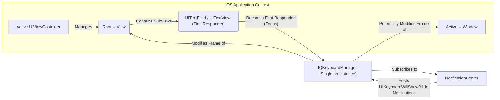
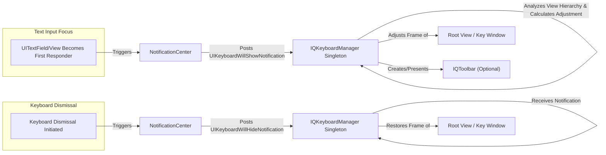

# Project Design Document: IQKeyboardManager

**Version:** 1.1
**Date:** October 26, 2023
**Author:** AI Software Architect

## 1. Introduction

This document provides an enhanced and detailed design overview of the open-source iOS library, [IQKeyboardManager](https://github.com/hackiftekhar/iqkeyboardmanager). This document aims to provide a comprehensive and improved understanding of the library's architecture, components, and data flow, serving as a robust foundation for subsequent threat modeling activities. This revision incorporates more specific details and clarifies certain aspects of the library's operation.

IQKeyboardManager is a widely adopted library for iOS development that automates the handling of keyboard appearance and dismissal, preventing the keyboard from obscuring text fields and other interactive elements within an application's user interface. It strives to deliver a smooth and intuitive user experience with minimal developer intervention.

## 2. Goals and Objectives

The core goals of IQKeyboardManager are:

*   **Automated Keyboard Management:** To automatically adjust the position of the active `UIWindow`'s root view or the relevant `UIViewController`'s view when the software keyboard appears or disappears.
*   **Prevention of UI Obstruction:** To guarantee that the currently focused text input view (e.g., `UITextField`, `UITextView`) remains fully visible above the presented keyboard.
*   **Simplified Integration:** To minimize the amount of manual code developers need to write to achieve consistent and correct keyboard handling across their applications.
*   **Extensibility and Customization:** To offer a range of configuration options and customization points, allowing developers to tailor the library's behavior to specific UI requirements and edge cases.
*   **Platform and Version Compatibility:** To maintain compatibility across a broad spectrum of iOS devices and operating system versions.

## 3. Architecture and Design

IQKeyboardManager operates as a singleton object, acting as a central point for observing and responding to system-level notifications related to keyboard events and changes within the application's view hierarchy. It dynamically manipulates the frame of the relevant view to ensure optimal visibility of the focused input element.

The library interacts significantly with the following iOS frameworks and components:

*   **UIKit Framework:** The foundational framework for constructing iOS user interfaces, specifically utilizing classes such as `UIView`, `UIViewController`, `UITextField`, `UITextView`, `UIWindow`, and `UIResponder`.
*   **Foundation Framework:** Utilizing `NotificationCenter` for observing system-wide notifications.
*   **Objective-C Runtime:**  Leveraging categories to extend the functionality of existing UIKit classes without subclassing.
*   **Key Window Management:**  Identifying and interacting with the `keyWindow`, which is the window receiving user input.
*   **View Hierarchy Traversal:**  Implementing logic to navigate the application's view hierarchy to locate the active text input view and its position within the window.

### 3.1. High-Level Architecture Diagram

### 3.2. Detailed Component Breakdown

*   **`IQKeyboardManager` (Singleton):** The core orchestrator of the library's functionality. It manages the observation of keyboard notifications and the subsequent adjustments to the view hierarchy.
    *   **Global Configuration Properties:**  A set of properties accessible via the singleton instance, allowing developers to configure the library's global behavior (e.g., enabling/disabling the manager, customizing toolbar appearance, defining the moving behavior of the view).
        *   Example properties: `enable`, `keyboardDistanceFromTextField`, `shouldResignOnTouchOutside`, `toolbarManageBehaviour`.
    *   **Notification Observation Logic:**  Manages the subscription and handling of key system notifications related to keyboard appearance (`UIKeyboardWillShowNotification`, `UIKeyboardDidShowNotification`, `UIKeyboardWillHideNotification`, `UIKeyboardDidHideNotification`, `UIKeyboardWillChangeFrameNotification`, `UIKeyboardDidChangeFrameNotification`).
    *   **Active Text View Tracking:**  Maintains a reference to the currently focused text input view (`UITextField` or `UITextView`).
    *   **View Hierarchy Inspection:**  Implements methods to traverse the view hierarchy to determine the position and properties of the active text view and its superviews.
    *   **Frame Adjustment Calculations:**  Contains the core logic for calculating the necessary adjustments to the root view's frame to prevent keyboard obstruction, taking into account the keyboard's size and the text view's position.
    *   **View Frame Manipulation:**  Applies the calculated frame adjustments to the appropriate view (typically the root view of the active view controller or the `keyWindow`).
    *   **Tap Gesture Handling:**  Optionally adds a `UITapGestureRecognizer` to the view to facilitate dismissing the keyboard when the user taps outside of any input fields.
    *   **`IQToolbar` Management:**  Handles the creation, configuration, and presentation of the optional input accessory view (`IQToolbar`).
    *   **Disabled Functionality Lists:**  Provides mechanisms to disable the library's behavior for specific classes or view controllers.
    *   **`shouldIgnore...` Delegates:**  Offers delegate methods (though less common now with block-based configurations) for more fine-grained control over when the library should intervene.
*   **`IQToolbar`:** A custom `UIToolbar` subclass used as the input accessory view for navigating between text fields and dismissing the keyboard.
    *   **"Previous", "Next", "Done" Buttons:**  Standard buttons for keyboard navigation and dismissal.
    *   **Customizable Button Support:**  Allows developers to add custom `UIBarButtonItem` instances to the toolbar.
    *   **Dynamic Button State:**  Manages the enabled/disabled state of the "Previous" and "Next" buttons based on the availability of other focusable text fields in the view hierarchy.
    *   **Target-Action Mechanism:**  Utilizes the target-action pattern to handle button taps.
*   **`IQUIView+IQKeyboardToolbar` (Objective-C Category on `UIView`):** Extends the `UIView` class to associate an `IQToolbar` with specific views.
    *   **`keyboardToolbar` Property:**  Adds a property to `UIView` to store a reference to its associated `IQToolbar`.
*   **`IQBarButtonItem`:** A custom `UIBarButtonItem` subclass, potentially offering slight customizations or extensions compared to the standard `UIBarButtonItem`.

### 3.3. Detailed Data Flow

The interaction flow within IQKeyboardManager is triggered by the system's keyboard appearance and the focus changes of text input views.

1. **Focus Event:** A `UITextField` or `UITextView` gains focus, becoming the first responder.
2. **`UIKeyboardWillShowNotification`:** The iOS system broadcasts a `UIKeyboardWillShowNotification` via `NotificationCenter.default`. This notification contains a `userInfo` dictionary with details about the keyboard's frame (`UIKeyboardFrameBeginUserInfoKey`, `UIKeyboardFrameEndUserInfoKey`), animation duration (`UIKeyboardAnimationDurationUserInfoKey`), and animation curve (`UIKeyboardAnimationCurveUserInfoKey`).
3. **`IQKeyboardManager` Receives Notification:** The `IQKeyboardManager` singleton, having registered as an observer, receives this notification.
4. **Active Text View Identification:** `IQKeyboardManager` identifies the `UIView` that triggered the keyboard appearance (the first responder).
5. **View Hierarchy Analysis and Position Calculation:** The library traverses the view hierarchy to determine the position of the active text view relative to the window's bounds.
6. **Required Adjustment Calculation:** Based on the keyboard's final frame and the active text view's position, `IQKeyboardManager` calculates the necessary vertical adjustment to the root view's frame to ensure the text view remains visible above the keyboard. This calculation considers the `keyboardDistanceFromTextField` setting.
7. **Frame Adjustment Application:** `IQKeyboardManager` animates the adjustment of the root view's frame (or potentially the `keyWindow`'s frame, depending on the configuration and view hierarchy) using the animation duration and curve provided in the notification's `userInfo`.
8. **`IQToolbar` Presentation (Optional):** If enabled, `IQKeyboardManager` creates or retrieves an `IQToolbar` and sets it as the `inputAccessoryView` of the active text view. The toolbar buttons are configured based on the presence of other focusable text fields.
9. **Focus Change Navigation:** When the user taps the "Previous" or "Next" buttons on the `IQToolbar`, `IQKeyboardManager` programmatically makes the previous or next focusable text field in the view hierarchy the first responder.
10. **Dismissal Event:** The user dismisses the keyboard (e.g., by tapping the "Done" button, tapping outside, or programmatic dismissal).
11. **`UIKeyboardWillHideNotification`:** The iOS system broadcasts a `UIKeyboardWillHideNotification`.
12. **`IQKeyboardManager` Receives Dismissal Notification:** `IQKeyboardManager` receives this notification.
13. **Frame Restoration:** `IQKeyboardManager` animates the root view's frame back to its original position using the animation details from the notification.

## 4. Key Components in Detail

Expanding on the core components:

### 4.1. `IQKeyboardManager` (Detailed)

*   **Configuration Properties (Examples):**
    *   `enable`: A boolean to globally enable or disable the library's functionality.
    *   `keyboardDistanceFromTextField`: A `CGFloat` value specifying the desired distance between the top of the keyboard and the bottom of the focused text field.
    *   `shouldResignOnTouchOutside`: A boolean indicating whether tapping outside the focused input field should dismiss the keyboard.
    *   `toolbarManageBehaviour`: An enum (`IQAutoToolbarManageBehaviour`) controlling how the toolbar is managed (e.g., automatic, by tag, individual).
    *   `enableAutoToolbar`: A boolean to enable or disable the automatic creation of the `IQToolbar`.
    *   `toolbarPreviousNextAllowedClasses`: An array of `String` representing class names for which the "Previous" and "Next" buttons should be enabled.
    *   `disabledDistanceHandlingClasses`: An array of `String` representing class names for which keyboard distance handling should be disabled.
*   **Internal State Management:**  The singleton maintains internal state, such as whether the keyboard is currently visible and the frame of the keyboard.
*   **Delegate Methods (Less Common Now):** While block-based configurations are more prevalent, older versions or specific use cases might utilize delegate methods from `IQKeyboardManagerDelegate` for customization.

### 4.2. `IQToolbar` (Detailed)

*   **Button Customization:** Developers can customize the appearance of the toolbar buttons (e.g., tint color, background image).
*   **Localization:** The button titles ("Previous", "Next", "Done") can be localized.
*   **Accessibility:**  The toolbar and its buttons should adhere to accessibility guidelines, providing appropriate labels for VoiceOver.
*   **Dynamic Button Availability Logic:** The logic for determining whether "Previous" and "Next" buttons should be enabled involves iterating through the view hierarchy and identifying other focusable text input views.

## 5. Configuration and Customization Methods

IQKeyboardManager provides several avenues for configuration:

*   **Global Configuration via Singleton:** The primary method, setting properties on the `IQKeyboardManager.shared` instance to affect the entire application.
    *   Example: `IQKeyboardManager.shared.enable = true`
*   **Per-View Controller Customization (Less Common):** While direct per-view controller configuration is less emphasized now, certain properties or delegate methods might still offer this level of control.
*   **Disabling Functionality:** Using properties like `disabledDistanceHandlingClasses`, `disabledToolbarClasses`, and `disabledTouchResignedClasses` to selectively disable features for specific view controllers or views.
*   **Custom Input Accessory Views:** Developers can completely bypass the `IQToolbar` by setting a custom `inputAccessoryView` on their text input fields.
*   **Delegate Implementation (If Applicable):** Implementing the `IQKeyboardManagerDelegate` protocol to respond to specific events or modify behavior.

## 6. Security Considerations (More Specific)

Considering the library's functionality, potential security considerations include:

*   **Potential for UI Spoofing (Mitigated):** While IQKeyboardManager aims to prevent keyboard obstruction, a vulnerability in its frame calculation or animation logic could theoretically be exploited to create UI elements that appear interactive but are not, potentially misleading users. However, this is highly unlikely given the library's maturity and focus.
*   **Resource Consumption (Low Risk):**  The view hierarchy analysis, while generally efficient, could potentially become a performance bottleneck in extremely complex or deeply nested view hierarchies, leading to minor delays. This is more of a performance concern than a direct security vulnerability.
*   **Information Disclosure (Indirect and Unlikely):**  Since the library interacts with text input fields, a bug causing unexpected view shifting could theoretically expose a small portion of obscured content. However, this scenario is improbable.
*   **Dependency Chain Risks:** As with any third-party dependency, there's a risk if the `IQKeyboardManager` repository itself were compromised. Developers should ensure they are using trusted sources and consider using tools to scan dependencies for vulnerabilities.
*   **Accidental Exposure of Sensitive Data (Developer Error):** If developers incorrectly configure the library or rely on it to handle sensitive input fields without proper additional security measures (like secure text entry), it could indirectly contribute to data exposure. This is a usage concern rather than a vulnerability in the library itself.

**Note:** A dedicated threat model document will provide a more structured and in-depth analysis of potential security threats, attack vectors, and mitigation strategies specific to the context of applications using IQKeyboardManager.

## 7. Deployment and Integration Details

IQKeyboardManager supports standard iOS dependency management tools:

*   **CocoaPods:**  Requires adding `pod 'IQKeyboardManagerSwift'` (or the Objective-C version) to the `Podfile` and running `pod install`. Developers should specify the desired version.
*   **Carthage:**  Involves adding `github "hackiftekhar/IQKeyboardManager"` to the `Cartfile` and running `carthage update`. Requires manual integration of the built frameworks.
*   **Swift Package Manager (SPM):**  Integration is done through Xcode by adding the repository URL (`https://github.com/hackiftekhar/IQKeyboardManager.git`) when adding a package dependency. Developers can specify version rules.

Post-integration, the library typically initializes automatically and starts managing keyboard behavior without requiring explicit initialization code in most common scenarios.

## 8. Future Development Areas

Potential areas for future enhancements include:

*   **Improved Support for SwiftUI:**  While primarily designed for UIKit, better integration or a SwiftUI-native alternative could be beneficial.
*   **Enhanced Handling of External Keyboards:**  Addressing potential issues or edge cases related to external keyboard input.
*   **More Granular Control over Animations:**  Providing more options to customize the animation behavior of view adjustments.
*   **Advanced Layout Constraint Integration:**  Potentially leveraging layout constraints more directly for view adjustments, offering more robust handling of complex layouts.
*   **Further Optimization for Performance:**  Continuously reviewing and optimizing the library's performance, especially in scenarios with complex view hierarchies.

This revised document offers a more detailed and comprehensive design overview of IQKeyboardManager, providing a stronger foundation for understanding its inner workings and facilitating thorough threat modeling activities.
