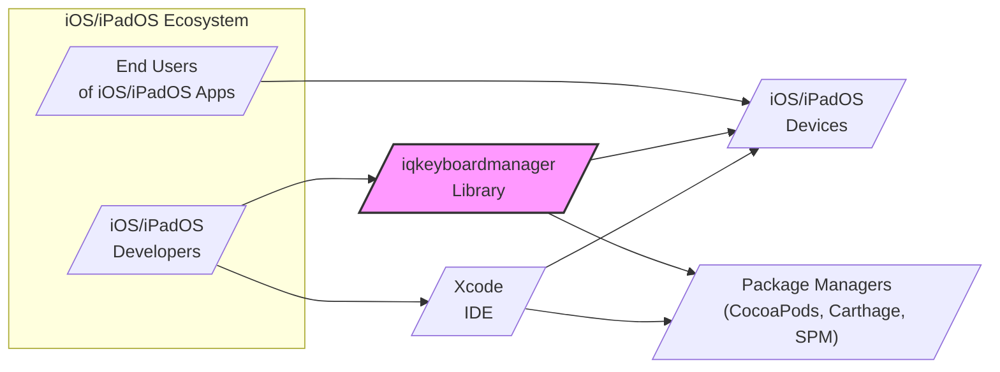
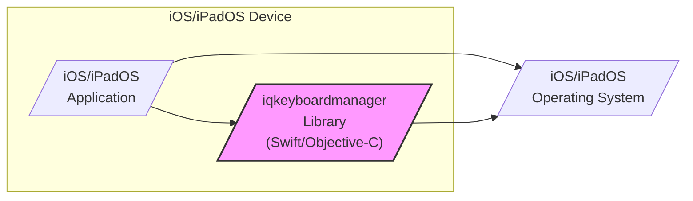
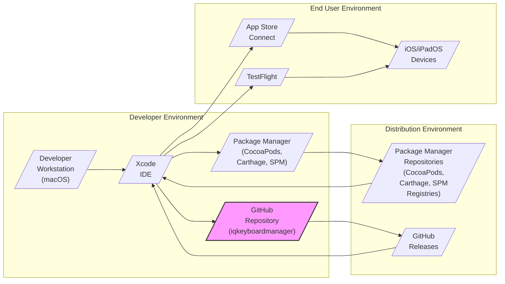

# BUSINESS POSTURE

- Business Priorities and Goals:
 - Enhance user experience in iOS and iPadOS applications by automatically managing keyboard interactions.
 - Improve application usability by preventing the software keyboard from obscuring text fields and text views.
 - Simplify development process for iOS developers by providing a reusable component for keyboard management, reducing the need for custom implementations.
 - Increase developer productivity by offering a well-tested and maintained solution, allowing developers to focus on application-specific logic rather than keyboard handling intricacies.

- Business Risks:
 - Potential for library defects to negatively impact user experience in applications using the library, leading to user dissatisfaction.
 - Risk of compatibility issues with future iOS/iPadOS updates, requiring ongoing maintenance and updates to the library.
 - Dependency on a third-party library introduces a potential point of failure or delay in application development if the library is not maintained or becomes unavailable.
 - Limited business impact from security vulnerabilities in the library itself, as it primarily deals with UI interactions and does not handle sensitive data directly. However, vulnerabilities could be exploited to cause denial of service or unexpected UI behavior within applications using the library.

# SECURITY POSTURE

- Existing Security Controls:
 - security control: Code hosted on GitHub, providing version control and transparency. (Implemented: GitHub Repository)
 - security control: Open-source license (MIT License), allowing for community review and contributions. (Implemented: LICENSE file in repository)
 - accepted risk: Reliance on community contributions for security vulnerability identification and patching.
 - accepted risk: Limited formal security testing or audits of the library code.

- Recommended Security Controls:
 - security control: Implement automated dependency scanning to identify and address vulnerabilities in third-party dependencies used by the library.
 - security control: Integrate static application security testing (SAST) tools into the development workflow to automatically detect potential security flaws in the library code.
 - security control: Establish a process for reporting and responding to security vulnerabilities, including a security policy and contact information.
 - security control: Consider code signing the library releases to ensure integrity and authenticity of the distributed component.

- Security Requirements:
 - Authentication: Not applicable. The library itself does not handle authentication. Applications using the library are responsible for their own authentication mechanisms.
 - Authorization: Not applicable. The library does not handle authorization. Applications using the library are responsible for their own authorization mechanisms.
 - Input Validation: The library should handle UI events and input data from text fields and text views safely. While the primary input is UI events, the library should avoid assumptions about the format or content of text data to prevent unexpected behavior or vulnerabilities in applications using it.
 - Cryptography: Not applicable. The library does not require cryptographic operations. Applications using the library are responsible for their own cryptographic needs.

# DESIGN

## C4 CONTEXT



- Context Diagram Elements:
 - - Name: iOS/iPadOS Developers
   - Type: Person
   - Description: Software developers who build iOS and iPadOS applications and integrate third-party libraries.
   - Responsibilities: Integrate the iqkeyboardmanager library into their projects, configure library settings, and test the library's behavior within their applications.
   - Security controls: Secure development practices, code review, dependency management within their own projects.

 - - Name: End Users of iOS/iPadOS Apps
   - Type: Person
   - Description: Users who interact with iOS and iPadOS applications that utilize the iqkeyboardmanager library.
   - Responsibilities: Use applications as intended, interact with UI elements including text fields and text views.
   - Security controls: Device security settings, application permissions, general awareness of mobile security best practices.

 - - Name: iqkeyboardmanager Library
   - Type: Software System
   - Description: An iOS/iPadOS library that automatically handles keyboard management to prevent the keyboard from covering text fields and text views.
   - Responsibilities: Intercept keyboard events, adjust view layouts to ensure text fields remain visible when the keyboard is displayed, provide configuration options for customization.
   - Security controls: Input validation (of UI events and potentially text data, though indirectly), adherence to secure coding practices, dependency scanning (recommended).

 - - Name: iOS/iPadOS Devices
   - Type: Software System
   - Description: iPhones and iPads running the iOS or iPadOS operating systems, on which applications using the iqkeyboardmanager library are installed and executed.
   - Responsibilities: Execute applications, render user interfaces, manage keyboard input and display, provide the runtime environment for the iqkeyboardmanager library.
   - Security controls: Operating system security features, application sandboxing, user permissions, device encryption.

 - - Name: Package Managers (CocoaPods, Carthage, SPM)
   - Type: Software System
   - Description: Dependency management tools used by iOS developers to integrate third-party libraries like iqkeyboardmanager into their projects.
   - Responsibilities: Download and manage library dependencies, integrate libraries into Xcode projects, facilitate library updates.
   - Security controls: Package integrity checks (checksums, signatures), repository security, vulnerability scanning of managed dependencies (within the package manager ecosystem).

 - - Name: Xcode IDE
   - Type: Software System
   - Description: Apple's Integrated Development Environment used by iOS/iPadOS developers to build, test, and deploy applications.
   - Responsibilities: Code editing, compilation, building applications, managing project dependencies, running simulators and deploying to devices.
   - Security controls: Code signing, developer account security, secure build environment, integration with security scanning tools (optional).

## C4 CONTAINER



- Container Diagram Elements:
 - - Name: iOS/iPadOS Application
   - Type: Software Container
   - Description: The iOS or iPadOS application developed by iOS developers, which integrates and utilizes the iqkeyboardmanager library.
   - Responsibilities: Application-specific logic, user interface rendering, handling user interactions, utilizing the iqkeyboardmanager library for keyboard management.
   - Security controls: Application-level security controls (authentication, authorization, data protection), secure coding practices, integration of security libraries and frameworks.

 - - Name: iqkeyboardmanager Library (Swift/Objective-C)
   - Type: Software Container
   - Description: The iqkeyboardmanager library itself, implemented in Swift and/or Objective-C, providing the keyboard management functionality.
   - Responsibilities: Intercepting keyboard notifications from the iOS/iPadOS operating system, calculating view adjustments, applying layout changes to prevent keyboard obstruction, providing configuration options.
   - Security controls: Input validation (of UI events), memory safety (inherent in Swift/Objective-C with ARC), static analysis (recommended), dependency scanning (recommended).

 - - Name: iOS/iPadOS Operating System
   - Type: Software Container
   - Description: The underlying operating system on iOS and iPadOS devices, providing system services and APIs to applications and libraries.
   - Responsibilities: Managing system resources, handling user input, providing UI frameworks, managing keyboard input and display, enforcing security policies.
   - Security controls: Operating system security features (sandboxing, permissions, memory protection), kernel-level security mechanisms, regular security updates.

## DEPLOYMENT



- Deployment Diagram Elements:
 - - Name: Developer Workstation (macOS)
   - Type: Infrastructure
   - Description: Developer's local macOS machine used for development, including Xcode and package managers.
   - Responsibilities: Running Xcode, managing dependencies, building and testing applications, developing the iqkeyboardmanager library (for library developers).
   - Security controls: Workstation security best practices, operating system security, developer account security.

 - - Name: Xcode IDE
   - Type: Software
   - Description: Apple's IDE used for iOS/iPadOS development.
   - Responsibilities: Code editing, compilation, building, testing, packaging applications and libraries.
   - Security controls: Code signing, secure build settings, developer account management.

 - - Name: Package Manager (CocoaPods, Carthage, SPM)
   - Type: Software
   - Description: Dependency management tools used by developers.
   - Responsibilities: Managing library dependencies, downloading and integrating libraries into projects.
   - Security controls: Secure package download and installation, repository security (of package manager registries).

 - - Name: GitHub Repository (iqkeyboardmanager)
   - Type: Software
   - Description: The GitHub repository hosting the source code of the iqkeyboardmanager library.
   - Responsibilities: Version control, source code management, issue tracking, collaboration, release management.
   - Security controls: GitHub security features (access control, branch protection), code review processes, vulnerability scanning (GitHub Dependabot).

 - - Name: Package Manager Repositories (CocoaPods, Carthage, SPM Registries)
   - Type: Infrastructure
   - Description: Online repositories where package managers host and distribute libraries.
   - Responsibilities: Hosting library packages, providing download access to developers.
   - Security controls: Repository security, package integrity checks (checksums, signatures).

 - - Name: GitHub Releases
   - Type: Software
   - Description: GitHub's release feature used to distribute specific versions of the iqkeyboardmanager library.
   - Responsibilities: Hosting downloadable release artifacts (e.g., zip files, frameworks).
   - Security controls: GitHub security features, release integrity (e.g., signed releases - recommended).

 - - Name: App Store Connect
   - Type: Software
   - Description: Apple's platform for distributing applications to the App Store and TestFlight.
   - Responsibilities: Application submission, review process, distribution to end users via App Store and TestFlight.
   - Security controls: Apple's app review process, code signing requirements, platform security features.

 - - Name: TestFlight
   - Type: Software
   - Description: Apple's platform for beta testing applications before App Store release.
   - Responsibilities: Beta distribution to testers, feedback collection.
   - Security controls: Limited distribution, beta testing environment.

 - - Name: iOS/iPadOS Devices
   - Type: Infrastructure
   - Description: End-user devices where applications are installed from the App Store or TestFlight.
   - Responsibilities: Running applications, providing the runtime environment for the iqkeyboardmanager library.
   - Security controls: Device security features, application sandboxing.

## BUILD

```mermaid
flowchart LR
    A[/"Developer\nWorkstation"/] --> B{/"Code Changes\n(Swift/Objective-C)"/}
    B --> C[/"GitHub\nRepository"/]
    C --> D{/"CI System\n(GitHub Actions,\nfastlane, etc.)"/}
    D --> E{/"Build Process\n(Xcodebuild,\nSwift Compiler)"/}
    E --> F[/"Unit Tests,\nLinters,\nSAST"/]
    F --> G{/"Build Artifacts\n(Framework,\nPackage)"/}
    G --> H[/"Package Manager\nRepositories\nGitHub Releases"/]
    style G fill:#f9f,stroke:#333,stroke-width:2px
```

- Build Diagram Elements:
 - - Name: Developer Workstation
   - Type: Infrastructure
   - Description: Developer's local machine where code changes are made.
   - Responsibilities: Writing and modifying code, local testing.
   - Security controls: Developer workstation security, code review (pre-commit).

 - - Name: Code Changes (Swift/Objective-C)
   - Type: Data
   - Description: Source code modifications made by developers.
   - Responsibilities: Implementing features, fixing bugs, addressing security vulnerabilities.
   - Security controls: Code review, version control (Git).

 - - Name: GitHub Repository
   - Type: Software System
   - Description: Central repository for source code.
   - Responsibilities: Version control, collaboration, triggering CI/CD pipelines.
   - Security controls: Access control, branch protection, pull request reviews.

 - - Name: CI System (GitHub Actions, fastlane, etc.)
   - Type: Software System
   - Description: Continuous Integration system for automated build and testing.
   - Responsibilities: Automated build process, running tests, performing static analysis, creating build artifacts.
   - Security controls: Secure CI/CD pipeline configuration, access control to CI system, secrets management.

 - - Name: Build Process (Xcodebuild, Swift Compiler)
   - Type: Software Process
   - Description: Steps involved in compiling and building the library.
   - Responsibilities: Compiling source code, linking dependencies, creating executable or library files.
   - Security controls: Secure build environment, dependency management, build process hardening.

 - - Name: Unit Tests, Linters, SAST
   - Type: Software Process
   - Description: Automated checks performed during the build process.
   - Responsibilities: Verifying code functionality, enforcing code style, detecting potential security vulnerabilities.
   - Security controls: Properly configured testing and scanning tools, secure test data management.

 - - Name: Build Artifacts (Framework, Package)
   - Type: Data
   - Description: Output of the build process, the distributable library.
   - Responsibilities: Providing the compiled library for distribution.
   - Security controls: Code signing, artifact integrity checks (checksums).

 - - Name: Package Manager Repositories, GitHub Releases
   - Type: Software System
   - Description: Distribution channels for the library.
   - Responsibilities: Hosting and distributing build artifacts.
   - Security controls: Repository security, secure distribution channels, package integrity verification.

# RISK ASSESSMENT

- Critical Business Processes:
 - Ensuring a positive user experience in iOS/iPadOS applications by preventing keyboard obstruction of text fields.
 - Maintaining developer productivity by providing a reliable and easy-to-use keyboard management solution.

- Data to Protect and Sensitivity:
 - Source code of the iqkeyboardmanager library: Sensitivity is moderate. Exposure could lead to cloning and redistribution, or potentially reveal implementation details that could be exploited (though unlikely for this type of library).
 - Build artifacts (compiled library): Sensitivity is low to moderate. Integrity is important to ensure users are using the intended and unmodified library.
 - No sensitive user data is processed or stored by the library itself.

# QUESTIONS & ASSUMPTIONS

- Questions:
 - What is the target audience for this design document? (e.g., security team, development team, project stakeholders)
 - Are there any specific security compliance requirements that the library or applications using it must adhere to?
 - What is the process for reporting and addressing security vulnerabilities in the library?
 - Are there any existing security policies or guidelines that should be considered for this project?
 - What is the expected lifespan and maintenance plan for the iqkeyboardmanager library?

- Assumptions:
 - The primary goal of the iqkeyboardmanager library is to improve user experience and developer productivity, with security being a secondary but important consideration.
 - The library is intended for use in a wide range of iOS/iPadOS applications, from small to large scale.
 - Security vulnerabilities in the library are considered to have a relatively low direct business impact, but could indirectly affect user trust and application reputation.
 - The development and maintenance of the library are primarily driven by community contributions and the project maintainer.
 - Security best practices for open-source software development are generally followed, but may not be formally documented or rigorously enforced.