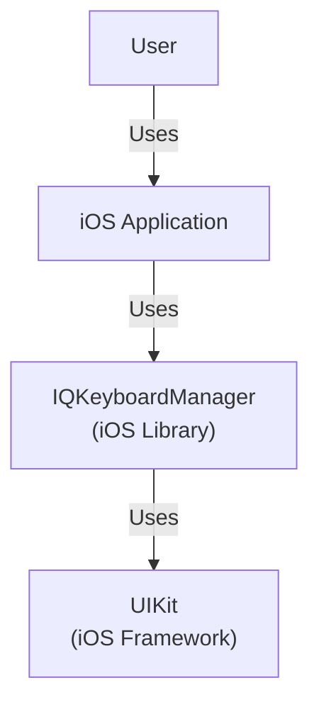
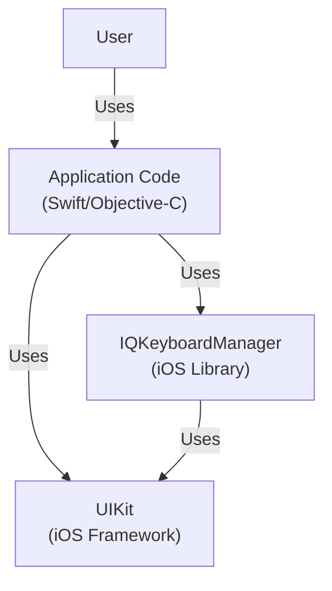
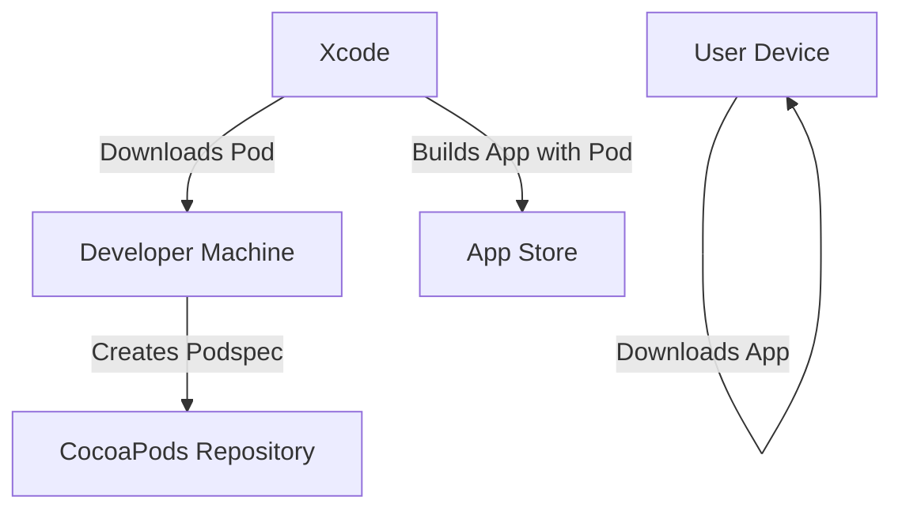
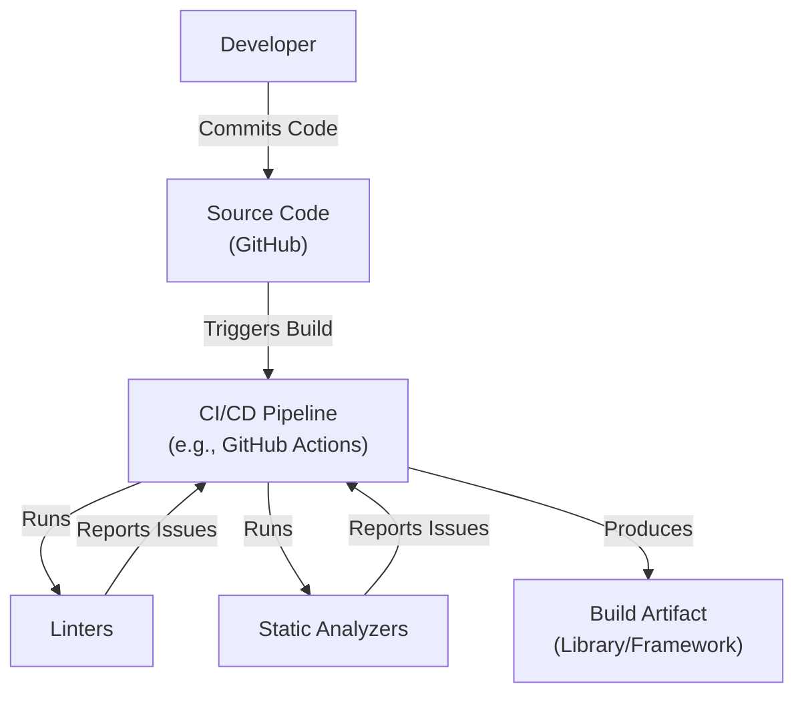

Okay, let's create a design document for the IQKeyboardManager project.

# BUSINESS POSTURE

Business Priorities and Goals:

*   Provide a seamless and developer-friendly solution for keyboard management in iOS applications.
*   Eliminate the need for manual keyboard handling code, reducing development time and potential errors.
*   Improve the user experience by preventing the keyboard from obscuring text fields.
*   Offer a highly customizable and configurable library to suit various application needs.
*   Maintain a lightweight and performant solution that doesn't negatively impact application performance.
*   Provide drop-in solution.

Most Important Business Risks:

*   Compatibility issues with different iOS versions and devices, leading to inconsistent behavior or crashes.
*   Security vulnerabilities that could be exploited by malicious actors.
*   Performance bottlenecks that could degrade the user experience.
*   Lack of adoption due to poor documentation, limited features, or better alternatives.
*   Maintainability challenges due to complex codebase or lack of updates.
*   Negative impact on application accessibility.

# SECURITY POSTURE

Existing Security Controls:

*   security control: The library itself doesn't directly handle sensitive data or network communication, reducing the attack surface.
*   security control: The library is distributed as source code, allowing for community scrutiny and identification of potential vulnerabilities. (Described in GitHub repository)
*   security control: The library doesn't require any special permissions or entitlements. (Described in GitHub repository)

Accepted Risks:

*   accepted risk: Potential for misuse if developers incorrectly configure the library or introduce vulnerabilities in their own code that interacts with the library.
*   accepted risk: Reliance on underlying iOS frameworks and APIs, inheriting any potential vulnerabilities in those components.
*   accepted risk: The library's functionality could be bypassed or disabled by malicious code with sufficient privileges.

Recommended Security Controls:

*   security control: Implement regular code reviews and static analysis to identify potential vulnerabilities.
*   security control: Conduct penetration testing to assess the library's resilience to attacks.
*   security control: Provide clear security guidelines and best practices for developers using the library.
*   security control: Establish a process for reporting and addressing security vulnerabilities.

Security Requirements:

*   Authentication: Not directly applicable, as the library doesn't handle user authentication.
*   Authorization: Not directly applicable, as the library doesn't manage user permissions or access control.
*   Input Validation: The library should handle various input scenarios gracefully, including unexpected or malicious input, although its primary function is not input validation. It should not introduce any vulnerabilities related to input handling.
*   Cryptography: Not directly applicable, as the library doesn't perform cryptographic operations.

# DESIGN

## C4 CONTEXT

Context Diagram Element List:

*   Element:
    *   Name: User
    *   Type: Person
    *   Description: The end-user interacting with the iOS application.
    *   Responsibilities: Interacts with the UI, enters text, triggers keyboard events.
    *   Security controls: N/A (External entity)

*   Element:
    *   Name: iOS Application
    *   Type: Software System
    *   Description: The iOS application that integrates IQKeyboardManager.
    *   Responsibilities: Provides application-specific functionality, handles user input, displays UI elements.
    *   Security controls: Application-specific security controls (e.g., authentication, authorization, data validation).

*   Element:
    *   Name: IQKeyboardManager
    *   Type: Library
    *   Description: The IQKeyboardManager library for managing keyboard appearance and behavior.
    *   Responsibilities: Automatically adjusts the view's position to prevent the keyboard from obscuring text fields, provides customization options.
    *   Security controls: Code reviews, static analysis, penetration testing (as recommended).

*   Element:
    *   Name: UIKit
    *   Type: Framework
    *   Description: The iOS UIKit framework providing UI components and event handling.
    *   Responsibilities: Manages UI elements, handles user interactions, provides keyboard-related APIs.
    *   Security controls: Relies on Apple's security measures for the UIKit framework.

## C4 CONTAINER

Since IQKeyboardManager is a single library integrated directly into an iOS application, the Container diagram is essentially an extension of the Context diagram.

Container Diagram Element List:

*   Element:
    *   Name: User
    *   Type: Person
    *   Description: The end-user interacting with the iOS application.
    *   Responsibilities: Interacts with the UI, enters text, triggers keyboard events.
    *   Security controls: N/A (External entity)

*   Element:
    *   Name: Application Code
    *   Type: Code
    *   Description: The application's source code (Swift or Objective-C) that integrates IQKeyboardManager.
    *   Responsibilities: Implements application logic, handles user input, integrates and configures IQKeyboardManager.
    *   Security controls: Application-specific security controls, secure coding practices.

*   Element:
    *   Name: IQKeyboardManager
    *   Type: Library
    *   Description: The IQKeyboardManager library.
    *   Responsibilities: Manages keyboard appearance, adjusts view positions, provides customization options.
    *   Security controls: Code reviews, static analysis, penetration testing (as recommended).

*   Element:
    *   Name: UIKit
    *   Type: Framework
    *   Description: The iOS UIKit framework.
    *   Responsibilities: Provides UI components, handles user interactions, manages keyboard events.
    *   Security controls: Relies on Apple's security measures for the UIKit framework.

## DEPLOYMENT

Deployment Options:

1.  CocoaPods: IQKeyboardManager can be integrated as a Pod.
2.  Carthage: IQKeyboardManager can be integrated as a framework via Carthage.
3.  Swift Package Manager: IQKeyboardManager supports Swift Package Manager.
4.  Manual Integration: The source code can be directly added to the project.

Chosen Deployment Method: CocoaPods (Illustrative Example)

Deployment Diagram Element List:

*   Element:
    *   Name: Developer Machine
    *   Type: Infrastructure
    *   Description: The developer's computer used for development and building the application.
    *   Responsibilities: Hosts the development environment, builds the application, manages dependencies.
    *   Security controls: Secure development environment, access controls, regular security updates.

*   Element:
    *   Name: CocoaPods Repository
    *   Type: Repository
    *   Description: The central repository for CocoaPods packages.
    *   Responsibilities: Stores and distributes IQKeyboardManager and other CocoaPods dependencies.
    *   Security controls: Repository security measures (e.g., access controls, integrity checks).

*   Element:
    *   Name: Xcode
    *   Type: Software
    *   Description: Apple's integrated development environment (IDE) for iOS development.
    *   Responsibilities: Manages the project, builds the application, integrates dependencies.
    *   Security controls: Relies on Apple's security measures for Xcode.

*   Element:
    *   Name: App Store
    *   Type: Platform
    *   Description: Apple's platform for distributing iOS applications.
    *   Responsibilities: Hosts and distributes the application to users.
    *   Security controls: App Store security review process, code signing, sandboxing.

*   Element:
    *   Name: User Device
    *   Type: Infrastructure
    *   Description: The end-user's iOS device (e.g., iPhone, iPad).
    *   Responsibilities: Runs the iOS application.
    *   Security controls: iOS security features (e.g., sandboxing, code signing, data protection).

## BUILD

Build Process Description:

1.  Developer commits code changes to the GitHub repository.
2.  A CI/CD pipeline (e.g., GitHub Actions, Travis CI, CircleCI) is triggered.
3.  The pipeline checks out the source code.
4.  Linters (e.g., SwiftLint) are run to enforce code style and identify potential issues.
5.  Static analyzers (e.g., SonarCloud, Coverity) are run to detect potential bugs, vulnerabilities, and code smells.
6.  If all checks pass, the pipeline builds the library/framework, producing the build artifact.
7.  The build artifact can then be distributed via CocoaPods, Carthage, Swift Package Manager, or manual integration.

Security Controls in Build Process:

*   security control: Code review process before merging changes to the main branch.
*   security control: Use of linters to enforce coding standards and identify potential issues.
*   security control: Use of static analyzers to detect vulnerabilities and code quality problems.
*   security control: Automated build process to ensure consistency and reproducibility.
*   security control: Dependency management tools (CocoaPods, Carthage, SPM) to manage external libraries and their versions.

# RISK ASSESSMENT

Critical Business Processes:

*   Providing a smooth and intuitive user experience within iOS applications.
*   Enabling developers to easily integrate and customize keyboard management.
*   Maintaining a reliable and performant library.

Data Protection:

*   IQKeyboardManager itself does not handle sensitive data directly. However, it interacts with text input fields, which *could* contain sensitive data entered by the user.
*   Data Sensitivity: The sensitivity of the data depends on the specific application using IQKeyboardManager. It could range from non-sensitive (e.g., search queries) to highly sensitive (e.g., passwords, personal information). The library itself does not differentiate. The *hosting application* is responsible for protecting any sensitive data.

# QUESTIONS & ASSUMPTIONS

Questions:

*   Are there any specific compliance requirements (e.g., HIPAA, GDPR) that the application using IQKeyboardManager must adhere to?
*   What is the expected level of usage and scale for applications using this library?
*   Are there any specific performance benchmarks or targets that the library should meet?
*   What is the process for handling bug reports and feature requests?

Assumptions:

*   BUSINESS POSTURE: The primary goal is to provide a convenient and reliable keyboard management solution for iOS developers.
*   SECURITY POSTURE: The library is used in a standard iOS application environment and doesn't require any unusual permissions.
*   DESIGN: Developers will integrate the library using one of the supported methods (CocoaPods, Carthage, SPM, or manual integration). The library will be used in conjunction with standard UIKit components.