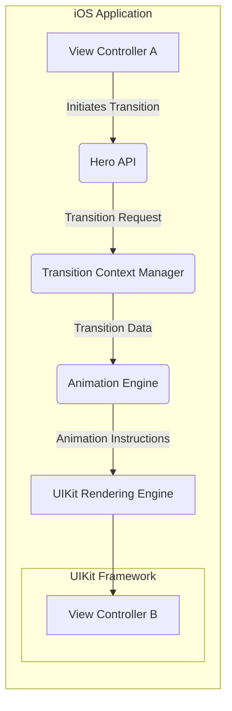

# Project Design Document: Hero Transitions Library

**Version:** 1.1
**Date:** October 26, 2023
**Author:** Gemini (AI Language Model)

## 1. Introduction

This document provides an enhanced design overview of the Hero Transitions library (referred to as "Hero" throughout this document), a library for creating smooth, sophisticated transitions between views in iOS applications. This revised document aims to provide a more detailed and structured understanding of Hero's architecture, components, and data flow, specifically tailored for effective threat modeling activities.

## 2. Goals

*   Provide a more granular description of the architecture and components of the Hero library, including their specific responsibilities.
*   Elaborate on the data flow within the library during transition animations, detailing the types of data being exchanged.
*   Clearly identify key interactions and dependencies of the library, highlighting potential points of integration and risk.
*   Offer more specific and actionable security considerations to facilitate targeted threat modeling.

## 3. Non-Goals

*   Detailed implementation specifics of individual animation algorithms' internal workings.
*   Micro-level performance optimization techniques employed within the library's code.
*   Specific UI/UX design guidelines or best practices for utilizing Hero in application development.
*   In-depth, line-by-line code-level implementation details of the library.

## 4. Architectural Overview

Hero is a client-side library deeply integrated into the lifecycle of iOS applications. It operates within the application's process space and leverages the robust capabilities of the UIKit framework for rendering and managing animations. The core functionality centers around intercepting standard view controller transitions and providing a mechanism for developers to inject custom, visually appealing animation logic.

### 4.1. High-Level Architecture Diagram

### 4.2. Key Components

*   **Hero API:** This serves as the primary point of interaction for developers to utilize the Hero library. It exposes methods and properties that enable the configuration and execution of custom transitions.
    *   Responsibilities:
        *   Providing methods to enable Hero for specific view controllers or individual views.
        *   Offering interfaces for developers to define and customize transition animations.
        *   Allowing the specification of transition parameters such as duration, timing functions (easing), and animation types.
        *   Enabling the assignment of unique "hero identifiers" to views, facilitating shared element transitions between view controllers.
*   **Transition Context Manager:** This component is responsible for managing the lifecycle and data associated with an ongoing transition. It acts as a central repository for information about the participating view controllers and views.
    *   Responsibilities:
        *   Storing references to the "from" and "to" view controllers involved in the transition.
        *   Holding snapshots or representations of the views that are part of the animation.
        *   Managing the temporary container view where animations are performed.
        *   Orchestrating the flow of data between different components during the transition.
*   **Animation Engine:** This is the core processing unit of the library, responsible for interpreting the transition context and executing the actual animation logic. It translates the desired transition effects into concrete animation instructions for UIKit.
    *   Responsibilities:
        *   Handling both container-level transitions (affecting the overall view controller presentation) and view-level animations (transforming individual views).
        *   Supporting a variety of built-in animation types (e.g., fade, slide, zoom, rotate) and allowing for custom animations.
        *   Managing the timing and synchronization of multiple animations occurring concurrently during a transition.
        *   Interacting with UIKit's animation APIs to apply the necessary transformations to the views.
*   **Hero Identifiers:** These are unique string identifiers assigned by developers to specific views within their view controllers. Hero uses these identifiers to establish a correspondence between views in the source and destination view controllers for shared element transitions.
    *   Responsibilities:
        *   Providing a mechanism for developers to mark views that should visually transition between screens.
        *   Enabling the `Animation Engine` to identify and animate corresponding views during shared element transitions.

## 5. Data Flow

The following details the typical flow of data during a view controller transition orchestrated by Hero:

1. **Transition Initiation:** The user's interaction within the application triggers a view controller transition, such as a button tap leading to a `pushViewController` or `present` method call.
2. **Hero Interception and Request:** Hero intercepts the standard UIKit transition process. The initiating view controller or a delegate informs the `Hero API` about the impending transition.
3. **Context Creation and Data Gathering:** The `Transition Context Manager` is invoked. It creates a `Transition Context` object and gathers essential information about the transition, including references to the "from" and "to" view controllers, their view hierarchies, and any relevant transition parameters specified by the developer.
4. **Snapshotting (Conditional):** Depending on the type of transition and the configuration, Hero might create snapshots of the views involved. This is crucial for achieving smooth and visually consistent animations, particularly for shared element transitions where the original views might be modified during the animation. The snapshot data includes visual representations of the views.
5. **Animation Setup and Instruction Generation:** The `Animation Engine` receives the `Transition Context` data. Based on the configured transition type, hero identifiers, and animation parameters, it calculates the necessary animation properties (e.g., initial and final positions, scales, opacities) and generates a set of animation instructions.
6. **Animation Execution via UIKit:** The `Animation Engine` communicates these animation instructions to UIKit's rendering engine. UIKit then performs the actual rendering and animation of the views within a temporary container view, creating the visual effect of the transition.
7. **View Controller Swap and Completion:** Once the animation completes (or is interrupted), UIKit handles the final swap of the view controllers. The "from" view controller is dismissed or moved off-screen, and the "to" view controller becomes the active view.
8. **Cleanup and Resource Release:** The `Transition Context Manager` performs necessary cleanup tasks, such as removing the temporary animation container and releasing any allocated resources.

### 5.1. Data Flow Diagram

```mermaid
graph LR
    A["User Interaction"] -- "Triggers Transition" --> B("UIKit Transition Call");
    B -- "Transition Notification" --> C{"Hero API Intercepts"};
    C -- "Transition Details" --> D["Transition Context Manager"];
    D -- "View Controllers, Views, Params" --> E["Snapshot Views (If Needed)"];
    E -- "Snapshot Data" --> F["Animation Engine Setup"];
    F -- "Animation Parameters, Identifiers" --> G["Generate Animation Instructions"];
    G -- "Animation Data" --> H["UIKit Rendering Engine"];
    H -- "Animated Views" --> I["View Controller Swap"];
    I --> J["Cleanup"];
```

## 6. Dependencies

Hero relies on the following core iOS frameworks:

*   **UIKit Framework:** This is the fundamental dependency, providing the building blocks for user interface elements, view management, and animation capabilities that Hero extends.
*   **Foundation Framework:** Provides essential data types, collections, and system services used throughout the library.
*   **Core Graphics and Core Animation:** While UIKit abstracts some of the underlying details, Hero ultimately leverages Core Animation for its animation mechanisms and Core Graphics for drawing and image manipulation related to snapshots.

## 7. Security Considerations (For Threat Modeling)

This section provides more specific security considerations to guide threat modeling efforts:

*   **Exposure of Sensitive Data in View Snapshots:**
    *   Threat: An attacker might be able to intercept or analyze view snapshots created by Hero during transitions. If these snapshots contain sensitive user data (e.g., personal information, financial details displayed on the screen), it could lead to unauthorized disclosure.
    *   Mitigation Considerations: Implement mechanisms to sanitize or redact sensitive information before or during snapshot creation. Consider the lifetime and storage of these snapshots.
*   **Manipulation of Transition Animations for UI Spoofing:**
    *   Threat: An attacker could potentially manipulate the animation parameters or the views involved in the transition to create a deceptive user interface. This could be used for phishing attacks or to trick users into performing unintended actions.
    *   Mitigation Considerations: Ensure that the transition logic is robust and cannot be easily manipulated by external factors. Implement checks to verify the integrity of the views and animation parameters.
*   **Denial of Service through Resource-Intensive Transitions:**
    *   Threat: A malicious actor could trigger a large number of complex or poorly optimized transitions, potentially consuming excessive CPU and memory resources, leading to application slowdowns or crashes (Denial of Service).
    *   Mitigation Considerations: Implement rate limiting or throttling mechanisms for transitions. Optimize animation performance to minimize resource consumption.
*   **Information Disclosure through Animation Timing and Behavior:**
    *   Threat: Subtle differences in animation timing or behavior based on underlying data or application state could potentially leak information to an observer. While less likely, this is a potential side-channel attack vector.
    *   Mitigation Considerations: Be mindful of the information conveyed through animation details, especially when dealing with sensitive data. Aim for consistent animation behavior regardless of the underlying data.
*   **Vulnerabilities in Dependent Frameworks:**
    *   Threat: Hero relies on UIKit, Foundation, and Core Animation. Security vulnerabilities in these frameworks could indirectly impact Hero's security.
    *   Mitigation Considerations: Stay updated with security patches and updates for the underlying iOS frameworks. Regularly assess the security posture of dependencies.
*   **Improper Handling of Hero Identifiers:**
    *   Threat: If hero identifiers are predictable or easily guessable, an attacker might be able to craft malicious transitions targeting specific views.
    *   Mitigation Considerations: While the developer is responsible for assigning identifiers, consider if there are any inherent risks in how identifiers are used internally by Hero.
*   **Injection Attacks through Custom Animation Logic:**
    *   Threat: If developers can inject arbitrary code or animation logic through Hero's API, it could potentially introduce vulnerabilities if not properly sanitized or validated.
    *   Mitigation Considerations: Carefully consider the security implications of allowing custom animation logic and provide clear guidelines to developers on secure usage.

## 8. Conclusion

This enhanced design document provides a more detailed and structured overview of the Hero Transitions library, specifically focusing on aspects relevant to security and threat modeling. By elaborating on the architecture, data flow, and dependencies, and by providing more specific security considerations, this document aims to facilitate a more comprehensive and effective threat modeling process for applications utilizing the Hero library.