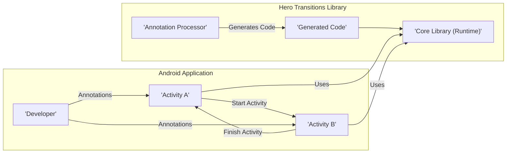
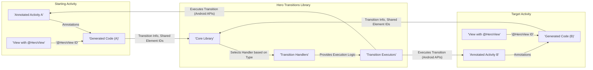

## Project Design Document: Hero Transitions Library

**Project Name:** Hero Transitions

**Project Repository:** https://github.com/herotransitions/hero

**Version:** 1.1

**Date:** October 26, 2023

**Author:** AI Software Architect

### 1. Introduction

This document provides a detailed design overview of the Hero Transitions library, an Android library meticulously crafted to simplify and streamline the creation of seamless activity transitions. This document aims to furnish a comprehensive understanding of the library's architectural underpinnings, its constituent components, and the intricate flow of data within its operation. This deep dive will serve as a solid foundation for subsequent threat modeling exercises.

### 2. Project Goals

*   To offer a declarative and intuitive approach to defining activity transitions through the use of annotations.
*   To significantly simplify the implementation of prevalent transition patterns, such as shared element transitions, fade effects, and slide animations.
*   To drastically reduce the amount of boilerplate code typically associated with utilizing Android's inherent transition APIs.
*   To establish a flexible and extensible architectural framework that facilitates the seamless integration of new and custom transition types.

### 3. Scope

This design document is specifically focused on the core functionality residing within the Hero Transitions library itself. It encompasses:

*   The internal architectural design and the various components that constitute the library.
*   The interaction paradigms between the library and the Android application that integrates it.
*   The journey of data as it flows within the library during the execution of transitions.

This document explicitly **does not** delve into:

*   The granular implementation specifics of individual transition animations as rendered by the Android framework.
*   The aesthetic aspects of UI design or the nuanced considerations of user experience related to the transitions.
*   The detailed implementation intricacies of the sample applications that are provided within the repository.

### 4. System Architecture

The Hero Transitions library is designed to operate seamlessly within the environment of an Android application. It leverages the power of annotation processing during the compilation phase and utilizes runtime components to effectively manage the transitions between activities.

#### 4.1. High-Level Architecture Diagram

#### 4.2. Component Description

*   **Annotation Processor:** This crucial component is executed during the application's compilation process. It diligently scans the source code of Android Activities, specifically looking for annotations provided by the Hero library (e.g., `@HeroActivity`, `@HeroView`). Based on the presence and configuration of these annotations, it dynamically generates supplementary Java or Kotlin code. This generated code serves as the crucial link, enabling seamless interaction with the core library at runtime.
*   **Generated Code:** This represents the output produced by the Annotation Processor. It comprises classes and methods that are uniquely tailored to each Activity that has been annotated. This generated code is responsible for the initial setup and the subsequent execution of the defined transitions. It effectively acts as an intermediary layer, bridging the gap between the annotated Activities and the core library's functionalities.
*   **Core Library (Runtime):** This component encapsulates the runtime logic essential for the management of transitions. It encompasses several key sub-components:
    *   **Transition Registry:** A sophisticated mechanism designed for the registration and retrieval of various transition handlers. This allows the library to support a diverse range of transition types.
    *   **Transition Handlers:** Concrete implementations responsible for executing specific categories of transitions. Examples include handlers for Shared Element transitions, Fade transitions, and Slide transitions. Each handler contains the logic to orchestrate its respective transition type.
    *   **Transition Executors:**  These components take the information provided by the generated code and the selected Transition Handler and interact directly with the Android framework's transition APIs to initiate and manage the visual aspects of the animation.
    *   **Lifecycle Integration:**  Logic meticulously designed to hook into the Android Activity lifecycle events (e.g., `onCreate`, `onStart`, `onStop`). This integration is vital for triggering and managing transitions at the appropriate points during an Activity's lifecycle.
    *   **Configuration Options:** Provides a set of interfaces and classes that allow developers to customize the behavior of transitions. This includes parameters such as duration, easing functions, and other transition-specific settings.

### 5. Data Flow

The following outlines the typical flow of data during an activity transition orchestrated by the Hero library:

1. **Annotation Processing Phase (Compile Time):**
    *   The developer utilizes Hero library annotations to decorate Android Activities and individual Views within those Activities.
    *   The Annotation Processor is invoked during the compilation process, meticulously parsing the application's source code.
    *   Upon encountering Hero annotations, the processor generates specialized Java or Kotlin code. This generated code is specific to the annotated Activities and typically contains logic to identify shared elements involved in the transition, configure the desired transition types, and establish the necessary interactions with the core library.

2. **Activity Startup Sequence (Runtime):**
    *   When an annotated Activity is initiated (e.g., through a call to `startActivity()`), the generated code residing within both the initiating Activity and the target Activity is executed.
    *   The generated code within the starting Activity gathers crucial details pertaining to the intended transition. This includes identifying shared element IDs (if applicable) and specifying the types of transitions to be applied.
    *   This collected transition information is then passed to the core library's Transition Registry or directly to a specific Transition Executor.

3. **Transition Execution Phase (Runtime):**
    *   The core library, leveraging the provided transition information and the registered transition handlers, takes charge of orchestrating the visual animation of the transition.
    *   In the case of shared element transitions, the library performs the critical task of identifying the corresponding views present in both the starting and the target Activities.
    *   The library then utilizes Android's `ActivityOptions` and `Transition` APIs to execute the animation. This may involve manipulating various properties of the involved views, such as their position, size, and alpha (opacity).
    *   For other types of transitions, such as fade or slide effects, the library applies the appropriate animations directly to the Activity windows, creating the desired visual effect.

4. **Activity Finishing Sequence (Runtime - Reverse Transition):**
    *   When an annotated Activity is being closed (e.g., via a call to `finish()`), a similar process to the startup sequence occurs, but in reverse. This allows for a smooth and coherent animation back to the preceding Activity.
    *   The generated code and the core library collaborate to execute the reverse animation, ensuring a consistent and visually appealing user experience.

#### 5.1. Data Flow Diagram

### 6. Security Considerations (Initial Assessment)

This section provides an initial assessment of potential security considerations associated with the Hero Transitions library. A more thorough threat model will be developed based on the detailed information presented in this design document.

*   **Dependency Management Risks:** The library relies on the Android SDK and potentially other third-party libraries for its functionality. Vulnerabilities discovered in these external dependencies could potentially be exploited by malicious actors, impacting the security of applications utilizing Hero Transitions. It's crucial to maintain up-to-date dependencies and conduct regular security audits.
*   **Annotation Processor Security Concerns:** Although the annotation processor operates during the compilation phase, a compromised or malicious annotation processor could theoretically inject harmful or unintended code into the generated files. This highlights the importance of using trusted and verified annotation processors.
*   **Potential for Indirect Code Injection:** While the library itself doesn't directly execute arbitrary code, the use of annotations could, in theory, be exploited if a vulnerability exists in how the annotation processor interprets or generates code based on those annotations. Carefully validating annotation inputs and generated code is essential.
*   **Reflection and Dynamic Loading Vulnerabilities:** If the library employs reflection or dynamic class loading techniques (this requires further investigation of the library's implementation), there could be security risks associated with loading code from untrusted sources or manipulating class behavior in unexpected ways.
*   **Information Disclosure (Subtle):** While generally a low-risk concern, carefully crafted transition animations could potentially reveal subtle information about the application's internal state or structure to an observant user. Consider the sensitivity of the information being displayed during transitions.
*   **Denial of Service Potential (Resource Exhaustion):** Although less probable, poorly implemented or excessively complex transition animations could potentially consume significant system resources (CPU, memory, GPU). This could lead to performance degradation or, in extreme cases, a denial of service for the application. Thorough testing and performance profiling of transitions are recommended.

### 7. Deployment

The Hero Transitions library is intended to be distributed as an Android library package (AAR file). Developers can seamlessly integrate it into their Android projects by declaring it as a dependency within their project's `build.gradle` file. The Android build system will then handle the inclusion and linking of the library during the application build process.

### 8. Technologies Used

*   **Primary Programming Languages:** Java
*   **Potential Secondary Language (for samples/testing):** Kotlin
*   **Core Build Tool:** Gradle
*   **Essential SDK:** Android SDK (leveraging framework APIs for transitions and animations)
*   **Compile-time Code Generation:** Annotation Processing API

### 9. Future Considerations

*   **Expansion to Fragment Transitions:** Extending the library's capabilities to seamlessly handle transitions between Fragments, providing a more comprehensive transition solution for modern Android applications.
*   **Enhanced Customization Options:** Providing developers with more granular control over various transition parameters, allowing for highly tailored and unique visual effects. This could include options for custom interpolators, transition listeners, and more.
*   **Improved Error Handling and Debugging Mechanisms:** Implementing more robust error handling within the library and providing better debugging tools or logging to assist developers in diagnosing and resolving transition-related issues more efficiently.
*   **Exploration of Jetpack Compose Integration:** Investigating potential integration opportunities with Jetpack Compose, Android's modern declarative UI toolkit. This could involve creating Compose-specific APIs or adapters to leverage the Hero Transitions library within Compose-based applications.