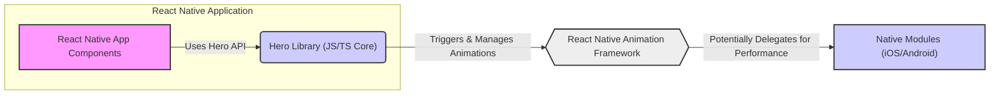

## Project Design Document: Hero Transitions Library (Hero)

**Project Name:** Hero Transitions Library (Hero)

**Project Repository:** [https://github.com/herotransitions/hero](https://github.com/herotransitions/hero)

**Document Version:** 1.1

**Date:** 2023-10-27

**Author:** AI Software Architect

---

### 1. Project Overview

#### 1.1. Project Goal

The Hero Transitions Library (Hero) aims to provide a declarative, performant, and accessible way to implement hero animations (shared element transitions) in React Native applications. Hero animations enhance user experience by creating visual continuity during navigation or UI element changes, resulting in smoother and more engaging interactions. This library simplifies the implementation of these complex animations for React Native developers, abstracting away much of the underlying animation management.

#### 1.2. Target Users

The primary users of this library are React Native developers who need to:

*   Enhance the visual appeal and user engagement of their applications through smooth transitions.
*   Implement hero animations between screens or different UI components within the same screen.
*   Reduce the complexity and boilerplate code associated with manual animation implementations in React Native.
*   Improve the perceived performance and polish of their React Native applications.
*   Maintain accessibility standards while implementing visually rich transitions.

#### 1.3. Key Features

*   **Declarative API:** Offers a React-centric, declarative API using components and props (e.g., `<Hero>`, `<HeroContainer>`) for defining hero transitions, making animation logic easier to understand and maintain.
*   **Cross-Platform Compatibility:**  Designed to function seamlessly on both iOS and Android platforms, ensuring consistent hero animation behavior and visual experience across different mobile operating systems.
*   **Highly Customizable Transitions:** Provides extensive customization options for animation properties, including:
    *   Duration: Control the speed of transitions.
    *   Easing Functions:  Select from various easing curves to fine-tune animation dynamics.
    *   Animation Types: Support for different animation styles and effects (e.g., scale, position, opacity transformations).
    *   Customizable Styles: Ability to adjust styles of hero elements during transitions.
*   **Performance Optimized:** Engineered for optimal performance within the React Native environment:
    *   Leverages React Native's animation framework efficiently.
    *   Potentially utilizes native modules for performance-critical animation tasks (implementation detail to be verified in source code).
    *   Aims to minimize JavaScript thread blocking during animations to maintain UI responsiveness.
*   **Easy Integration:**  Packaged as an npm library for straightforward integration into existing and new React Native projects. Simple installation and usage with clear documentation.
*   **Accessibility Considerations:**  Designed with accessibility in mind (though specific features need to be verified in the source code and documentation).  Aims to provide mechanisms for developers to ensure transitions are accessible to users with disabilities.

### 2. Architecture Overview

#### 2.1. System Architecture

The Hero library is primarily a client-side React Native library operating within the JavaScript/TypeScript environment. It interacts with React Native's animation framework and *may* utilize native modules for performance enhancements on iOS and Android.  The extent of native module usage is implementation-dependent and requires source code analysis.

Key architectural components:

*   **React Native Library (JavaScript/TypeScript Core):**
    *   **Public API:** Exposes React components (`<Hero>`, `<HeroContainer>`, etc.) and related APIs for developers to define and control hero transitions declaratively.
    *   **Animation Logic & State Management:** Manages the internal state required for tracking hero elements, coordinating transitions, and orchestrating the animation lifecycle.
    *   **Animation Orchestration:**  Calculates animation parameters based on component properties, layout information, and configured transition types.  Initiates and manages animations using React Native's animation framework.
    *   **Component Lifecycle Integration:** Integrates with React component lifecycle methods to detect component mounting, unmounting, and updates, enabling proper animation triggering and cleanup.
*   **Native Modules (Potentially - iOS & Android):**
    *   **Performance Optimization (Assumption):**  *Potentially* used to offload computationally intensive animation tasks or leverage platform-specific animation capabilities for improved performance and smoother transitions.
    *   **Native Animation Bridge:** If used, native modules would act as a bridge between the JavaScript animation logic and the underlying native animation systems of iOS and Android.
    *   **Rendering Hints (Potential):**  *Potentially* provide hints to the native rendering engine for optimized animation rendering.
    *   *Note:*  The actual usage and role of native modules need to be confirmed by examining the library's source code. This document assumes their potential presence for performance reasons. If no native modules are used, the library relies solely on React Native's JavaScript animation capabilities.
*   **Client Application (React Native App using Hero):**
    *   **Integration Point:** The React Native application that imports and utilizes the Hero library as a dependency.
    *   **Hero Transition Definition:** Developers use the Hero library's API within their application components to define which UI elements should participate in hero transitions and how those transitions should behave.
    *   **UI Rendering:**  The application's components are rendered by React Native, and the Hero library manipulates these components' styles and properties during animations to create the transition effects.

#### 2.2. Component Diagram (Mermaid)



### 3. Data Flow

#### 3.1. Animation Data Flow (Detailed)

The data flow in Hero revolves around configuring animations, capturing component layout information, calculating animation parameters, and executing the animations.

1.  **Declarative Animation Configuration (Developer):** React Native developers use the Hero library's components and props to define transitions within their application code. This configuration includes:
    *   **Hero IDs (`heroId` prop):** Unique identifiers assigned to components that will participate in a hero transition. Matching `heroId` values link "from" and "to" elements.
    *   **Transition Types & Customization Props:**  Properties passed to Hero components to specify the type of animation (e.g., position, scale, fade) and customize animation behavior (duration, easing, style modifications).
    *   **Component Styles & Layout:**  Implicitly, the styles and layout properties of the React Native components wrapped by Hero components are crucial input for animation calculations.

2.  **Library Receives Configuration & Component Information:** The Hero library's JavaScript core receives:
    *   **Configuration Data:**  Through React component props and potentially React Context for managing shared animation settings.
    *   **Component Instances:**  References to the React components wrapped by Hero components.
    *   **Layout Information:**  The library needs to obtain the layout (position, size) of the hero components *before* and *after* transitions. This likely involves using React Native's layout measurement APIs (e.g., `measure`, `measureLayout`).

3.  **Animation Parameter Calculation & State Initialization:**
    *   **Matching Hero Elements:** The library identifies pairs of hero elements based on matching `heroId` values across different screens or UI states.
    *   **Layout Measurement:**  It measures the initial and final layout of the paired hero elements.
    *   **Parameter Calculation:** Based on the configured transition type, customization props, and the measured layout differences, the library calculates animation parameters (e.g., starting and ending values for position, scale, opacity, animation curves).
    *   **Animation State Management:** The library initializes and manages the animation state, tracking the progress and status of each active hero transition.

4.  **Animation Execution via React Native Animation Framework:**
    *   **Animation Driver Selection:** The library utilizes React Native's animation API (e.g., `Animated` library) to drive the animations. It might choose different animation drivers based on performance considerations or animation complexity.
    *   **Property Updates:**  For each animation frame, the library updates the style properties of the hero components using the calculated animation parameters and the chosen animation driver. These style updates are typically applied using React Native's `Animated.Value` and related APIs.
    *   **Native Module Delegation (Conditional):** *If* native modules are used, the animation execution might involve delegating certain animation tasks (e.g., complex calculations, rendering optimizations) to native code via bridge communication.

5.  **UI Rendering & Transition Display:**
    *   **React Native Re-renders:** React Native's rendering engine detects the style property updates triggered by the animation framework.
    *   **Frame-by-Frame Rendering:** React Native re-renders the UI on each animation frame, reflecting the updated styles of the hero components. This frame-by-frame rendering creates the visual effect of a smooth hero transition on the user's screen.
    *   **Animation Completion & Cleanup:**  The library monitors animation completion. Upon completion, it may perform cleanup tasks, such as resetting animation state or triggering completion callbacks.

#### 3.2. Data Flow Diagram (Mermaid)

```mermaid
graph LR
    A["React Native Developer"] -- "1. Declarative Hero Transition Configuration" --> B("React Native App Components")
    B -- "2. Configuration, Component Instances & Layout Requests" --> C("Hero Library (JS/TS Core)")
    C -- "3. Layout Measurement & Animation Parameter Calculation" --> D{{"Layout Engine & Measurement APIs"}}
    D --> C
    C -- "4. Animation Execution via React Native Animation API" --> E{{"React Native Animation Framework"}}
    E -- "Potentially Delegates Animation Tasks" --> F["Native Modules (iOS/Android)"]
    E -- "5. Style Updates & Rendering Triggers" --> G{{"UI Rendering Engine (Native Views)"}}
    G -- "6. Animated Transitions Displayed" --> H["User Screen"]
    style A fill:#f9f,stroke:#333,stroke-width:2px
    style B fill:#ccf,stroke:#333,stroke-width:2px
    style C fill:#ccf,stroke:#333,stroke-width:2px
    style D fill:#eee,stroke:#333,stroke-width:2px
    style E fill:#eee,stroke:#333,stroke-width:2px
    style F fill:#ccf,stroke:#333,stroke-width:2px
    style G fill:#eee,stroke:#333,stroke-width:2px
    style H fill:#f9f,stroke:#333,stroke-width:2px
```



### 4. Technology Stack

*   **Programming Languages:**
    *   JavaScript (Core library logic, React components, animation orchestration)
    *   TypeScript (Likely for enhanced type safety, code maintainability, and developer experience)
    *   Objective-C or Swift (For iOS Native Modules - *if used for performance optimization*)
    *   Java or Kotlin (For Android Native Modules - *if used for performance optimization*)

*   **Frameworks and Libraries:**
    *   React Native (Primary framework for cross-platform mobile application development)
    *   React (Component-based UI library, foundation for React Native)
    *   React Native's Animation API (`Animated` library) (For driving animations and managing animation values)
    *   npm or yarn (Package managers for JavaScript dependencies)

*   **Development Tools:**
    *   Node.js and npm/yarn (JavaScript runtime environment and package management)
    *   React Native CLI (Command-line interface for React Native project setup and management)
    *   Xcode (Apple's IDE for iOS development - *if native iOS modules are involved*)
    *   Android Studio (Google's IDE for Android development - *if native Android modules are involved*)
    *   Integrated Development Environment (IDE) or Text Editor (e.g., VS Code, Sublime Text, WebStorm) with JavaScript/TypeScript support and React Native development extensions.
    *   Debugging tools for React Native (e.g., React Native Debugger, browser developer tools for JavaScript debugging).

### 5. Deployment Model

#### 5.1. Library Distribution (npm Package)

The Hero library is distributed as a public npm package, making it easily accessible to React Native developers.

*   **npm Registry:** Published to the npm registry ([www.npmjs.com](www.npmjs.com)).
*   **Installation:** Developers install the library into their React Native projects using npm or yarn:
    ```bash
    npm install hero-transitions
    # or
    yarn add hero-transitions
    ```
*   **Versioning:**  Follows semantic versioning principles for managing library updates and compatibility.

#### 5.2. Usage in Applications (Integration Steps)

Integrating Hero into a React Native application involves these steps:

1.  **Installation:** Install the `hero-transitions` npm package as a project dependency.
2.  **Importing Components:** Import the necessary components (e.g., `Hero`, `HeroContainer`) from the `hero-transitions` library in React Native component files.
    ```javascript
    import { Hero, HeroContainer } from 'hero-transitions';
    ```
3.  **Declarative Usage:** Wrap React Native components that should participate in hero transitions with the `<Hero>` component. Use `<HeroContainer>` to define the scope for hero transitions (if needed).
4.  **Configuration via Props:** Configure hero transitions using props provided by the Hero components, such as `heroId`, `transitionType`, `duration`, `easing`, and style customization props.
5.  **Application Logic:** Implement application navigation or UI state changes that trigger the hero transitions between components with matching `heroId` values.

#### 5.3. Application Deployment (Standard React Native App Deployment)

Applications utilizing the Hero library are deployed using the standard React Native application deployment process for iOS and Android.

1.  **Build Process:** Build the React Native application for the target platforms (iOS and/or Android) using React Native CLI or platform-specific build tools (Xcode for iOS, Gradle in Android Studio for Android).
2.  **Packaging:** Package the built application into platform-specific distribution packages (e.g., `.ipa` for iOS App Store, `.apk` or `.aab` for Google Play Store).
3.  **Deployment to App Stores or Distribution Channels:** Deploy the packaged application to app stores (Apple App Store, Google Play Store) for public distribution or through enterprise distribution channels for internal use.

### 6. Security Considerations (Detailed for Threat Modeling)

While Hero is a client-side UI library with a limited direct attack surface, security considerations are crucial for its responsible use and within the context of the larger React Native applications that depend on it.

*   **Dependency Management & Supply Chain Security:**
    *   **Risk:** Vulnerabilities in third-party dependencies used by Hero could indirectly introduce security flaws into applications using the library. Malicious actors could potentially compromise dependencies in the supply chain.
    *   **Mitigation:**
        *   **Regular Dependency Updates:**  Maintain up-to-date dependencies by regularly updating to the latest stable and secure versions.
        *   **Dependency Vulnerability Scanning:** Implement automated dependency vulnerability scanning tools and processes to detect and address known vulnerabilities in dependencies.
        *   **Dependency Auditing:** Periodically audit the dependencies used by Hero, ensuring they are from reputable sources and actively maintained.
        *   **Software Bill of Materials (SBOM):** Consider generating and maintaining an SBOM for the Hero library to track dependencies and facilitate vulnerability management.

*   **Code Quality, Vulnerabilities, and Secure Coding Practices:**
    *   **Risk:** Bugs, logic errors, or vulnerabilities in Hero's JavaScript/TypeScript or native code (if used) could be exploited. While UI libraries are less prone to classic web vulnerabilities, code quality is still essential.
    *   **Mitigation:**
        *   **Secure Coding Practices:** Adhere to secure coding principles throughout the development lifecycle.
        *   **Code Reviews:** Implement thorough code reviews by experienced developers to identify potential security flaws and logic errors.
        *   **Static Analysis Security Testing (SAST):** Utilize SAST tools to automatically scan the codebase for potential vulnerabilities and coding weaknesses.
        *   **Dynamic Analysis Security Testing (DAST) & Penetration Testing:**  Consider DAST and penetration testing, especially if native modules are involved or if the library handles sensitive data (though unlikely for a UI library).
        *   **Thorough Testing:** Implement comprehensive unit, integration, and UI tests to ensure the library functions as expected and is robust against unexpected inputs or edge cases.

*   **Input Validation and Data Handling (Animation Configuration):**
    *   **Risk:** Although less likely for a UI library, if Hero processes any external or user-provided data as part of animation configuration, improper validation or sanitization could lead to vulnerabilities (e.g., if configuration allows code injection, though highly improbable in this context).
    *   **Mitigation:**
        *   **Input Validation:**  If any configuration options are derived from external sources, implement strict input validation to ensure data conforms to expected formats and ranges.
        *   **Output Encoding/Sanitization:** If the library generates any output based on configuration, ensure proper output encoding or sanitization to prevent potential injection vulnerabilities (again, less likely for this type of library).
        *   **Principle of Least Privilege:** Design the library to operate with the minimum necessary privileges and access to system resources.

*   **State Management and Race Conditions:**
    *   **Risk:**  Improper state management within the library, especially during concurrent animations or rapid UI updates, could potentially lead to race conditions, unexpected behavior, or even security vulnerabilities in edge cases.
    *   **Mitigation:**
        *   **Careful State Management Design:** Design the library's state management logic to be robust and thread-safe, minimizing the risk of race conditions.
        *   **Concurrency Control:** Implement appropriate concurrency control mechanisms (e.g., locks, mutexes, atomic operations if native modules are used) if necessary to protect shared state.
        *   **Thorough Testing for Concurrency Issues:**  Specifically test scenarios involving rapid UI updates, interrupted animations, and concurrent transitions to identify and resolve potential race conditions.

*   **Performance and Denial of Service (DoS) Vulnerabilities:**
    *   **Risk:**  Maliciously crafted or excessively complex hero animations could potentially consume excessive device resources (CPU, memory, battery), leading to performance degradation or even DoS conditions, especially on lower-powered devices.
    *   **Mitigation:**
        *   **Performance Optimization:** Continuously optimize animation performance to minimize resource consumption.
        *   **Resource Limits & Safeguards:** Consider implementing safeguards to prevent excessively resource-intensive animations (e.g., limits on animation duration, complexity, or number of concurrent animations).
        *   **Documentation & Best Practices:** Provide clear documentation and best practices to guide developers in creating efficient and performant hero animations, discouraging patterns that could lead to performance issues.
        *   **Rate Limiting (Application Level):** At the application level, consider rate limiting or throttling mechanisms to prevent excessive animation triggers from potentially malicious sources.

*   **Accessibility and Security Intersections:**
    *   **Risk:**  While primarily an accessibility concern, poorly implemented or overly complex animations could potentially be used to create confusing or deceptive UI experiences that could be exploited in social engineering or phishing attacks.
    *   **Mitigation:**
        *   **Accessibility Best Practices:** Design and document the library with accessibility in mind. Encourage developers to create accessible transitions that are usable by all users, including those with disabilities.
        *   **Clear and Understandable Transitions:** Promote the use of clear, predictable, and understandable hero animations that do not create confusion or disorientation.
        *   **User Control:**  Consider providing mechanisms for users to control or disable animations if needed for accessibility or performance reasons.

*   **Misuse in Malicious Applications (Application-Level Responsibility):**
    *   **Risk:**  Malicious applications could potentially misuse the Hero library to create deceptive or misleading UI transitions for malicious purposes (e.g., UI spoofing, phishing).
    *   **Mitigation:**
        *   **Ethical Usage Guidelines:** While library developers have limited control over application-level misuse, providing ethical usage guidelines and promoting responsible use of UI libraries can be beneficial.
        *   **Application Security Best Practices:** Emphasize that application developers are ultimately responsible for ensuring the security and ethical use of UI libraries within their applications.

**Scope of Security Responsibility:** It's crucial to understand that the Hero library's security is one component of the overall security posture of applications that use it. Application developers bear the primary responsibility for securing their applications, including the responsible and secure integration of UI libraries like Hero. The Hero library developers should focus on providing a secure, well-tested, and documented library, but cannot be held responsible for all potential security issues arising from application-level misuse or vulnerabilities outside the library's scope.

---
This revised document provides a more detailed and comprehensive design overview of the Hero Transitions Library, specifically enhanced for threat modeling purposes. It expands on the architecture, data flow, and, most importantly, the security considerations, offering a more actionable foundation for identifying and mitigating potential security risks associated with the library and its usage in React Native applications.