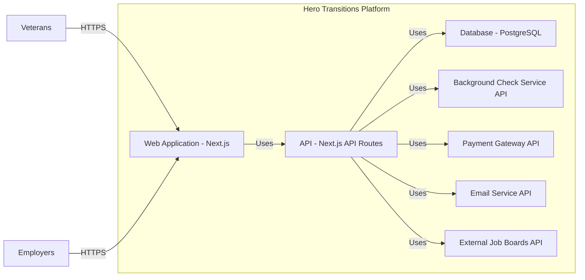

Okay, let's dive into designing a comprehensive document for the Hero Transitions project, focusing on security and architecture.

# BUSINESS POSTURE

Hero Transitions appears to be a startup or a relatively new project focused on providing a platform for military veterans transitioning to civilian careers.  The core business goals seem to be:

*   Connecting veterans with potential employers.
*   Providing resources and tools to aid in the transition process (resume building, skill translation, etc.).
*   Building a community for veterans to support each other.
*   Potentially monetizing the platform through job postings, premium features, or partnerships.

Based on these goals, the most important business risks are:

*   Data breach of veteran personal information (PII), including potentially sensitive military history details. This could lead to reputational damage, legal issues, and loss of trust.
*   Compromise of employer accounts, leading to fraudulent job postings or data theft.
*   Platform unavailability or performance issues, hindering the user experience and potentially damaging the platform's reputation.
*   Lack of user adoption, rendering the platform ineffective.
*   Failure to comply with relevant regulations (e.g., GDPR, CCPA, potentially specific regulations related to veteran data).
*   Intellectual property theft, if the platform has unique algorithms or content.

# SECURITY POSTURE

Based on the provided GitHub repository, the following security controls and accepted risks are identified:

*   security control: The project uses Next.js, which offers some built-in security features like protection against XSS (Cross-Site Scripting) if used correctly. Implemented in: Next.js framework.
*   security control: The project uses a database (likely PostgreSQL, based on the Prisma schema). Database security will be crucial. Implemented in: Database configuration and access controls.
*   security control: The project uses environment variables for configuration, which is a good practice for separating secrets from code. Implemented in: `.env` files and deployment configuration.
*   security control: The project appears to use a form of authentication (based on the presence of authentication-related files). Implemented in: Authentication logic (specific implementation details are unclear).
*   security control: The project uses Prisma as an ORM, which can help prevent SQL injection vulnerabilities if used correctly. Implemented in: Prisma client.
*   security control: The project has a basic CI/CD pipeline using GitHub Actions. Implemented in: `.github/workflows` directory.
*   accepted risk: The provided repository does not contain detailed information about authorization mechanisms (role-based access control, etc.).
*   accepted risk: The repository lacks explicit input validation logic in many areas.
*   accepted risk: There's limited evidence of comprehensive security testing (unit tests, integration tests, security-specific tests).
*   accepted risk: The deployment configuration (especially regarding network security, firewalls, etc.) is not fully detailed in the repository.
*   accepted risk: No information about encryption at rest and in transit.
*   accepted risk: No information about logging and monitoring.

Recommended Security Controls (High Priority):

*   Implement robust input validation on both the client-side and server-side for all user inputs.
*   Implement strong authentication and authorization mechanisms, including multi-factor authentication (MFA) as an option.
*   Implement comprehensive logging and monitoring to detect and respond to security incidents.
*   Implement encryption at rest for sensitive data stored in the database.
*   Implement encryption in transit using HTTPS for all communication.
*   Implement regular security assessments, including penetration testing and vulnerability scanning.
*   Implement a Web Application Firewall (WAF) to protect against common web attacks.
*   Implement rate limiting to prevent brute-force attacks and denial-of-service.
*   Implement Content Security Policy (CSP) to mitigate XSS vulnerabilities.

Security Requirements:

*   Authentication:
    *   The system must securely authenticate users (veterans and employers).
    *   The system should support strong password policies.
    *   The system should offer or require multi-factor authentication (MFA).
    *   The system must protect against common authentication-related attacks (e.g., brute-force, credential stuffing).
*   Authorization:
    *   The system must implement role-based access control (RBAC) to restrict access to sensitive data and functionality based on user roles (e.g., veteran, employer, administrator).
    *   The system must ensure that users can only access data and perform actions that they are authorized to.
*   Input Validation:
    *   The system must validate all user inputs on both the client-side and server-side.
    *   The system must use a whitelist approach to input validation, accepting only known-good input.
    *   The system must sanitize all user inputs to prevent cross-site scripting (XSS) and other injection attacks.
*   Cryptography:
    *   The system must use strong, industry-standard cryptographic algorithms for all encryption and hashing operations.
    *   The system must securely store and manage cryptographic keys.
    *   The system must use HTTPS for all communication between the client and the server.
    *   The system must encrypt sensitive data at rest in the database.

# DESIGN

## C4 CONTEXT

```mermaid
graph LR
    subgraph Hero Transitions System
        A[Hero Transitions Platform]
    end
    B[Veterans] -->|Uses| A
    C[Employers] -->|Uses| A
    D[External Job Boards] -->|Provides Job Data| A
    E[Email Service] <--|Sends Emails| A
    F[Payment Gateway] <--|Processes Payments| A
    G[Background Check Service] <--|Performs Background Checks| A

```

Element Descriptions:

*   Element:
    *   Name: Veterans
    *   Type: User
    *   Description: Military veterans seeking civilian employment.
    *   Responsibilities: Create profiles, search for jobs, apply for jobs, communicate with employers, manage their transition resources.
    *   Security controls: Strong password policies, MFA, account lockout, session management.

*   Element:
    *   Name: Employers
    *   Type: User
    *   Description: Companies seeking to hire veterans.
    *   Responsibilities: Create company profiles, post job openings, search for candidates, communicate with veterans, manage their recruitment process.
    *   Security controls: Strong password policies, MFA, account lockout, session management, potentially background checks.

*   Element:
    *   Name: Hero Transitions Platform
    *   Type: System
    *   Description: The core web application facilitating the connection between veterans and employers.
    *   Responsibilities: User management, job posting management, search functionality, communication tools, resource provision, payment processing, background check integration.
    *   Security controls: Input validation, output encoding, authentication, authorization, session management, encryption, logging, monitoring, WAF, rate limiting, CSP.

*   Element:
    *   Name: External Job Boards
    *   Type: External System
    *   Description: Third-party job boards that may provide job data to the Hero Transitions platform.
    *   Responsibilities: Provide job data via API or other integration methods.
    *   Security controls: API authentication, data validation, rate limiting.

*   Element:
    *   Name: Email Service
    *   Type: External System
    *   Description: A third-party service used to send emails (e.g., notifications, password resets).
    *   Responsibilities: Send emails on behalf of the Hero Transitions platform.
    *   Security controls: API authentication, secure communication (TLS).

*   Element:
    *   Name: Payment Gateway
    *   Type: External System
    *   Description: A third-party service used to process payments (if applicable).
    *   Responsibilities: Process payments securely.
    *   Security controls: PCI DSS compliance, secure communication (TLS).

*   Element:
    *   Name: Background Check Service
    *   Type: External System
    *   Description: A third-party service used to perform background checks on veterans (if applicable).
    *   Responsibilities: Perform background checks securely and in compliance with relevant regulations.
    *   Security controls: Secure communication (TLS), data privacy compliance.

## C4 CONTAINER



Element Descriptions:

*   Element:
    *   Name: Web Application
    *   Type: Container (Next.js)
    *   Description: The front-end user interface, built with Next.js.
    *   Responsibilities: Renders the user interface, handles user interactions, communicates with the API.
    *   Security controls: Client-side input validation, output encoding, XSS protection (via Next.js), CSP.

*   Element:
    *   Name: API
    *   Type: Container (Next.js API Routes)
    *   Description: The server-side API, built with Next.js API Routes.
    *   Responsibilities: Handles requests from the web application, interacts with the database and external services, enforces business logic and security rules.
    *   Security controls: Server-side input validation, authentication, authorization, session management, rate limiting, logging.

*   Element:
    *   Name: Database
    *   Type: Container (PostgreSQL)
    *   Description: The relational database storing user data, job postings, and other application data.
    *   Responsibilities: Stores and retrieves data.
    *   Security controls: Database access controls, encryption at rest, regular backups, auditing.

*   Element:
    *   Name: Background Check Service API, Payment Gateway API, Email Service API, External Job Boards API
    *   Type: External API
    *   Description: APIs of external services.
    *   Responsibilities: Provide specific functionalities (background checks, payments, emails, job data).
    *   Security controls: API authentication, secure communication (TLS), data validation.

*   Element:
    *   Name: Veterans, Employers
    *   Type: User
    *   Description: Users interacting with the web application.
    *   Responsibilities: Interact with the system.
    *   Security controls: Strong password policies, MFA, account lockout, session management.

## DEPLOYMENT

Possible Deployment Solutions:

1.  Vercel: Since the project is built with Next.js, Vercel is a natural choice for deployment. It offers seamless integration with Next.js and provides features like automatic scaling, CDN, and SSL certificates.
2.  AWS (Amplify, EC2, ECS, EKS): AWS offers various options for deploying Next.js applications, ranging from fully managed services like Amplify to more granular control with EC2, ECS, or EKS.
3.  Google Cloud Platform (App Engine, Cloud Run, GKE): Similar to AWS, GCP provides various options for deploying Next.js applications.
4.  Netlify: Another platform similar to Vercel, optimized for front-end deployments.

Chosen Solution (for detailed description): Vercel

Deployment Diagram:

```mermaid
graph LR
    subgraph Vercel
        A[Vercel Edge Network] -->|HTTPS| B[Next.js Application]
        B -->|Postgres Protocol| C[PostgreSQL Database (e.g., Vercel Postgres, AWS RDS, GCP Cloud SQL)]
    end
    D[Developer] -->|Git Push| E[GitHub Repository]
    E -->|Webhook| A

```

Element Descriptions:

*   Element:
    *   Name: Vercel Edge Network
    *   Type: Infrastructure
    *   Description: Vercel's global network of edge servers.
    *   Responsibilities: Serves static assets, handles SSL termination, provides CDN functionality.
    *   Security controls: DDoS protection, WAF (potentially), SSL/TLS encryption.

*   Element:
    *   Name: Next.js Application
    *   Type: Application Instance
    *   Description: A running instance of the Next.js application.
    *   Responsibilities: Handles user requests, interacts with the database and external services.
    *   Security controls: All application-level security controls (see previous sections).

*   Element:
    *   Name: PostgreSQL Database
    *   Type: Database Instance
    *   Description: The database instance storing application data. Could be hosted on Vercel Postgres, AWS RDS, GCP Cloud SQL, or another provider.
    *   Responsibilities: Stores and retrieves data.
    *   Security controls: Database access controls, encryption at rest, regular backups, auditing, firewall rules.

*   Element:
    *   Name: Developer
    *   Type: User
    *   Description: A developer working on the project.
    *   Responsibilities: Writes code, pushes changes to the repository.
    *   Security controls: Strong passwords, MFA for GitHub access, secure development environment.

*   Element:
    *   Name: GitHub Repository
    *   Type: Code Repository
    *   Description: The Git repository storing the project's source code.
    *   Responsibilities: Stores code, tracks changes, triggers deployments.
    *   Security controls: Access controls, branch protection rules, code review policies.

## BUILD

The build process is automated using GitHub Actions, as indicated by the presence of workflow files in the `.github/workflows` directory.

Build Diagram:

```mermaid
graph LR
    A[Developer] -->|Git Push| B[GitHub Repository]
    B -->|Webhook Trigger| C[GitHub Actions]
    C -->|Checkout Code| D[Build Step]
    D -->|Install Dependencies (npm install)| E[Install]
    E -->|Lint Code (eslint)| F[Lint]
    F -->|Run Tests (jest)| G[Test]
    G -->|Build Application (next build)| H[Build]
    H -->|Deploy to Vercel| I[Deploy]
    I -->|Build Artifacts (Vercel Deployment)| J[Artifacts]

```

Build Process Description:

1.  Developer pushes code changes to the GitHub repository.
2.  A webhook triggers a GitHub Actions workflow.
3.  The workflow checks out the code.
4.  The workflow installs project dependencies using `npm install`.
5.  The workflow lints the code using `eslint` (security control: static code analysis for potential security issues and code quality problems).
6.  The workflow runs tests using `jest` (security control: automated testing to catch bugs and regressions that could lead to security vulnerabilities).
7.  The workflow builds the Next.js application using `next build`.
8.  The workflow deploys the application to Vercel.
9.  The build artifacts are stored within the Vercel deployment.

Security Controls in Build Process:

*   Static Code Analysis (eslint): Identifies potential code quality and security issues.
*   Automated Testing (jest): Catches bugs and regressions that could lead to vulnerabilities.
*   Dependency Management (npm): Uses a package manager to manage dependencies, but requires regular auditing for vulnerable packages (using tools like `npm audit` or Snyk).  This is a crucial aspect of supply chain security.
*   Automated Build and Deployment: Reduces the risk of manual errors and ensures consistency.

# RISK ASSESSMENT

*   Critical Business Processes:
    *   User Registration and Authentication: Ensuring only authorized users can access the platform.
    *   Job Posting and Application: Facilitating the core functionality of connecting veterans and employers.
    *   Communication: Enabling secure communication between users.
    *   Data Management: Protecting user data and ensuring its integrity.
    *   Payment Processing (if applicable): Handling financial transactions securely.

*   Data Sensitivity:
    *   Veteran Personal Information (PII): Name, contact details, email address, potentially sensitive military history details (highest sensitivity).
    *   Employer Information: Company name, contact details, potentially financial information (high sensitivity).
    *   Job Postings: Job descriptions, salary information, potentially company-confidential information (medium sensitivity).
    *   Communication Data: Messages exchanged between users (medium to high sensitivity, depending on content).
    *   Authentication Credentials: Passwords, tokens (highest sensitivity).

# QUESTIONS & ASSUMPTIONS

*   Questions:
    *   What specific regulations are applicable to this platform (e.g., GDPR, CCPA, specific regulations related to veteran data)?
    *   What is the expected user volume and traffic? This will impact scalability and performance requirements.
    *   What are the specific requirements for background checks (if applicable)?
    *   What are the specific requirements for payment processing (if applicable)?
    *   What are the existing security policies and procedures of the organization?
    *   What level of logging and monitoring is required?
    *   Are there any specific compliance requirements (e.g., SOC 2, ISO 27001)?
    *   What is the budget for security tools and services?
    *   What is the process for handling security incidents?
    *   What is the data retention policy?

*   Assumptions:
    *   The platform will be hosted on Vercel.
    *   The database will be PostgreSQL.
    *   The primary users are veterans and employers in the US.
    *   The platform will handle sensitive PII.
    *   The platform may integrate with third-party services for email, payments, and background checks.
    *   The development team has basic security awareness.
    *   The budget for security is limited, but there is a commitment to implementing essential security controls.
    *   The initial focus is on launching the platform, with security improvements to be made iteratively.
    *   GitHub Actions is used for CI/CD.
    *   No existing security incident response plan.
    *   No existing data retention policy.