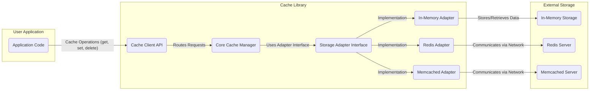
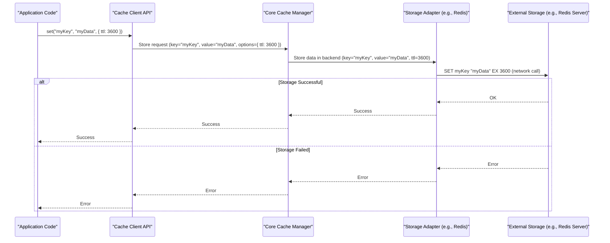
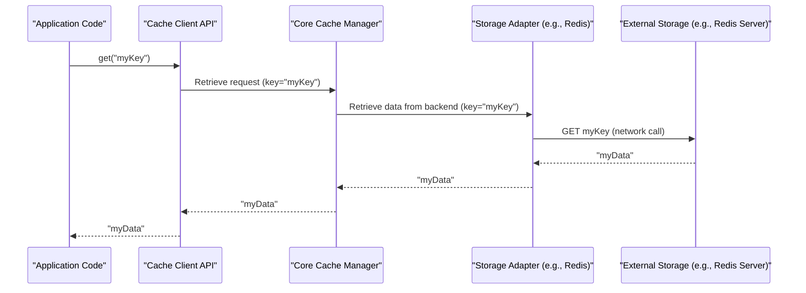
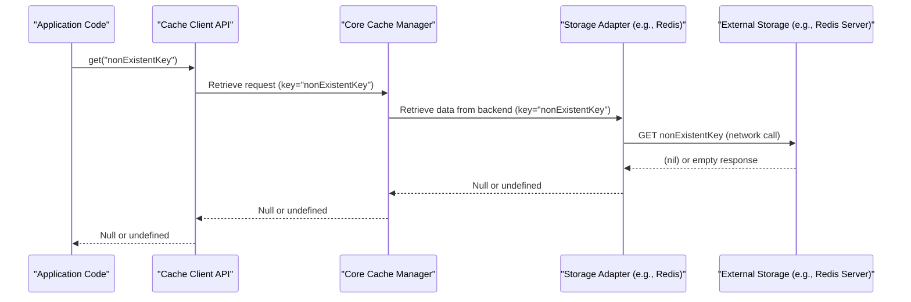
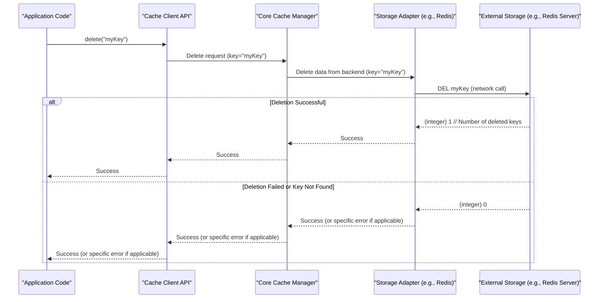

# Project Design Document: Cache Library (`hyperoslo/cache`) - Improved

**Version:** 1.1
**Date:** October 26, 2023
**Author:** AI Software Architect

## 1. Introduction

This document provides an enhanced and more detailed design overview of the `hyperoslo/cache` library (as represented by the GitHub repository: https://github.com/hyperoslo/cache). The primary goal is to offer a clear and comprehensive understanding of the library's architecture, components, and data flow, specifically tailored to facilitate effective threat modeling. This document delves deeper into internal workings, potential vulnerabilities, and interactions with external systems.

## 2. Project Overview

The `hyperoslo/cache` library is engineered to provide a robust and adaptable caching solution for applications. Its core functionalities likely encompass:

*   **Temporary Data Storage:**  Storing frequently accessed data in a faster medium to reduce latency.
*   **Storage Backend Abstraction:** Supporting a variety of storage mechanisms, including in-memory, Redis, and Memcached, through an adapter pattern.
*   **Time-Based Expiration (TTL):**  Configurable expiration times for cached entries, ensuring data freshness.
*   **Data Invalidation/Eviction:** Mechanisms to remove outdated or less frequently used items from the cache.
*   **Namespace or Tagging Support:**  Organizing cached data into logical groups for better management and targeted invalidation.
*   **Potential Features:**  Could include features like cache warming, pre-fetching, or integration with monitoring systems.

This document aims to provide a generalized yet detailed view of such a library, acknowledging that specific implementation choices within `hyperoslo/cache` might differ.

## 3. System Architecture

The `hyperoslo/cache` library likely employs a well-defined modular architecture, clearly separating the core caching logic from the specific implementation details of different storage backends. This design promotes flexibility, maintainability, and extensibility.

*   **Core Cache Manager:** This central component orchestrates all caching operations. Its responsibilities include:
    *   Receiving and routing `get`, `set`, and `delete` requests.
    *   Enforcing TTL policies and triggering data expiration.
    *   Managing cache eviction strategies (e.g., Least Recently Used (LRU), First-In, First-Out (FIFO)).
    *   Handling cache namespaces or tags for data organization.
    *   Potentially implementing locking or synchronization mechanisms for concurrent access.
*   **Storage Adapter Interface:** This defines a contract that all storage backend implementations must adhere to. It provides a consistent set of methods for interacting with different storage systems, abstracting away their specific details.
*   **Concrete Storage Adapters:** These are specific implementations of the `Storage Adapter Interface`, tailored for different storage technologies:
    *   **In-Memory Adapter:** Stores cached data directly within the application's process memory. This is typically the fastest option but data is lost on application restart.
    *   **Redis Adapter:** Leverages a Redis server for caching, offering persistence and more advanced features. Requires network communication.
    *   **Memcached Adapter:** Utilizes a Memcached server, another popular in-memory key-value store. Also requires network communication.
    *   **Potential Future Adapters:** Could include adapters for databases (e.g., PostgreSQL, MySQL) or cloud-based caching services.
*   **Cache Client (Public API):** This is the interface exposed to applications that want to use the caching functionality. It provides a simple and intuitive set of methods for interacting with the cache.

## 4. Data Flow

The following sections detail the typical data flow for common cache operations, including potential error scenarios.

### 4.1. Cache Set Operation

1. The **"Application Code"** invokes the `set(key, value, options)` method on the **"Cache Client API"**.
2. The **"Cache Client API"** validates the input and forwards the request to the **"Core Cache Manager"**.
3. The **"Core Cache Manager"** determines the appropriate **"Storage Adapter Interface"** implementation based on the configured backend.
4. The selected **"Storage Adapter"** (e.g., **"Redis Adapter"**) interacts with the corresponding **"External Storage"** (e.g., **"Redis Server"**) to store the `value` associated with the `key`, potentially including TTL information.
5. The **"External Storage"** attempts to store the data and returns a success or failure response.
6. The response propagates back through the **"Storage Adapter"**, **"Core Cache Manager"**, and **"Cache Client API"** to the **"Application Code"**. Error conditions (e.g., network issues, storage errors) are handled and potentially propagated.

### 4.2. Cache Get Operation (Cache Hit)

1. The **"Application Code"** calls the `get(key)` method on the **"Cache Client API"**.
2. The **"Cache Client API"** forwards the request to the **"Core Cache Manager"**.
3. The **"Core Cache Manager"** identifies the relevant **"Storage Adapter"**.
4. The **"Storage Adapter"** (e.g., **"Redis Adapter"**) queries the **"External Storage"** (e.g., **"Redis Server"**) for the data associated with the `key`.
5. The **"External Storage"** retrieves the cached data (if it exists and is not expired) and returns it.
6. The data is passed back through the **"Storage Adapter"**, **"Core Cache Manager"**, and **"Cache Client API"** to the **"Application Code"**.

### 4.3. Cache Get Operation (Cache Miss or Expiration)

1. The **"Application Code"** calls the `get(key)` method on the **"Cache Client API"**.
2. The **"Cache Client API"** forwards the request to the **"Core Cache Manager"**.
3. The **"Core Cache Manager"** interacts with the appropriate **"Storage Adapter"**.
4. The **"Storage Adapter"** queries the **"External Storage"**.
5. The **"External Storage"** determines that the data is either not present or has expired.
6. A "not found" or similar response is returned to the **"Storage Adapter"**.
7. This response propagates back to the **"Core Cache Manager"** and **"Cache Client API"**, eventually returning `null` or `undefined` to the **"Application Code"**.

### 4.4. Cache Delete Operation

1. The **"Application Code"** calls the `delete(key)` method on the **"Cache Client API"**.
2. The **"Cache Client API"** forwards the request to the **"Core Cache Manager"**.
3. The **"Core Cache Manager"** selects the correct **"Storage Adapter"**.
4. The **"Storage Adapter"** instructs the **"External Storage"** to delete the entry associated with the `key`.
5. The **"External Storage"** attempts to delete the data and sends a confirmation (or error) back.
6. The response travels back through the **"Storage Adapter"**, **"Core Cache Manager"**, and **"Cache Client API"** to the **"Application Code"**.

## 5. Key Components

*   **Cache Client API:**
    *   Provides a developer-friendly and consistent interface for interacting with the cache.
    *   Handles basic input validation and parameter serialization.
    *   Abstracts away the complexities of the underlying caching mechanisms and storage backends.
    *   May include features like bulk operations (e.g., `mget`, `mset`).
*   **Core Cache Manager:**
    *   The central orchestrator of the caching system.
    *   Manages the lifecycle of cached items, including setting, retrieving, deleting, and expiring data.
    *   Implements core caching logic, such as TTL management and eviction policies.
    *   Responsible for selecting the appropriate storage adapter based on configuration.
    *   May implement locking or synchronization to handle concurrent access safely.
*   **Storage Adapters:**
    *   Provide a layer of abstraction for interacting with different storage backends.
    *   Encapsulate the specific logic for connecting to and communicating with each storage system.
    *   Handle data serialization and deserialization if required by the underlying storage.
    *   Manage connection pooling, error handling, and potentially authentication for the storage backend.
*   **External Storage (Backends):**
    *   The persistent or in-memory systems used to store the cached data.
    *   Security characteristics and performance vary significantly between different backends (e.g., in-memory vs. networked).
    *   Require proper configuration and security hardening.

## 6. Security Considerations (Pre-Threat Modeling)

This section outlines potential security concerns based on the architecture, serving as a foundation for detailed threat modeling.

*   **Data Confidentiality:**
    *   Sensitive data stored in the cache must be protected from unauthorized access. This is especially critical for external storage backends.
    *   Consider encryption at rest for persistent storage and encryption in transit for network communication.
    *   In-memory caching offers less inherent protection compared to encrypted persistent storage.
*   **Data Integrity:**
    *   Mechanisms are needed to ensure that cached data has not been tampered with, either maliciously or accidentally.
    *   Consider checksums or other integrity checks, especially when data passes through network boundaries.
*   **Availability:**
    *   The cache service must be reliable and available when needed.
    *   Consider the availability and resilience of the underlying storage backend.
    *   Implement appropriate error handling and retry mechanisms.
    *   Protect against denial-of-service (DoS) attacks targeting the cache or its dependencies.
*   **Secure Communication:**
    *   When using network-based storage (e.g., Redis, Memcached), all communication channels should be secured using TLS/SSL to prevent eavesdropping and man-in-the-middle attacks.
*   **Authentication and Authorization:**
    *   If the storage backend requires authentication, the cache library must handle credentials securely. Avoid storing credentials directly in code; use environment variables or secure configuration management.
    *   Consider authorization mechanisms to control which applications or users can access or modify the cache.
*   **Input Validation:**
    *   The cache library should rigorously validate all inputs (keys, values, options) to prevent injection attacks (e.g., command injection) or other unexpected behavior.
    *   Sanitize inputs before storing them in the cache.
*   **Denial of Service (DoS):**
    *   Be aware of potential vulnerabilities that could allow an attacker to overwhelm the cache or the underlying storage, leading to service disruption.
    *   Implement rate limiting or other protective measures.
    *   Consider the impact of large cache entries on memory usage and performance.
*   **Cache Poisoning:**
    *   Prevent malicious actors from inserting incorrect or harmful data into the cache, which could then be served to legitimate users.
    *   Implement strong authentication and authorization for cache modification operations.
*   **Configuration Security:**
    *   Securely manage and store configuration settings for the cache library and its storage backends. Avoid hardcoding sensitive information.
    *   Ensure proper access controls on configuration files.

## 7. Technology Stack (Likely)

*   **Programming Language:**  Primarily JavaScript/TypeScript (based on the GitHub repository).
*   **Core Dependencies:**
    *   Potentially libraries for asynchronous operations (e.g., `async/await`, Promises).
    *   Data structure manipulation libraries.
    *   Logging libraries.
    *   Testing frameworks (e.g., Jest, Mocha).
*   **Storage Adapter Dependencies:**
    *   `redis`: For interacting with Redis servers.
    *   `memcached`: For communicating with Memcached servers.
*   **Build Tools:**  Likely `npm` or `yarn`.
*   **Transpilers/Bundlers:**  Potentially Webpack, Parcel, or similar tools for bundling and transpiling code.

## 8. Deployment Considerations

The `hyperoslo/cache` library is typically deployed as a dependency within a larger application. Key deployment considerations include:

*   **Configuration Management:**  Centralized and secure management of cache configuration, including backend selection, connection details, and TTLs.
*   **Resource Provisioning:**  Ensuring adequate resources (memory, CPU, network bandwidth) are allocated for the cache and its chosen storage backend.
*   **Network Configuration:**  Proper network configuration to allow communication between the application and the cache storage backend (if it's a separate service). Ensure firewall rules are correctly configured.
*   **Monitoring and Logging:**  Implementing comprehensive monitoring to track cache performance, hit/miss rates, error rates, and resource utilization. Robust logging is crucial for debugging and security auditing.
*   **Security Hardening:**  Following security best practices for the chosen storage backend, including access controls, encryption, and regular security updates.
*   **High Availability and Scalability:**  Designing the deployment to ensure high availability and scalability, potentially involving clustering or replication of the cache storage backend.

## 9. Future Considerations

*   **Advanced Eviction Policies:**  Implementing more sophisticated eviction strategies, such as LFU (Least Frequently Used) or time-aware policies.
*   **Cache Invalidation Strategies:**  Exploring more advanced methods for invalidating cached data based on external events or dependencies (e.g., using message queues or webhooks).
*   **Distributed Caching Support:**  Extending the library to natively support distributed caching scenarios, potentially using consistent hashing or other distribution techniques.
*   **Metrics and Observability Enhancements:**  Adding more granular metrics and integration with observability platforms for better insights into cache behavior.
*   **Integration with Monitoring Tools:**  Providing built-in integration with popular monitoring tools for easier setup and data visualization.

This improved design document provides a more detailed and nuanced understanding of the `hyperoslo/cache` library, specifically focusing on aspects relevant to threat modeling. The added details on data flow, error handling, and security considerations should significantly aid in identifying and mitigating potential vulnerabilities.