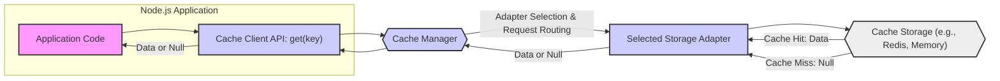

# Project Design Document: Node.js Cache Library (`hyperoslo/cache`)

**Version:** 1.1
**Date:** October 26, 2023
**Author:** Gemini (AI Expert in Software, Cloud, and Cybersecurity Architecture)

## 1. Project Overview

This document outlines the design of the Node.js cache library project, based on the repository [https://github.com/hyperoslo/cache](https://github.com/hyperoslo/cache). This library provides a versatile and extensible caching mechanism for Node.js applications, aiming to improve performance and reduce backend load. It achieves this by offering a unified API that abstracts away the complexities of various caching backends. Developers can select and configure different storage adapters to suit their specific application needs and infrastructure. This document details the library's architecture, components, and security considerations, serving as a blueprint for development and a foundation for future threat modeling.

## 2. Goals and Objectives

*   **Primary Goal:** To deliver a high-quality, developer-friendly caching library for Node.js environments.
*   **Key Objectives:**
    *   **Abstraction and Unified API:** Provide a consistent and simple API for common caching operations (`get`, `set`, `delete`, `has`, `clear`), hiding the implementation details of underlying storage mechanisms.
    *   **Storage Flexibility:** Support a wide range of cache storage adapters, including:
        *   In-memory (for development and lightweight caching).
        *   Redis (for robust, networked caching).
        *   Memcached (for distributed caching).
        *   File system (for persistent caching).
        *   Allow for easy addition of new adapters.
    *   **Extensibility and Customization:** Enable developers to extend the library by:
        *   Creating custom storage adapters to integrate with unique caching solutions.
        *   Implementing custom serialization/deserialization logic.
        *   Potentially customizing eviction policies.
    *   **Performance Optimization:** Enhance application performance by:
        *   Reducing latency in data retrieval through in-process or near-process caching.
        *   Minimizing load on backend databases and services by serving frequently accessed data from the cache.
        *   Providing efficient cache operations with minimal overhead.
    *   **Configurability:** Offer comprehensive configuration options to tailor caching behavior, including:
        *   Default Time-To-Live (TTL) for cached items.
        *   Selection of the desired storage adapter.
        *   Adapter-specific connection parameters and settings.
        *   Cache key prefixing for namespacing.
    *   **Maintainability and Code Quality:** Ensure a maintainable and robust codebase through:
        *   Modular design with clear separation of concerns.
        *   Comprehensive documentation for API and internal components.
        *   Thorough unit and integration testing.
        *   Adherence to established Node.js coding standards and best practices.

## 3. Target Audience

*   Node.js developers seeking to implement caching in their web applications, APIs, and other server-side applications.
*   Software architects designing scalable and performant Node.js systems that require caching layers.
*   Operations and DevOps teams responsible for deploying and managing Node.js applications that utilize caching infrastructure.
*   Security engineers and auditors tasked with performing security assessments and threat modeling of Node.js applications and their dependencies, including caching libraries.

## 4. System Architecture

### 4.1. Components

The Node.js cache library is architected around a modular design, comprising the following core components:

*   **Cache Client API:**
    *   This is the primary entry point for developers to interact with the cache library.
    *   It exposes a simple and intuitive API with methods like `get(key)`, `set(key, value, options)`, `del(key)`, `has(key)`, and `clear()`.
    *   It acts as a facade, abstracting away the underlying caching mechanisms and adapter complexities.
    *   It receives cache requests from the application and routes them to the Cache Manager.
*   **Cache Manager:**
    *   The central orchestrator of the caching system.
    *   Responsible for initializing and managing the configured storage adapter.
    *   Handles the library's configuration, loading settings from various sources (programmatic, files, environment variables).
    *   Maintains a registry of available storage adapters and selects the appropriate adapter based on configuration.
    *   May implement global cache policies or cross-adapter functionalities in the future.
*   **Storage Adapters:**
    *   Implement the concrete logic for interacting with specific caching backends.
    *   Each adapter is designed for a particular storage technology (e.g., in-memory, Redis, File System).
    *   Adapters conform to a well-defined interface, ensuring interoperability with the Cache Manager and API.
    *   Key responsibilities of an adapter include:
        *   Storing and retrieving cache items.
        *   Handling TTL and expiration.
        *   Implementing eviction policies (if applicable to the backend).
        *   Serialization/deserialization if required by the backend.
    *   Examples of provided adapters:
        *   `MemoryAdapter`: Utilizes in-memory JavaScript objects for caching (volatile, suitable for development or non-critical caching).
        *   `RedisAdapter`: Leverages a Redis server for persistent and networked caching, using a Node.js Redis client library.
        *   `FileSystemAdapter`: Stores cache data in files on the local file system, providing persistence across application restarts.
*   **Configuration Module:**
    *   Handles all aspects of configuration management for the cache library.
    *   Supports configuration through:
        *   Programmatic configuration via JavaScript objects passed to the library's initialization.
        *   Configuration files (e.g., JSON, YAML) loaded from specified paths.
        *   Environment variables for deployment-specific settings.
    *   Configuration parameters include:
        *   `defaultTtl`: Default Time-To-Live for cache entries (in seconds or milliseconds).
        *   `adapter`: Specifies the storage adapter to be used (e.g., 'memory', 'redis', 'filesystem').
        *   `adapterOptions`: An object containing adapter-specific configuration options (e.g., Redis connection details, file system path).
        *   `keyPrefix`: A string to prefix all cache keys for namespacing and avoiding collisions.
*   **Serialization/Deserialization Module (Adapter-Specific):**
    *   This module is often implemented within individual Storage Adapters as needed.
    *   Handles the conversion of JavaScript data structures into formats suitable for storage in the chosen backend and vice versa.
    *   For example, the `RedisAdapter` might use JSON serialization to store complex JavaScript objects as strings in Redis.
    *   The choice of serialization method can impact performance and data compatibility.
*   **Eviction Policy (Adapter-Specific):**
    *   Defines the strategy for removing cache entries when the cache reaches its capacity or when entries expire due to TTL.
    *   Eviction policies are typically implemented within Storage Adapters, as different backends may have built-in eviction mechanisms or require specific approaches.
    *   Common eviction policies include:
        *   **TTL (Time-To-Live) based eviction:** Entries are automatically removed after their TTL expires.
        *   **LRU (Least Recently Used):** When the cache is full, the least recently accessed items are evicted to make space for new entries.
        *   **FIFO (First-In, First-Out):**  The oldest entries in the cache are evicted first.
        *   Adapters may offer configurable eviction policies or default to a suitable strategy for their backend.

### 4.2. Data Flow

The following diagram illustrates the data flow for a `cache.get(key)` operation, demonstrating how the components interact:

**Detailed Data Flow Description for `cache.get(key)`:**

1.  **Application Initiates Cache Retrieval:** The Node.js application executes `cache.get(key)` through the Cache Client API to retrieve data associated with a specific `key`.
2.  **API Receives Request:** The Cache Client API receives the `get` request and the provided `key`.
3.  **Cache Manager Orchestration:** The API forwards the request to the Cache Manager. The Cache Manager is responsible for determining which Storage Adapter is configured for the current cache instance.
4.  **Adapter Selection and Invocation:** Based on the configuration, the Cache Manager selects the appropriate Storage Adapter (e.g., `RedisAdapter`, `MemoryAdapter`). It then invokes the `get` operation on the selected adapter, passing the `key`.
5.  **Storage Adapter Interacts with Backend:** The Storage Adapter interacts with the underlying cache storage system (e.g., Redis server, in-memory store). It performs the necessary operations to look up the data associated with the `key` in the backend.
6.  **Cache Lookup and Result:**
    *   **Cache Hit:** If the data is found in the cache storage for the given `key`, the Storage Adapter retrieves the data from the backend.
    *   **Cache Miss:** If the data is not found (or has expired), the Storage Adapter signals a "cache miss," typically by returning `null` or `undefined`.
7.  **Adapter Returns Result to Manager:** The Storage Adapter returns the retrieved data (on a cache hit) or the "cache miss" indication back to the Cache Manager.
8.  **Manager Returns Result to API:** The Cache Manager passes the result received from the Storage Adapter back to the Cache Client API.
9.  **API Returns Result to Application:** The Cache Client API returns the data (or `null`/`undefined` on a cache miss) to the original calling application code. The application can then use this data or proceed to fetch it from the origin source if it was a cache miss.

**Data Flow for `cache.set(key, value, options)`:**  Follows a similar pattern: Application -> API -> Manager -> Adapter -> Cache Storage, but instead of retrieving data, it involves storing the provided `value` under the given `key`, potentially with specified `options` like TTL.

### 4.3. Technology Stack

*   **Core Language:** JavaScript (Node.js runtime environment)
*   **Primary Dependencies (Example Adapters):**
    *   **Redis Adapter:**  Relies on a robust Node.js Redis client library such as `ioredis` or `redis`.
    *   **Memcached Adapter:** Would depend on a Node.js Memcached client library (e.g., `memcached`).
    *   **File System Adapter:** Utilizes built-in Node.js `fs` module for file system operations.
*   **Configuration Format:** Primarily JavaScript objects for programmatic configuration. May support JSON or YAML for configuration files, parsed using standard Node.js libraries.

## 5. Security Considerations (Preliminary Threat Assessment)

This section provides a preliminary security assessment, highlighting potential threats and vulnerabilities. A comprehensive threat model and security testing should be performed in subsequent phases.

*   **Data Confidentiality and Exposure in Cache Storage:**
    *   **Threat:** Sensitive data cached by the library could be exposed if the underlying cache storage is compromised or misconfigured. This is especially critical for persistent caches like Redis or File System adapters. In-memory caches, while less persistent, still hold data in memory accessible to the Node.js process.
    *   **Attack Vectors:**
        *   Unauthorized access to the cache storage backend (e.g., Redis server exposed without proper authentication).
        *   Memory dumping of the Node.js process to extract in-memory cache contents.
        *   File system access vulnerabilities if using the FileSystemAdapter.
    *   **Mitigation Strategies:**
        *   **Encryption:** Implement encryption for sensitive data *before* storing it in the cache. Consider adapter-level encryption options if available or application-level encryption.
        *   **Secure Storage Configuration:** Properly configure and secure the chosen cache storage backend (e.g., Redis authentication, network isolation, file system permissions).
        *   **Minimize Sensitive Data Caching:** Avoid caching highly sensitive data if possible. If caching is necessary, apply strict security controls.
*   **Cache Poisoning and Data Integrity:**
    *   **Threat:** An attacker could inject malicious or corrupted data into the cache, leading to cache poisoning. Subsequent requests retrieving this poisoned data could compromise application logic or security.
    *   **Attack Vectors:**
        *   Exploiting vulnerabilities in the application logic that sets cache values.
        *   If external inputs are directly used as cache values without proper validation.
        *   In some scenarios, if the cache storage itself is vulnerable to injection.
    *   **Mitigation Strategies:**
        *   **Input Validation and Sanitization:** Rigorously validate and sanitize all data *before* it is stored in the cache. This should be done in the application layer *before* calling `cache.set()`.
        *   **Data Integrity Checks:** Consider implementing mechanisms to verify the integrity of cached data upon retrieval (e.g., using checksums or digital signatures, although this adds overhead).
        *   **Secure Cache Setting Logic:** Ensure that the application logic responsible for setting cache values is secure and resistant to injection attacks.
*   **Denial of Service (DoS) Attacks via Cache Manipulation:**
    *   **Threat:** Attackers could attempt to degrade application performance or cause service disruption by manipulating the cache.
    *   **Attack Vectors:**
        *   **Cache Filling/Flooding:** Rapidly setting a large number of unique cache keys to fill up cache storage, potentially evicting legitimate cached data and impacting performance.
        *   **Cache Key Collision/Overwriting:**  Attempting to overwrite legitimate cache entries with malicious data by predicting or brute-forcing cache keys.
    *   **Mitigation Strategies:**
        *   **Cache Size Limits and Eviction Policies:** Configure appropriate cache size limits and eviction policies (e.g., LRU) to prevent uncontrolled cache growth and ensure that the cache remains effective.
        *   **Rate Limiting:** Implement rate limiting on cache-setting operations, especially from untrusted sources, to prevent cache flooding.
        *   **Secure Cache Key Generation:** Use sufficiently complex and unpredictable cache keys to make it difficult for attackers to guess or brute-force keys. Consider using UUIDs or cryptographic hashes for keys when appropriate.
*   **Storage Adapter Vulnerabilities:**
    *   **Threat:** Security vulnerabilities in the underlying storage adapters or their dependencies could indirectly compromise the cache library and applications using it.
    *   **Attack Vectors:**
        *   Exploiting known vulnerabilities in Node.js client libraries used by adapters (e.g., Redis client library vulnerabilities).
        *   Vulnerabilities in the storage backend itself (e.g., Redis server vulnerabilities).
    *   **Mitigation Strategies:**
        *   **Dependency Management and Updates:** Regularly audit and update dependencies of the cache library and its adapters to patch known vulnerabilities. Use dependency scanning tools to identify vulnerable dependencies.
        *   **Adapter Security Audits:**  Periodically review and audit the code of storage adapters for potential security flaws.
        *   **Secure Backend Deployment:** Ensure that the chosen cache storage backends (e.g., Redis, Memcached) are deployed and configured securely, following security best practices.
*   **Dependency Chain Vulnerabilities:**
    *   **Threat:** The cache library relies on Node.js ecosystem dependencies. Vulnerabilities in these transitive dependencies could introduce security risks.
    *   **Mitigation Strategies:**
        *   **Regular Dependency Scanning:** Implement automated dependency scanning as part of the development and CI/CD process to detect and address vulnerabilities in the entire dependency tree.
        *   **Dependency Pinning:** Consider pinning dependencies to specific versions to ensure consistent and predictable builds and reduce the risk of unexpected vulnerability introductions through automatic updates.

## 6. Deployment Architecture

The `hyperoslo/cache` library is designed for seamless integration into Node.js applications.

*   **Integration as a Dependency:** Developers install the library using npm or yarn (`npm install cache` or `yarn add cache`) and include it as a module in their Node.js projects.
*   **Configuration within Application Code:** Cache configuration is typically performed programmatically within the application's startup or initialization code. This involves:
    *   Importing the `cache` library.
    *   Creating a new cache instance, specifying the desired adapter and configuration options.
    *   Making the cache instance available to application components that need to use caching.
*   **Runtime Environment:** The cache library operates within the same Node.js process as the application.
*   **Storage Backend Deployment Considerations:**
    *   **In-memory Adapter:** Requires no separate infrastructure deployment. The cache resides in the application's memory space. Suitable for development, testing, or caching non-critical data.
    *   **Redis/Memcached Adapters:** Necessitate the deployment and management of separate Redis or Memcached server infrastructure. The Node.js application must be configured to connect to these external services, typically via network connections. Consider network security, authentication, and resource allocation for these backend services.
    *   **File System Adapter:** Requires careful consideration of file system permissions for the Node.js process to ensure it can read and write cache files in the designated directory. File system-based caching might have performance implications compared to in-memory or networked caches.

**Typical Deployment Scenario:**

1.  A Node.js application is containerized (e.g., using Docker) and deployed to a cloud platform (e.g., AWS, Azure, GCP) or a traditional server environment.
2.  The `hyperoslo/cache` library is included in the application's `package.json` and installed during the build process.
3.  Application configuration (including cache settings) is often managed through environment variables or configuration files externalized from the application code for deployment flexibility.
4.  If using a Redis adapter, a Redis cluster or standalone Redis instance is deployed separately and made accessible to the Node.js application over the network.
5.  At runtime, the Node.js application initializes the cache library with the configured adapter and connection details.
6.  The application then utilizes the cache library to improve performance by caching frequently accessed data, reducing load on backend systems.

## 7. Future Enhancements (Categorized)

This section outlines potential future enhancements, categorized for clarity:

*   **Scalability and Distribution:**
    *   **Distributed Cache Support Enhancements:** Improve native support for distributed caching patterns, potentially including:
        *   Client-side sharding or consistent hashing for distributing cache load across multiple instances.
        *   Integration with distributed cache coordination mechanisms.
    *   **Clustering Capabilities:** Explore adding clustering features to the library itself, allowing multiple Node.js instances to share a distributed cache view (potentially using a coordination service).

*   **Advanced Caching Features:**
    *   **Enhanced Cache Invalidation Strategies:** Implement more sophisticated cache invalidation methods beyond TTL, such as:
        *   Tag-based invalidation: Invalidating cache entries based on associated tags or categories.
        *   Event-driven invalidation: Invalidating cache entries in response to external events or data changes.
        *   Conditional invalidation: Invalidating based on specific conditions or predicates.
    *   **Cache Warm-up/Pre-population:** Provide mechanisms for pre-populating the cache with frequently accessed data at application startup or during deployment to improve initial performance.
    *   **Write-Through/Write-Behind Caching:** Explore support for write-through or write-behind caching patterns for scenarios where cache consistency is critical or write performance needs optimization.

*   **Observability and Monitoring:**
    *   **Metrics and Monitoring Integration:** Enhance the library to automatically collect and expose key cache metrics for monitoring and performance analysis, including:
        *   Cache hit rate and miss rate.
        *   Cache size and utilization.
        *   Eviction counts.
        *   Latency of cache operations.
        *   Integration with popular monitoring systems (e.g., Prometheus, Grafana).
    *   **Cache Analytics and Insights:** Provide tools or APIs for analyzing cache usage patterns to identify hot keys, optimize cache configuration, and gain insights into application data access patterns.

*   **Security Enhancements:**
    *   **Built-in Encryption Options:** Offer built-in options for encrypting cached data at rest and in transit, simplifying the process of securing sensitive information.
    *   **Data Integrity Verification:** Enhance data integrity checks to protect against data corruption or tampering within the cache.
    *   **Role-Based Access Control (RBAC) for Cache Operations:**  Potentially explore adding RBAC mechanisms for controlling access to cache operations (e.g., who can clear the cache, who can set certain keys).

*   **Extensibility and Customization:**
    *   **Pluggable Eviction Policies:**  Make eviction policies more pluggable and customizable, allowing developers to easily implement and use custom eviction algorithms.
    *   **Interceptor/Middleware Support:** Introduce interceptors or middleware capabilities to allow developers to inject custom logic at various stages of the cache lifecycle (e.g., pre-get, post-set hooks).

This improved design document provides a more detailed and comprehensive overview of the Node.js cache library, incorporating enhanced security considerations and a categorized list of future enhancements. It serves as a stronger foundation for development, threat modeling, and ongoing evolution of the library.