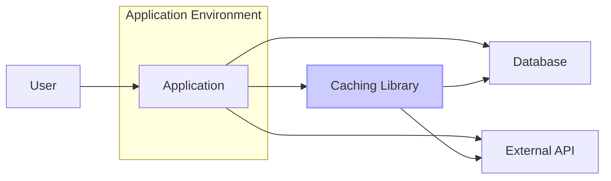

# BUSINESS POSTURE

This project is a caching library for Swift. The primary business goal for using a caching library is to improve application performance and responsiveness by reducing latency and server load. This is achieved by storing frequently accessed data closer to the application, minimizing the need to fetch it from slower sources like databases or remote APIs repeatedly.

Business Priorities and Goals:
- Improve application performance and user experience.
- Reduce server load and infrastructure costs by minimizing requests to backend systems.
- Enhance application scalability by efficiently handling high traffic volumes.
- Provide offline capabilities by caching data for use when network connectivity is limited or unavailable.

Business Risks:
- Data staleness: Cached data might become outdated, leading to inconsistencies if not managed properly.
- Cache invalidation issues: Incorrect or inefficient cache invalidation can result in serving stale data or unnecessary cache misses, negating the benefits of caching.
- Data security in cache: Sensitive data stored in the cache could be exposed if the cache storage mechanism is not properly secured.
- Increased complexity: Introducing caching adds complexity to the application architecture and requires careful design and implementation to avoid introducing bugs or performance bottlenecks.
- Operational overhead: Managing and monitoring the cache infrastructure (if not using in-memory cache) can add operational overhead.

# SECURITY POSTURE

Existing Security Controls:
- security control: Secure software development lifecycle (assumed): The project is hosted on GitHub, suggesting the use of version control and collaborative development practices.
- security control: Code review (assumed): Contributions to open-source projects on GitHub often undergo code review processes.
- security control: Unit testing (assumed):  Caching libraries typically require unit tests to ensure correctness and reliability.
- security control: Dependency management (assumed): Swift Package Manager is likely used for managing dependencies.

Accepted Risks:
- accepted risk: Lack of formal security audit: As an open-source library, a dedicated security audit might not have been performed.
- accepted risk: Reliance on community contributions for security vulnerability identification and patching.

Recommended Security Controls:
- security control: Implement automated static analysis security testing (SAST) in the CI/CD pipeline to identify potential code vulnerabilities.
- security control: Regularly update dependencies to patch known vulnerabilities.
- security control: Provide clear documentation and guidance on secure usage of the library, especially regarding handling sensitive data in the cache.
- security control: Consider fuzz testing to identify potential input validation vulnerabilities.

Security Requirements:
- Authentication: Not directly applicable to a caching library itself. Authentication is handled by the applications using the library.
- Authorization: Not directly applicable to a caching library itself. Authorization is handled by the applications using the library.
- Input Validation:
    - Requirement: The library should perform input validation on cache keys to prevent injection attacks or unexpected behavior.
    - Requirement: If the library handles user-provided data as cache values, it should provide mechanisms or guidance to applications for sanitizing or validating this data before caching to prevent stored cross-site scripting (XSS) or other injection vulnerabilities when the data is retrieved from the cache.
- Cryptography:
    - Requirement: If sensitive data is cached, the library should provide options or guidance for applications to encrypt the data before storing it in the cache and decrypt it upon retrieval. This might involve using encryption at rest for persistent caches or providing APIs for applications to integrate their own encryption mechanisms.

# DESIGN

## C4 CONTEXT



Context Diagram Elements:

- Name: User
  - Type: Person
  - Description: End-user interacting with the application.
  - Responsibilities: Initiates requests to the application.
  - Security controls: User authentication and authorization are handled by the Application.

- Name: Application
  - Type: Software System
  - Description: The application that utilizes the caching library to improve performance.
  - Responsibilities: Handles user requests, interacts with the caching library, database, and external APIs. Implements application-level security controls.
  - Security controls: Input validation, authentication, authorization, session management, error handling, logging, monitoring.

- Name: Caching Library
  - Type: Software System
  - Description: The Swift caching library (hyperoslo/cache) being analyzed.
  - Responsibilities: Provides caching functionality to the application, storing and retrieving data from cache storage.
  - Security controls: Input validation on cache keys, potential encryption of cached data (depending on application implementation and library features).

- Name: Database
  - Type: Software System
  - Description: Backend database storing persistent application data.
  - Responsibilities: Persists application data, serves data requests from the application.
  - Security controls: Database access controls, encryption at rest and in transit, database auditing, vulnerability management.

- Name: External API
  - Type: Software System
  - Description: External services or APIs that the application interacts with.
  - Responsibilities: Provides external data or services to the application.
  - Security controls: API authentication and authorization, rate limiting, input validation, secure communication (HTTPS).

## C4 CONTAINER

```mermaid
flowchart LR
    subgraph "Application Environment"
        subgraph "Application Container"
            AppCode["Application Code"]
            CL[/"Caching Library Container"\n(Swift Package)\n hyperoslo/cache/]
        end
        subgraph "Cache Storage Container"
            CacheStorage[/"Cache Storage"\n(In-Memory, Disk, NSCache)]
        end
    end

    AppCode --> CL
    CL --> CacheStorage

    style CL fill:#ccf,stroke:#99f,stroke-width:2px
    style CacheStorage fill:#eee,stroke:#999,stroke-width:1px
```

Container Diagram Elements:

- Name: Caching Library Container
  - Type: Container (Swift Package)
  - Description: Represents the Swift caching library (hyperoslo/cache) as a deployable component (Swift Package).
  - Responsibilities: Provides caching functionalities to the Application Code. Manages cache storage interactions.
  - Security controls: Input validation on cache keys within the library code. Potentially provides APIs for encryption of cached data.

- Name: Application Code
  - Type: Container (Application Code)
  - Description: Represents the application's codebase that integrates and utilizes the Caching Library.
  - Responsibilities: Application logic, handling user requests, interacting with the Caching Library, Database, and External APIs. Implements application-level security controls.
  - Security controls: Input validation, authentication, authorization, session management, error handling, logging, monitoring, secure usage of the Caching Library (e.g., encrypting sensitive data before caching).

- Name: Cache Storage Container
  - Type: Container (Data Store)
  - Description: Represents the chosen storage mechanism for the cache (e.g., in-memory, disk-based storage, or NSCache).
  - Responsibilities: Persistently or temporarily stores cached data. Provides data access to the Caching Library.
  - Security controls: Access controls to the cache storage, encryption at rest (if disk-based), secure configuration of storage mechanism. Security controls are highly dependent on the chosen storage type. For in-memory cache, security is primarily within the application process. For disk-based cache, file system permissions and encryption are relevant. For NSCache, security is managed by the operating system.

## DEPLOYMENT

Deployment Scenario: Library Integration within Application Deployment

```mermaid
flowchart LR
    subgraph "Deployment Environment"
        subgraph "Application Server"
            AS[/"Application Server Instance"\n(e.g., AWS EC2, GCP Compute Engine)]
            subgraph "Application Process"
                APP[/"Application Process"\n(Swift Application Instance)]
                CL[/"Caching Library"\n(Swift Package)]
                CS[/"Cache Storage"\n(In-Memory or Disk)]
            end
        end
    end

    APP --> CL
    APP --> CS

    style AS fill:#ddd,stroke:#999,stroke-width:1px
    style APP fill:#eee,stroke:#999,stroke-width:1px
    style CL fill:#ccf,stroke:#99f,stroke-width:2px
    style CS fill:#eee,stroke:#999,stroke-width:1px
```

Deployment Diagram Elements:

- Name: Application Server Instance
  - Type: Infrastructure (Compute Instance)
  - Description: Represents a server instance (e.g., virtual machine, container) where the application is deployed.
  - Responsibilities: Provides the runtime environment for the application. Manages resources (CPU, memory, storage).
  - Security controls: Operating system security hardening, network security groups/firewalls, access control to the server instance, security monitoring.

- Name: Application Process
  - Type: Software Runtime (Process)
  - Description: Represents a running instance of the Swift application.
  - Responsibilities: Executes application code, handles user requests, utilizes the Caching Library, interacts with backend systems.
  - Security controls: Application-level security controls (authentication, authorization, input validation), secure configuration of the application runtime environment.

- Name: Caching Library
  - Type: Software Component (Swift Package)
  - Description: The Swift caching library integrated into the Application Process.
  - Responsibilities: Provides caching functionality within the application process.
  - Security controls: Security controls are inherited from the application process and the chosen cache storage mechanism.

- Name: Cache Storage
  - Type: Data Store (In-Memory or Disk)
  - Description: The storage location for cached data, either in-memory within the application process or on disk storage accessible to the application process.
  - Responsibilities: Stores and retrieves cached data.
  - Security controls: Security controls depend on the chosen storage type. In-memory cache security is tied to the application process security. Disk-based cache requires file system permissions and potentially encryption at rest.

## BUILD

```mermaid
flowchart LR
    subgraph "Developer Workstation"
        DEV[/"Developer"\n(Software Engineer)]
        CODE[/"Source Code"\n(Git Repository)]
    end
    subgraph "CI/CD Pipeline"
        VC[/"Version Control System"\n(GitHub)]
        BUILD[/"Build Server"\n(GitHub Actions, Jenkins)]
        TEST[/"Automated Tests"\n(Unit, Integration)]
        SAST[/"SAST Scanner"\n(Static Analysis Security Testing)]
        PACKAGE[/"Package Manager"\n(Swift Package Manager)]
        REPO[/"Package Repository"\n(e.g., GitHub Packages, Swift Package Registry)]
    end

    DEV --> CODE
    CODE --> VC
    VC --> BUILD
    BUILD --> TEST
    BUILD --> SAST
    BUILD --> PACKAGE
    PACKAGE --> REPO

    style DEV fill:#bbe,stroke:#88a,stroke-width:1px
    style CODE fill:#eee,stroke:#999,stroke-width:1px
    style VC fill:#eee,stroke:#999,stroke-width:1px
    style BUILD fill:#eee,stroke:#999,stroke-width:1px
    style TEST fill:#eee,stroke:#999,stroke-width:1px
    style SAST fill:#eee,stroke:#999,stroke-width:1px
    style PACKAGE fill:#eee,stroke:#999,stroke-width:1px
    style REPO fill:#eee,stroke:#999,stroke-width:1px
```

Build Process Description:

1.  Developer (Software Engineer): Writes code for the caching library and commits changes to the Source Code repository.
2.  Source Code (Git Repository): Stores the source code of the caching library, managed by Git.
3.  Version Control System (GitHub): Hosts the Git repository and triggers the CI/CD pipeline on code changes.
4.  Build Server (GitHub Actions, Jenkins): Automated build server that compiles the code, runs tests, and performs security checks.
    -   Security controls: Access control to the build server, secure configuration of build agents, audit logging of build activities.
5.  Automated Tests (Unit, Integration): Executes automated tests to ensure code quality and functionality.
    -   Security controls: Secure test data management, isolation of test environments.
6.  SAST Scanner (Static Analysis Security Testing): Performs static analysis of the code to identify potential security vulnerabilities.
    -   Security controls: Regularly updated vulnerability rules, secure configuration of the SAST scanner.
7.  Package Manager (Swift Package Manager): Packages the compiled library into a Swift Package.
    -   Security controls: Integrity checks of package dependencies, secure package signing (if applicable).
8.  Package Repository (e.g., GitHub Packages, Swift Package Registry): Publishes the built Swift Package to a package repository for distribution.
    -   Security controls: Access control to the package repository, integrity checks of published packages, vulnerability scanning of published packages.

# RISK ASSESSMENT

Critical Business Processes:
- Application performance and availability: Caching directly impacts application performance and responsiveness, which are critical for user satisfaction and business operations. Degradation in caching performance or availability can negatively impact the user experience and potentially business revenue.
- Data consistency: Maintaining data consistency between the cache and the source of truth (database, API) is crucial. Inconsistencies can lead to incorrect information being presented to users, impacting decision-making and trust.

Data Sensitivity:
- Data sensitivity depends on the application using the caching library. The caching library itself is agnostic to the data it caches.
- Potential data types cached could include:
    - Public data: Low sensitivity (e.g., website content, product catalogs).
    - Semi-sensitive data: Medium sensitivity (e.g., user preferences, non-PII user data).
    - Sensitive data: High sensitivity (e.g., Personally Identifiable Information (PII), financial data, authentication tokens).
- Sensitivity level dictates the required security controls for the cache storage and handling of cached data, including encryption, access controls, and data retention policies.

# QUESTIONS & ASSUMPTIONS

Questions:
- What are the intended use cases for this caching library? Is it primarily for web applications, mobile apps, or other types of Swift applications?
- What types of data are expected to be cached using this library? Are there specific requirements for handling sensitive data?
- What are the performance requirements for the cache? Are there specific latency or throughput targets?
- What are the operational requirements for the cache? Is it expected to be self-managed or integrated with a managed caching service?
- Are there any specific compliance requirements (e.g., GDPR, HIPAA, PCI DSS) that the applications using this library need to adhere to?

Assumptions:
- BUSINESS POSTURE: The primary business driver for using this library is to improve application performance and user experience. The business is moderately risk-averse and recognizes the importance of data security and consistency.
- SECURITY POSTURE: Standard secure software development practices are followed, including version control, code review, and testing. However, formal security audits and dedicated security testing might not be regularly performed for this open-source library. Applications using this library are responsible for implementing application-level security controls and securely handling sensitive data cached by the library.
- DESIGN: The caching library is intended to be integrated into various Swift applications. It supports different cache storage backends (in-memory, disk, NSCache). The deployment model involves including the library as a Swift Package dependency within applications. The build process utilizes standard CI/CD practices for Swift packages.