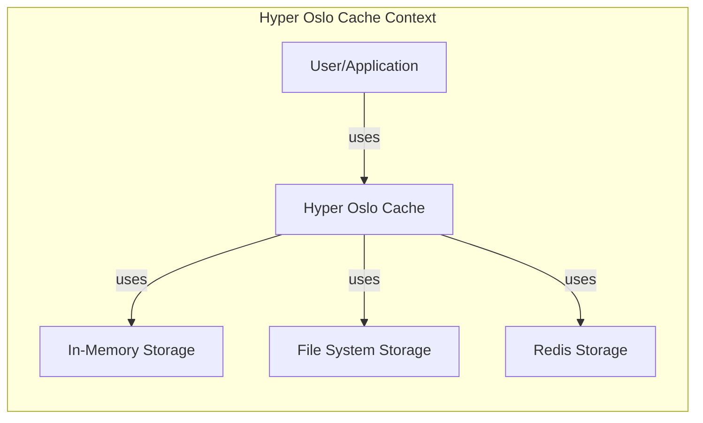
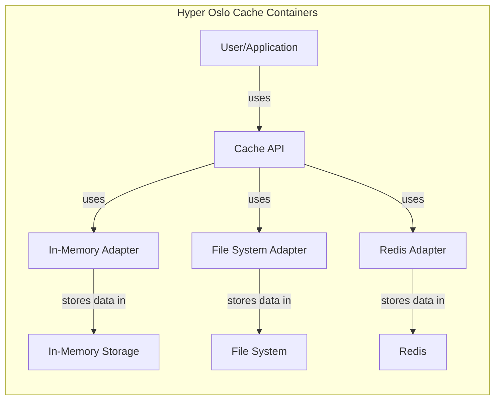
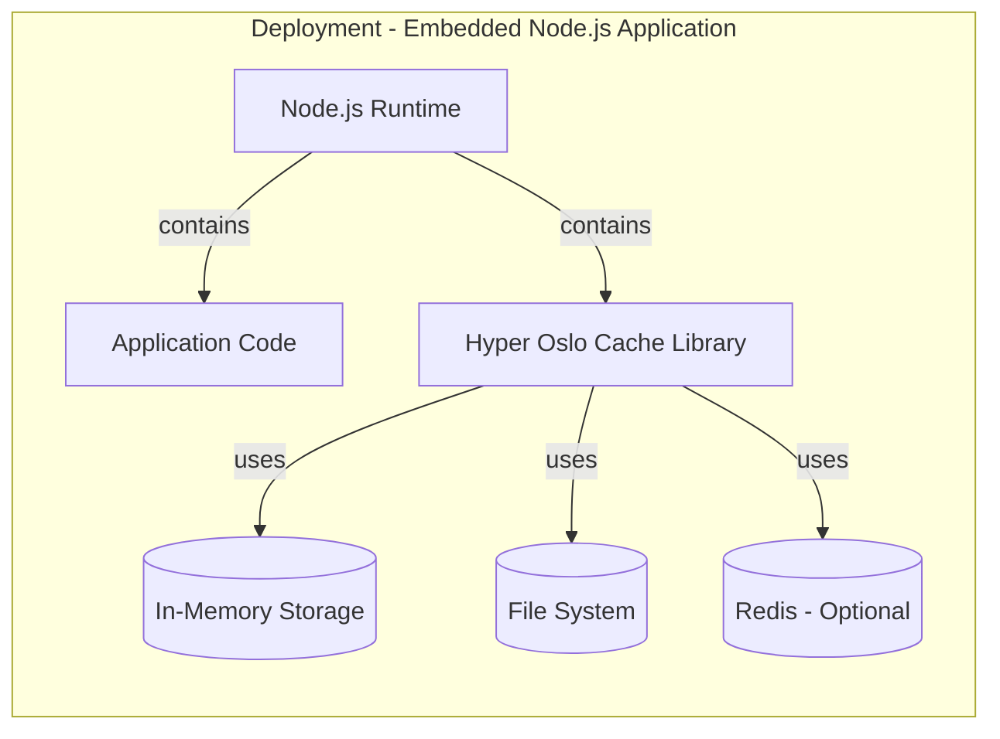
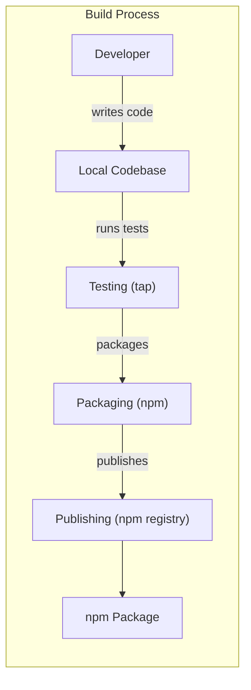

# Project Design Document: Hyper Oslo Cache

## BUSINESS POSTURE

*   Priorities and Goals:
    *   Provide a simple, fast, and reliable caching mechanism for Node.js applications.
    *   Offer flexibility in terms of storage backends (in-memory, file system, Redis).
    *   Minimize external dependencies to reduce complexity and potential conflicts.
    *   Ensure ease of use and integration for developers.
    *   Improve application performance by reducing latency for frequently accessed data.

*   Business Risks:
    *   Data inconsistency: Cached data becoming stale and out of sync with the source of truth, leading to incorrect application behavior.
    *   Cache poisoning: Malicious actors manipulating the cache content to inject harmful data or redirect users.
    *   Denial of Service (DoS): Overwhelming the cache with requests, making it unavailable and impacting application performance.
    *   Data leakage: Sensitive information stored in the cache being exposed due to misconfiguration or vulnerabilities.
    *   Availability: Cache service failure leading to application performance degradation or unavailability.

## SECURITY POSTURE

*   Existing Security Controls:
    *   security control: Input validation: The library appears to perform basic checks on cache keys (e.g., ensuring they are strings). Implemented in source code.
    *   security control: Limited external dependencies: Reduces the attack surface by minimizing reliance on third-party code. Described in package.json.
    *   security control: File system adapter uses file paths that are relative to a base directory, preventing path traversal vulnerabilities. Implemented in source code.

*   Accepted Risks:
    *   accepted risk: No built-in encryption for cached data at rest. This is acceptable if the cached data is not sensitive or if the underlying storage (e.g., Redis) provides encryption.
    *   accepted risk: No built-in authentication or authorization for cache access. This is acceptable if the cache is used within a trusted environment or if access control is managed at a higher level.
    *   accepted risk: The in-memory adapter does not have built-in eviction policies based on memory usage. This could lead to memory exhaustion if not managed carefully.

*   Recommended Security Controls:
    *   security control: Implement data serialization/deserialization with robust validation to prevent injection vulnerabilities.
    *   security control: Consider adding support for data encryption at rest, especially for sensitive data.
    *   security control: Provide options for configuring cache size limits and eviction policies (e.g., LRU, TTL) to prevent resource exhaustion.
    *   security control: Add input sanitization for cache keys to prevent potential injection attacks or unexpected behavior.
    *   security control: If integrating with external storage (Redis), ensure secure configuration and communication (e.g., TLS, authentication).

*   Security Requirements:

    *   Authentication: Not strictly required for the cache itself, assuming it operates within a trusted environment. However, if the cache is exposed externally, authentication mechanisms (e.g., API keys, tokens) should be implemented.
    *   Authorization: Not strictly required for basic cache operations. However, if different users/roles have different access permissions to cached data, authorization mechanisms should be considered.
    *   Input Validation:
        *   Cache keys should be validated to ensure they are of the expected type (string) and do not contain any malicious characters or patterns.
        *   Data being cached should be validated and sanitized before being stored, especially if it originates from user input or untrusted sources.
    *   Cryptography:
        *   If sensitive data is being cached, encryption at rest should be implemented.
        *   If communicating with external storage (e.g., Redis), secure communication channels (e.g., TLS) should be used.

## DESIGN

### C4 CONTEXT

*   Elements Description:

    *   1. Name: User/Application
        *   Type: User/External System
        *   Description: Represents the application or user interacting with the Hyper Oslo Cache.
        *   Responsibilities: Making requests to store and retrieve data from the cache.
        *   Security controls: Authentication and authorization may be implemented at the application level.

    *   2. Name: Hyper Oslo Cache
        *   Type: System
        *   Description: The caching library itself.
        *   Responsibilities: Managing cache entries, handling storage and retrieval, and interacting with different storage adapters.
        *   Security controls: Input validation, adapter-specific security measures.

    *   3. Name: In-Memory Storage
        *   Type: External System
        *   Description: An in-memory data structure (e.g., a JavaScript object) used for caching.
        *   Responsibilities: Storing cache entries in memory.
        *   Security controls: Limited attack surface due to its simplicity, but susceptible to memory exhaustion.

    *   4. Name: File System Storage
        *   Type: External System
        *   Description: The file system used for storing cache entries as files.
        *   Responsibilities: Storing and retrieving cache entries from files.
        *   Security controls: File system permissions, path traversal prevention.

    *   5. Name: Redis Storage
        *   Type: External System
        *   Description: A Redis instance used for caching.
        *   Responsibilities: Storing and retrieving cache entries from Redis.
        *   Security controls: Redis authentication, TLS encryption, network security.

### C4 CONTAINER

*   Elements Description:

    *   1. Name: User/Application
        *   Type: User/External System
        *   Description: Represents the application or user interacting with the Hyper Oslo Cache.
        *   Responsibilities: Making requests to store and retrieve data from the cache.
        *   Security controls: Authentication and authorization may be implemented at the application level.

    *   2. Name: Cache API
        *   Type: Container
        *   Description: The main interface for interacting with the cache.
        *   Responsibilities: Providing methods for storing, retrieving, and deleting cache entries.  Routing requests to the appropriate adapter.
        *   Security controls: Input validation, API rate limiting (if applicable).

    *   3. Name: In-Memory Adapter
        *   Type: Container
        *   Description: Adapter for interacting with in-memory storage.
        *   Responsibilities: Managing cache entries in memory.
        *   Security controls: Limited attack surface, but susceptible to memory exhaustion.

    *   4. Name: File System Adapter
        *   Type: Container
        *   Description: Adapter for interacting with file system storage.
        *   Responsibilities: Managing cache entries as files.
        *   Security controls: File system permissions, path traversal prevention.

    *   5. Name: Redis Adapter
        *   Type: Container
        *   Description: Adapter for interacting with Redis storage.
        *   Responsibilities: Managing cache entries in Redis.
        *   Security controls: Secure communication with Redis (TLS, authentication).

    *   6. Name: In-Memory Storage
        *   Type: External System
        *   Description: An in-memory data structure (e.g., a JavaScript object) used for caching.
        *   Responsibilities: Storing cache entries in memory.
        *   Security controls: Limited attack surface due to its simplicity, but susceptible to memory exhaustion.

    *   7. Name: File System
        *   Type: External System
        *   Description: The file system used for storing cache entries as files.
        *   Responsibilities: Storing and retrieving cache entries from files.
        *   Security controls: File system permissions, path traversal prevention.

    *   8. Name: Redis
        *   Type: External System
        *   Description: A Redis instance used for caching.
        *   Responsibilities: Storing and retrieving cache entries from Redis.
        *   Security controls: Redis authentication, TLS encryption, network security.

### DEPLOYMENT

*   Possible Deployment Solutions:
    *   1.  **Embedded within a Node.js application:** The library is directly integrated into the application's codebase and runs within the same process.
    *   2.  **As a separate service:** The cache could be deployed as a standalone service (e.g., using a framework like Express.js) and accessed via an API. This is less likely given the library's design, but still possible.
    *   3.  **Redis as a managed service:** If using the Redis adapter, a managed Redis service (e.g., from AWS, Azure, GCP) could be used.

*   Chosen Deployment Solution (1. Embedded within a Node.js application):

*   Elements Description:

    *   1. Name: Node.js Runtime
        *   Type: Infrastructure Node
        *   Description: The Node.js runtime environment.
        *   Responsibilities: Executing the application code and the Hyper Oslo Cache library.
        *   Security controls: Node.js security updates, secure configuration.

    *   2. Name: Application Code
        *   Type: Software System Instance
        *   Description: The application code that utilizes the Hyper Oslo Cache.
        *   Responsibilities: Performing application logic and interacting with the cache.
        *   Security controls: Application-level security measures (authentication, authorization, input validation, etc.).

    *   3. Name: Hyper Oslo Cache Library
        *   Type: Software System Instance
        *   Description: An instance of the Hyper Oslo Cache library.
        *   Responsibilities: Managing cache entries and interacting with storage.
        *   Security controls: Input validation, adapter-specific security measures.

    *   4. Name: In-Memory
        *   Type: Data Store Instance
        *   Description: In-memory storage for cache data.
        *   Responsibilities: Storing cache entries in memory.
        *   Security controls: Limited attack surface, but susceptible to memory exhaustion.

    *   5. Name: File System
        *   Type: Data Store Instance
        *   Description: File system storage for cache data.
        *   Responsibilities: Storing and retrieving cache entries from files.
        *   Security controls: File system permissions, path traversal prevention.

    *   6. Name: RedisDB
        *   Type: Data Store Instance
        *   Description: Redis database for cache data (optional, if using the Redis adapter).
        *   Responsibilities: Storing and retrieving cache entries from Redis.
        *   Security controls: Redis authentication, TLS encryption, network security.

### BUILD

*   The Hyper Oslo Cache library is a relatively simple Node.js package.  The build process likely involves:

    1.  **Development:** Developers write code and tests locally.
    2.  **Testing:** Running unit tests using a framework like `tap`.
    3.  **Packaging:** Using `npm` to package the library for distribution.
    4.  **Publishing:** Publishing the package to the npm registry.

*   Security Controls:

    *   security control: **Dependency Management:** `npm` is used to manage dependencies.  Regularly auditing and updating dependencies is crucial to mitigate vulnerabilities in third-party libraries. Tools like `npm audit` or `snyk` can be used.
    *   security control: **Testing:** Unit tests help ensure the code functions as expected and can catch potential security flaws early on.
    *   security control: **Code Review:**  Code reviews by other developers can help identify potential security issues before they are merged into the main codebase.
    *   security control: **Secure Publishing:** Publishing to npm should be done with appropriate authentication and authorization to prevent unauthorized modifications to the package.

## RISK ASSESSMENT

*   Critical Business Processes:
    *   Application performance and responsiveness: The cache is designed to improve these aspects.
    *   Data consistency: Ensuring that the cache does not serve stale or incorrect data.
    *   Application availability: The cache should not become a single point of failure.

*   Data Sensitivity:
    *   The sensitivity of the data being cached is a crucial factor.  If the cache stores sensitive data (e.g., user credentials, personal information, financial data), then stronger security measures (encryption, access control) are required. If the data is non-sensitive (e.g., publicly available information), the security requirements may be less stringent. The library itself doesn't inherently know the sensitivity of the data; this is determined by how it's used.

## QUESTIONS & ASSUMPTIONS

*   Questions:

    *   What types of data will be cached? What is the sensitivity of this data?
    *   What are the expected cache hit rates and miss rates?
    *   What are the performance requirements for cache access (latency, throughput)?
    *   What is the expected size of the cache?
    *   Will the cache be accessed concurrently by multiple users or processes?
    *   Is there a need for cache invalidation based on events or triggers?
    *   What is the acceptable downtime for the cache?
    *   Are there any specific regulatory or compliance requirements related to data caching?

*   Assumptions:

    *   BUSINESS POSTURE: The primary goal is to improve application performance. The organization has a moderate risk appetite.
    *   SECURITY POSTURE: The cache will primarily be used within a trusted environment (e.g., within a single application or a cluster of trusted services). The data being cached is not highly sensitive.
    *   DESIGN: The embedded deployment model is the most common and appropriate use case. The in-memory and file system adapters are the most frequently used.