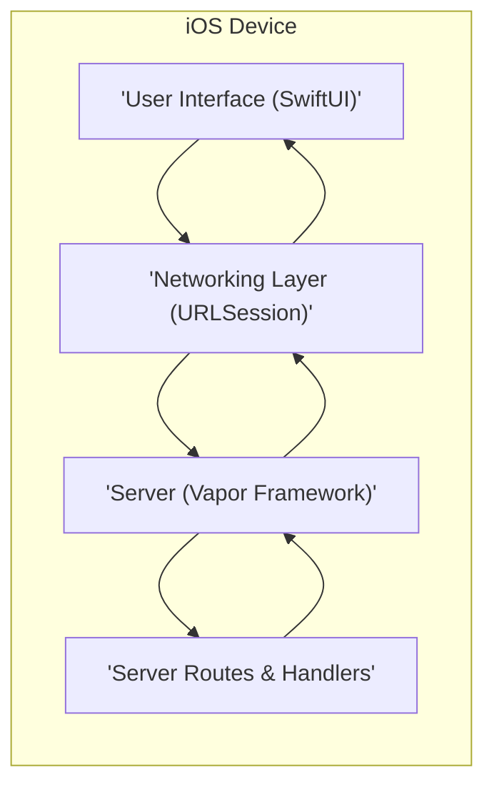
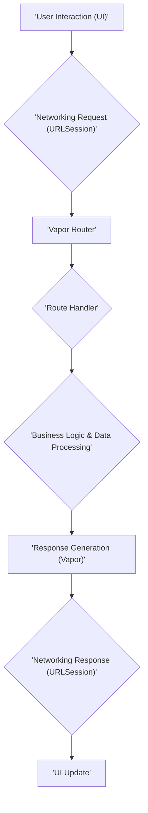

# Project Design Document: Swift-On-iOS

**Version:** 1.1
**Date:** October 26, 2023
**Author:** Gemini (AI Language Model)

## 1. Introduction

This document provides an enhanced architectural design for the "Swift-On-iOS" project, available at [https://github.com/johnlui/Swift-On-iOS](https://github.com/johnlui/Swift-On-iOS). This project demonstrates the capability of running server-side Swift code directly within an iOS application. This document details the key components, their interactions, data flow, and technologies involved, with a specific focus on providing the necessary information for effective threat modeling.

## 2. Goals and Objectives

The primary goal remains to showcase the feasibility of executing server-side Swift code within an iOS application. Key objectives include:

*   Demonstrating a functional server implementation embedded within an iOS app.
*   Providing a basic API endpoint for client-side interaction within the same application.
*   Illustrating the use of a Swift web framework (Vapor in this case) running on iOS.
*   Offering a simplified, self-contained example for developers interested in exploring this architectural pattern.

## 3. Architectural Overview

The "Swift-On-iOS" project utilizes a unique self-contained architecture where both the client-side user interface and the server-side logic coexist within the same iOS application process. This contrasts with traditional client-server models where the server is a distinct, separate entity.

### 3.1. High-Level Architecture

*   **User Interface (SwiftUI):** The presentation layer of the application, responsible for rendering the user interface components and handling user interactions.
*   **Networking Layer (URLSession):**  Used by the UI to communicate with the embedded local server. This communication is internal to the application process.
*   **Server (Vapor Framework):** The core of the server-side logic, responsible for receiving requests, processing them, and generating responses.
*   **Server Routes & Handlers:** Defines the specific API endpoints exposed by the server and the corresponding Swift code that executes when those endpoints are accessed.

### 3.2. Component-Level Architecture

#### 3.2.1. User Interface (SwiftUI)

*   **Views:** SwiftUI view structures that define the visual elements of the application (e.g., `Text`, `Button`, `List`). These are responsible for displaying data and capturing user input.
*   **View Models:**  Objects that manage the state of the views and act as intermediaries between the views and the data sources (in this case, the local server). They typically initiate network requests and handle responses.
*   **Data Models:** Swift structures or classes that represent the data exchanged between the UI and the server. These ensure type safety and facilitate data handling.

#### 3.2.2. Networking Layer (URLSession)

*   **URLSession:** The standard Apple framework for performing network requests. Here, it's used to send HTTP requests to the server running within the same application process (likely targeting `localhost` or a specific loopback address).
*   **URLRequest Objects:** Instances that encapsulate the details of an HTTP request, including the URL, HTTP method (GET, POST, etc.), headers, and request body.
*   **URLResponse Objects:** Instances that represent the server's response to a request, including the status code, headers, and response body.
*   **Data Tasks:**  The specific type of `URLSession` task used to retrieve the content of a URL.

#### 3.2.3. Server (Vapor Framework)

*   **Application Instance (`app`):** The central object in a Vapor application, responsible for managing the server's lifecycle, configuring services, and handling routing.
*   **Router:** The component that maps incoming HTTP requests to specific route handlers based on the request's path and HTTP method.
*   **Middleware:** Components that intercept requests and responses as they flow through the application. They can perform tasks like logging, request modification, or error handling.
*   **Request Object (`Request`):** A Vapor object representing an incoming HTTP request, providing access to parameters, headers, and the request body.
*   **Response Object (`Response`):** A Vapor object used to construct and send HTTP responses back to the client, including setting the status code, headers, and response body.
*   **Content Encoding/Decoding (Codable):**  Leverages Swift's `Codable` protocol to automatically serialize and deserialize data (e.g., JSON) between the client and server, simplifying data exchange.

#### 3.2.4. Server Routes & Handlers

*   **Route Definitions:**  Declarations that specify the API endpoints exposed by the server, typically defined using Vapor's routing DSL (Domain Specific Language). Examples include `app.get("/hello")` or `app.post("/data")`.
*   **Handler Functions/Closures:** Swift functions or closures that contain the business logic for processing requests to specific routes. These functions receive the `Request` object and are responsible for generating a `Response`.

## 4. Data Flow

The typical data flow within the "Swift-On-iOS" application proceeds as follows:

1. **User Interaction (UI):** A user interacts with the application's UI, triggering an action that requires communication with the server (e.g., tapping a button, submitting a form).
2. **Networking Request (URLSession):** The UI initiates a network request using `URLSession` to a specific endpoint on the local server. This involves creating a `URLRequest` and starting a `DataTask`.
3. **Vapor Router:** The Vapor router receives the incoming HTTP request and matches it against the defined routes based on the request method and path.
4. **Route Handler:** The corresponding route handler function or closure associated with the matched route is executed.
5. **Business Logic & Data Processing:** The handler function executes the necessary business logic, which might involve data manipulation, calculations, or interactions with other parts of the application.
6. **Response Generation (Vapor):** The handler function constructs an HTTP response using Vapor's `Response` builders. This includes setting the status code, headers, and the response body (often in JSON format).
7. **Networking Response (URLSession):** `URLSession` receives the response from the local server. The completion handler of the `DataTask` is called with the response data.
8. **UI Update:** The UI updates based on the data received in the response. The view model typically processes the response data and updates the observable state, triggering UI re-rendering.

## 5. Technology Stack

*   **Programming Language:** Swift
*   **UI Framework:** SwiftUI
*   **Server-Side Framework:** Vapor (version likely 4 or later)
*   **Networking Library (Client-Side):** URLSession (part of Foundation framework)
*   **Operating System:** iOS

## 6. Deployment

The "Swift-On-iOS" project is deployed as a standard iOS application package (`.ipa` file). The server component is embedded within the application binary and starts when the application is launched. There is no separate server deployment process involved, as the server runs within the application's process on the user's device.

## 7. Key Security Considerations (For Threat Modeling)

This section highlights potential areas of security concern that should be thoroughly investigated during threat modeling activities.

*   **Localhost Exposure & Internal Communication Security:** While the server is intended for local access only, vulnerabilities in the server framework or application logic could be exploited if an attacker gains unauthorized access to the device. Consider the security of inter-process communication within the app.
*   **Data Storage Security:** If the application persists any data locally (e.g., using Core Data, UserDefaults, or files), the security of this storage is critical. Consider using encryption at rest for sensitive data.
*   **Input Validation on Server Endpoints:** Even though the client and server are within the same application, the server-side route handlers must validate all input received from the client to prevent unexpected behavior, crashes, or potential exploits like injection attacks (though less likely in this context).
*   **Dependency Vulnerabilities:** The security of the Vapor framework and any other third-party dependencies is paramount. Regularly updating dependencies to their latest secure versions is crucial to mitigate known vulnerabilities.
*   **Code Injection Risks:** While less likely due to the self-contained nature, ensure there are no scenarios where user-controlled input could be interpreted as executable code by the server-side logic (e.g., through dynamic code execution or unsafe string interpolation).
*   **Information Disclosure through Error Handling:** Ensure that error messages or server responses do not inadvertently reveal sensitive information about the application's internal workings or data. Implement proper error handling and logging mechanisms.
*   **Denial of Service (DoS) within the Application:** Consider potential vulnerabilities that could allow an attacker (if they gain control of the device or can influence the client-side logic) to overwhelm the server's resources, leading to a denial of service within the application itself.
*   **Authentication and Authorization (Internal):** Even within a single application, consider if there are different levels of access or operations that should be restricted. While traditional user authentication might not be applicable, internal authorization mechanisms might be relevant for more complex applications.
*   **Side-Channel Attacks:**  Consider potential side-channel attacks if sensitive data is being processed. While less common in this scenario, it's worth noting for completeness.
*   **Mobile Platform Security Features:** Leverage iOS security features like sandboxing to further isolate the application and its components.

## 8. Future Considerations

*   **Expanding API Functionality:** Adding more complex API endpoints to support richer interactions and features within the application.
*   **Integrating Local Data Persistence:** Implementing a local database (e.g., SQLite via Vapor's Fluent ORM or Core Data) or other persistent storage mechanisms for managing application data.
*   **Exploring Alternative Communication Methods:** Investigating other methods of communication between the UI and server components, although `URLSession` is a standard and suitable approach for this pattern.
*   **Enhancing Security Measures:** Implementing more robust security practices as the application evolves, such as input sanitization, secure coding practices, and potentially code obfuscation.
*   **Modularization:**  Breaking down the server and client components into more distinct modules for better organization and maintainability.

This enhanced design document provides a more detailed and security-focused overview of the "Swift-On-iOS" project's architecture, serving as a valuable foundation for conducting comprehensive threat modeling and identifying potential security vulnerabilities.