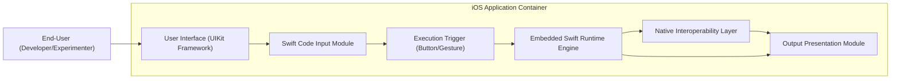
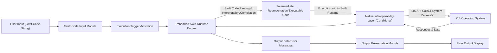

## Project Design Document: Swift on iOS (Improved)

**Project Name:** Swift on iOS

**Project Repository:** [https://github.com/johnlui/swift-on-ios](https://github.com/johnlui/swift-on-ios)

**Document Version:** 1.1

**Date:** October 26, 2023

**Author:** AI Software Architect

### 1. Introduction

This document provides an enhanced architectural design of the "Swift on iOS" project, as found in the provided GitHub repository. The core objective of this project is to enable the direct execution of Swift code within an iOS application, bypassing the conventional Xcode build and deployment process. This is achieved by integrating a Swift runtime environment directly into the iOS application. This document details the system's architecture, key components, data flows, and crucial security considerations to facilitate comprehensive threat modeling.

### 2. Goals

The primary goals of the "Swift on iOS" project are:

*   To demonstrate the technical viability of dynamic Swift code execution within an iOS application context.
*   To offer a user-friendly interface for inputting and immediately running Swift code snippets.
*   To showcase the interaction mechanisms between the embedded Swift runtime and the underlying native iOS operating system.
*   To serve as a platform for experimentation, education, and deeper understanding of Swift runtime environments on iOS devices.

### 3. Target Audience

This document is specifically intended for:

*   Cybersecurity professionals and architects tasked with performing threat modeling and security assessments.
*   Software developers seeking to understand the internal architecture and implementation details of the project.
*   Technology enthusiasts and researchers interested in the technical aspects of running Swift code dynamically on iOS.

### 4. System Architecture

The "Swift on iOS" project employs an embedded architecture where a complete Swift runtime environment is packaged within a standard native iOS application. This embedded runtime is responsible for interpreting and executing Swift code provided by the user at runtime.

**Detailed Architectural Components:**

*   **User Interface (UIKit Framework):**  Provides the standard iOS user interface elements for interaction. This includes views for input, buttons for triggering actions, and areas for displaying output.
*   **Swift Code Input Module:** A dedicated component (e.g., a `UITextView`) that allows users to enter Swift code as text. This module might include features like syntax highlighting for improved usability.
*   **Execution Trigger (Button/Gesture):** A UI element (typically a `UIButton`) or a gesture recognizer that initiates the Swift code execution process when activated by the user.
*   **Embedded Swift Runtime Engine:** This is the core of the project. It contains the necessary libraries and executables to interpret and run Swift code. This likely involves:
    *   **Swift Interpreter/Compiler:**  Responsible for parsing and either directly interpreting or compiling the Swift code into an intermediate representation or machine code.
    *   **Standard Swift Libraries:**  A subset of the standard Swift library providing core functionalities.
    *   **Memory Management:**  Handles allocation and deallocation of memory for the executed Swift code.
    *   **Error Handling:**  Manages runtime errors and exceptions within the Swift execution environment.
*   **Native Interoperability Layer:** A crucial component that bridges the gap between the managed Swift runtime and the native iOS environment. This layer enables the executed Swift code to interact with iOS system services and APIs. Implementation techniques might include:
    *   **C Function Interface:**  Exposing C functions from the native application that can be called from Swift.
    *   **Objective-C Bridging:**  Utilizing Objective-C runtime features to allow Swift code to interact with Objective-C objects and methods.
    *   **Foreign Function Interface (FFI):** A more general mechanism for calling functions written in other languages.
*   **Output Presentation Module:**  A UI component (e.g., a `UITextView` or `UILabel`) responsible for displaying the results, output, or error messages generated by the executed Swift code.

### 5. Component Details

A more granular description of each key component:

*   **User Interface (UIKit Framework):**
    *   Built using standard UIKit components to ensure a native iOS look and feel.
    *   Handles user input events and updates the display based on application state.
    *   May incorporate accessibility features for users with disabilities.

*   **Swift Code Input Module:**
    *   Typically a `UITextView` allowing multi-line text input.
    *   Could potentially integrate with third-party libraries for advanced features like code completion and syntax highlighting.
    *   The raw text content of this module is the primary input to the Swift execution process.

*   **Execution Trigger (Button/Gesture):**
    *   A standard `UIButton` with a clear label (e.g., "Run", "Execute").
    *   Alternatively, a gesture recognizer could be used to trigger execution based on user interaction.
    *   The action associated with this trigger initiates the transfer of the input code to the Swift Runtime Engine.

*   **Embedded Swift Runtime Engine:**
    *   This component is likely the most complex and security-sensitive.
    *   The specific implementation details of the Swift interpreter/compiler are critical for understanding potential vulnerabilities.
    *   Memory management within this environment needs to be robust to prevent crashes and security issues.
    *   Error handling should be implemented to gracefully manage issues during code execution and prevent sensitive information leakage.

*   **Native Interoperability Layer:**
    *   This layer defines the boundaries and access controls between the sandboxed Swift environment and the native iOS system.
    *   The design of this layer directly impacts the potential for security vulnerabilities like sandbox escape or privilege escalation.
    *   Careful consideration must be given to which native APIs and functionalities are exposed to the embedded Swift code.

*   **Output Presentation Module:**
    *   Displays the output generated by the executed Swift code.
    *   Should implement proper sanitization to prevent the display of potentially malicious or unexpected content that could exploit UI vulnerabilities.
    *   May include features for formatting the output for better readability.

### 6. Data Flow (Detailed)

The data flow within the "Swift on iOS" project centers around the processing and execution of user-provided Swift code:

**Step-by-Step Data Flow:**

1. **User Input (Swift Code String):** The user enters Swift code as a text string within the "Swift Code Input Module."
2. **Swift Code Input Module:** Stores the user-provided Swift code.
3. **Execution Trigger Activation:** The user interacts with the "Execution Trigger," signaling the start of the execution process.
4. **Embedded Swift Runtime Engine:**
    *   Receives the Swift code string from the "Swift Code Input Module."
    *   Parses the Swift code to check for syntax errors.
    *   Either interprets the code directly or compiles it into an intermediate representation or machine code.
5. **Intermediate Representation/Executable Code:** The result of the parsing and compilation/interpretation stage.
6. **Execution within Swift Runtime:** The Swift code is executed within the isolated environment of the "Embedded Swift Runtime Engine."
7. **Native Interoperability Layer (Conditional):**
    *   If the executed Swift code attempts to interact with native iOS functionalities (e.g., accessing the device's file system, network, or sensors), the "Native Interoperability Layer" is invoked.
    *   The Swift runtime makes requests through this layer to the native application.
8. **iOS Operating System:**
    *   Receives requests from the "Native Interoperability Layer."
    *   Processes these requests by invoking the appropriate iOS APIs or accessing system resources.
    *   Returns responses or data back to the "Native Interoperability Layer."
9. **Output Data/Error Messages:** The "Embedded Swift Runtime Engine" captures the output generated by the executed Swift code (e.g., from `print()` statements, return values) or any error messages encountered during execution.
10. **Output Presentation Module:**  Receives the output data or error messages from the Swift Runtime Engine.
11. **User Output Display:** The "Output Presentation Module" displays the results to the user.

### 7. Security Considerations (Enhanced for Threat Modeling)

This section expands on the potential security vulnerabilities, providing more context for threat modeling activities:

*   **Remote Code Execution (via Code Injection):**
    *   **Threat:** A malicious user could input crafted Swift code designed to exploit vulnerabilities in the embedded Swift runtime, potentially gaining arbitrary code execution within the application's sandbox.
    *   **Impact:** Could lead to data breaches, unauthorized access to device resources, or denial of service.
    *   **Likelihood:** Depends on the security robustness of the embedded Swift runtime and the complexity of the project.

*   **Sandbox Escape:**
    *   **Threat:** Malicious Swift code could leverage vulnerabilities in the "Native Interoperability Layer" to bypass the iOS application's sandbox restrictions and access resources or functionalities outside of its intended scope.
    *   **Impact:** Could allow access to sensitive user data, system-level operations, or communication with external servers without user consent.
    *   **Likelihood:**  Highly dependent on the design and implementation of the "Native Interoperability Layer."

*   **Resource Exhaustion/Denial of Service (DoS):**
    *   **Threat:** A user could input Swift code designed to consume excessive CPU, memory, or other system resources, leading to application instability or device slowdown.
    *   **Impact:** Could render the application unusable or negatively impact the overall device performance.
    *   **Likelihood:** Moderate, especially if there are no resource limits imposed on the executed Swift code.

*   **Data Exfiltration (via Native Bridge Misuse):**
    *   **Threat:** Malicious Swift code could exploit vulnerabilities or weaknesses in the "Native Interoperability Layer" to access and exfiltrate sensitive data stored within the application or accessible through iOS APIs.
    *   **Impact:** Loss of confidential user data, privacy violations.
    *   **Likelihood:** Depends on the access controls and sanitization implemented in the "Native Interoperability Layer."

*   **Privilege Escalation (Through Native Bridge Exploits):**
    *   **Threat:**  Vulnerabilities in the "Native Interoperability Layer" could allow malicious Swift code to perform actions with higher privileges than the application itself possesses.
    *   **Impact:** Could lead to unauthorized system modifications or access to protected resources.
    *   **Likelihood:** Lower, but a critical risk if the "Native Interoperability Layer" is not carefully designed and secured.

*   **Information Disclosure (via Error Messages or Debug Information):**
    *   **Threat:**  Error messages or debugging information exposed by the Swift runtime could inadvertently reveal sensitive information about the application's internal workings, the device's configuration, or user data.
    *   **Impact:** Could provide attackers with valuable information for further exploitation.
    *   **Likelihood:** Moderate, can be mitigated by careful error handling and logging practices.

*   **Input Validation Failures:**
    *   **Threat:** Insufficient input validation on the Swift code could lead to unexpected behavior, crashes, or potentially exploitable vulnerabilities.
    *   **Impact:** Application instability, potential for code injection if not handled correctly.
    *   **Likelihood:** Moderate, requires robust parsing and validation of the input Swift code.

*   **Compromise of the Embedded Swift Runtime:**
    *   **Threat:** If the embedded Swift runtime itself is compromised (e.g., through vulnerabilities in its libraries or executables), attackers could gain significant control over the application's execution environment.
    *   **Impact:** Severe, as the entire execution environment becomes untrusted.
    *   **Likelihood:**  Depends on the security of the specific Swift runtime version and any included third-party libraries.

### 8. Deployment Considerations

*   The application will be packaged and deployed as a standard iOS application.
*   The "Embedded Swift Runtime Engine" will significantly increase the application's size.
*   Consider the implications for App Store review guidelines regarding dynamic code execution.

### 9. Future Considerations

*   **Enhanced Security Measures:** Implement robust sandboxing for the embedded Swift code, refine access controls in the "Native Interoperability Layer," and regularly update the embedded Swift runtime.
*   **Granular API Access Control:**  Implement a more fine-grained mechanism for controlling which iOS APIs are accessible to the embedded Swift code, potentially using a whitelist approach.
*   **Resource Management:** Implement stricter resource limits and monitoring for the executed Swift code to prevent resource exhaustion attacks.
*   **Code Signing and Integrity Checks:** Implement mechanisms to verify the integrity of the embedded Swift runtime and prevent tampering.
*   **User Authentication and Authorization:** If the application handles sensitive data or provides privileged functionalities, implement appropriate user authentication and authorization mechanisms.

This improved design document provides a more detailed and security-focused overview of the "Swift on iOS" project. It highlights critical areas for threat modeling and emphasizes the importance of secure design and implementation practices, particularly concerning the embedded Swift runtime and the native interoperability layer.