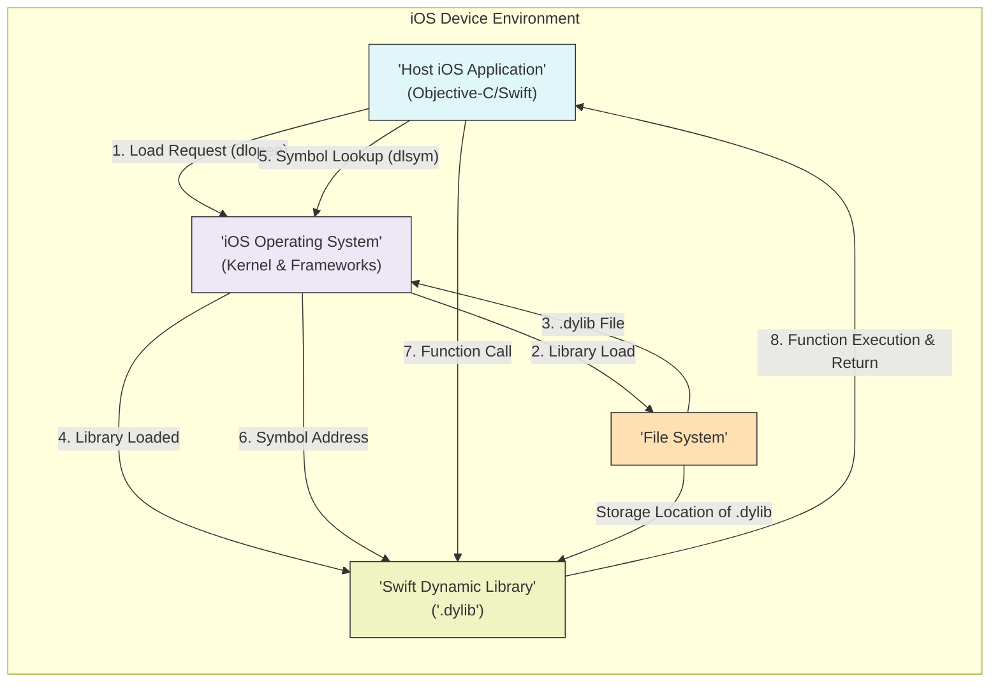

# Project Design Document: Swift On iOS

**Project Name:** Swift On iOS Dynamic Library Loader

**Project Repository:** [https://github.com/johnlui/swift-on-ios](https://github.com/johnlui/swift-on-ios)

**Document Version:** 1.1
**Date:** October 26, 2023
**Author:** Gemini (AI Expert in Software, Cloud, and Cybersecurity Architecture)

## 1. Introduction

This document provides a detailed design for the "Swift On iOS" project, which demonstrates the dynamic loading and execution of Swift code within an iOS application. This capability allows for extending app functionality at runtime by loading Swift code from external `.dylib` (dynamic library) files.  This document is crucial for understanding the system's architecture and will serve as the foundation for a comprehensive threat modeling exercise to identify and mitigate potential security vulnerabilities inherent in dynamic code loading.  Given the inherent security risks associated with dynamic code execution, especially from potentially untrusted sources, a thorough security analysis based on this design is paramount.

## 2. Project Overview

The "Swift On iOS" project showcases the technical process of dynamically loading and executing Swift code within an iOS application. It leverages standard POSIX dynamic linking mechanisms, specifically `dlopen` and `dlsym`, to load compiled Swift dynamic libraries into a running iOS application. This approach opens up possibilities for:

*   **Extensible Applications:**  Developing iOS applications with plugin-like architectures, where new features can be added without requiring full app recompilation and redistribution.
*   **Runtime Feature Updates:**  Potentially enabling updates to specific application functionalities without submitting a new version to the App Store (though this approach has significant App Store policy implications and security risks).
*   **Scripting and Automation:**  Facilitating scripting or automation capabilities within iOS applications using the Swift language.

**Critical Security Reminder:**  Dynamically loading and executing code, especially from external sources, is a high-risk operation.  This project, while demonstrating the technical feasibility, explicitly highlights the security concerns.  This design document and the subsequent threat modeling process are essential steps to understand and mitigate these risks before deploying such a system in a production environment.  The primary focus should be on ensuring the integrity and trustworthiness of the dynamically loaded code and preventing malicious code execution.

## 3. Goals and Objectives

The primary goals of this project are:

*   **Proof of Concept:** To create a working demonstration of dynamic Swift code loading on iOS, proving its technical viability.
*   **Educational Resource:** To provide a clear and understandable example for developers interested in exploring dynamic code loading in Swift and iOS.
*   **Security Awareness:** To emphasize the significant security implications of dynamic code loading and to encourage developers to adopt secure practices if they choose to implement such features.

Key objectives to achieve these goals include:

*   **Dynamic Library Loading:** Implement robust and reliable loading of Swift `.dylib` files into an iOS application using `dlopen`.
*   **Symbol Resolution and Access:**  Successfully resolve and access function symbols within the loaded dynamic libraries using `dlsym`.
*   **Cross-Boundary Function Execution:**  Enable seamless execution of Swift functions residing in the dynamically loaded library from the host iOS application.
*   **Data Interoperability:** Demonstrate basic data exchange and communication between the host application and the dynamically loaded Swift code, including passing arguments and receiving return values.
*   **Clear Error Handling:** Implement comprehensive error handling for all stages of the dynamic loading and execution process, including library loading failures, symbol resolution errors, and function execution issues.

## 4. System Architecture

The system architecture is based on a client-server model, where the host iOS application acts as the client, and the dynamically loaded Swift library acts as a server of functionalities.

**Components:**

*   **'Host iOS Application' (Objective-C/Swift):**
    *   The primary iOS application, developed in Objective-C or Swift, responsible for initiating the dynamic loading process and interacting with the loaded Swift code.
    *   Manages the application's core logic and user interface.
    *   Utilizes system calls (`dlopen`, `dlsym`, `dlclose`) to manage the lifecycle of the dynamic library.
    *   Orchestrates function calls to the dynamically loaded Swift library and handles data exchange.
    *   Implements error handling and security measures related to dynamic loading.

*   **'Swift Dynamic Library' (.dylib):**
    *   A pre-compiled Swift library containing the dynamically loadable code.
    *   Developed and compiled separately from the host application.
    *   Exposes specific functions designed to be called by the host application.
    *   Resides in the iOS file system at a location accessible to the host application.
    *   Should be designed with security best practices in mind, especially if loaded from potentially untrusted sources.

*   **'iOS Operating System' (Kernel & Frameworks):**
    *   The underlying iOS operating system providing the environment for application execution.
    *   Provides the `dlopen`, `dlsym`, and `dlclose` system calls that enable dynamic linking.
    *   Enforces system-level security policies, including sandboxing and code signing.
    *   Manages memory allocation and process execution for both the host application and the dynamic library.

*   **'File System':**
    *   The iOS file system where the `.dylib` file is stored.
    *   The location of the `.dylib` is critical for the host application to find and load it.
    *   The security of the file system and the storage location of the `.dylib` are important security considerations.

## 5. Component Details

### 5.1. 'Host iOS Application'

*   **Programming Language:** Primarily Objective-C or Swift (the example project is in Objective-C).
*   **Key Responsibilities:**
    *   **Dynamic Library Management:**
        *   **Loading:** Uses `dlopen(dylibPath, RTLD_NOW)` to load the `.dylib` file from a specified path. `RTLD_NOW` ensures all symbols are resolved immediately upon loading.
        *   **Unloading:** Uses `dlclose(dylibHandle)` to unload the dynamic library when it's no longer needed, releasing resources.
        *   **Error Handling:** Implements robust error handling for `dlopen` and `dlclose` failures, including logging and user feedback.
    *   **Function Symbol Resolution:**
        *   Uses `dlsym(dylibHandle, functionName)` to resolve function symbols within the loaded library.
        *   **Function Signature Awareness:**  The host application must be aware of the expected function signatures (parameter types and return type) in the dynamic library to correctly cast the returned function pointer. Mismatched signatures can lead to crashes or undefined behavior.
        *   **Error Handling:** Implements error handling for `dlsym` failures, indicating that the requested function symbol was not found in the library.
    *   **Function Invocation and Data Marshaling:**
        *   Casts the void pointer returned by `dlsym` to a function pointer with the correct signature.
        *   Invokes the Swift function through the function pointer, passing arguments as needed.
        *   Handles data marshaling between Objective-C/Swift data types and the data types expected by the Swift functions in the dynamic library. This might involve bridging between Swift and Objective-C types if necessary.
    *   **Security Context Management:**
        *   Manages the security context under which the dynamic library operates.  Ideally, the dynamic library should operate with the same security privileges as the host application, but careful consideration is needed to prevent privilege escalation.
        *   If loading `.dylib` from external sources, implements mechanisms to verify the integrity and authenticity of the library before loading (e.g., code signing verification).

### 5.2. 'Swift Dynamic Library' (.dylib)

*   **Programming Language:** Swift.
*   **Key Responsibilities:**
    *   **Function Implementation:** Implements the Swift code that provides the desired functionality to be dynamically loaded.
    *   **Function Export (C-compatible):**
        *   Exports functions that are intended to be called by the host application.
        *   **`@_cdecl` Attribute:**  Crucially, uses the `@_cdecl` attribute to ensure that Swift function names are mangled in a C-compatible way, making them discoverable by `dlsym` from Objective-C (or C).  Without `@_cdecl`, Swift name mangling will make it extremely difficult to resolve function symbols.
        *   **Stable API Design:**  Designs a stable API for the exported functions, considering versioning and backward compatibility if the dynamic library is intended to be updated independently of the host application.
    *   **Resource Management within Library:** Manages any resources (memory, files, network connections) used by the Swift code within the library. Proper resource cleanup is essential to prevent leaks.
    *   **Security Best Practices:**
        *   **Secure Coding:**  Implements secure coding practices to prevent vulnerabilities in the Swift code itself, especially if it handles sensitive data or interacts with external systems.
        *   **Input Validation:**  Performs thorough input validation on all data received from the host application to prevent injection attacks or unexpected behavior.
        *   **Principle of Least Privilege (within library):**  If the dynamic library needs to perform operations that require specific permissions, it should request only the necessary permissions and adhere to the principle of least privilege.

## 6. Data Flow

The data flow involves the host application requesting to load the library, the OS loading it, the host resolving function symbols, and finally, the host calling functions within the loaded library. Data is passed as arguments to the functions and returned as results.

```mermaid
graph LR
    A["'Host iOS Application'"] --> B{{"1. dlopen('.dylib')\nLoad Library Request"}}
    B -- "Success" --> C["'iOS OS'\nLibrary Loading"]
    C --> D["'Swift Dynamic Library'\nLoaded in Memory"]
    B -- "Failure" --> E["'Host App Error Handling'\n(Loading Failed)"]
    D --> F{{"2. dlsym('functionName')\nResolve Symbol Request"}}
    F -- "Success" --> G["'iOS OS'\nSymbol Resolution"]
    G --> H["'Function Pointer'\nObtained"]
    F -- "Failure" --> I["'Host App Error Handling'\n(Symbol Not Found)"]
    H --> J["'Host App'\nFunction Call Setup"]
    J --> K["'Function Call'\n(Host App -> .dylib)"]
    K --> L["'Swift Code Execution'\n('.dylib')"]
    L --> M["'Return Data'\n('.dylib' -> Host App)"]
    M --> N["'Host App'\nProcess Results"]

    style E fill:#f9f,stroke:#333,stroke-width:2px
    style I fill:#f9f,stroke:#333,stroke-width:2px
    style N fill:#ccf,stroke:#333,stroke-width:2px
```

**Detailed Data Flow Steps:**

1.  **'Load Library Request':** The 'Host iOS Application' initiates the dynamic loading process by calling `dlopen()` with the path to the `.dylib` file.
2.  **'iOS OS Library Loading':** The 'iOS Operating System' receives the `dlopen()` request and attempts to load the specified `.dylib` file into the application's memory space.
    *   **Success:** If the library is successfully loaded, the 'iOS OS' returns a handle (pointer) to the loaded library to the 'Host iOS Application'.
    *   **Failure:** If loading fails (e.g., file not found, invalid format, security restrictions), `dlopen()` returns NULL, and the 'Host App Error Handling (Loading Failed)' step is triggered.
3.  **'Swift Dynamic Library Loaded in Memory':**  The `.dylib` is now loaded into memory and ready for symbol resolution.
4.  **'Resolve Symbol Request':** The 'Host iOS Application' calls `dlsym()` with the library handle and the name of the Swift function it wants to call.
5.  **'iOS OS Symbol Resolution':** The 'iOS Operating System' searches within the loaded library for the function symbol matching the provided name.
    *   **Success:** If the symbol is found, `dlsym()` returns a pointer to the function's code in memory (a 'Function Pointer').
    *   **Failure:** If the symbol is not found (e.g., function name is misspelled, function is not exported), `dlsym()` returns NULL, and the 'Host App Error Handling (Symbol Not Found)' step is triggered.
6.  **'Function Pointer Obtained':** The 'Host iOS Application' now has a pointer to the Swift function it wants to execute.
7.  **'Host App Function Call Setup':** The 'Host iOS Application' prepares to call the Swift function. This involves casting the void function pointer to the correct function signature and preparing arguments to be passed to the function.
8.  **'Function Call (Host App -> .dylib)':** The 'Host iOS Application' makes the function call through the obtained function pointer, passing any necessary data as arguments.
9.  **'Swift Code Execution (.dylib)':** The Swift code within the `.dylib` is executed. This code performs its intended operations, potentially processing input data and generating output.
10. **'Return Data (.dylib -> Host App)':** The Swift function may return data back to the 'Host iOS Application'.
11. **'Host App Process Results':** The 'Host iOS Application' receives the return data from the Swift function and processes it as needed, updating the UI or performing further actions based on the results.

## 7. Security Considerations (Detailed)

Dynamically loading code introduces significant security risks that must be carefully addressed. This section expands on the preliminary considerations and provides more detailed mitigations.

*   **Code Injection/Malicious Library Replacement:**
    *   **Threat:** If the `.dylib` files are loaded from external or untrusted sources, or if the storage location is compromised, malicious actors could inject or replace legitimate `.dylib` files with malicious ones. This allows them to execute arbitrary code within the application's security context, potentially gaining access to sensitive data, system resources, or user credentials.
    *   **Mitigations:**
        *   **Code Signing:**  Strictly enforce code signing for all `.dylib` files. The host application should verify the code signature of the `.dylib` before loading it to ensure authenticity and integrity.  This requires a robust key management and distribution system.
        *   **Secure Storage and Retrieval:** Store `.dylib` files in secure locations within the application's sandbox or in encrypted storage. If downloading from a remote server, use HTTPS to ensure secure communication and prevent man-in-the-middle attacks. Verify the server's certificate.
        *   **Integrity Checks (Checksums/Hashes):**  Calculate and verify checksums or cryptographic hashes of `.dylib` files before loading to detect any tampering. Store these checksums securely and compare them against the downloaded or retrieved library.
        *   **Input Validation for Paths:**  If the path to the `.dylib` is provided as input (e.g., from user configuration or a remote server), rigorously validate and sanitize the path to prevent path traversal attacks that could lead to loading libraries from unexpected locations.
        *   **Sandboxing (Library-Specific):** Explore if iOS provides mechanisms to further sandbox the dynamically loaded code, limiting its access to system resources and the host application's data.  This might involve using different security contexts or containers, if feasible.

*   **Privilege Escalation:**
    *   **Threat:**  Dynamically loaded code might attempt to exploit vulnerabilities in the host application or the iOS system to gain elevated privileges beyond what the host application itself possesses.
    *   **Mitigations:**
        *   **Principle of Least Privilege (Host App):** Design the host application with the principle of least privilege in mind. Minimize the permissions and capabilities granted to the host application itself, as the dynamic library will inherit these privileges.
        *   **Secure API Design (Host-Library Communication):** Carefully design the API for communication between the host application and the dynamic library. Limit the functionality exposed to the dynamic library and avoid providing access to sensitive or privileged operations unless absolutely necessary and securely controlled.
        *   **iOS Sandboxing:** Rely on iOS sandboxing mechanisms to limit the capabilities of both the host application and the dynamic library. Ensure that the dynamic library operates within the intended sandbox constraints.
        *   **Regular Security Audits and Penetration Testing:** Conduct regular security audits and penetration testing of both the host application and the dynamic library to identify and address potential vulnerabilities that could be exploited for privilege escalation.

*   **Data Security and Information Disclosure:**
    *   **Threat:** If the dynamically loaded Swift code handles sensitive data, vulnerabilities in this code (e.g., insecure data storage, logging of sensitive information, improper data handling) could lead to data breaches or unauthorized disclosure of sensitive information.
    *   **Mitigations:**
        *   **Secure Coding Practices (in .dylib):**  Implement secure coding practices within the Swift dynamic library, including secure data handling, input validation, output encoding, and protection against common vulnerabilities like SQL injection, cross-site scripting (if applicable in this context), and buffer overflows.
        *   **Data Encryption:** Encrypt sensitive data at rest and in transit within the dynamic library. Use appropriate encryption algorithms and key management practices.
        *   **Access Control within Library:** Implement access control mechanisms within the dynamic library to restrict access to sensitive data and functionalities to authorized components or users (if applicable within the library's context).
        *   **Minimize Data Exposure:** Minimize the amount of sensitive data handled by the dynamic library. If possible, process sensitive data within the host application and only pass non-sensitive data to the dynamic library.
        *   **Secure Logging and Auditing:** Implement secure logging and auditing mechanisms within the dynamic library to track security-relevant events. Avoid logging sensitive data in logs.

*   **Denial of Service (DoS):**
    *   **Threat:** Malicious dynamic libraries could be designed to consume excessive system resources (CPU, memory, network bandwidth, disk I/O), leading to denial of service for the host application or the entire device.
    *   **Mitigations:**
        *   **Resource Limits and Quotas:** Implement resource limits and quotas for the dynamic library. Monitor resource consumption and terminate or throttle the dynamic library if it exceeds predefined limits.
        *   **Robust Error Handling (Resource Exhaustion):** Implement robust error handling within the host application and the dynamic library to gracefully handle resource exhaustion scenarios and prevent crashes or instability.
        *   **Input Validation and Rate Limiting:** Validate inputs to the dynamic library to prevent malicious inputs that could trigger resource-intensive operations. Implement rate limiting to prevent excessive requests to the dynamic library that could lead to DoS.
        *   **Watchdog Timers:** Implement watchdog timers to monitor the execution of functions within the dynamic library. If a function takes too long to execute (potentially indicating a DoS attack or a bug), terminate the function execution and handle the error gracefully.

*   **Integrity of Dynamic Library (Post-Build Tampering):**
    *   **Threat:** Even if the `.dylib` is initially built securely, it could be tampered with after compilation but before loading into the application. This could involve injecting malicious code or modifying existing code to introduce vulnerabilities.
    *   **Mitigations:**
        *   **Secure Build and Release Pipeline:** Establish a secure build and release pipeline for the dynamic library. Protect the build environment and the distribution channels from unauthorized access and tampering.
        *   **Code Signing (as mentioned before):** Code signing is crucial for verifying the integrity of the `.dylib` at runtime.
        *   **Secure Distribution Channels:** If distributing `.dylib` files remotely, use secure distribution channels (e.g., HTTPS, secure package repositories) to prevent man-in-the-middle attacks and ensure the integrity of the downloaded library.

*   **Dependency Management Vulnerabilities:**
    *   **Threat:** Dynamic libraries often rely on external dependencies (other libraries, frameworks, etc.). Vulnerabilities in these dependencies can be exploited through the dynamic library, indirectly compromising the host application.
    *   **Mitigations:**
        *   **Secure Dependency Management Practices:** Use secure dependency management practices for the dynamic library. Use dependency management tools to track and manage dependencies.
        *   **Vulnerability Scanning of Dependencies:** Regularly scan dependencies for known vulnerabilities. Use automated vulnerability scanning tools and stay updated on security advisories for used libraries and frameworks.
        *   **Dependency Pinning and Version Control:** Pin dependencies to specific versions to ensure consistent builds and reduce the risk of introducing vulnerabilities through automatic dependency updates. Use version control to track dependency changes.
        *   **Minimal Dependencies:** Minimize the number of dependencies used by the dynamic library to reduce the attack surface and the complexity of dependency management.

## 8. Technologies Used

*   **Programming Languages:**
    *   Objective-C or Swift (for 'Host iOS Application')
    *   Swift (for 'Swift Dynamic Library')
*   **iOS SDK (Software Development Kit):**  Required for iOS application development, including frameworks, libraries, and tools.
*   **Xcode IDE (Integrated Development Environment):** Apple's primary IDE for iOS development, used for coding, building, debugging, and profiling.
*   **Swift Compiler:**  Used to compile Swift code into machine code for both the host application (if Swift-based) and the dynamic library.
*   **Linker:**  Used to link compiled code and libraries together to create executable binaries and dynamic libraries.
*   **System Calls (iOS Kernel):** `dlopen`, `dlsym`, `dlclose` - POSIX system calls provided by the iOS kernel for dynamic linking.
*   **Code Signing Tools (Apple Developer Tools):** Tools for signing code to ensure authenticity and integrity.

## 9. Deployment Considerations

*   **'.dylib' File Deployment Location:** The location where the `.dylib` file is stored and accessed by the host application is a critical deployment decision with security implications.
    *   **Bundled within Application Bundle:**
        *   **Pros:** Simplest deployment, `.dylib` is packaged with the app during build time. Reduced risk of external tampering if the application bundle itself is protected.
        *   **Cons:** Less dynamic, requires a new app version to update the `.dylib`.  Still needs code signing.
        *   **Security:** Relatively secure if the application bundle is properly code-signed and protected.
    *   **Downloaded from Remote Server:**
        *   **Pros:** Highly dynamic, allows for updating `.dylib` without app updates.
        *   **Cons:** Significantly increased security risks. Requires secure download mechanisms, integrity verification, and robust error handling. Network dependency.
        *   **Security:** High risk if not implemented with extreme care. Requires HTTPS, code signing verification after download, secure storage of downloaded `.dylib`, and protection against download failures.  App Store review might be stricter.
    *   **Shared Container/File System Location:**
        *   **Pros:**  Potentially allows sharing `.dylib` between multiple applications (if designed for that). More dynamic than bundling.
        *   **Cons:** Requires careful management of file system permissions and access control.  Increased risk of tampering if the shared location is not properly secured.
        *   **Security:** Medium risk. Requires strict file system permissions, code signing, and potentially encryption of the `.dylib` at rest.

    *   **Security Recommendation:**  For most applications, bundling the `.dylib` within the application bundle is the most secure and recommended approach, especially for initial deployments and when security is paramount. If dynamic updates are absolutely necessary, downloading from a remote server is possible but requires extremely rigorous security measures and careful consideration of App Store policies.

*   **Code Signing (Deployment):**  Crucially, both the host application and *all* dynamically loaded `.dylib` files *must* be properly code-signed with valid Apple Developer certificates for deployment on real iOS devices and for App Store submission. Code signing is a fundamental security requirement for iOS.

*   **iOS Sandboxing (Deployment):**  iOS sandboxing restrictions will apply to both the host application and the dynamically loaded code. Ensure that the intended functionality of the dynamic library is compatible with the iOS sandbox environment. Test thoroughly on real devices to identify any sandbox-related issues.

*   **App Store Review Guidelines:**  Be aware that applications that dynamically load and execute code may face stricter scrutiny during the App Store review process.  Apple has specific guidelines regarding dynamic code loading. Ensure full compliance with these guidelines to avoid rejection.  Transparency with Apple about the use of dynamic code loading and the security measures implemented is crucial.

## 10. Future Enhancements (Beyond Initial Threat Model)

*   **Enhanced Security Framework:** Develop a more comprehensive security framework specifically for managing dynamically loaded code, including features like:
    *   **Policy-Based Access Control:** Define policies to control the capabilities and permissions of dynamic libraries.
    *   **Runtime Integrity Monitoring:** Implement mechanisms to continuously monitor the integrity of loaded libraries at runtime.
    *   **Secure Communication Channel:** Establish a secure and encrypted communication channel between the host application and the dynamic library for sensitive data exchange.
*   **Advanced Sandboxing Techniques:** Explore and implement more advanced sandboxing techniques to further isolate and restrict the dynamic library's environment, potentially using containerization or virtualization technologies if feasible within the iOS ecosystem.
*   **Dynamic Library Versioning and Update Management:** Implement a robust versioning system for dynamic libraries and a secure mechanism for managing updates, including rollback capabilities in case of issues.
*   **Plugin Architecture Framework (Advanced):**  Develop a more sophisticated plugin architecture framework that simplifies the management, loading, and communication with multiple dynamic libraries, providing features like plugin discovery, dependency resolution, and lifecycle management.
*   **Formal Threat Modeling and Security Testing:** Conduct formal threat modeling exercises (e.g., STRIDE, PASTA) and comprehensive security testing (penetration testing, vulnerability scanning) to identify and address any remaining security vulnerabilities in the system.

This improved design document provides a more detailed and security-focused overview of the "Swift On iOS" project. It emphasizes the security risks associated with dynamic code loading and outlines crucial mitigation strategies. This document is now well-suited to serve as the basis for a thorough and effective threat modeling exercise.