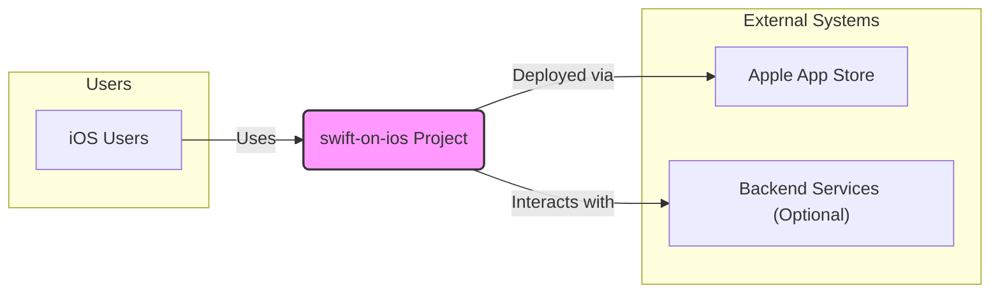
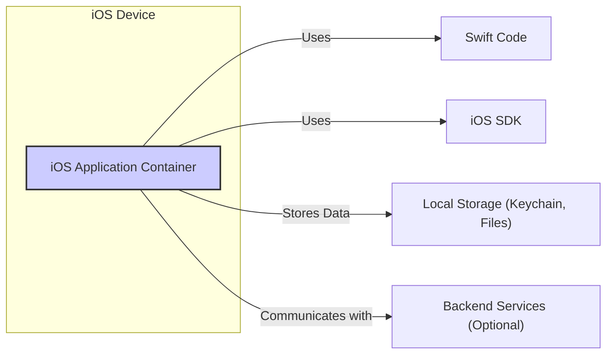
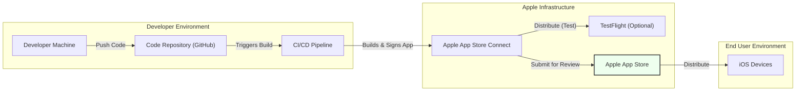

# BUSINESS POSTURE

This project, represented by the GitHub repository 'swift-on-ios', appears to be a demonstration or template project showcasing Swift development for iOS applications.  Assuming this is an example project, its primary business goal is likely educational or demonstrative, aiming to provide a starting point or reference for developers learning or using Swift for iOS development.

Business Priorities and Goals:
- Provide a clear and functional example of Swift code for iOS development.
- Demonstrate best practices in iOS development using Swift.
- Offer a reusable template or starting point for new iOS projects.
- Potentially showcase specific iOS features or libraries.

Business Risks:
- Lack of adoption or interest from the developer community if the example is not relevant or well-executed.
- Misinterpretation or misuse of the example code leading to insecure or poorly designed applications if security aspects are not properly addressed or highlighted.
- Outdatedness of the example code if not maintained with the latest Swift and iOS updates, reducing its educational value.
- Potential security vulnerabilities in the example code itself, which could be copied and pasted into real applications, leading to security issues.

# SECURITY POSTURE

Existing Security Controls:
- security control: iOS platform security features (sandboxing, code signing, app store review). Implemented by: iOS operating system and Apple App Store.
- security control: Swift language safety features (memory safety, type safety). Implemented by: Swift compiler and language design.
- security control: Secure coding practices by developers (input validation, secure data handling). Implemented by: Developers following secure coding guidelines.
- security control: Static code analysis tools (linters, SAST) can be integrated into development workflow. Implemented by: Developer tooling and CI/CD pipelines (if used).

Accepted Risks:
- accepted risk: Vulnerabilities in third-party libraries if used and not regularly updated.
- accepted risk: Developer errors leading to security vulnerabilities in the application code.
- accepted risk: Reverse engineering of the application code, common for mobile applications.
- accepted risk: Data breaches if sensitive data is stored insecurely on the device or during transmission.

Recommended Security Controls:
- security control: Implement automated static application security testing (SAST) in the CI/CD pipeline to identify potential vulnerabilities in the code.
- security control: Conduct regular dependency scanning to identify and update vulnerable third-party libraries.
- security control: Implement runtime application self-protection (RASP) techniques to detect and prevent attacks at runtime (if applicable and necessary for the application's risk profile).
- security control: Perform penetration testing or security audits to identify vulnerabilities before release.

Security Requirements:
- Authentication:
    - requirement: If the application interacts with backend services, implement secure authentication mechanisms (e.g., OAuth 2.0, token-based authentication).
    - requirement: Store authentication tokens securely on the device, using Keychain services.
- Authorization:
    - requirement: Implement proper authorization checks to ensure users can only access data and functionalities they are permitted to.
    - requirement: Follow the principle of least privilege when designing authorization models.
- Input Validation:
    - requirement: Validate all user inputs to prevent injection attacks (e.g., SQL injection, cross-site scripting if using web views).
    - requirement: Sanitize inputs before processing and displaying them.
- Cryptography:
    - requirement: Use strong and up-to-date cryptographic algorithms for data encryption and hashing.
    - requirement: Securely manage cryptographic keys, avoiding hardcoding them in the application.
    - requirement: Encrypt sensitive data at rest and in transit.

# DESIGN

## C4 CONTEXT

Context Diagram Elements:

- Element:
    - Name: iOS Users
    - Type: Person
    - Description: End-users who will install and use the 'swift-on-ios' application on their iOS devices.
    - Responsibilities: Use the application to achieve their intended goals. Provide input to the application.
    - Security controls: Device passcode/biometrics, user awareness of app permissions.

- Element:
    - Name: swift-on-ios Project
    - Type: Software System
    - Description: The iOS application developed using Swift, as represented by the GitHub repository. This is the system being designed.
    - Responsibilities: Provide functionalities as designed. Securely handle user data and interactions. Implement security controls.
    - Security controls: Input validation, authorization, secure data storage, secure communication (if applicable), code signing, adherence to iOS security guidelines.

- Element:
    - Name: Apple App Store
    - Type: External System
    - Description: Apple's official platform for distributing iOS applications to users.
    - Responsibilities: Host and distribute the application. Perform app review and security checks before publishing.
    - Security controls: App review process, code signing enforcement, platform security features.

- Element:
    - Name: Backend Services (Optional)
    - Type: External System
    - Description:  Optional backend services that the 'swift-on-ios' application might interact with for data storage, processing, or other functionalities. This is dependent on the specific features of the application.
    - Responsibilities: Provide data and services to the application. Implement backend security controls.
    - Security controls: Authentication and authorization APIs, secure data storage, network security, API security best practices.

## C4 CONTAINER

Container Diagram Elements:

- Element:
    - Name: iOS Application Container
    - Type: Container - Application
    - Description: The running iOS application on a user's device. This container encapsulates all the application's components and resources.
    - Responsibilities: Execute the application logic. Manage user interface. Handle user interactions. Store and retrieve data. Communicate with external systems. Enforce application-level security controls.
    - Security controls: Application sandboxing, input validation within the application, authorization logic, secure data storage within the container, secure communication protocols.

- Element:
    - Name: Swift Code
    - Type: Container - Code
    - Description: The Swift source code that implements the application's functionalities and logic.
    - Responsibilities: Implement the application's features. Handle data processing and manipulation. Define user interface elements and interactions.
    - Security controls: Secure coding practices, input validation logic within the code, implementation of authorization checks, proper error handling, use of secure libraries and frameworks.

- Element:
    - Name: iOS SDK
    - Type: Container - Library/Framework
    - Description: Apple's Software Development Kit for iOS, providing APIs and libraries for accessing device features and functionalities.
    - Responsibilities: Provide access to device hardware and software features. Offer pre-built UI components and functionalities. Manage system resources.
    - Security controls: Platform-level security controls provided by iOS, secure APIs, permission management.

- Element:
    - Name: Local Storage (Keychain, Files)
    - Type: Container - Data Store
    - Description: Local storage mechanisms on the iOS device used to persist application data, including Keychain for secure storage of credentials and file system for other data.
    - Responsibilities: Securely store application data locally on the device. Provide mechanisms for data retrieval and management.
    - Security controls: iOS Keychain encryption, file system permissions, data encryption at rest (if implemented by the application).

- Element:
    - Name: Backend Services (Optional)
    - Type: Container - External System
    - Description:  Optional backend services that the iOS application communicates with over the network.
    - Responsibilities: Provide data and services to the application. Handle backend data storage and processing. Implement backend security controls.
    - Security controls: API authentication and authorization, secure communication protocols (HTTPS), backend data encryption, server-side input validation.

## DEPLOYMENT

Deployment Architecture: Apple App Store Distribution

Deployment Diagram Elements:

- Element:
    - Name: Developer Machine
    - Type: Infrastructure - Workstation
    - Description: Developer's local computer used for writing code, building, and testing the application.
    - Responsibilities: Code development, local testing, building application packages.
    - Security controls: Developer workstation security (OS hardening, antivirus), code repository access controls, secure development practices.

- Element:
    - Name: Code Repository (GitHub)
    - Type: Infrastructure - Code Repository
    - Description: Version control system (GitHub) used to store and manage the application's source code.
    - Responsibilities: Source code version control, collaboration, code history tracking.
    - Security controls: Access control to the repository, branch protection, audit logs, secure communication (HTTPS, SSH).

- Element:
    - Name: CI/CD Pipeline
    - Type: Infrastructure - Automation Server
    - Description: Continuous Integration and Continuous Delivery pipeline (e.g., GitHub Actions, Jenkins) used to automate the build, test, and deployment process.
    - Responsibilities: Automated building, testing, code analysis, signing, and deployment of the application.
    - Security controls: Secure pipeline configuration, access control to pipeline resources, secure build environment, secrets management, automated security scans (SAST, dependency scanning).

- Element:
    - Name: Apple App Store Connect
    - Type: Infrastructure - Distribution Platform
    - Description: Apple's platform for managing and submitting applications to the App Store.
    - Responsibilities: Application management, TestFlight distribution, App Store submission, app metadata management.
    - Security controls: Apple's platform security, access control, secure communication (HTTPS).

- Element:
    - Name: TestFlight (Optional)
    - Type: Infrastructure - Beta Distribution
    - Description: Apple's beta testing platform for distributing pre-release versions of the application to testers.
    - Responsibilities: Beta testing distribution, feedback collection.
    - Security controls: Apple's platform security, access control, limited distribution.

- Element:
    - Name: Apple App Store
    - Type: Infrastructure - Public App Store
    - Description: Apple's public marketplace for distributing iOS applications to end-users.
    - Responsibilities: Public distribution of the application, app discovery, updates.
    - Security controls: App review process, code signing enforcement, platform security features.

- Element:
    - Name: iOS Devices
    - Type: Infrastructure - End User Devices
    - Description: End-users' iPhones and iPads where the application is installed and run.
    - Responsibilities: Run the application, provide user input, store application data.
    - Security controls: Device passcode/biometrics, iOS platform security features, app sandboxing.

## BUILD

Build Process Diagram:

```mermaid
flowchart LR
    A["Developer"] --> B["Code Changes"]
    B --> C["Code Repository (GitHub)"]
    C --> D["CI/CD Pipeline (GitHub Actions)"]
    D --> E["Build & Test"]
    E --> F["Static Analysis (SAST, Linters)"]
    F --> G["Dependency Scan"]
    G --> H["Code Signing"]
    H --> I["Build Artifact (IPA)"]
    I --> J["Apple App Store Connect"]
    style I fill:#cdf,stroke:#333,stroke-width:2px
```

Build Process Description:

1. Developer: Developers write and modify Swift code for the iOS application.
2. Code Changes: Developers commit and push code changes to the code repository.
3. Code Repository (GitHub): GitHub stores the source code and triggers the CI/CD pipeline upon code changes.
4. CI/CD Pipeline (GitHub Actions): GitHub Actions is used as the CI/CD pipeline to automate the build process.
5. Build & Test: The pipeline builds the iOS application using Xcode build tools and runs automated unit and UI tests.
6. Static Analysis (SAST, Linters): Static Application Security Testing (SAST) tools and linters are used to analyze the code for potential security vulnerabilities and code quality issues.
7. Dependency Scan: The pipeline scans project dependencies to identify known vulnerabilities in third-party libraries.
8. Code Signing: The application is code-signed with Apple Developer certificates to ensure integrity and authenticity.
9. Build Artifact (IPA): The build process produces an IPA (iOS App Package) file, which is the distributable package for iOS applications.
10. Apple App Store Connect: The IPA file is uploaded to Apple App Store Connect for distribution through TestFlight or the App Store.

Build Security Controls:
- security control: Secure access control to the code repository and CI/CD pipeline.
- security control: Use of secure build environments and hardened build agents.
- security control: Implementation of static application security testing (SAST) and linters in the pipeline.
- security control: Automated dependency scanning to identify and manage vulnerable dependencies.
- security control: Secure storage and management of code signing certificates and provisioning profiles.
- security control: Audit logging of build process activities.
- security control: Code review process before merging code changes to the main branch.

# RISK ASSESSMENT

Critical Business Processes:
- Providing a functional and secure example of Swift iOS development for educational purposes.
- Maintaining the integrity and security of the example code to prevent misuse in real-world applications.
- Ensuring the example remains relevant and up-to-date with current iOS development practices.

Data Sensitivity:
- The example project itself likely does not handle sensitive user data.
- However, if the example is extended or used as a template for real applications, the data sensitivity will depend on the specific application's functionality.
- For the example project, the primary data to protect is the source code itself and the integrity of the build artifacts to prevent malicious modifications.

Data to Protect and Sensitivity:
- Source Code: High sensitivity - Intellectual property, potential vulnerabilities if exposed or modified maliciously.
- Build Artifacts (IPA): Medium sensitivity - Integrity is important to ensure users download the intended application.
- Developer Credentials and Signing Certificates: High sensitivity - Critical for maintaining the integrity and authenticity of the application.
- CI/CD Pipeline Configuration: Medium sensitivity - Misconfiguration could lead to security vulnerabilities in the build process.

# QUESTIONS & ASSUMPTIONS

Questions:
- Is this project intended purely as an educational example, or is it meant to be a starting point for a real application?
- Are there any specific features or functionalities that are considered high priority for this project?
- Are there any specific compliance requirements or industry standards that this project needs to adhere to?
- Are there any plans to integrate backend services or handle user data in the future?
- What is the expected lifespan and maintenance plan for this project?

Assumptions:
- BUSINESS POSTURE: Assumed to be primarily educational/demonstrative.
- SECURITY POSTURE: Assumed a standard secure software development lifecycle and deployment model for iOS applications. Assumed no specific sensitive data handling in the example project itself.
- DESIGN: Assumed a typical iOS application architecture without complex backend integrations for this example. Assumed deployment via Apple App Store as the primary distribution method.