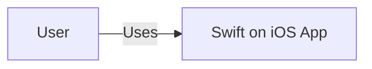
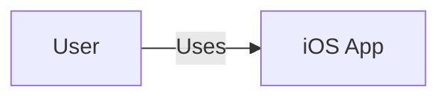
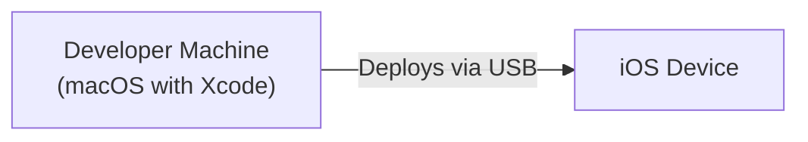
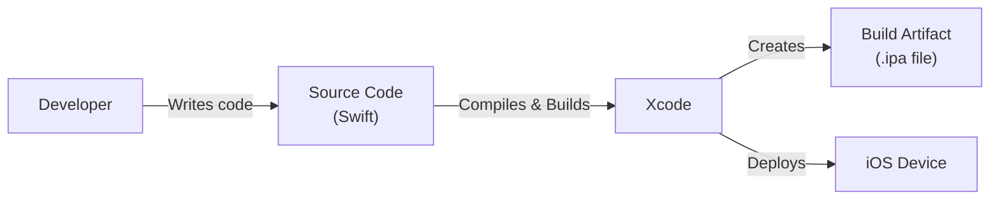

Okay, let's create a design document for the provided GitHub repository.

# BUSINESS POSTURE

Business Priorities and Goals:

*   Provide a functional example of using Swift programming language on iOS.
*   Demonstrate a simple "Hello World" application.
*   Serve as a basic template or starting point for iOS development with Swift.
*   Educational purpose: help developers learn the basics of Swift on iOS.

Most Important Business Risks:

*   The application might contain vulnerabilities that could be exploited, although the impact is likely low given its simplicity.
*   The example code might be outdated, leading to compatibility issues or promoting insecure practices.
*   Lack of documentation could hinder understanding and adoption.

# SECURITY POSTURE

Existing Security Controls:

*   security control: The project uses Swift, a memory-safe language, which inherently protects against many common vulnerabilities like buffer overflows. (Source code)
*   security control: The project is a simple "Hello World" application, minimizing the attack surface. (Source code)

Accepted Risks:

*   accepted risk: The project does not implement explicit security controls beyond the inherent safety of Swift.
*   accepted risk: The project may not follow all the latest security best practices for iOS development, as it's a very basic example.
*   accepted risk: The project does not include any input validation, as there is no user input.

Recommended Security Controls:

*   security control: Integrate a Static Application Security Testing (SAST) tool into the build process to identify potential vulnerabilities early.
*   security control: If the project evolves to include user input or network communication, implement appropriate input validation and output encoding.
*   security control: Consider using a dependency management system (like Swift Package Manager) and regularly update dependencies to address known vulnerabilities.
*   security control: Add code signing to ensure the integrity of the application.

Security Requirements:

*   Authentication: Not applicable for this simple "Hello World" application.
*   Authorization: Not applicable for this simple "Hello World" application.
*   Input Validation: Not applicable, as there is no user input.
*   Cryptography: Not applicable for this simple "Hello World" application.

# DESIGN

## C4 CONTEXT

Element Description:

*   User
    *   Name: User
    *   Type: Person
    *   Description: A person interacting with the iOS device.
    *   Responsibilities: Runs the "Swift on iOS" application.
    *   Security controls: None (relies on the device's security).
*   Swift on iOS App
    *   Name: Swift on iOS App
    *   Type: Software System
    *   Description: A simple "Hello World" application written in Swift.
    *   Responsibilities: Displays "Hello World" on the screen.
    *   Security controls: Leverages Swift's memory safety features.

## C4 CONTAINER

Element Description:

*   User
    *   Name: User
    *   Type: Person
    *   Description: A person interacting with the iOS device.
    *   Responsibilities: Runs the "Swift on iOS" application.
    *   Security controls: None (relies on the device's security).
*   iOS App
    *   Name: iOS App
    *   Type: Mobile App
    *   Description: The compiled Swift code running as an iOS application.
    *   Responsibilities: Displays "Hello World" on the screen.
    *   Security controls: Leverages Swift's memory safety features; runs within the iOS sandbox.

## DEPLOYMENT

Possible deployment solutions:

1.  Direct deployment to a physical iOS device via Xcode.
2.  Deployment via TestFlight for beta testing.
3.  Deployment to the App Store for public release.

Chosen solution (for detailed description): Direct deployment to a physical iOS device via Xcode.

Element Description:

*   Developer Machine
    *   Name: Developer Machine
    *   Type: Development Environment
    *   Description: A macOS machine with Xcode installed.
    *   Responsibilities: Compiles the Swift code, builds the iOS application, and deploys it to the connected iOS device.
    *   Security controls: Relies on macOS security features; Xcode code signing.
*   iOS Device
    *   Name: iOS Device
    *   Type: Mobile Device
    *   Description: A physical iPhone or iPad.
    *   Responsibilities: Runs the deployed iOS application.
    *   Security controls: iOS sandbox, operating system security features.

## BUILD

The build process involves using Xcode on a macOS machine.

Build Process Description:

1.  Developer writes Swift code.
2.  The code is compiled and built using Xcode.
3.  Xcode creates a build artifact (.ipa file).
4.  Xcode can deploy the .ipa file to a connected iOS device or prepare it for distribution.

Security Controls in Build Process:

*   security control: Xcode's built-in compiler performs static analysis and provides warnings/errors for potential issues.
*   security control: Code signing with a developer certificate ensures the app's integrity and authenticity (during deployment).
*   security control: (Recommended) Integrate a SAST tool into the Xcode build process or a separate CI/CD pipeline.

# RISK ASSESSMENT

Critical Business Processes:

*   Demonstrating a basic Swift application on iOS.
*   Providing a starting point for learning.

Data Protection:

*   There is no sensitive data handled by this application. The application does not collect, store, or transmit any user data.

# QUESTIONS & ASSUMPTIONS

Questions:

*   Will this application be extended in the future to include more features (user input, network communication, etc.)?
*   What is the target audience for this example (beginner developers, experienced developers)?
*   Is there a specific version of iOS or Swift that this example should target?

Assumptions:

*   BUSINESS POSTURE: The primary goal is education and demonstration, not production use.
*   SECURITY POSTURE: The application is assumed to be low-risk due to its simplicity. No sensitive data is handled.
*   DESIGN: The deployment model is assumed to be direct deployment via Xcode for development and testing purposes. The build process relies on Xcode's built-in capabilities.