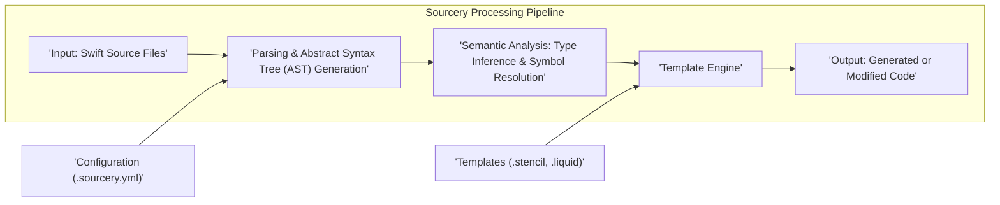

## Project Design Document: Sourcery - Code Analysis and Refactoring Tool

**Version:** 1.1
**Date:** October 26, 2023
**Author:** Gemini (AI Language Model)

### 1. Introduction

This document provides a detailed architectural design for Sourcery, a powerful command-line tool designed for Swift code analysis and generation. Based on the project available at [https://github.com/krzysztofzablocki/sourcery](https://github.com/krzysztofzablocki/sourcery), this document aims to clearly articulate the system's structure, components, and data flow. It serves as a crucial foundation for subsequent security threat modeling and architectural discussions. This document focuses on providing a comprehensive overview suitable for security architects and developers alike.

### 2. Goals and Objectives

Sourcery is designed with the following primary objectives:

*   **Automated Code Generation:** To reduce boilerplate code by automatically generating Swift code based on predefined templates and code analysis.
*   **Coding Standard Enforcement:** To facilitate adherence to project-specific coding standards through customizable rules and automated code modification.
*   **Improved Code Maintainability:** By automating repetitive tasks and ensuring consistency, Sourcery aims to enhance the long-term maintainability and readability of Swift codebases.
*   **Extensibility and Customization:** To offer a flexible platform where users can define custom analysis logic and code generation patterns through templates and configuration.

### 3. Scope

This design document focuses on the core architectural elements of the Sourcery command-line interface (CLI). It details the interactions between input source code, configuration, templates, and the output generated by the tool. While acknowledging the existence of potential integrations (like IDE extensions), this document primarily addresses the standalone CLI execution flow. Specific refactoring rules, template syntax details, and the intricacies of the Swift parsing library are considered implementation details and are not the primary focus here.

### 4. High-Level Architecture

Sourcery operates as a pipeline, processing Swift source code through a series of distinct stages driven by configuration and templates.

**Key Architectural Components:**

*   **Input: Swift Source Files:** The entry point for Sourcery, consisting of Swift code files or directories specified by the user.
*   **Configuration (.sourcery.yml):** A YAML file that dictates Sourcery's behavior, including input and output paths, template locations, and custom parameters. This acts as the control plane for the tool.
*   **Parsing & Abstract Syntax Tree (AST) Generation:**  This component is responsible for analyzing the input Swift code and constructing a hierarchical representation of its structure, the AST. This is a crucial step for understanding the code's syntax.
*   **Semantic Analysis: Type Inference & Symbol Resolution:** Building upon the AST, this stage infers the types of variables, functions, and expressions. It also resolves symbols (names) to their corresponding declarations, providing a deeper understanding of the code's meaning.
*   **Templates (.stencil, .liquid):** Files written in templating languages (such as Stencil or Liquid) that define the logic for generating or modifying code based on the information extracted during the analysis phases. These are the blueprints for code transformation.
*   **Template Engine:** This component takes the output of the semantic analysis (essentially a structured representation of the code's information) and the templates as input. It executes the template logic, using the code information to produce the desired output.
*   **Output: Generated or Modified Code:** The final result of Sourcery's processing – new Swift code generated according to the templates or modifications applied to the original source code.

### 5. Component Details

This section provides a more granular view of each component's functionality and responsibilities:

*   **Input Handling Module:**
    *   Accepts file paths and directory paths as command-line arguments, defining the scope of the analysis.
    *   Implements logic to recursively traverse directories to locate all relevant Swift source files.
    *   Reads the content of these files into memory for subsequent processing.
    *   Involves interaction with the operating system's file system API, requiring appropriate permissions.

*   **Configuration Management Module:**
    *   Locates and loads `.sourcery.yml` configuration files from the project directory or user-specified locations.
    *   Parses the YAML structure to extract configuration parameters, such as input/output paths and template locations.
    *   Provides default configuration values when explicit settings are not provided, ensuring a functional baseline.

*   **Parsing and AST Generation Module:**
    *   Employs a Swift parser library (likely leveraging SwiftSyntax or a similar technology) to analyze the raw Swift source code.
    *   Constructs an Abstract Syntax Tree (AST), a tree-like representation of the code's syntactic structure.
    *   The AST nodes represent elements like classes, functions, variables, and expressions, capturing the code's grammar.

*   **Semantic Analysis Module:**
    *   Traverses the generated AST to perform type inference, determining the data types of variables and expressions.
    *   Resolves symbols, linking identifiers (names) to their corresponding declarations within the code's scope.
    *   Builds a symbol table or similar data structure to store and manage the semantic information extracted from the code.

*   **Template Processing Engine Module:**
    *   Integrates with templating engines like Stencil and Liquid, allowing users to define code generation logic using familiar syntax.
    *   Provides mechanisms for templates to access the structured information derived from the semantic analysis (e.g., class names, properties, function signatures).
    *   Executes the template logic, performing operations like loops, conditional statements, and variable substitutions to generate the desired code output.

*   **Output Generation Module:**
    *   Formats the code generated by the template engine according to predefined formatting rules or template-specific instructions.
    *   Writes the generated or modified code to the specified output files or directories.
    *   Handles file creation, overwriting of existing files, and potential error conditions related to file system operations.

### 6. Data Flow

The execution flow of Sourcery involves a sequential processing of data through its components:

1. **Initialization:** The user invokes the Sourcery CLI, providing input paths, template paths, and potentially configuration overrides.
2. **Configuration Loading:** Sourcery loads configuration settings from `.sourcery.yml` files, establishing the operational parameters.
3. **Input Discovery:** Based on the configured input paths, Sourcery identifies the Swift source files to be processed.
4. **Parsing and AST Generation:** Each identified Swift file is parsed, resulting in the creation of an Abstract Syntax Tree (AST) representing its structure.
5. **Semantic Analysis:** The AST is analyzed to infer types and resolve symbols, creating a rich semantic model of the code.
6. **Template Loading:** Sourcery loads the specified template files, which contain the instructions for code generation or modification.
7. **Template Processing:** The template engine receives the semantic model of the code and the templates. It executes the template logic, using the code information to generate the desired output.
8. **Output Generation:** The generated code is formatted and written to the designated output locations.
9. **Completion:** Sourcery reports the success or failure of the operation, along with any encountered errors.

```mermaid
flowchart LR
    A["'User Invokes Sourcery CLI'"] --> B["'Load Configuration (.sourcery.yml)'"];
    B --> C["'Discover Input Swift Files'"];
    C --> D["'Parse Swift Files & Generate AST'"];
    D --> E["'Perform Semantic Analysis (Type Inference, Symbol Resolution)'"];
    E --> F["'Load Templates'"];
    F --> G["'Process Templates with Semantic Data'"];
    G --> H["'Generate Output Code'"];
    H --> I["'Write Output to Files'"];
```

### 7. Security Considerations (Pre-Threat Modeling)

Even before a formal threat modeling exercise, several potential security considerations are apparent in Sourcery's design:

*   **Input Validation Vulnerabilities:**  Maliciously crafted Swift source files could potentially exploit vulnerabilities in the parsing or semantic analysis stages, leading to denial-of-service or unexpected behavior.
*   **Template Injection Risks:** If users can provide arbitrary templates, there's a significant risk of code injection. Malicious templates could execute arbitrary code on the system running Sourcery, potentially compromising sensitive data or the system itself.
*   **File System Security:** Sourcery requires read access to input files and write access to output locations. Improperly configured permissions or vulnerabilities in path handling could lead to unauthorized access or modification of files outside the intended scope.
*   **Configuration Injection Attacks:** If the `.sourcery.yml` configuration file parsing is not robust, malicious users might inject harmful configurations that alter Sourcery's behavior in unintended and potentially harmful ways.
*   **Dependency Chain Security:** Sourcery relies on external libraries for parsing and templating. Vulnerabilities in these dependencies could be exploited if not properly managed and updated.
*   **Information Disclosure:** Error messages or logging might inadvertently reveal sensitive information about the codebase or the system's internal workings.

### 8. Deployment

Sourcery is typically deployed as a command-line tool, which means it is generally:

*   Installed locally on a developer's machine, providing on-demand code generation capabilities.
*   Integrated into Continuous Integration/Continuous Deployment (CI/CD) pipelines to automate code generation as part of the build process.

The deployment environment can vary, including macOS, Linux, and potentially Windows, each with its own security context and considerations.

### 9. Future Considerations

Potential future enhancements that could impact the architecture and security profile of Sourcery include:

*   **Enhanced IDE Integration:** Deeper integration with Integrated Development Environments (IDEs) could introduce new attack vectors if not implemented securely.
*   **Web-Based Interface:** Offering a web interface for configuring and running Sourcery would introduce web application security concerns, such as cross-site scripting (XSS) and cross-site request forgery (CSRF).
*   **Plugin Architecture:** Allowing developers to create and install plugins could introduce risks associated with third-party code execution and the need for robust plugin sandboxing.

This design document provides a solid foundation for understanding the architecture of Sourcery and serves as a valuable resource for conducting a comprehensive threat modeling exercise. The identified components, data flow, and preliminary security considerations highlight key areas that require further scrutiny to ensure the tool's security and integrity.