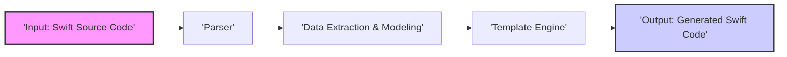

## Project Design Document: Sourcery - Swift Code Generation Tool

**Project Name:** Sourcery

**Project URL:** [https://github.com/krzysztofzablocki/sourcery](https://github.com/krzysztofzablocki/sourcery)

**Document Version:** 1.1
**Date:** 2023-10-27
**Author:** AI Software Architect

### 1. Introduction

Sourcery is a command-line tool designed to automate Swift code generation, significantly boosting developer productivity and reducing boilerplate code. It achieves this by parsing Swift source code, extracting detailed structural information, and then applying user-defined templates to generate new Swift code. This generated code can serve various purposes, including:

*   **Boilerplate Reduction:** Automating the creation of repetitive code structures for protocols, enums, and data models.
*   **Testing Support:** Generating mocks, stubs, and fakes to streamline unit and integration testing.
*   **Data Handling:** Implementing serialization, deserialization, and data transformation logic automatically.
*   **Feature Generation:**  Creating code based on custom annotations, attributes, or domain-specific rules.
*   **API Client Generation:**  Potentially generating client-side code from API definitions (though this is not a primary advertised feature, it's within its capabilities).

This document provides a comprehensive design overview of Sourcery, detailing its architecture, key components, data flow, technology stack, and deployment model.  It is specifically created to serve as a basis for future threat modeling and security analysis.

### 2. System Architecture

Sourcery operates as a pipeline, processing Swift source code through distinct stages to achieve code generation. The following diagram illustrates the high-level architecture:

**Key Components:**

*   **Input: Swift Source Code:** The initial input to Sourcery, consisting of Swift files from a project. These files are the source of information for code generation.
*   **Parser:**  Responsible for analyzing the input Swift code and converting it into a structured, computer-readable format. This typically involves creating an Abstract Syntax Tree (AST).
*   **Data Extraction & Modeling:** This component processes the parsed code (AST) to extract relevant structural and semantic information. It then organizes this information into an internal data model that is easily accessible and usable by the Template Engine. This stage is crucial for making the Swift code's structure available for template-based generation.
*   **Template Engine:** The core of Sourcery's code generation process. It takes user-defined templates and the extracted data model as input. It processes the templates, substituting data from the model into placeholders within the templates to generate the final Swift code.
*   **Output: Generated Swift Code:** The final product of Sourcery. This is the Swift code generated by the Template Engine, ready to be integrated back into the Swift project.

### 3. Component Details

#### 3.1. Input: Swift Source Code

*   **Description:** The starting point of the Sourcery workflow. A collection of Swift source files that Sourcery will analyze.
*   **Functionality:** Provides the raw Swift code that will be parsed and processed.
*   **Input Format:** Plain text files containing valid Swift code syntax.
*   **Source:** Typically specified by the user via:
    *   Command-line arguments.
    *   Configuration files (e.g., `.sourcery.yml`).
    *   Project settings.
*   **Example Input:** Swift files defining classes, structs, enums, protocols, etc. within a project directory.

#### 3.2. Parser

*   **Description:**  The component responsible for transforming raw Swift source code into a structured representation.
*   **Functionality:**
    *   **Lexical Analysis:** Breaks down the input stream of characters into tokens (keywords, identifiers, operators, etc.).
    *   **Syntax Analysis:**  Organizes tokens into a hierarchical structure based on Swift grammar rules, creating an Abstract Syntax Tree (AST).
    *   **Error Handling:** Detects and potentially reports syntax errors in the input Swift code (though primary focus is on structural understanding, not full compilation).
*   **Technology:**  Likely leverages:
    *   **SwiftSyntax:** Apple's official Swift parser library, providing accurate and up-to-date parsing capabilities.
    *   Potentially other Swift parsing libraries or custom parsing logic for specific edge cases or optimizations.
*   **Output Format:** An Abstract Syntax Tree (AST) or a similar structured representation of the Swift code's syntax and structure.

#### 3.3. Data Extraction & Modeling

*   **Description:**  This component extracts meaningful information from the AST and organizes it into a structured data model for template processing.
*   **Functionality:**
    *   **AST Traversal:**  Navigates the AST to identify and locate relevant code elements.
    *   **Information Extraction:** Extracts details about:
        *   Types: Classes, Structs, Enums, Protocols, Type Aliases.
        *   Members: Properties, Variables, Constants, Methods, Functions, Initializers.
        *   Attributes and Annotations:  `@` attributes, comments used as annotations.
        *   Relationships: Inheritance, Protocol Conformance, Associated Types.
        *   Generics, Access Control, and other Swift language features.
    *   **Data Modeling:** Structures the extracted information into an in-memory data model. This model is designed for efficient access and querying by the Template Engine.
*   **Data Model Structure:**  Likely uses a graph-based or object-oriented model to represent Swift code elements and their relationships. This allows templates to easily navigate and access the extracted data.
*   **Example Data:**  The data model might contain objects representing classes, with properties listing their names, properties, methods, and inherited types.

#### 3.4. Template Engine

*   **Description:** The core code generation engine that combines user-defined templates with the extracted data model to produce Swift code.
*   **Functionality:**
    *   **Template Parsing:** Reads and parses user-provided templates written in a templating language.
    *   **Template Interpretation:**  Understands the syntax and logic of the templating language.
    *   **Data Binding:** Connects template placeholders and logic to the extracted data model.
    *   **Code Generation Logic:** Executes template logic (loops, conditionals, filters, custom tags/helpers) and substitutes data into placeholders.
    *   **Output Formatting:**  Formats the generated Swift code according to template specifications and potentially default formatting rules.
*   **Template Language:**  Commonly uses:
    *   **Stencil:** A Swift-based templating engine inspired by Django and Jinja2, offering a familiar and powerful syntax.
    *   Potentially other templating engines or a custom-built engine.
*   **Template Customization:** Users have full control over the generated code structure and content by defining their own templates. This provides significant flexibility and customization.

#### 3.5. Output: Generated Swift Code

*   **Description:** The final output of Sourcery – the generated Swift code ready for use in a project.
*   **Functionality:**
    *   **Code Formatting:** Applies formatting to the generated Swift code to ensure readability and consistency (e.g., indentation, spacing).
    *   **File Output:** Writes the generated code to specified output files.
    *   **File Handling:** Supports options for:
        *   Creating new files.
        *   Overwriting existing files.
        *   Appending to existing files (less common for code generation).
    *   **Logging and Feedback:** Provides information about the generation process, including success, warnings, or errors.
*   **Output Format:** Plain text files containing valid Swift code.
*   **Output Destination:** Configurable by the user, typically a directory within the Swift project or a separate output location.

### 4. Data Flow

The data flows through Sourcery in a sequential manner, transforming input Swift code into generated output:

1.  **Swift Source Code Input:** Sourcery begins by receiving Swift source code files as input, based on user configuration.
2.  **Parsing to AST:** The Parser component processes the input Swift code and converts it into an Abstract Syntax Tree (AST), representing the code's structure.
3.  **Data Extraction and Modeling:** The Data Extraction & Modeling component analyzes the AST, extracts relevant information about Swift code elements, and organizes it into a structured data model.
4.  **Template Processing and Code Generation:** The Template Engine takes user-defined templates and the structured data model. It processes the templates, using the data model to generate Swift code.
5.  **Generated Swift Code Output:**  Finally, Sourcery outputs the generated Swift code to files, completing the code generation process.

### 5. Technology Stack

*   **Primary Language:** Swift - Sourcery is primarily developed in Swift, leveraging the language's features and ecosystem.
*   **Parsing:**
    *   **SwiftSyntax:**  Likely the primary parsing library for Swift code analysis.
*   **Templating:**
    *   **Stencil:** A popular Swift templating engine, often used for code generation in Swift projects.
*   **Configuration:**
    *   **YAML:**  Commonly used for configuration files (e.g., `.sourcery.yml`) due to its human-readable format.
    *   Potentially JSON or other configuration formats.
*   **Build Tool Integration:**
    *   Designed for integration with Swift build systems like Xcode and Swift Package Manager (SPM).
*   **Dependency Management:**
    *   Swift Package Manager (SPM) is likely used to manage Sourcery's dependencies.

### 6. Deployment Model

Sourcery is deployed as a command-line interface (CLI) tool.

*   **Installation Methods:**
    *   **Homebrew:**  A common package manager for macOS, often used to install Sourcery (`brew install sourcery`).
    *   **Mint:** A Swift package manager for command-line tools (`mint install Sourcery`).
    *   **Manual Build:** Building from source code directly from the GitHub repository.
*   **Execution Environment:**
    *   Executed locally on developer workstations.
    *   Integrated into CI/CD pipelines for automated code generation as part of the build process.
*   **Integration Points:**
    *   **Xcode Build Phases:**  Sourcery can be added as a build phase in Xcode projects to run automatically during builds.
    *   **Swift Package Manager Build Scripts:**  Integrated into SPM projects using build scripts.
    *   **Command-line execution:** Run directly from the command line for ad-hoc code generation.
*   **Configuration Management:**
    *   **Command-line arguments:**  Passing configuration options directly when running Sourcery.
    *   **Configuration Files:** Using YAML files (e.g., `.sourcery.yml`) to define project-specific settings.

### 7. Security Considerations for Threat Modeling

This section outlines potential security considerations relevant to threat modeling Sourcery. These are categorized for clarity:

#### 7.1. Template Security

*   **Template Injection Vulnerabilities:**
    *   **Threat:** If user-provided data or extracted data is directly embedded into templates without proper escaping or sanitization, it could lead to template injection. Attackers might manipulate templates to execute arbitrary code on the server or access sensitive data if Sourcery were used in a server-side context (less likely for a CLI tool, but still a principle to consider in template design).
    *   **Mitigation:**
        *   **Context-Aware Output Encoding:** Use templating engines that automatically handle output encoding based on the context (e.g., HTML escaping, JavaScript escaping).
        *   **Input Validation and Sanitization:** Validate and sanitize any user-provided data or extracted data before using it in templates, especially if it originates from untrusted sources.
        *   **Principle of Least Privilege in Templates:** Limit the capabilities of templates. Avoid allowing templates to execute arbitrary system commands or access sensitive resources directly.
*   **Template Logic Complexity:**
    *   **Threat:** Overly complex template logic can be harder to audit for security vulnerabilities and might introduce unexpected behavior.
    *   **Mitigation:**
        *   **Keep Templates Simple and Focused:** Design templates to be clear, concise, and focused on code generation. Avoid excessive logic within templates.
        *   **Template Code Review:**  Conduct code reviews of templates, especially complex ones, to identify potential security issues or logic flaws.

#### 7.2. Input Validation and Processing

*   **Malicious Swift Source Code Input:**
    *   **Threat:**  If Sourcery is used in an environment where it processes Swift code from untrusted sources, malicious Swift code could potentially exploit vulnerabilities in the Parser or Data Extraction components, leading to denial-of-service, crashes, or unexpected behavior.
    *   **Mitigation:**
        *   **Robust Parser and Error Handling:** Ensure the Parser is robust and can handle malformed or unexpected Swift code gracefully without crashing or exhibiting undefined behavior. Implement thorough error handling.
        *   **Input Sanitization (Limited Applicability for Code):** While direct sanitization of code is complex, ensure that the parsing process itself is secure and doesn't introduce vulnerabilities.
        *   **Sandboxing (If applicable):** If Sourcery were to be used in a server-side or sandboxed environment, consider running the parsing and code generation processes in a restricted environment to limit the impact of potential vulnerabilities.
*   **Configuration File Vulnerabilities:**
    *   **Threat:** If configuration files (e.g., `.sourcery.yml`) are parsed insecurely, malicious actors could potentially inject malicious data into these files to manipulate Sourcery's behavior or gain unauthorized access.
    *   **Mitigation:**
        *   **Secure Configuration Parsing:** Use secure and well-vetted libraries for parsing configuration files (YAML, JSON, etc.).
        *   **Input Validation for Configuration:** Validate configuration data to ensure it conforms to expected formats and values.
        *   **Restrict Access to Configuration Files:** Limit write access to configuration files to authorized users and processes.

#### 7.3. Dependency Management

*   **Dependency Vulnerabilities:**
    *   **Threat:** Sourcery relies on external libraries (SwiftSyntax, Stencil, etc.). Vulnerabilities in these dependencies could indirectly affect Sourcery's security.
    *   **Mitigation:**
        *   **Regular Dependency Updates:** Keep dependencies up-to-date with the latest versions to patch known vulnerabilities.
        *   **Dependency Scanning:** Use dependency scanning tools to identify potential vulnerabilities in dependencies.
        *   **Vulnerability Monitoring:** Monitor security advisories and vulnerability databases for reported issues in Sourcery's dependencies and promptly address them.

#### 7.4. Output Handling

*   **Output File Overwriting Risks:**
    *   **Threat:** If Sourcery is configured to overwrite existing files, and if output paths are not carefully controlled, there's a potential risk of accidentally overwriting important files. This is more of a data integrity/availability risk than a direct security vulnerability, but worth considering in a threat model.
    *   **Mitigation:**
        *   **Clear Output Path Configuration:** Ensure users clearly understand and control where Sourcery outputs generated files.
        *   **Backup Mechanisms:** Encourage users to have backup mechanisms in place for important files, especially when using file overwriting features.
        *   **Confirmation Prompts (Optional):**  Consider adding confirmation prompts or warnings when Sourcery is about to overwrite existing files, especially in interactive modes.

This improved design document provides a more detailed and structured overview of Sourcery, with enhanced security considerations for threat modeling. It uses valid markdown formatting, mermaid syntax with quoted node names, and markdown lists as requested.