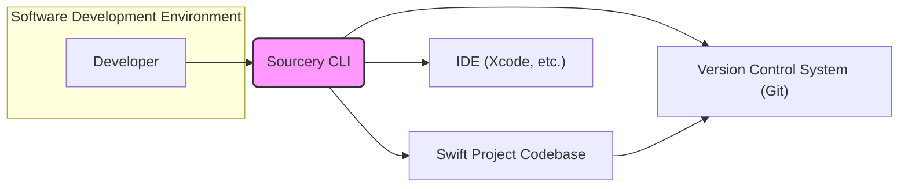
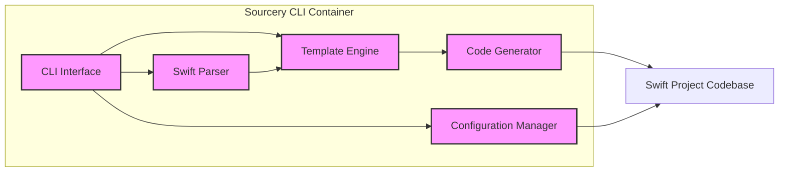
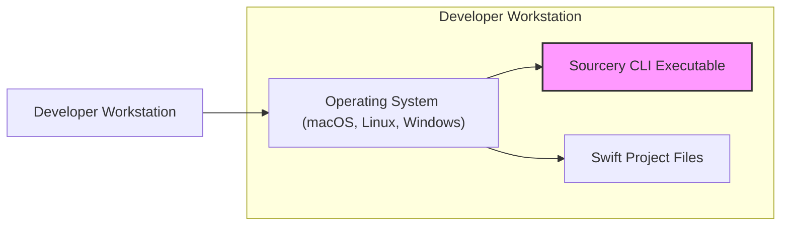
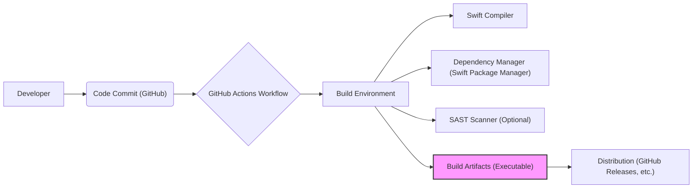

# BUSINESS POSTURE

- Business Priorities and Goals:
  - Increase developer productivity by automating repetitive code generation tasks in Swift projects.
  - Improve code consistency and reduce boilerplate code, leading to better maintainability.
  - Enable developers to focus on higher-level logic and business problems instead of manual code generation.
- Business Risks:
  - Risk of introducing bugs through generated code if Sourcery's parsing or template logic is flawed.
  - Potential for increased complexity if code generation is overused or templates are poorly designed, making debugging and understanding harder.
  - Dependency on Sourcery for code generation might create a single point of failure in development workflows if the tool becomes unavailable or has issues.
  - Risk of developers misusing Sourcery, leading to inconsistent coding styles or unintended code changes if not properly configured and used.

# SECURITY POSTURE

- Existing Security Controls:
  - security control: Open Source Code - The project is open source, allowing for community review and scrutiny of the codebase. Implemented in: GitHub repository.
  - security control: GitHub Security Features - Reliance on GitHub's platform security features for repository hosting, access control, and vulnerability scanning. Implemented in: GitHub platform.
  - security control: Input Validation -  Presumably, Sourcery includes input validation to parse Swift code and templates, although specific details are not provided in the repository description. Implemented in: Sourcery codebase (implementation details unknown).
- Accepted Risks:
  - accepted risk: Dependency Vulnerabilities - Potential vulnerabilities in third-party libraries and dependencies used by Sourcery.
  - accepted risk: Template Security - Risk of using untrusted or malicious templates if developers source them from unverified locations (though this is less likely in typical usage as templates are usually project-specific).
- Recommended Security Controls:
  - security control: Dependency Scanning - Implement automated dependency scanning to identify and address vulnerabilities in Sourcery's dependencies.
  - security control: Static Application Security Testing (SAST) - Integrate SAST tools into the development pipeline to automatically analyze Sourcery's codebase for potential security flaws.
  - security control: Input Validation Hardening -  Thoroughly review and harden input validation logic for Swift code and template parsing to prevent injection attacks and unexpected behavior.
  - security control: Secure Template Development Guidelines - Provide guidelines and best practices for developers on how to create secure templates, minimizing the risk of introducing vulnerabilities through generated code.
- Security Requirements:
  - Authentication: Not directly applicable as Sourcery is a command-line tool used locally by developers.
  - Authorization: Not directly applicable as Sourcery operates on files accessible to the user running it. Access control is managed by the operating system's file system permissions.
  - Input Validation: Critical for parsing Swift code and templates. Sourcery must robustly validate inputs to prevent issues like code injection or denial-of-service attacks through maliciously crafted Swift code or templates.
  - Cryptography: Not directly applicable to the core functionality of Sourcery as a code generation tool. Cryptographic requirements might be relevant if Sourcery were to handle sensitive data or secrets, which is not indicated in its current description.

# DESIGN

## C4 CONTEXT

- Context Diagram Elements:
  - - Name: Developer
    - Type: Person
    - Description: A software developer using Sourcery to automate code generation in Swift projects.
    - Responsibilities: Uses Sourcery to generate code, configures Sourcery templates, integrates generated code into Swift projects.
    - Security controls: Relies on personal workstation security practices.
  - - Name: Sourcery CLI
    - Type: Software System
    - Description: The Sourcery command-line interface tool, responsible for parsing Swift code, applying templates, and generating new Swift code.
    - Responsibilities: Code parsing, template processing, code generation, configuration management.
    - Security controls: Input validation, secure handling of templates, logging.
  - - Name: Swift Project Codebase
    - Type: Software System
    - Description: The Swift project codebase that Sourcery operates on, containing Swift source files and project configurations.
    - Responsibilities: Stores the Swift code to be processed and augmented by Sourcery.
    - Security controls: Access control via file system permissions and version control system.
  - - Name: IDE (Xcode, etc.)
    - Type: Software System
    - Description: Integrated Development Environment used by developers to write, edit, and build Swift code, including code generated by Sourcery.
    - Responsibilities: Code editing, compilation, debugging, integration with development tools.
    - Security controls: IDE security features, plugin security management.
  - - Name: Version Control System (Git)
    - Type: Software System
    - Description: A version control system (likely Git) used to manage the Swift project codebase, including both original and generated code.
    - Responsibilities: Version control, code history tracking, collaboration, backup and recovery.
    - Security controls: Authentication, authorization, access control, audit logging.

## C4 CONTAINER

- Container Diagram Elements:
  - - Name: CLI Interface
    - Type: Container - Application
    - Description: Command-line interface that accepts user commands and parameters to invoke Sourcery functionalities.
    - Responsibilities: Command parsing, argument validation, interaction with other Sourcery components, output display.
    - Security controls: Input validation of command-line arguments, logging of commands executed.
  - - Name: Swift Parser
    - Type: Container - Library
    - Description: Component responsible for parsing Swift source code into an Abstract Syntax Tree (AST) or similar intermediate representation.
    - Responsibilities: Lexical analysis, syntax analysis, error reporting during parsing.
    - Security controls: Robust input validation to handle potentially malicious or malformed Swift code, prevention of parser vulnerabilities.
  - - Name: Template Engine
    - Type: Container - Library
    - Description: Component that processes templates written in a template language (e.g., Stencil, Swig) and combines them with parsed Swift code information to generate new code.
    - Responsibilities: Template parsing, template execution, data binding between parsed code and templates.
    - Security controls: Secure template parsing to prevent template injection attacks, control over template execution environment.
  - - Name: Code Generator
    - Type: Container - Library
    - Description: Component that takes the output from the template engine and generates Swift code in text format.
    - Responsibilities: Code formatting, code generation based on template output.
    - Security controls: Output encoding to prevent code injection vulnerabilities in generated code.
  - - Name: Configuration Manager
    - Type: Container - Library
    - Description: Component that handles Sourcery's configuration, including template paths, output directories, and other settings.
    - Responsibilities: Configuration loading, configuration validation, configuration storage.
    - Security controls: Secure storage of configuration data if sensitive, validation of configuration parameters to prevent misuse.

## DEPLOYMENT

- Deployment Architecture Options:
  - Local CLI Deployment (Typical): Sourcery is typically deployed as a command-line tool installed directly on a developer's workstation. This is the most common and straightforward deployment model.
  - CI/CD Integration: Sourcery can be integrated into CI/CD pipelines to automatically generate code as part of the build process. This would involve installing Sourcery on build agents.
  - Server-Based Code Generation (Less Likely): In less common scenarios, Sourcery could potentially be deployed on a server to provide code generation as a service, although this is not the typical use case for Sourcery.

- Detailed Deployment Architecture (Local CLI Deployment):

- Deployment Diagram Elements:
  - - Name: Developer Workstation
    - Type: Deployment Environment - Physical
    - Description: The physical or virtual machine used by a software developer for coding and development tasks.
    - Responsibilities: Provides the environment for running Sourcery and developing Swift code.
    - Security controls: Workstation security policies, operating system security controls, endpoint protection software.
  - - Name: Operating System (macOS, Linux, Windows)
    - Type: Infrastructure - Software
    - Description: The operating system running on the developer's workstation, providing core system functionalities.
    - Responsibilities: Resource management, process isolation, user authentication, file system access control.
    - Security controls: OS security updates, user access control, firewall, security configurations.
  - - Name: Sourcery CLI Executable
    - Type: Deployment Unit - Executable
    - Description: The compiled and packaged Sourcery command-line executable, deployed on the developer's workstation.
    - Responsibilities: Code generation when executed by the developer.
    - Security controls: Software integrity verification (e.g., code signing), access control via file system permissions.
  - - Name: Swift Project Files
    - Type: Data - Files
    - Description: Swift project source code files, templates, and configuration files residing on the developer's workstation.
    - Responsibilities: Input data for Sourcery, storage for generated code.
    - Security controls: File system permissions, data encryption at rest (if required by workstation security policy).

## BUILD

- Build Process Description:
  - Developer commits code changes to the GitHub repository.
  - GitHub Actions workflow is triggered upon code commit.
  - Build environment is provisioned (likely a GitHub Actions runner).
  - Swift compiler compiles the Sourcery codebase.
  - Dependency manager (Swift Package Manager) resolves and downloads dependencies.
  - Optional SAST scanner performs static analysis on the codebase for security vulnerabilities.
  - Build artifacts (Sourcery CLI executable) are created.
  - Build artifacts are published for distribution (e.g., GitHub Releases, Homebrew).

- Build Diagram Elements:
  - - Name: Developer
    - Type: Person
    - Description: A developer contributing code to the Sourcery project.
    - Responsibilities: Writing code, committing code changes, initiating the build process through code commits.
    - Security controls: Developer workstation security, code review process.
  - - Name: Code Commit (GitHub)
    - Type: Process - Manual/Automated
    - Description: The action of committing code changes to the GitHub repository, triggering the CI/CD pipeline.
    - Responsibilities: Version control, change tracking, triggering automated build process.
    - Security controls: Authentication, authorization, commit signing.
  - - Name: GitHub Actions Workflow
    - Type: Automation - CI/CD
    - Description: Automated workflow defined in GitHub Actions to build, test, and publish Sourcery.
    - Responsibilities: Orchestrating the build process, running build steps, managing build environment.
    - Security controls: Workflow definition security, secrets management, access control to workflow configurations.
  - - Name: Build Environment
    - Type: Infrastructure - Virtualized
    - Description: The environment where the build process is executed, typically a virtual machine or container provided by GitHub Actions.
    - Responsibilities: Providing resources for compilation, dependency management, and testing.
    - Security controls: Secure build environment configuration, isolation from other environments.
  - - Name: Swift Compiler
    - Type: Tool - Development
    - Description: The Swift compiler used to compile the Sourcery Swift codebase into an executable.
    - Responsibilities: Code compilation, static analysis during compilation.
    - Security controls: Compiler security features, compiler version management.
  - - Name: Dependency Manager (Swift Package Manager)
    - Type: Tool - Development
    - Description: Swift Package Manager used to manage and download dependencies required by Sourcery.
    - Responsibilities: Dependency resolution, dependency download, dependency version management.
    - Security controls: Dependency integrity verification (e.g., checksums), vulnerability scanning of dependencies.
  - - Name: SAST Scanner (Optional)
    - Type: Tool - Security
    - Description: Static Application Security Testing tool used to analyze the Sourcery codebase for potential security vulnerabilities (optional but recommended).
    - Responsibilities: Static code analysis, vulnerability detection, security reporting.
    - Security controls: SAST tool configuration, vulnerability reporting and remediation process.
  - - Name: Build Artifacts (Executable)
    - Type: Artifact - Executable
    - Description: The compiled Sourcery CLI executable and other distribution files produced by the build process.
    - Responsibilities: Packaged software ready for distribution and deployment.
    - Security controls: Code signing, artifact integrity verification (e.g., checksums), secure storage of artifacts.
  - - Name: Distribution (GitHub Releases, etc.)
    - Type: Process - Distribution
    - Description: The process of making Sourcery build artifacts available to users for download and installation.
    - Responsibilities: Software distribution, release management, versioning.
    - Security controls: Secure distribution channels (HTTPS), release signing, integrity verification for downloads.

# RISK ASSESSMENT

- Critical Business Processes:
  - Swift software development process for organizations using Sourcery to enhance productivity.
  - Distribution of Sourcery software to developers.
- Data to Protect:
  - Sourcery source code (intellectual property).
  - Swift project codebases processed by Sourcery (potentially sensitive customer code).
  - Sourcery templates (potentially containing sensitive logic or configurations).
- Data Sensitivity:
  - Sourcery source code: High sensitivity (intellectual property, competitive advantage).
  - Swift project codebases: Sensitivity varies depending on the project, can be highly sensitive (confidential business logic, personal data).
  - Sourcery templates: Medium sensitivity (can contain business logic or configuration details).

# QUESTIONS & ASSUMPTIONS

- Questions:
  - Are there any specific security compliance requirements for Sourcery (e.g., SOC 2, ISO 27001)?
  - Are there any plans to integrate Sourcery with cloud-based services or platforms in the future?
  - What is the process for handling security vulnerabilities reported in Sourcery?
  - Are there any specific types of Swift projects or code patterns that Sourcery is designed to handle or explicitly avoid?
- Assumptions:
  - Sourcery is primarily used as a local command-line tool by individual developers.
  - Templates are typically created and managed by the developers using Sourcery and are project-specific.
  - The build process for Sourcery relies on GitHub Actions for CI/CD.
  - Distribution of Sourcery is primarily through GitHub Releases and potentially package managers like Homebrew.
  - Security is a consideration for the Sourcery project, but specific security measures might not be fully implemented yet.