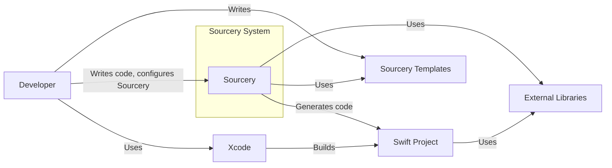
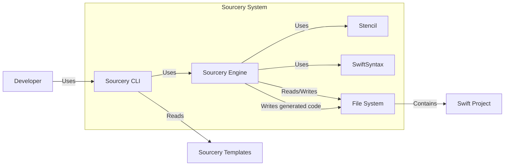
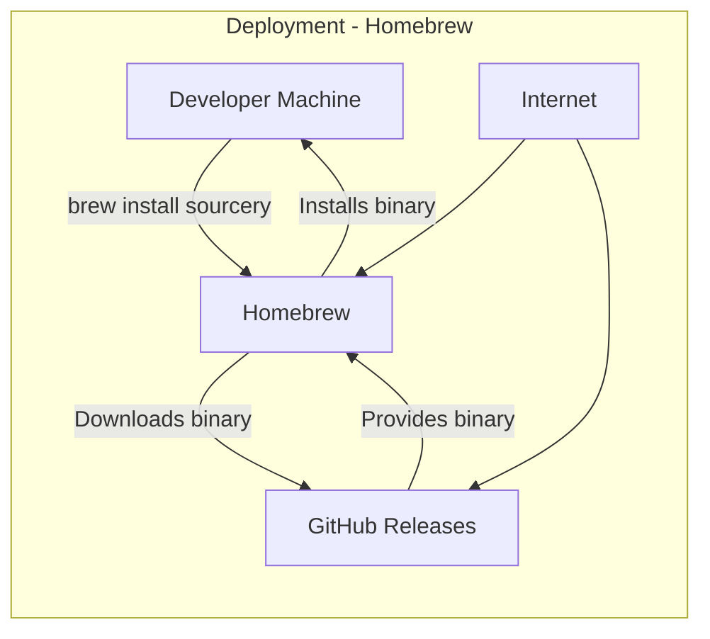

Okay, let's create a design document for Sourcery, based on the provided GitHub repository.

# BUSINESS POSTURE

Sourcery is a meta-programming tool for Swift, designed to automate repetitive coding tasks, reduce boilerplate, and improve code consistency.  It's used during development and integrated into the build process.

Priorities:

*   Maintainability:  The project must be easy to maintain and extend, given its nature as a foundational tool for other projects.
*   Reliability: Sourcery's code generation must be accurate and predictable to avoid introducing bugs into the projects that use it.
*   Performance:  Sourcery should operate efficiently to minimize its impact on build times.
*   Usability:  The tool should be easy to configure and use, with clear documentation and helpful error messages.
*   Community Adoption:  As an open-source project, wider adoption leads to more contributions, bug reports, and overall improvement.

Goals:

*   Reduce boilerplate code in Swift projects.
*   Automate common coding tasks.
*   Enforce coding standards and best practices.
*   Improve developer productivity.
*   Provide a robust and reliable code generation engine.

Business Risks:

*   Incorrect Code Generation: The most critical risk is Sourcery generating incorrect code, leading to runtime errors or unexpected behavior in applications that depend on it. This could lead to significant debugging time and potential production issues.
*   Performance Bottlenecks: If Sourcery is slow or resource-intensive, it could significantly increase build times, impacting developer productivity and potentially delaying releases.
*   Security Vulnerabilities: While Sourcery itself doesn't handle sensitive data directly, vulnerabilities in its code or dependencies could be exploited to inject malicious code into generated output, creating security risks in the applications that use it.
*   Compatibility Issues: Changes in the Swift language or Xcode could break Sourcery's functionality, requiring significant updates and potentially disrupting existing workflows.
*   Lack of Adoption: If developers don't find Sourcery useful or easy to use, it won't be adopted, limiting its impact and potentially leading to the project being abandoned.
*   Maintenance Overhead: If the codebase is difficult to maintain or extend, it could become a burden for the maintainers, slowing down development and making it harder to address bugs and feature requests.

# SECURITY POSTURE

Existing Security Controls:

*   security control: Code Reviews: The project uses pull requests on GitHub, implying that code reviews are part of the development process. (GitHub repository)
*   security control: Static Analysis: The presence of linters (SwiftLint) suggests some level of static analysis is performed. (.swiftlint.yml configuration file)
*   security control: Testing: The project has a comprehensive suite of unit and integration tests. (Tests directory)
*   security control: Dependency Management: Dependencies are managed using Swift Package Manager, which provides some level of security by allowing for version pinning and auditing. (Package.swift file)
*   security control: Continuous Integration: GitHub Actions are used for continuous integration, which can be configured to run security checks. (.github/workflows directory)

Accepted Risks:

*   accepted risk: Template Injection: Sourcery uses templates to generate code.  There's an inherent risk of template injection if user-provided templates are not handled carefully. This is partially mitigated by the Stencil template language, but care must still be taken.
*   accepted risk: Reliance on Third-Party Libraries: Sourcery depends on several third-party libraries. Vulnerabilities in these libraries could impact Sourcery's security. This is a standard risk for most software projects.
*   accepted risk: Limited Input Validation: While Sourcery parses Swift code, it may not perform extensive validation on all inputs, potentially leading to unexpected behavior or crashes.

Recommended Security Controls:

*   security control: SAST (Static Application Security Testing): Integrate a dedicated SAST tool into the CI pipeline to automatically scan for security vulnerabilities in Sourcery's code.
*   security control: SCA (Software Composition Analysis): Use an SCA tool to identify known vulnerabilities in Sourcery's dependencies and keep them up-to-date.
*   security control: Fuzz Testing: Implement fuzz testing to identify potential crashes or unexpected behavior caused by malformed input.
*   security control: Security Documentation: Create dedicated security documentation that outlines potential threats and mitigation strategies, especially regarding template injection.

Security Requirements:

*   Authentication: Not applicable, as Sourcery is a command-line tool run locally.
*   Authorization: Not applicable, as Sourcery operates with the privileges of the user running it.
*   Input Validation:
    *   Sourcery should validate the structure and syntax of input Swift files to prevent crashes or unexpected behavior.
    *   Sourcery should validate template files to mitigate the risk of template injection vulnerabilities.
    *   Configuration files should be validated to ensure they adhere to the expected schema.
*   Cryptography: Not directly applicable, as Sourcery doesn't handle sensitive data. However, if Sourcery were to interact with remote services in the future, secure communication protocols (e.g., HTTPS) should be used.
*   Output Encoding: Ensure that generated code is properly encoded to prevent potential injection vulnerabilities in the target application.

# DESIGN

## C4 CONTEXT



Elements Description:

*   Element:
    *   Name: Developer
    *   Type: Person
    *   Description: A software developer who uses Sourcery to generate code for their Swift project.
    *   Responsibilities: Writes Swift code, configures Sourcery, writes Sourcery templates, and builds the Swift project using Xcode.
    *   Security controls: Uses strong passwords, follows secure coding practices.
*   Element:
    *   Name: Sourcery
    *   Type: Software System
    *   Description: The meta-programming tool that generates Swift code.
    *   Responsibilities: Parses Swift code, processes Sourcery templates, and generates Swift code.
    *   Security controls: Input validation, template sanitization (limited), dependency management.
*   Element:
    *   Name: Swift Project
    *   Type: Software System
    *   Description: The Swift project that Sourcery is used with.
    *   Responsibilities: Contains the application logic and the generated code.
    *   Security controls: Depends on the specific project; Sourcery's output should be reviewed for security issues.
*   Element:
    *   Name: Xcode
    *   Type: Software System
    *   Description: The IDE used to develop and build Swift projects.
    *   Responsibilities: Provides a development environment, compiles code, and builds the final application.
    *   Security controls: Code signing, sandboxing (limited).
*   Element:
    *   Name: Sourcery Templates
    *   Type: Data
    *   Description: Stencil or other template files that define how Sourcery should generate code.
    *   Responsibilities: Provide the instructions for code generation.
    *   Security controls: Should be carefully reviewed for potential injection vulnerabilities.
*   Element:
    *   Name: External Libraries
    *   Type: Software System
    *   Description: Third-party libraries used by Sourcery and the Swift project.
    *   Responsibilities: Provide additional functionality.
    *   Security controls: Should be regularly updated to address known vulnerabilities.

## C4 CONTAINER



Elements Description:

*   Element:
    *   Name: Sourcery CLI
    *   Type: Container: Command-Line Interface
    *   Description: The command-line interface that developers use to interact with Sourcery.
    *   Responsibilities: Parses command-line arguments, loads configuration, and invokes the Sourcery Engine.
    *   Security controls: Input validation (limited).
*   Element:
    *   Name: Sourcery Engine
    *   Type: Container: Application
    *   Description: The core logic of Sourcery, responsible for parsing Swift code, processing templates, and generating output.
    *   Responsibilities: Parses Swift code using SwiftSyntax, processes templates using Stencil, and generates Swift code.
    *   Security controls: Input validation, template sanitization (limited).
*   Element:
    *   Name: Stencil
    *   Type: Container: Library
    *   Description: The template engine used by Sourcery.
    *   Responsibilities: Processes template files and generates output based on the provided data.
    *   Security controls: Built-in escaping mechanisms (should be used correctly).
*   Element:
    *   Name: SwiftSyntax
    *   Type: Container: Library
    *   Description: A library for parsing, inspecting, and manipulating Swift code.
    *   Responsibilities: Provides the AST (Abstract Syntax Tree) representation of the Swift code.
    *   Security controls: Relies on the security of the Swift compiler and runtime.
*   Element:
    *   Name: File System
    *   Type: Container: File System
    *   Description: The file system where Sourcery reads input files and writes output files.
    *   Responsibilities: Stores input files (Swift code, templates, configuration) and output files (generated code).
    *   Security controls: Operating system file permissions.
*   Element:
    *   Name: Developer
    *   Type: Person
    *   Description: A software developer.
    *   Responsibilities: Interacts with Sourcery CLI.
    *   Security controls: N/A
*   Element:
    *   Name: Sourcery Templates
    *   Type: Data
    *   Description: Template files.
    *   Responsibilities: Used by Sourcery Engine.
    *   Security controls: N/A
*   Element:
    *   Name: Swift Project
    *   Type: Software System
    *   Description: Project where generated code will be used.
    *   Responsibilities: N/A
    *   Security controls: N/A

## DEPLOYMENT

Sourcery is a command-line tool, and its "deployment" is typically handled in one of the following ways:

1.  **Homebrew:**  Installing via Homebrew is a common method for macOS users. This involves downloading a pre-built binary from a trusted source (Sourcery's GitHub releases).
2.  **Swift Package Manager:** Sourcery can be added as a dependency to a Swift project using SPM. This downloads the source code and builds it locally.
3.  **Manual Build:** Users can clone the repository and build Sourcery manually using `swift build`.
4.  **Mint:** Installing via Mint, a package manager for Swift command-line tools.

We'll describe the **Homebrew** deployment, as it's a common and relatively straightforward method.



Elements Description:

*   Element:
    *   Name: Developer Machine
    *   Type: Infrastructure Node: Computer
    *   Description: The developer's local machine where Sourcery will be installed and used.
    *   Responsibilities: Runs the Homebrew commands, executes Sourcery.
    *   Security controls: Operating system security, user account privileges.
*   Element:
    *   Name: Homebrew
    *   Type: Software System: Package Manager
    *   Description: The Homebrew package manager for macOS.
    *   Responsibilities: Downloads, installs, and manages software packages.
    *   Security controls: Uses checksums to verify downloaded packages, relies on the security of the Homebrew repositories.
*   Element:
    *   Name: GitHub Releases
    *   Type: Software System: Artifact Repository
    *   Description: The GitHub Releases page for the Sourcery project, where pre-built binaries are stored.
    *   Responsibilities: Provides the Sourcery binary for download.
    *   Security controls: GitHub's security infrastructure, code signing (if implemented).
*   Element:
    *   Name: Internet
    *   Type: Infrastructure Node
    *   Description: Network connection.
    *   Responsibilities: Provides communication between elements.
    *   Security controls: N/A

## BUILD

Sourcery's build process is automated using GitHub Actions. The process involves building the project, running tests, and creating release artifacts.

```mermaid
graph LR
    subgraph Build Process
        developer[Developer]
        github[GitHub]
        githubActions[GitHub Actions]
        swiftCompiler[Swift Compiler]
        testRunner[Test Runner]
        artifact[Artifact (Sourcery Binary)]

        developer -- "Pushes code" --> github
        github -- "Triggers workflow" --> githubActions
        githubActions -- "Uses" --> swiftCompiler
        githubActions -- "Uses" --> testRunner
        swiftCompiler -- "Builds" --> artifact
        testRunner -- "Runs tests" --> githubActions
        githubActions -- "Creates release" --> github
    end
```
Build process description:

1.  **Code Push:** A developer pushes code changes to the Sourcery repository on GitHub.
2.  **Workflow Trigger:** GitHub Actions detects the push and triggers the defined workflow (e.g., on push to the `main` branch or on a pull request).
3.  **Checkout Code:** The workflow checks out the latest code from the repository.
4.  **Setup Environment:** The workflow sets up the required build environment (e.g., macOS, Swift version).
5.  **Build:** The workflow uses the Swift compiler (`swift build`) to build Sourcery.
6.  **Run Tests:** The workflow runs the test suite using the Swift test runner (`swift test`).
7.  **Create Artifact:** If the build and tests are successful, the workflow creates a release artifact (the Sourcery binary).
8.  **Publish Release:** For tagged commits, the workflow may create a new release on GitHub and upload the artifact.
9.  **Security Checks:**
    *   **Linters:** SwiftLint is run as part of the build process to enforce code style and identify potential issues.
    *   **Tests:** Unit and integration tests are run to ensure code correctness.
    *   **Dependency Management:** Swift Package Manager is used to manage dependencies, and the `Package.resolved` file helps ensure consistent builds.

# RISK ASSESSMENT

Critical Business Processes:

*   **Code Generation:** The core process of generating Swift code based on input files and templates. This must be reliable and accurate.
*   **Build Integration:** Sourcery's integration into the build process of Swift projects. This must be efficient and not significantly impact build times.
*   **Template Processing:** The handling of Sourcery templates, which must be secure and prevent injection vulnerabilities.

Data Sensitivity:

*   **Source Code (Low Sensitivity):** Sourcery processes Swift source code, which is generally not considered highly sensitive data *in itself*. However, the *generated* code could potentially introduce vulnerabilities if Sourcery is compromised.
*   **Templates (Low Sensitivity):** Sourcery templates are also generally low sensitivity, but they could contain sensitive information (e.g., API keys) if developers are not careful. This is a user responsibility, but Sourcery should provide guidance on secure template practices.
*   **Configuration Files (Low Sensitivity):** Configuration files may contain project-specific settings, but are generally not highly sensitive.

# QUESTIONS & ASSUMPTIONS

Questions:

*   Are there any specific compliance requirements (e.g., GDPR, HIPAA) that Sourcery needs to consider, even indirectly? (Assumption: No specific compliance requirements beyond general secure coding practices.)
*   What is the expected level of support for older Swift versions? (Assumption: Sourcery aims to support the latest few Swift versions, but may not support very old versions.)
*   Are there any plans to expand Sourcery's functionality beyond Swift code generation? (Assumption: The primary focus is on Swift code generation.)
*   What is the process for handling security vulnerabilities reported by users or researchers? (Assumption: There is a process for reporting and addressing security vulnerabilities, likely through GitHub Issues.)
*   Is there a formal code signing process for released binaries? (Assumption: No formal code signing is currently in place, but it's a recommended security control.)

Assumptions:

*   BUSINESS POSTURE: The primary users of Sourcery are Swift developers who are familiar with the command line and build tools.
*   BUSINESS POSTURE: The project prioritizes code quality, maintainability, and performance.
*   SECURITY POSTURE: Developers using Sourcery are responsible for the security of their own projects, including the code generated by Sourcery.
*   SECURITY POSTURE: Sourcery's maintainers are responsive to security concerns and will address vulnerabilities in a timely manner.
*   DESIGN: Sourcery is primarily used as a local command-line tool, not as a network service.
*   DESIGN: The majority of users install Sourcery via Homebrew or Swift Package Manager.
*   DESIGN: The build process is fully automated using GitHub Actions.