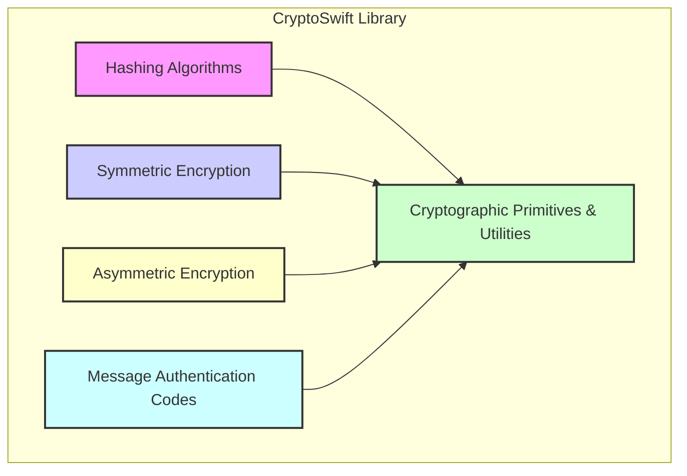
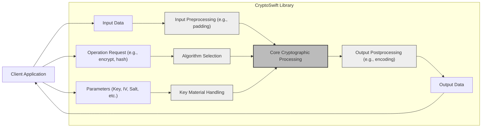

# Project Design Document: CryptoSwift

**Version:** 1.1
**Date:** October 26, 2023
**Prepared By:** Gemini (Expert in Software, Cloud and Cybersecurity Architecture)

## 1. Introduction

This document details the architectural design of the CryptoSwift library, a Swift package providing cryptographic functionalities. Its primary purpose is to serve as a foundation for threat modeling and security analysis, enabling the identification of potential vulnerabilities within the library and its integration points.

## 2. Goals and Non-Goals

**Goals:**

*   Clearly articulate the architectural structure of the CryptoSwift library.
*   Identify and describe the major functional components within the library.
*   Illustrate the typical flow of data during cryptographic operations.
*   Highlight key areas and considerations relevant to the security posture of the library.
*   Provide a reference document for security assessments, including penetration testing and code reviews.

**Non-Goals:**

*   Serve as a user manual or API documentation for the CryptoSwift library.
*   Provide in-depth mathematical explanations of the implemented cryptographic algorithms.
*   Detail the internal implementation specifics of each algorithm within the library.
*   Document the project's development history, versioning, or contribution guidelines.

## 3. Architectural Overview

CryptoSwift is designed as a modular library, offering a collection of cryptographic algorithm implementations in Swift. Its architecture focuses on providing building blocks for developers to perform various cryptographic operations within their Swift applications. The library is structured around distinct categories of cryptographic functions, allowing for focused usage and integration. It aims to be a lightweight and efficient solution for common cryptographic needs in Swift environments.

## 4. Key Components

The CryptoSwift library is logically organized into the following key component categories:

*   **Hashing Algorithms:** This component provides implementations of various cryptographic hash functions. These functions take input data and produce a fixed-size hash value (digest).
    *   Supported Algorithms: MD5, SHA1, SHA2 (SHA224, SHA256, SHA384, SHA512), SHA3 (SHA3-224, SHA3-256, SHA3-384, SHA3-512).
    *   Functionality:  Computes the hash of provided data.
*   **Symmetric Encryption Algorithms:** This component offers implementations of symmetric encryption algorithms, where the same key is used for both encryption and decryption.
    *   Supported Algorithms: AES (Advanced Encryption Standard) with various block sizes and modes of operation (e.g., CBC, ECB, GCM), ChaCha20, Blowfish.
    *   Functionality: Encrypts plaintext into ciphertext and decrypts ciphertext back to plaintext using a secret key.
*   **Asymmetric Encryption Algorithms (Limited):** This component provides basic support for asymmetric encryption algorithms, involving key pairs (public and private keys). The extent of support might vary.
    *   Supported Algorithms: RSA (for encryption/decryption and signing/verification, key generation might be external), Elliptic Curve Cryptography (ECC) (support for key exchange, signing, and verification might be present depending on the version).
    *   Functionality: Encrypts data with a public key (decryptable with the private key), and potentially supports digital signatures.
*   **Message Authentication Codes (MACs):** This component implements algorithms for generating message authentication codes, used to verify the integrity and authenticity of a message.
    *   Supported Algorithms: HMAC (keyed-Hashing for Message Authentication) using various hash functions (e.g., HMAC-SHA256).
    *   Functionality: Generates a MAC tag for a given message and secret key.
*   **Cryptographic Primitives and Utilities:** This component provides fundamental building blocks and utility functions used by the other components.
    *   Sub-components:
        *   Block Ciphers: Implementations of basic block cipher operations used in symmetric encryption modes.
        *   Stream Ciphers: Implementations of stream cipher operations like those used in ChaCha20.
        *   Padding Schemes: Implementations of padding methods (e.g., PKCS#7) used in block cipher modes.
        *   Initialization Vector (IV) / Nonce Generation: Functions for generating random or pseudo-random IVs or nonces.
        *   Key Derivation Functions (KDFs):  Potentially includes implementations of KDFs for deriving keys from passwords or other secrets.
        *   Random Number Generation: May rely on system-provided random number generators for cryptographic operations.
        *   Data Encoding/Decoding: Functions for encoding and decoding data in various formats (e.g., Base64).
        *   Error Handling: Mechanisms for managing and reporting errors during cryptographic operations.

## 5. Data Flow

The data flow within CryptoSwift generally involves a client application initiating a cryptographic operation by providing input data and necessary parameters to the library. CryptoSwift then processes this data based on the selected algorithm and returns the output.

Here's a breakdown of the typical data flow:

**Detailed Data Flow Examples:**

*   **Hashing Operation:**
    *   Input Data: Data to be hashed.
    *   Operation Request: Specifies the desired hash algorithm (e.g., "SHA256").
    *   Parameters:  Typically, the algorithm name.
    *   Input Preprocessing: May involve data formatting or chunking.
    *   Algorithm Selection: The appropriate hashing algorithm implementation is chosen.
    *   Core Cryptographic Processing: The hashing algorithm computes the digest.
    *   Output Postprocessing: The hash digest might be encoded (e.g., to a hexadecimal string).
    *   Output Data: The resulting hash value.

*   **Symmetric Encryption Operation:**
    *   Input Data: Plaintext to be encrypted.
    *   Operation Request: Specifies the encryption algorithm ("AES"), mode of operation ("GCM"), and operation type ("encrypt").
    *   Parameters: Encryption key, Initialization Vector (IV) or nonce, and potentially associated authenticated data (AAD).
    *   Input Preprocessing: Padding might be applied based on the block cipher mode.
    *   Algorithm Selection: The specified symmetric encryption algorithm and mode are selected.
    *   Key Material Handling: The provided key is used for the encryption process.
    *   Core Cryptographic Processing: The encryption algorithm processes the plaintext using the key and IV.
    *   Output Postprocessing: The ciphertext might be encoded (e.g., Base64). For authenticated modes, an authentication tag is also generated.
    *   Output Data: The ciphertext (and potentially the authentication tag).

*   **Symmetric Decryption Operation:**
    *   Input Data: Ciphertext to be decrypted.
    *   Operation Request: Specifies the decryption algorithm, mode, and operation type ("decrypt").
    *   Parameters: Encryption key (matching the encryption key), IV or nonce. For authenticated modes, the authentication tag is also required.
    *   Input Preprocessing:  May involve decoding the ciphertext.
    *   Algorithm Selection: The specified symmetric decryption algorithm and mode are selected.
    *   Key Material Handling: The provided key is used for decryption.
    *   Core Cryptographic Processing: The decryption algorithm processes the ciphertext using the key and IV. For authenticated modes, the tag is verified.
    *   Output Postprocessing: Padding might be removed.
    *   Output Data: The decrypted plaintext (or an error if decryption or authentication fails).

## 6. Security Considerations

Several security aspects need careful consideration when using and integrating CryptoSwift:

*   **Key Management Vulnerabilities:** CryptoSwift itself does not manage keys. The security of the system heavily relies on how the integrating application generates, stores, and handles cryptographic keys. Weak key generation, insecure storage, or improper key exchange can completely undermine the cryptography.
*   **Improper IV/Nonce Handling:** Reusing the same Initialization Vector (IV) with the same key in certain block cipher modes (e.g., CBC) can lead to information leakage. Similarly, nonce reuse in stream ciphers or authenticated encryption modes is a critical vulnerability. The integrating application must ensure proper generation and unique usage of IVs/nonces.
*   **Padding Oracle Attacks:** When using block cipher modes like CBC with padding, vulnerabilities in the padding verification process can be exploited to decrypt ciphertext without knowing the key. Careful implementation and use of secure padding schemes are essential.
*   **Side-Channel Attack Potential:** Implementations of cryptographic algorithms can be susceptible to side-channel attacks, such as timing attacks, where information is leaked based on the execution time of operations. Mitigation against these attacks requires careful coding practices.
*   **Weak Random Number Generation:** Cryptographic security relies on strong random numbers for key generation, IV generation, and other security-sensitive operations. If CryptoSwift relies on a weak or predictable random number source, it can compromise the security of the generated keys and other parameters.
*   **Algorithm Choice and Configuration Errors:** Selecting weak or outdated cryptographic algorithms or using them with insecure configurations (e.g., short key lengths) can significantly weaken security. Developers must choose appropriate algorithms and configurations based on security best practices.
*   **Error Handling and Information Disclosure:**  Careless error handling within CryptoSwift or the integrating application could inadvertently leak sensitive information, such as key material or intermediate cryptographic states, in error messages or logs.
*   **Dependency Chain Risks:** While CryptoSwift aims to be self-contained, any underlying dependencies (e.g., system libraries) could introduce vulnerabilities. Keeping dependencies updated and understanding their security posture is important.
*   **Memory Safety Issues:** Potential vulnerabilities like buffer overflows or memory leaks within the CryptoSwift implementation could be exploited. Secure coding practices and thorough testing are necessary to mitigate these risks.
*   **Input Validation Failures:**  Insufficient validation of input parameters provided to CryptoSwift could lead to unexpected behavior, crashes, or even security vulnerabilities. The library and the integrating application should validate inputs appropriately.

## 7. Dependencies

CryptoSwift primarily depends on the following:

*   **Swift Standard Library:** Provides fundamental data types and functionalities.
*   **Foundation Framework (Apple Platforms):** Offers essential system services and data management capabilities.
*   **System Cryptographic Libraries (Platform-Specific):** Depending on the target platform (e.g., macOS, iOS, Linux), CryptoSwift might leverage underlying system-provided cryptographic libraries (like CommonCrypto on Apple platforms or OpenSSL on Linux) for certain operations or optimizations. The specific dependencies can vary based on the build configuration and target environment.

## 8. Deployment and Integration

CryptoSwift is typically deployed as a Swift Package Manager (SPM) dependency and integrated into Swift projects. The security of the deployed application depends not only on the security of CryptoSwift itself but also critically on how developers utilize the library and manage cryptographic secrets within their applications. Secure coding practices and a thorough understanding of cryptographic principles are essential for secure integration.

## 9. Future Considerations

*   **Adoption of Newer Cryptographic Standards:** Continuously evaluating and incorporating support for new, robust, and widely accepted cryptographic algorithms and standards.
*   **Formal Security Audits and Reviews:** Conducting regular independent security audits and code reviews to identify and address potential vulnerabilities proactively.
*   **Enhanced Protection Against Side-Channel Attacks:** Implementing countermeasures to mitigate the risk of side-channel attacks.
*   **Improved Documentation and Usage Guidance:** Providing comprehensive documentation and best practice guidelines for developers to use CryptoSwift securely.
*   **Vulnerability Disclosure Program:** Establishing a clear process for reporting and addressing security vulnerabilities discovered in the library.
*   **Focus on Secure Defaults:**  Configuring the library with secure default settings to minimize the risk of misconfiguration.

This design document provides a comprehensive overview of the CryptoSwift library's architecture, serving as a crucial input for the threat modeling process. By understanding the components, data flow, and potential security considerations outlined here, security analysts and developers can effectively identify and mitigate potential vulnerabilities.