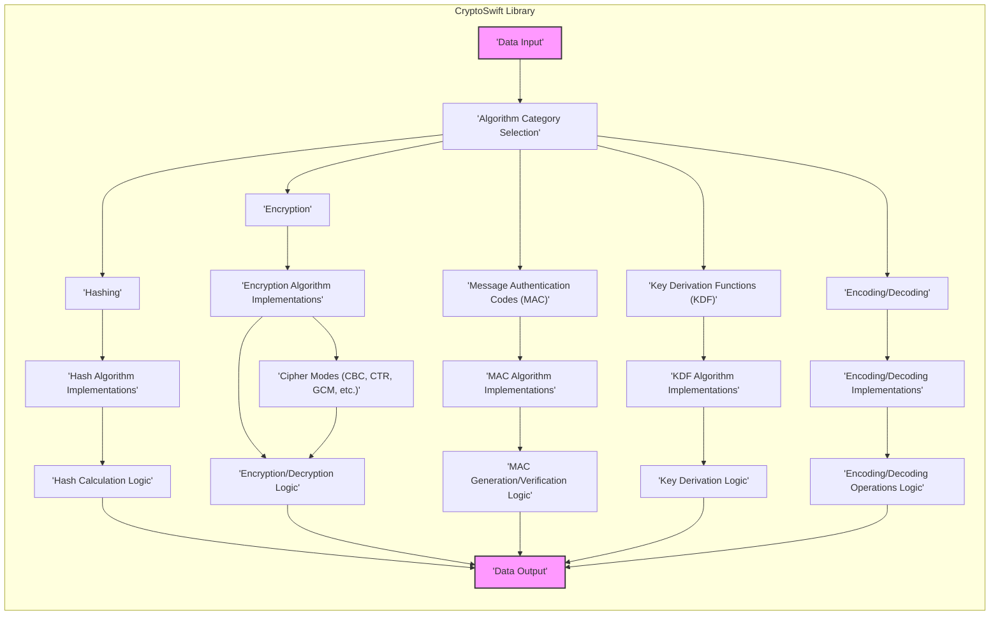

# Project Design Document: CryptoSwift for Threat Modeling

**Project Name:** CryptoSwift

**Project URL:** [https://github.com/krzyzanowskim/cryptoswift](https://github.com/krzyzanowskim/cryptoswift)

**Document Version:** 1.1

**Date:** October 26, 2023

**Author:** AI Software Architect

## 1. Introduction

This document provides a detailed design overview of the CryptoSwift project, an open-source cryptographic library written in Swift. This document is intended to be used as a basis for threat modeling activities. It outlines the project's purpose, architecture, key components, security considerations, and potential attack surfaces. This document focuses on the design and functionality of CryptoSwift as a library, and not on specific applications that might utilize it. The goal is to provide a clear and structured representation of CryptoSwift to facilitate effective threat identification and risk assessment.

## 2. Project Overview

*   **Project Description:** CryptoSwift is a Swift-based library providing a comprehensive collection of cryptographic algorithms and primitives. It is designed to offer a pure Swift implementation of common cryptographic functions, making it readily usable in Swift-based applications across diverse platforms including iOS, macOS, Linux, watchOS, and tvOS.
*   **Purpose:** The primary purpose of CryptoSwift is to empower Swift developers to seamlessly integrate cryptographic functionalities into their projects. This eliminates the need for complex Objective-C bridging or reliance on external dependencies for fundamental cryptographic operations, promoting code clarity and platform independence.
*   **Target Users:** Developers building applications in Swift who require cryptographic functionalities, including but not limited to:
    *   Hashing: Securely generating digests of data for integrity checks and data indexing. (e.g., SHA-256, MD5, SHA3)
    *   Encryption/Decryption: Protecting data confidentiality through symmetric and potentially asymmetric encryption algorithms. (e.g., AES, ChaCha20, RSA - if supported)
    *   Message Authentication Codes (MACs): Ensuring data integrity and authenticity by generating and verifying MACs. (e.g., HMAC)
    *   Key Derivation Functions (KDFs): Securely deriving cryptographic keys from passwords or other secrets. (e.g., PBKDF2)
    *   Data Encoding/Decoding: Converting data into different formats for storage or transmission. (e.g., Base64, Hex)
    *   Authenticated Encryption: Combining encryption and authentication for enhanced security. (e.g., AES-GCM, ChaCha20-Poly1305 - if supported)
*   **Scope:** This document specifically covers the design of the CryptoSwift library itself. It explicitly excludes applications that consume CryptoSwift and the broader Swift cryptography ecosystem. The focus is on the library's internal structure and functionalities as they relate to security.

## 3. System Architecture

CryptoSwift is architected as a modular library, with a clear separation of concerns based on cryptographic algorithm categories and utility functions. This modularity enhances maintainability and allows developers to use only the necessary components.

### 3.1. High-Level Architecture Diagram

### 3.2. Component Description

*   **"Data Input"**: This component represents the initial entry point for data that needs to be processed by CryptoSwift. Data can be provided as `Data` objects, `String`s, or other Swift data types. This is the raw material for cryptographic operations.
*   **"Algorithm Category Selection"**: This is a logical routing component. Based on the developer's intent, the input data and desired operation are directed to the appropriate category of cryptographic algorithms: Hashing, Encryption, MAC, KDF, or Encoding/Decoding.
*   **"Hashing"**: This category encompasses all supported hashing algorithms.
    *   **"Hash Algorithm Implementations"**: Contains the specific implementations for various hash algorithms:
        *   `MD5`: Message Digest 5 (legacy, collision-prone, generally not recommended for new applications).
        *   `SHA1`: Secure Hash Algorithm 1 (legacy, weakened, generally not recommended for new applications).
        *   `SHA224`, `SHA256`, `SHA384`, `SHA512`: Secure Hash Algorithm 2 family (widely used and considered secure).
        *   `SHA3` (variants): Secure Hash Algorithm 3 family (Keccak-based, modern and secure).
    *   **"Hash Calculation Logic"**:  The core logic for executing the chosen hash algorithm on the input data, producing a fixed-size hash value (digest).
*   **"Encryption"**: This category includes symmetric and potentially asymmetric encryption algorithms.
    *   **"Encryption Algorithm Implementations"**: Contains implementations for encryption algorithms:
        *   `AES` (Advanced Encryption Standard):  A widely used symmetric block cipher, supporting various key sizes (128, 192, 256 bits).
        *   `ChaCha20`: A modern stream cipher known for its speed and security, often paired with Poly1305 for authenticated encryption.
        *   `Blowfish`: A symmetric block cipher (less common in modern applications).
        *   `DES` (Data Encryption Standard):  Legacy block cipher, considered insecure for most modern applications due to its small key size.
        *   `RC4` (Rivest Cipher 4): Legacy stream cipher, known to have vulnerabilities and generally not recommended.
    *   **"Encryption/Decryption Logic"**: The core logic for encrypting and decrypting data using the selected algorithm, key, and initialization vector (IV) or nonce.
    *   **"Cipher Modes (CBC, CTR, GCM, etc.)"**:  Implementations of different modes of operation for block ciphers like AES. These modes define how the cipher is applied to blocks of data and are crucial for security and functionality. Examples include:
        *   `CBC` (Cipher Block Chaining): Requires an IV, prone to padding oracle attacks if not implemented carefully.
        *   `CTR` (Counter Mode):  Requires a unique nonce for each encryption operation, parallelizable.
        *   `ECB` (Electronic Codebook):  Not generally recommended due to identical plaintext blocks resulting in identical ciphertext blocks.
        *   `GCM` (Galois/Counter Mode): Authenticated encryption mode, provides both confidentiality and integrity.
*   **"Message Authentication Codes (MAC)"**: This category provides algorithms for generating and verifying MACs.
    *   **"MAC Algorithm Implementations"**: Implementations of MAC algorithms:
        *   `HMAC` (Hash-based Message Authentication Code):  Uses a hash function (e.g., SHA256) and a secret key to generate a MAC. CryptoSwift likely supports HMAC with various hash functions.
    *   **"MAC Generation/Verification Logic"**: The logic for generating a MAC tag from input data and a secret key, and for verifying the integrity and authenticity of data by checking the MAC tag.
*   **"Key Derivation Functions (KDF)"**: This category provides functions for securely deriving cryptographic keys.
    *   **"KDF Algorithm Implementations"**: Implementations of KDF algorithms:
        *   `PBKDF2` (Password-Based Key Derivation Function 2):  A widely used KDF that applies a salt and iterations to a password to derive a strong key.
    *   **"Key Derivation Logic"**: The logic for deriving a cryptographic key from a password or other secret, using a salt and iteration count (for PBKDF2) to increase security and resistance to brute-force attacks.
*   **"Encoding/Decoding"**: This category provides utilities for data encoding and decoding.
    *   **"Encoding/Decoding Implementations"**: Implementations for encoding and decoding schemes:
        *   `Base64`:  A common encoding scheme for representing binary data in ASCII.
        *   `Hex`:  Hexadecimal encoding for representing binary data.
    *   **"Encoding/Decoding Operations Logic"**: The logic for performing encoding and decoding operations according to the selected scheme.
*   **"Data Output"**: Represents the final output of the cryptographic operations. This is typically in the form of `Data` objects, `String`s, or other Swift data types, depending on the specific operation performed. This is the result returned to the user application.

### 3.3. Data Flow

1.  **Input Data Provision:** A Swift application provides data to the CryptoSwift library for cryptographic processing.
2.  **Algorithm Category and Selection:** The developer selects the appropriate category of cryptographic operation (hashing, encryption, MAC, KDF, encoding) and then chooses a specific algorithm within that category from CryptoSwift's offerings.
3.  **Parameter Configuration:**  Depending on the chosen algorithm, the developer configures necessary parameters. This is a critical step for security and correct operation. Parameters include:
    *   Key: Secret key for symmetric encryption, MAC, and KDF. Key management is crucial and is the responsibility of the application developer using CryptoSwift.
    *   Initialization Vector (IV) or Nonce: Required for certain encryption modes (e.g., CBC, CTR, GCM).  Proper generation and handling are essential.
    *   Salt: Used in KDFs like PBKDF2 to enhance security against rainbow table attacks.
    *   Iteration Count:  For KDFs like PBKDF2, the number of iterations significantly impacts the computational cost and security.
    *   Mode of Operation: For block ciphers like AES, selecting the appropriate mode (CBC, CTR, GCM, etc.) is vital for security and functionality.
4.  **Algorithm Execution by CryptoSwift:** CryptoSwift executes the selected cryptographic algorithm using the provided data and configured parameters. This involves calling the appropriate logic within the library based on the algorithm and mode chosen.
5.  **Output Data Return:** The result of the cryptographic operation (hash digest, ciphertext, MAC tag, derived key, encoded data) is generated by CryptoSwift and returned to the calling Swift application. The application then uses this output as needed.

## 4. Security Considerations

### 4.1. Cryptographic Algorithm Implementation

*   **Correctness and Robustness:** The cryptographic algorithm implementations must be mathematically correct and robust against various inputs. Subtle implementation errors can lead to catastrophic security failures. For example, incorrect padding in CBC mode encryption can lead to padding oracle vulnerabilities.
*   **Algorithm Choice and Security Level:** CryptoSwift offers a range of algorithms, including some that are considered legacy or weakened. Developers must be educated on the appropriate algorithm choices for their security requirements. Using MD5 or SHA1 for hashing in security-sensitive contexts is generally discouraged. Similarly, DES and RC4 are weak encryption algorithms.
*   **Side-Channel Attack Resistance:** Pure Swift implementations, while offering some degree of isolation, are not inherently resistant to side-channel attacks like timing attacks. For instance, if key comparison operations in HMAC are not constant-time, they could be vulnerable to timing attacks that leak key information. Developers should be aware of this limitation, especially when dealing with highly sensitive keys.
*   **Secure Random Number Generation:** Cryptographic operations heavily rely on cryptographically secure random number generators (CSRNGs). CryptoSwift likely uses Swift's standard library for random number generation. The underlying security of this RNG is critical for key generation, IV/nonce generation, and salt generation. If the RNG is predictable, it can undermine the security of the entire system.

### 4.2. Key Management

*   **Key Generation (Library vs. Application Responsibility):** CryptoSwift primarily focuses on *using* keys for cryptographic operations. Key generation itself is often the responsibility of the application using CryptoSwift. While CryptoSwift might provide utilities for generating salts or nonces, robust key generation practices (e.g., using system-provided secure random sources) are crucial and should be emphasized in documentation for developers.
*   **Secure Key Storage (Application Responsibility):** CryptoSwift does not handle key storage. Secure storage of cryptographic keys is entirely the responsibility of the application developer.  Insecure key storage is a leading cause of security breaches. Developers must use platform-specific secure storage mechanisms (e.g., Keychain on iOS/macOS, Keystore on Android) and avoid storing keys in plaintext or easily accessible locations.
*   **In-Memory Key Handling:** Sensitive cryptographic keys will inevitably reside in memory during cryptographic operations.  Memory protection techniques and secure coding practices are important to minimize the risk of key exposure through memory dumps, process inspection, or memory corruption vulnerabilities.  While Swift provides memory safety features, developers still need to be mindful of potential memory-related vulnerabilities.
*   **Key Derivation Strength and Parameter Selection:** When using KDFs like PBKDF2, the security strength of the derived key depends heavily on the password strength, the salt's randomness and uniqueness, and the iteration count. Developers must choose sufficiently strong passwords (or use other strong secrets as input), use unique and randomly generated salts, and select a high enough iteration count to make brute-force attacks computationally infeasible. Insufficient iteration counts are a common mistake.

### 4.3. Input Validation and Error Handling

*   **Robust Input Validation:** CryptoSwift must rigorously validate all input data to prevent unexpected behavior, crashes, or security vulnerabilities. This includes validating data types, sizes, formats, and ranges. For example, when decrypting AES-GCM, the library must validate the provided authentication tag to prevent authenticated encryption bypass attacks.
*   **Secure Error Handling:** Error handling must be robust and secure. CryptoSwift should handle errors gracefully and provide informative error messages to developers for debugging purposes. However, error messages should avoid leaking sensitive information that could be exploited by attackers. Errors should not lead to insecure states or leave sensitive data exposed. For example, in decryption, errors should not reveal information about the validity of padding or the key.

### 4.4. Modes of Operation (Block Ciphers)

*   **Mode Selection Security Implications:** For block ciphers like AES, the choice of cipher mode is critical for security.  Developers must understand the security properties of different modes (CBC, CTR, GCM, etc.) and select the most appropriate mode for their use case. ECB mode should generally be avoided. CBC mode requires careful handling of padding and IVs to prevent vulnerabilities. CTR mode requires unique nonces. GCM mode provides authenticated encryption and is often a good default choice when both confidentiality and integrity are needed.
*   **IV/Nonce Management and Best Practices:**  Modes like CBC and CTR rely on proper Initialization Vector (IV) or nonce management.  Incorrect IV/nonce usage is a common source of vulnerabilities. For CBC, IVs should be unpredictable. For CTR, nonces must be unique for each encryption operation with the same key. IV/nonce reuse in CBC or CTR mode can lead to serious security breaches, including plaintext recovery. CryptoSwift's API and documentation should guide developers towards secure IV/nonce generation and handling practices. For example, recommending the use of cryptographically secure random number generators for IV/nonce generation.

### 4.5. Dependencies and Platform APIs

*   **Swift Standard Library Security:** CryptoSwift's security is indirectly dependent on the security of the Swift standard library. Vulnerabilities in the Swift standard library, particularly in areas related to memory management, string handling, or random number generation, could potentially impact CryptoSwift.
*   **Platform Cryptographic API Considerations:** While CryptoSwift is a pure Swift implementation, developers should be aware of the availability and potential advantages of using platform-native cryptographic APIs (e.g., CommonCrypto on macOS/iOS, OpenSSL on Linux). Platform APIs are often highly optimized and may be hardware-accelerated.  However, they might introduce platform dependencies. CryptoSwift offers platform independence but might have performance trade-offs compared to optimized native libraries in certain scenarios.

### 4.6. API Design and Usability

*   **API Clarity and Secure Defaults:** CryptoSwift's API design should be clear, intuitive, and promote secure usage by default.  The API should guide developers towards secure practices and make it difficult to make common security mistakes. For example, the API could encourage the use of authenticated encryption modes like GCM by default, rather than less secure modes like ECB.
*   **Documentation and Security Guidance:** Comprehensive and accurate documentation is essential. The documentation should clearly explain the security implications of different algorithms, modes, and parameters. It should provide best practices for secure key management, IV/nonce handling, and algorithm selection. Security warnings and recommendations should be prominently featured in the documentation.

## 5. Technologies Used

*   **Programming Language:** Swift (designed for safety and performance)
*   **Target Platforms:** Cross-platform compatibility: iOS, macOS, watchOS, tvOS, Linux, and potentially other platforms that support Swift.
*   **Core Dependencies:** Primarily relies on the Swift Standard Library, minimizing external dependencies for core cryptographic functions to enhance portability and reduce dependency-related risks.
*   **Build System and Package Management:**
    *   Swift Package Manager (SPM): The primary build system and package manager for Swift projects, facilitating easy integration into Swift projects.
    *   Xcode Projects:  Likely includes Xcode project files for easier development and integration into iOS and macOS projects.
    *   CocoaPods and Carthage: May also support CocoaPods and Carthage for dependency management, catering to different Swift project setups.

## 6. Deployment Model

*   **Library Integration Model:** CryptoSwift is deployed as a library that is directly integrated into Swift applications during the build process. It becomes part of the application's executable.
*   **Distribution Channels:** Distributed through various Swift package managers and dependency management tools:
    *   Swift Package Manager (SPM): Recommended and primary distribution method.
    *   CocoaPods: Popular dependency manager for iOS and macOS projects.
    *   Carthage: Another dependency manager for iOS and macOS projects.
    *   Source Code Availability: Open-source and available on GitHub, allowing direct download and manual integration of source code if needed.
*   **Runtime Environment:** Executes within the application's process on the target platform. Performance characteristics will be influenced by the target platform's hardware and Swift runtime environment.

## 7. Potential Attack Surfaces

Based on the design, implementation characteristics, and security considerations, potential attack surfaces for CryptoSwift and applications using it include:

*   **Cryptographic Algorithm Implementation Flaws:**
    *   **Logic Errors:** Bugs in the implementation of cryptographic algorithms leading to incorrect computations, weakened security, or complete breaks. Example: Incorrect implementation of AES round functions.
    *   **Memory Safety Issues:** Memory corruption vulnerabilities (buffer overflows, out-of-bounds access) in algorithm implementations, potentially exploitable for code execution. While Swift is memory-safe, unsafe code blocks or incorrect handling of `UnsafePointer` could introduce such issues.
*   **Side-Channel Attacks (Implementation-Level):**
    *   **Timing Attacks:** Vulnerabilities due to timing variations in cryptographic operations that depend on secret data (e.g., key bits). Exploitable to recover keys. Example: Non-constant-time key comparison in HMAC.
    *   **Cache Attacks:** Exploiting CPU cache behavior to infer information about secret keys or data. Less likely in pure Swift but still a theoretical consideration.
*   **API Misuse Vulnerabilities (Application-Level):**
    *   **Incorrect Mode of Operation Selection:** Developers choosing insecure or inappropriate cipher modes (e.g., ECB) for encryption, weakening security.
    *   **IV/Nonce Mismanagement:**  Incorrect generation, reuse, or predictable IVs/nonces in modes like CBC and CTR, leading to plaintext recovery or other attacks.
    *   **Weak Key Derivation Parameter Choices:** Using insufficient iteration counts or weak salts in KDFs like PBKDF2, making brute-force attacks easier.
    *   **Insecure Key Storage:** Applications storing cryptographic keys insecurely (plaintext, easily accessible locations), leading to key compromise.
*   **Input Validation and Error Handling Vulnerabilities:**
    *   **Input Injection Attacks:**  Insufficient input validation allowing attackers to inject malicious data that bypasses security checks or causes unexpected behavior. Less likely in core crypto algorithms but could be relevant in utility functions or parsing logic.
    *   **Information Leakage through Error Messages:**  Error messages revealing sensitive information (e.g., key material, internal state) to attackers.
    *   **Denial of Service (DoS):**  Potential for DoS attacks if the library is vulnerable to resource exhaustion through maliciously crafted inputs or operations. Example: Hash collision DoS attacks if hash function implementation is inefficient for certain inputs.
*   **Dependency Chain Vulnerabilities (Indirect):**
    *   **Swift Standard Library Vulnerabilities:**  Security flaws in the Swift standard library that CryptoSwift relies upon could indirectly affect CryptoSwift's security.
    *   **Future Dependency Introduction:** If CryptoSwift introduces external dependencies in the future, vulnerabilities in those dependencies could become attack surfaces.

## 8. Threat Modeling Considerations

This design document provides a structured foundation for conducting a comprehensive threat model of CryptoSwift. The threat modeling process should systematically address the following steps:

*   **Asset Identification:** Clearly identify the critical assets that CryptoSwift is intended to protect. Primary assets include:
    *   Confidentiality of data encrypted using CryptoSwift.
    *   Integrity of data protected by hashing or MACs provided by CryptoSwift.
    *   Authenticity of data verified using MACs or digital signatures (if supported).
    *   Cryptographic keys used with CryptoSwift (though key management is primarily the application's responsibility).
*   **Threat Identification:** Based on the attack surfaces outlined in Section 7, systematically identify potential threats. Examples of threats include:
    *   **Algorithm Implementation Exploitation:** Attackers exploiting flaws in algorithm implementations to bypass encryption, forge MACs, or recover keys.
    *   **Side-Channel Attacks:** Attackers using timing or other side-channel attacks to extract secret keys.
    *   **API Misuse Exploitation:** Attackers exploiting vulnerabilities arising from developers misusing the CryptoSwift API in their applications (e.g., IV reuse).
    *   **Key Compromise:** Attackers gaining access to cryptographic keys due to insecure key storage or handling in applications.
    *   **Data Integrity Attacks:** Attackers modifying data without detection due to weaknesses in hashing or MAC implementations or usage.
    *   **Denial of Service Attacks:** Attackers causing DoS by exploiting vulnerabilities in CryptoSwift's processing of malicious inputs.
*   **Vulnerability Assessment:** Conduct a detailed analysis of the CryptoSwift codebase and design to identify potential vulnerabilities that could be exploited by the identified threats. This includes:
    *   Code review of cryptographic algorithm implementations.
    *   Static and dynamic analysis of the code.
    *   Security testing, including fuzzing and penetration testing.
*   **Risk Assessment:** Evaluate the likelihood and potential impact of each identified threat and vulnerability. This involves considering factors such as:
    *   Likelihood of the threat occurring.
    *   Impact if the threat is realized (confidentiality breach, integrity compromise, etc.).
    *   Severity of the vulnerability.
*   **Mitigation Strategies and Security Improvements:** Develop and implement mitigation strategies to address identified vulnerabilities and reduce risks to an acceptable level. Mitigation strategies may include:
    *   Code fixes to address implementation flaws.
    *   Strengthening input validation and error handling.
    *   Improving documentation and API design to promote secure usage.
    *   Adding security testing to the development process.
    *   Providing security guidelines and best practices for developers using CryptoSwift.

This enhanced design document provides a more detailed and structured overview of CryptoSwift, specifically tailored for threat modeling. It should be used as a starting point for a comprehensive security analysis and ongoing security efforts for the CryptoSwift project and applications that rely on it. Continuous security review and updates are crucial for maintaining the security of cryptographic libraries.