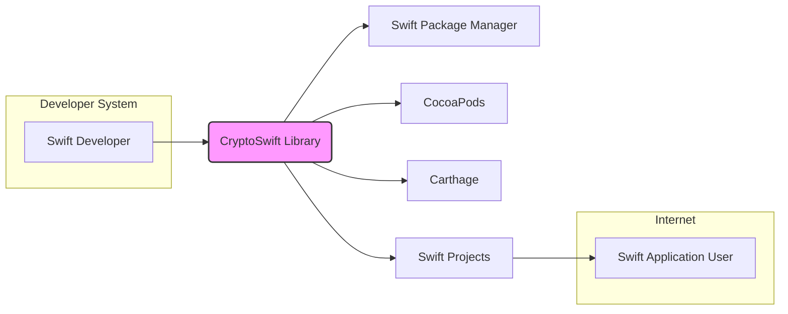
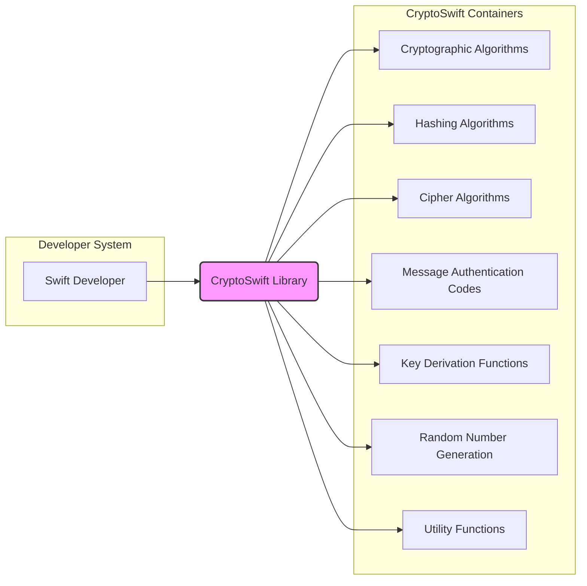

# BUSINESS POSTURE

This project, CryptoSwift, provides a collection of cryptographic algorithms implemented in Swift. It aims to offer developers a readily available and easy-to-use library for incorporating cryptography into their Swift applications across various platforms, including iOS, macOS, watchOS, tvOS, and Linux.

Business Priorities and Goals:
- Provide a robust and reliable cryptographic library for Swift developers.
- Enable secure data handling and communication in Swift applications.
- Support a wide range of cryptographic algorithms and primitives.
- Maintain a high level of code quality and security.
- Foster community contribution and maintain active development.

Business Risks:
- Vulnerabilities in cryptographic implementations leading to data breaches or security compromises in applications using the library.
- Incorrect usage of the library by developers resulting in insecure applications.
- Lack of maintenance and updates, causing the library to become outdated and insecure over time.
- Supply chain attacks targeting the library's dependencies or build process.
- Compatibility issues with different Swift versions and platforms.

# SECURITY POSTURE

Existing Security Controls:
- security control: Code review process for contributions (described in contribution guidelines).
- security control: Unit tests to ensure the correctness of cryptographic implementations (present in the repository).
- accepted risk: Reliance on community contributions, which may introduce vulnerabilities if not properly vetted.
- accepted risk: Open-source nature, making the codebase publicly accessible to both security researchers and malicious actors.

Recommended Security Controls:
- recommended security control: Implement automated Static Application Security Testing (SAST) in the CI/CD pipeline to detect potential code-level vulnerabilities.
- recommended security control: Integrate Dependency Scanning to identify and manage vulnerabilities in third-party dependencies.
- recommended security control: Conduct regular security audits and penetration testing by external security experts.
- recommended security control: Establish a clear vulnerability disclosure and response process.
- recommended security control: Implement code signing for releases to ensure integrity and authenticity.

Security Requirements:
- Authentication: Not directly applicable to a cryptographic library itself. Authentication is the responsibility of applications using CryptoSwift.
- Authorization: Not directly applicable to a cryptographic library itself. Authorization is the responsibility of applications using CryptoSwift.
- Input Validation: Critical for all cryptographic functions to prevent vulnerabilities like buffer overflows, format string bugs, and injection attacks. The library must handle invalid or malformed inputs gracefully and securely.
- Cryptography:
    - Implement cryptographic algorithms correctly and according to established standards.
    - Provide secure defaults and guidance on choosing appropriate algorithms and parameters.
    - Protect cryptographic keys and sensitive data within the library's operations (though key management is primarily the responsibility of the application using the library).
    - Ensure resistance against known cryptographic attacks for implemented algorithms.

# DESIGN

## C4 CONTEXT



Context Diagram Elements:

- Element:
    - Name: Swift Application User
    - Type: Person
    - Description: End-users who interact with Swift applications that utilize the CryptoSwift library for security features.
    - Responsibilities: Use Swift applications to perform tasks that may involve secure data handling.
    - Security controls: Security controls are implemented within the Swift applications they use, which may leverage CryptoSwift.

- Element:
    - Name: Swift Developer
    - Type: Person
    - Description: Software developers who integrate the CryptoSwift library into their Swift projects to implement cryptographic functionalities.
    - Responsibilities: Utilize CryptoSwift to build secure Swift applications, correctly implement cryptographic operations, and manage keys appropriately within their applications.
    - Security controls: Responsible for secure coding practices, proper integration of CryptoSwift, and managing application-level security.

- Element:
    - Name: CryptoSwift Library
    - Type: Software System
    - Description: A Swift package providing a collection of cryptographic algorithms and primitives for use in Swift applications.
    - Responsibilities: Provide correct and secure implementations of cryptographic algorithms, offer an API for developers to use these algorithms, and maintain compatibility with Swift and relevant platforms.
    - Security controls: Input validation within cryptographic functions, secure implementation of algorithms, and adherence to cryptographic standards.

- Element:
    - Name: Swift Package Manager
    - Type: Software System
    - Description: A dependency management tool for Swift projects, used to integrate CryptoSwift into Swift applications.
    - Responsibilities: Package and distribute Swift libraries, manage dependencies for Swift projects, and facilitate the integration of libraries like CryptoSwift.
    - Security controls: Package integrity checks, dependency resolution mechanisms, and potentially supply chain security measures within the Swift Package Manager ecosystem.

- Element:
    - Name: CocoaPods
    - Type: Software System
    - Description: A dependency manager for Swift and Objective-C projects, another way to integrate CryptoSwift.
    - Responsibilities: Dependency management for iOS and macOS projects, distribution of libraries, and integration of CryptoSwift into projects using CocoaPods.
    - Security controls: Podspec verification, dependency resolution, and security considerations within the CocoaPods ecosystem.

- Element:
    - Name: Carthage
    - Type: Software System
    - Description: A decentralized dependency manager for macOS and iOS Swift/Objective-C projects, an alternative integration method for CryptoSwift.
    - Responsibilities: Build and integrate dependencies for Swift and Objective-C projects, offering another option for using CryptoSwift.
    - Security controls: Dependency resolution and build process security within the Carthage framework.

- Element:
    - Name: Swift Projects
    - Type: Software System
    - Description: Swift applications developed by Swift Developers that incorporate the CryptoSwift library to provide security features to end-users.
    - Responsibilities: Utilize CryptoSwift to implement application-level security features, handle user interactions, manage data, and provide the intended functionality to end-users.
    - Security controls: Application-level authentication, authorization, input validation, secure data storage, secure communication, and proper usage of CryptoSwift library.

## C4 CONTAINER



Container Diagram Elements:

- Element:
    - Name: CryptoSwift Library
    - Type: Container (Swift Library)
    - Description: The CryptoSwift library itself, encompassing all its modules and functionalities. It's distributed as a Swift package and integrated into Swift projects.
    - Responsibilities: Provide a comprehensive set of cryptographic algorithms and utilities, maintain code quality and security, and offer a well-documented API for developers.
    - Security controls: Input validation within each module, secure implementation of algorithms, unit and integration testing, and adherence to secure coding practices.

- Element:
    - Name: Cryptographic Algorithms
    - Type: Container (Module)
    - Description: Contains core cryptographic algorithms like block ciphers, stream ciphers, public-key cryptography, and digital signatures.
    - Responsibilities: Implement specific cryptographic algorithms correctly and efficiently, ensuring resistance to known attacks.
    - Security controls: Rigorous testing of algorithm implementations, adherence to cryptographic standards, and protection against implementation-specific vulnerabilities.

- Element:
    - Name: Hashing Algorithms
    - Type: Container (Module)
    - Description: Provides various cryptographic hash functions for data integrity and other cryptographic applications.
    - Responsibilities: Implement secure and efficient hash functions, ensuring collision resistance and preimage resistance as per algorithm specifications.
    - Security controls: Testing for hash function properties, input validation to prevent vulnerabilities, and selection of strong and widely accepted hash algorithms.

- Element:
    - Name: Cipher Algorithms
    - Type: Container (Module)
    - Description: Includes implementations of symmetric and asymmetric encryption and decryption algorithms.
    - Responsibilities: Provide secure and performant cipher implementations, supporting various modes of operation and key management practices.
    - Security controls: Proper key handling within cipher implementations (though key management is primarily external), correct implementation of cipher modes, and resistance to known cipher attacks.

- Element:
    - Name: Message Authentication Codes (MACs)
    - Type: Container (Module)
    - Description: Offers algorithms for generating message authentication codes to verify data integrity and authenticity.
    - Responsibilities: Implement MAC algorithms correctly, ensuring strong authentication properties and resistance to forgery attacks.
    - Security controls: Secure key management for MAC algorithms, correct implementation of MAC generation and verification processes.

- Element:
    - Name: Key Derivation Functions (KDFs)
    - Type: Container (Module)
    - Description: Provides functions to derive cryptographic keys from passwords or other secrets securely.
    - Responsibilities: Implement robust KDFs that are resistant to brute-force and dictionary attacks, following best practices for key derivation.
    - Security controls: Proper salting and iteration count usage in KDF implementations, resistance to known KDF weaknesses.

- Element:
    - Name: Random Number Generation
    - Type: Container (Module)
    - Description: Includes functionalities for generating cryptographically secure random numbers, essential for key generation and other cryptographic operations.
    - Responsibilities: Provide a source of cryptographically secure random numbers, ensuring unpredictability and sufficient entropy.
    - Security controls: Use of appropriate random number generators (CSPRNGs), proper seeding and management of the random number generator state.

- Element:
    - Name: Utility Functions
    - Type: Container (Module)
    - Description: Contains helper functions and utilities that support the core cryptographic functionalities, such as data encoding/decoding, padding schemes, and data manipulation.
    - Responsibilities: Provide utility functions that are secure and reliable, supporting the correct usage of cryptographic algorithms.
    - Security controls: Input validation for utility functions, prevention of vulnerabilities in data handling and manipulation, and ensuring utilities do not introduce security weaknesses.

## DEPLOYMENT

CryptoSwift itself is not deployed as a standalone application. It is deployed as a library that is integrated into other Swift applications. The deployment architecture for CryptoSwift is therefore dependent on the deployment architecture of the Swift applications that use it.

Possible Deployment Scenarios for Swift Applications using CryptoSwift:

1. Mobile Applications (iOS, watchOS, tvOS): Deployed to user devices via app stores (Apple App Store).
2. macOS Applications: Distributed directly to users or via the Mac App Store.
3. Server-Side Applications (Linux): Deployed to cloud environments (AWS, Azure, GCP), on-premise servers, or containerized environments (Docker, Kubernetes).
4. Embedded Systems: Deployed to resource-constrained devices running Swift.

Detailed Deployment Diagram for Server-Side Application (Example):

```mermaid
flowchart LR
    subgraph Cloud Environment
        subgraph Load Balancer
            A[Load Balancer]
        end
        subgraph Application Servers
            B[Application Server 1]
            C[Application Server 2]
            D[Application Server 3]
        end
        subgraph Database Server
            E[Database Server]
        end
        A --> B & C & D
        B & C & D --> E
    end
    F[Internet] --> A
    subgraph Application Server Container
        B --- G[Swift Application with CryptoSwift]
        C --- H[Swift Application with CryptoSwift]
        D --- I[Swift Application with CryptoSwift]
    end
    classDef container fill:#ccf,stroke:#333,stroke-width:2px
    subgraph Database Server Container
        E --- J[Database System]
    end
    classDef database fill:#eee,stroke:#333,stroke-width:2px
    classDef highlight fill:#f9f,stroke:#333,stroke-width:2px
    classDef lb fill:#cce,stroke:#333,stroke-width:2px

    style "Load Balancer" class:lb
    style "Application Servers" class:container
    style "Database Server" class:database
    style "Application Server Container" class:container
    style "Database Server Container" class:database
```

Deployment Diagram Elements (Server-Side Application Example):

- Element:
    - Name: Load Balancer
    - Type: Infrastructure (Load Balancer)
    - Description: Distributes incoming internet traffic across multiple application servers to ensure high availability and scalability.
    - Responsibilities: Traffic distribution, health checks of application servers, SSL termination (optional).
    - Security controls: DDoS protection, rate limiting, SSL/TLS configuration, access control lists.

- Element:
    - Name: Application Servers (Application Server 1, Application Server 2, Application Server 3)
    - Type: Infrastructure (Virtual Machines/Containers)
    - Description: Servers running instances of the Swift application that utilizes the CryptoSwift library.
    - Responsibilities: Execute the Swift application logic, handle user requests, interact with the database, and perform cryptographic operations using CryptoSwift.
    - Security controls: Operating system hardening, security patching, network firewalls, intrusion detection systems, application-level security controls, and secure configuration of the Swift application.

- Element:
    - Name: Database Server
    - Type: Infrastructure (Database Server)
    - Description: Server hosting the database system used by the Swift application to store and retrieve data.
    - Responsibilities: Data storage, data retrieval, data integrity, and database security.
    - Security controls: Database access controls, encryption at rest and in transit, database hardening, regular backups, and vulnerability management.

- Element:
    - Name: Swift Application with CryptoSwift (G, H, I)
    - Type: Software (Application)
    - Description: Instances of the Swift application that have integrated the CryptoSwift library for cryptographic functionalities.
    - Responsibilities: Implement application logic, utilize CryptoSwift for security features, handle user requests, and interact with the database.
    - Security controls: Input validation, output encoding, secure session management, authorization checks, proper usage of CryptoSwift API, and logging and monitoring.

- Element:
    - Name: Database System (J)
    - Type: Software (Database)
    - Description: The database system used by the Swift application (e.g., PostgreSQL, MySQL, etc.).
    - Responsibilities: Store and manage application data securely and reliably.
    - Security controls: Database-level authentication and authorization, access control lists, encryption features, and audit logging.

- Element:
    - Name: Internet
    - Type: External Environment
    - Description: The public internet through which users access the Swift application.
    - Responsibilities: Provide connectivity for users to access the application.
    - Security controls: External firewalls, DDoS protection at the network perimeter.

## BUILD

```mermaid
flowchart LR
    A[Developer] --> B{Code Changes}
    B --> C[GitHub Repository]
    C --> D[GitHub Actions Workflow]
    D --> E{Build & Test}
    E --> F{Security Checks (SAST, Dependency Scan, Linting)}
    F --> G{Code Signing}
    G --> H[Build Artifacts (Swift Package)]
    H --> I[Package Registry (e.g., GitHub Packages, Swift Package Registry)]
    style H fill:#ccf,stroke:#333,stroke-width:2px
```

Build Process Description:

1. Developer: A Swift developer writes code, potentially contributing to the CryptoSwift library.
2. Code Changes: The developer commits and pushes code changes to the GitHub repository.
3. GitHub Repository: The central repository hosting the CryptoSwift source code and build configurations.
4. GitHub Actions Workflow: A CI/CD pipeline defined in GitHub Actions is triggered upon code changes (e.g., push, pull request).
5. Build & Test: The workflow compiles the Swift code, runs unit tests, and performs integration tests to ensure code correctness and functionality.
6. Security Checks: Automated security checks are performed:
    - Static Application Security Testing (SAST): Scans the source code for potential vulnerabilities.
    - Dependency Scanning: Checks for known vulnerabilities in third-party dependencies.
    - Linting: Enforces code style and identifies potential code quality issues.
7. Code Signing: The build artifacts (e.g., Swift Package) are signed with a digital signature to ensure integrity and authenticity.
8. Build Artifacts (Swift Package): The compiled and signed Swift Package containing the CryptoSwift library.
9. Package Registry: The build artifacts are published to a package registry (e.g., GitHub Packages, Swift Package Registry) for distribution and consumption by Swift developers.

Build Process Security Controls:

- security control: Secure coding practices enforced through linters and code review.
- security control: Automated testing (unit and integration tests) to verify code correctness.
- security control: Static Application Security Testing (SAST) to identify potential code vulnerabilities.
- security control: Dependency scanning to detect and manage vulnerabilities in dependencies.
- security control: Code signing to ensure the integrity and authenticity of build artifacts.
- security control: Access control to the GitHub repository and CI/CD pipeline to prevent unauthorized modifications.
- security control: Audit logging of build process activities.
- security control: Secure storage of signing keys and credentials used in the build process.

# RISK ASSESSMENT

Critical Business Process:
- Providing secure cryptographic functionalities to Swift applications.
- Maintaining the integrity and confidentiality of data processed by applications using CryptoSwift.
- Ensuring the availability and reliability of the CryptoSwift library for developers.

Data to Protect:
- Source code of the CryptoSwift library (Confidentiality, Integrity, Availability).
    - Sensitivity: High. Compromise could lead to vulnerabilities in the library and applications using it.
- Cryptographic keys used for code signing (Confidentiality, Integrity, Availability).
    - Sensitivity: Critical. Compromise could allow malicious actors to distribute fake or compromised versions of the library.
- Build artifacts (Swift Packages) (Integrity, Availability).
    - Sensitivity: Medium. Compromised artifacts could lead to users integrating vulnerable versions of the library.
- Intellectual property related to cryptographic implementations (Confidentiality).
    - Sensitivity: Medium. While algorithms are often public, specific implementations might contain proprietary optimizations or techniques.

Data Sensitivity Levels:
- High: Cryptographic keys, potential vulnerabilities.
- Medium: Source code, build artifacts, intellectual property.
- Low: Public documentation, website content.

# QUESTIONS & ASSUMPTIONS

Questions:
- What is the target audience for CryptoSwift? Is it primarily for mobile applications, server-side applications, or a mix?
- Are there specific compliance requirements (e.g., FIPS, PCI DSS) that CryptoSwift needs to adhere to?
- What is the expected level of security expertise of developers using CryptoSwift? Should the library provide more guidance and guardrails to prevent misuse?
- What is the process for handling vulnerability reports and security updates for CryptoSwift?
- Are there any specific threat models or attack vectors that are considered high priority for CryptoSwift?

Assumptions:
- BUSINESS POSTURE: Security and reliability are paramount for CryptoSwift due to its nature as a cryptographic library. The project aims to provide a secure and trustworthy solution for Swift developers.
- SECURITY POSTURE: While some basic security controls like code review and unit tests are in place, there is room for improvement in automated security testing, dependency management, and formal security audits. Security is a continuous process and requires ongoing attention.
- DESIGN: The design of CryptoSwift is modular, with different cryptographic algorithms and functionalities separated into containers. Deployment is dependent on the applications using the library. The build process should incorporate robust security checks to ensure the integrity of the distributed library.