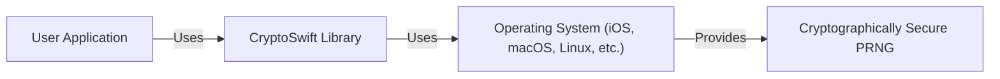
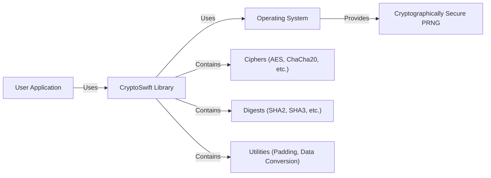
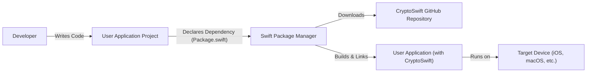
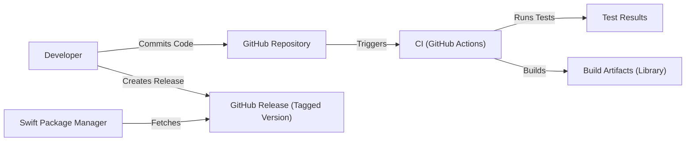

Okay, let's create a design document for the CryptoSwift project.

# BUSINESS POSTURE

CryptoSwift is a mature, open-source project providing cryptographic primitives for Swift. It's not a product of a specific company, but rather a community-driven effort.  The primary business goals (from the perspective of a user *adopting* CryptoSwift) are:

*   Reduce Development Time:  Provide readily available, well-tested cryptographic implementations, eliminating the need for developers to write their own (which is error-prone and time-consuming).
*   Improve Application Security:  Offer secure implementations of standard cryptographic algorithms, enhancing the overall security posture of applications that use them.
*   Maintain Compatibility: Support a wide range of Swift versions and platforms, ensuring broad applicability.
*   Code Maintainability: Offer well-documented and easy to use API.

The most important business risks that need to be addressed are:

*   Incorrect Implementation: Bugs or vulnerabilities in CryptoSwift's cryptographic implementations could lead to severe security breaches in applications that rely on it. This is the paramount risk.
*   Outdated Algorithms: Failure to keep up with cryptographic best practices and deprecate outdated or weakened algorithms could expose users to attacks.
*   Lack of Maintenance:  If the project becomes unmaintained, it will become increasingly risky to use over time, as vulnerabilities may not be patched and new platform/Swift versions may not be supported.
*   Supply Chain Attacks: Compromise of the distribution channel (e.g., package manager) could lead to malicious versions of CryptoSwift being installed.
*   Licensing Issues: Unclear or restrictive licensing could prevent adoption in certain projects. (CryptoSwift uses Apache 2.0, which is permissive, so this is a low risk).

# SECURITY POSTURE

Existing security controls and accepted risks, based on the repository and common practices for similar projects:

*   security control: Code Reviews: Pull requests are used, implying a code review process before merging changes. (Implicit in GitHub workflow).
*   security control: Testing: The project includes a comprehensive suite of unit tests for its cryptographic functions. (Visible in the `Tests` directory).
*   security control: Static Analysis: Some level of static analysis is likely performed, either through Xcode's built-in tools or external linters. (Common practice, but not explicitly documented).
*   security control: Fuzzing: No fuzzing implemented.
*   security control: Dependency Management: Swift Package Manager (SPM) is used, providing some level of dependency management and version control. (Defined in `Package.swift`).
*   security control: Open Source: The code is publicly available for scrutiny, allowing for community auditing and vulnerability identification.
*   accepted risk: Limited Formal Verification:  While testing is present, there's no evidence of formal verification of the cryptographic implementations. This is a common accepted risk for many cryptographic libraries.
*   accepted risk: Supply Chain Vulnerabilities:  Reliance on SPM and the broader Swift ecosystem introduces potential supply chain risks, although SPM does provide some mitigation.
*   accepted risk: Lack of Dynamic Analysis: No evidence of dynamic analysis tools (e.g., for memory safety) being used routinely.
*   accepted risk: No dedicated security team: Security relies on community contributions and the maintainer's diligence.

Recommended Security Controls (High Priority):

*   Implement Fuzzing: Introduce fuzz testing to identify potential vulnerabilities that might be missed by unit tests. This is crucial for cryptographic code.
*   Integrate Static Analysis: Explicitly integrate a static analysis tool (e.g., SwiftLint, Infer) into the build process and CI pipeline.
*   Consider Dynamic Analysis: Explore the use of dynamic analysis tools to detect memory corruption issues.
*   Security Audits: Encourage or commission periodic security audits by independent experts.
*   Supply Chain Security: Investigate and implement best practices for securing the supply chain, such as signing releases and using dependency pinning.
*   Vulnerability Disclosure Policy: Establish a clear and documented vulnerability disclosure policy.

Security Requirements:

*   Authentication: N/A - CryptoSwift provides cryptographic primitives, not authentication mechanisms. Authentication is a higher-level concern built *using* these primitives.
*   Authorization: N/A - Similar to authentication, authorization is outside the scope of this library.
*   Input Validation:
    *   The library should validate the input parameters of its functions (e.g., key sizes, IV lengths) to prevent unexpected behavior or vulnerabilities.
    *   Error handling should be clear and consistent, allowing calling code to handle invalid inputs gracefully.
*   Cryptography:
    *   Support for Strong Algorithms: The library should prioritize strong, well-vetted cryptographic algorithms (e.g., AES-256, SHA-256, ChaCha20Poly1305).
    *   Key Management: While CryptoSwift doesn't *manage* keys, it should provide clear guidance on secure key generation, storage, and handling in its documentation.
    *   Random Number Generation: The library should use cryptographically secure random number generators (CSRNGs) where needed.
    *   Avoidance of Weak Algorithms: Deprecate and eventually remove support for weak or broken algorithms (e.g., MD5, SHA-1).
    *   Constant-Time Operations: Where appropriate, cryptographic operations should be implemented in a constant-time manner to mitigate timing side-channel attacks. This is particularly important for operations involving secret keys.
*   Data validation:
    *   The library should validate integrity of decrypted data.

# DESIGN

## C4 CONTEXT

Element Descriptions:

*   Element:
    *   Name: User Application
    *   Type: Software System
    *   Description: Any application written in Swift that utilizes CryptoSwift for cryptographic operations.
    *   Responsibilities:
        *   Making calls to CryptoSwift functions.
        *   Handling keys and sensitive data securely.
        *   Implementing higher-level security protocols (e.g., authentication, encryption).
    *   Security controls:
        *   Secure key management practices.
        *   Proper use of CryptoSwift APIs.
        *   Input validation.
        *   Output encoding.

*   Element:
    *   Name: CryptoSwift Library
    *   Type: Library
    *   Description: A Swift library providing cryptographic algorithms and functions.
    *   Responsibilities:
        *   Providing implementations of cryptographic primitives (hashing, encryption, etc.).
        *   Validating input parameters.
        *   Returning results and errors.
    *   Security controls:
        *   Code reviews.
        *   Unit testing.
        *   (Ideally) Fuzz testing.
        *   (Ideally) Static and dynamic analysis.

*   Element:
    *   Name: Operating System
    *   Type: System
    *   Description: The underlying operating system (iOS, macOS, Linux, etc.) on which the application and CryptoSwift run.
    *   Responsibilities:
        *   Providing system calls and resources.
        *   Providing a cryptographically secure random number generator (CSPRNG).
    *   Security controls:
        *   OS-level security features (sandboxing, memory protection, etc.).
        *   Regular security updates.

*   Element:
    *   Name: Cryptographically Secure PRNG
    *   Type: Component
    *   Description: A system-provided source of cryptographically secure random numbers.
    *   Responsibilities:
        *   Generating high-quality random data for key generation, IVs, etc.
    *   Security controls:
        *   Implementation adhering to cryptographic best practices.
        *   Regular security audits and updates.

## C4 CONTAINER

Since CryptoSwift is a single library, the Container diagram is essentially the same as the Context diagram, with a bit more detail on the internal structure of the library.

Element Descriptions:

*   Element:
    *   Name: User Application
    *   Type: Software System
    *   Description: Any application written in Swift that utilizes CryptoSwift for cryptographic operations.
    *   Responsibilities:
        *   Making calls to CryptoSwift functions.
        *   Handling keys and sensitive data securely.
        *   Implementing higher-level security protocols (e.g., authentication, encryption).
    *   Security controls:
        *   Secure key management practices.
        *   Proper use of CryptoSwift APIs.
        *   Input validation.
        *   Output encoding.

*   Element:
    *   Name: CryptoSwift Library
    *   Type: Library
    *   Description: A Swift library providing cryptographic algorithms and functions.
    *   Responsibilities:
        *   Providing implementations of cryptographic primitives (hashing, encryption, etc.).
        *   Validating input parameters.
        *   Returning results and errors.
    *   Security controls:
        *   Code reviews.
        *   Unit testing.
        *   (Ideally) Fuzz testing.
        *   (Ideally) Static and dynamic analysis.

*   Element:
    *   Name: Operating System
    *   Type: System
    *   Description: The underlying operating system (iOS, macOS, Linux, etc.) on which the application and CryptoSwift run.
    *   Responsibilities:
        *   Providing system calls and resources.
        *   Providing a cryptographically secure random number generator (CSPRNG).
    *   Security controls:
        *   OS-level security features (sandboxing, memory protection, etc.).
        *   Regular security updates.

*   Element:
    *   Name: Cryptographically Secure PRNG
    *   Type: Component
    *   Description: A system-provided source of cryptographically secure random numbers.
    *   Responsibilities:
        *   Generating high-quality random data for key generation, IVs, etc.
    *   Security controls:
        *   Implementation adhering to cryptographic best practices.
        *   Regular security audits and updates.

*   Element:
    *   Name: Ciphers
    *   Type: Component
    *   Description:  Contains implementations of various cipher algorithms (AES, ChaCha20, etc.).
    *   Responsibilities:  Providing encryption and decryption functions.
    *   Security controls: Constant-time implementations (where applicable), rigorous testing.

*   Element:
    *   Name: Digests
    *   Type: Component
    *   Description: Contains implementations of hash functions (SHA2, SHA3, etc.).
    *   Responsibilities: Providing hashing functions.
    *   Security controls: Rigorous testing, adherence to standards.

*   Element:
    *   Name: Utilities
    *   Type: Component
    *   Description:  Provides utility functions for padding, data conversion, etc., needed by the cryptographic algorithms.
    *   Responsibilities: Supporting the core cryptographic functions.
    *   Security controls:  Input validation, testing.

## DEPLOYMENT

CryptoSwift is a library, not a standalone application. Therefore, "deployment" refers to how it's integrated into a user's application.  There are several possible deployment scenarios:

1.  **Swift Package Manager (SPM):**  The recommended and most common method.  The user adds CryptoSwift as a dependency in their `Package.swift` file.
2.  **CocoaPods:**  Another popular dependency manager for Cocoa projects.
3.  **Carthage:**  A decentralized dependency manager for Cocoa.
4.  **Manual Integration:**  The user could manually copy the source files into their project. (Not recommended).

We'll focus on the SPM method, as it's the primary one supported by the project.

Element Descriptions:

*   Element:
    *   Name: Developer
    *   Type: Person
    *   Description: The developer building the application that uses CryptoSwift.
    *   Responsibilities: Writing code, managing dependencies, building the application.
    *   Security controls: Secure coding practices, following CryptoSwift documentation.

*   Element:
    *   Name: User Application Project
    *   Type: Project
    *   Description: The developer's application project that will use CryptoSwift.
    *   Responsibilities: Containing the application code and dependency declarations.
    *   Security controls: Secure coding practices within the application.

*   Element:
    *   Name: Swift Package Manager
    *   Type: Tool
    *   Description: The Swift Package Manager, used for managing dependencies.
    *   Responsibilities: Downloading, building, and linking dependencies.
    *   Security controls:  Integrity checks (checksums) for downloaded packages (SPM feature).

*   Element:
    *   Name: CryptoSwift GitHub Repository
    *   Type: Repository
    *   Description: The official source code repository for CryptoSwift.
    *   Responsibilities: Hosting the CryptoSwift source code and releases.
    *   Security controls: Access controls, code reviews, branch protection rules (GitHub features).

*   Element:
    *   Name: User Application (with CryptoSwift)
    *   Type: Application
    *   Description: The built application, including the linked CryptoSwift library.
    *   Responsibilities: Running the application logic and utilizing CryptoSwift for cryptographic operations.
    *   Security controls:  All security controls of the User Application and CryptoSwift.

*   Element:
    *   Name: Target Device
    *   Type: Device
    *   Description: The device (iPhone, Mac, etc.) on which the application runs.
    *   Responsibilities: Executing the application code.
    *   Security controls: OS-level security features.

## BUILD

The build process for CryptoSwift itself (not the user's application) is primarily handled by Xcode and SPM.

Element Descriptions:

*   Developer: The CryptoSwift maintainer or contributor.
*   GitHub Repository: The main code repository.
*   CI (GitHub Actions): Continuous integration system, triggered by commits and pull requests. Runs tests and potentially performs static analysis.
*   Test Results: The output of the test suite.
*   Build Artifacts: The compiled CryptoSwift library (not typically distributed as a standalone artifact, but built as part of the testing and integration process).
*   GitHub Release: A tagged version of the code, representing a specific release of CryptoSwift.
*   Swift Package Manager: Used by developers integrating CryptoSwift into their applications. Fetches the library from the GitHub Release.

Security Controls in the Build Process:

*   Code Reviews: Pull requests on GitHub enforce code review before merging.
*   Automated Testing: Unit tests are run automatically by the CI system.
*   (Ideally) Static Analysis: Should be integrated into the CI pipeline.
*   (Ideally) Fuzzing: Should be integrated into the CI pipeline or run regularly.
*   Signed Commits: Developers should sign their commits to ensure authenticity.
*   Release Tagging: Releases should be tagged and potentially signed.

# RISK ASSESSMENT

*   Critical Business Processes:
    *   Providing secure cryptographic functionality to user applications.
    *   Maintaining the integrity and availability of the CryptoSwift library.
    *   Protecting the reputation of the project and its contributors.

*   Data We Are Trying to Protect:
    *   User Data (Indirectly): CryptoSwift itself doesn't handle user data directly. However, it's used to *protect* user data within applications. The sensitivity of this data depends entirely on the application using CryptoSwift. This could range from low-sensitivity data to highly sensitive data like passwords, financial information, or personal health information.
    *   Source Code: The CryptoSwift source code itself is valuable and needs to be protected from unauthorized modification.
    *   Cryptographic Keys (Indirectly): CryptoSwift provides functions that *use* cryptographic keys. The security of these keys is paramount, but key management is the responsibility of the user application, not CryptoSwift itself.

# QUESTIONS & ASSUMPTIONS

*   Questions:
    *   Are there any specific compliance requirements (e.g., FIPS 140-2) that users of CryptoSwift typically need to meet? This would influence recommendations for algorithm choices and configurations.
    *   What is the expected level of security expertise of the typical CryptoSwift user? This helps tailor the documentation and recommendations.
    *   What is the long-term maintenance plan for CryptoSwift? Are there dedicated maintainers or is it purely community-driven?
    *   Are there any plans to support hardware-backed cryptographic operations (e.g., using the Secure Enclave on iOS/macOS)?

*   Assumptions:
    *   Business Posture: Assumed that users prioritize security and correctness, and are willing to invest effort in using CryptoSwift properly.
    *   Security Posture: Assumed that basic security practices (code reviews, testing) are followed, but there's room for improvement. Assumed that users are responsible for secure key management.
    *   Design: Assumed that SPM is the primary distribution method. Assumed that the library is used in a variety of applications with varying security needs.