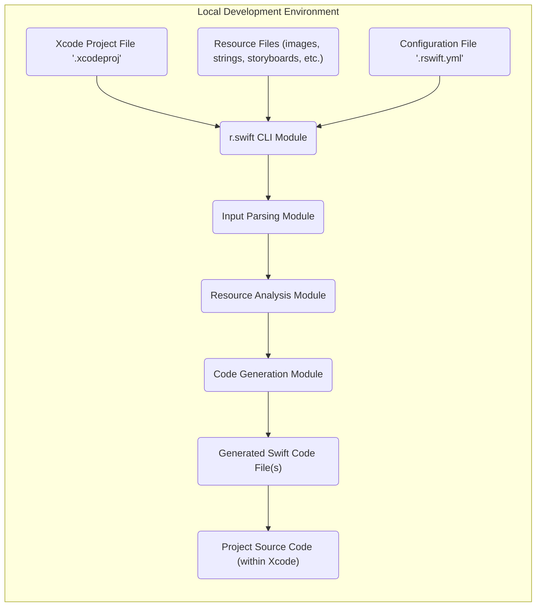

## Project Design Document: r.swift (Improved)

**1. Introduction**

This document provides an enhanced and more detailed design overview of the r.swift project, a Swift code generation tool designed to provide type-safe resource access for Apple platform projects (iOS, macOS, tvOS, and watchOS). This refined document serves as a robust foundation for subsequent threat modeling activities, offering a comprehensive understanding of the system's components, data flows, and interactions.

**2. Goals**

* To furnish a highly detailed and unambiguous understanding of the r.swift architecture and its functionalities.
* To precisely define the responsibilities and internal workings of each key component.
* To meticulously map the data flow within the system, explicitly highlighting potential points of interest and data transformation steps for security analysis.
* To act as a definitive reference for identifying potential threats, vulnerabilities, and attack vectors during the threat modeling process.

**3. Project Overview**

r.swift is a command-line tool seamlessly integrated into the Xcode build process. Its primary function is to analyze project files and various resource files (including but not limited to image assets, localized strings, storyboards, interface builder files, data files, fonts, and color sets). Based on this analysis, it generates Swift source code containing structs and enums, enabling developers to access project resources in a type-safe manner. This approach eliminates the reliance on string-based resource identifiers, significantly reducing the likelihood of runtime errors caused by typos or incorrect identifiers and greatly improving code maintainability and refactoring safety.

**4. System Architecture**

The r.swift system is composed of the following distinct yet interconnected components:

* **Input Parsing Module:** This module is responsible for the initial stage of processing, which involves reading and interpreting a variety of input file formats crucial to understanding the project's resources. This includes:
    * **Xcode Project File Parser:** Specifically designed to parse the `.xcodeproj` file, extracting critical information about the project's structure, build targets, configurations, and file references.
    * **Resource File Parsers:** A collection of specialized parsers tailored to different resource file types:
        * **Asset Catalog Parser:**  Handles `.xcassets` files, extracting information about images, app icons, and other assets, including their variations and localization.
        * **Strings File Parser:** Interprets `.strings` files to extract localized string keys and their corresponding values for different languages.
        * **Storyboard and XIB Parser:** Parses `.storyboard` and `.xib` files, identifying view controllers, segues, reusable views, and their associated identifiers.
        * **Data File Parser:** Handles generic data files, potentially extracting information based on file extensions or predefined formats.
        * **Font File Parser:** Extracts font names from font files.
        * **Color Set Parser:** Parses `.colorset` files to extract color definitions.
    * **Configuration File Parser:**  Responsible for reading and interpreting the `.rswift.yml` file, which allows developers to customize r.swift's behavior, such as specifying resource filters, custom templates, and output locations.

* **Resource Analysis Module:** This module takes the structured data produced by the Input Parsing Module and performs a deeper analysis to identify, categorize, and validate the project's resources. It extracts relevant metadata such as image names, string keys, storyboard identifiers, view controller class names, and more.

* **Code Generation Module:** The core of r.swift, this module takes the analyzed resource data and generates Swift source code. The generation process typically involves:
    * **Template Engine:** Utilizing predefined or custom templates to structure the generated Swift code. These templates define the overall structure of the `R` struct and its nested types.
    * **Code Generation Logic:**  Applying specific logic to generate Swift code elements such as:
        * Structs and enums representing resource categories (e.g., `R.image`, `R.string`, `R.segue`).
        * Static properties and methods for accessing individual resources within each category.
        * Type information for resource parameters (e.g., `UIImage` for images, `String` for strings) and return values.
        * Support for localization and different resource variations.

* **Command-Line Interface (CLI) Module:** This module serves as the primary interface for users to interact with r.swift. It handles:
    * **Argument Parsing:** Processing command-line arguments and options provided by the user, such as the project path, output directory, and configuration file path.
    * **Orchestration:** Invoking the Input Parsing Module, Resource Analysis Module, and Code Generation Module in the correct sequence.
    * **Error Handling:**  Managing errors encountered during the process and providing informative feedback to the user.
    * **Configuration Management:** Loading and applying configuration settings from the `.rswift.yml` file.
    * **File System Interaction:** Reading input files and writing the generated Swift code to the specified output location.

* **Xcode Integration (Build Phase) Module:** This module describes how r.swift is typically integrated into an Xcode project. It involves adding a "Run Script" build phase to one or more targets in the Xcode project. This build phase executes the r.swift CLI tool during the build process.

**5. Data Flow Diagram**

**6. Detailed Component Breakdown (Enhanced)**

* **Input Parsing Module:**
    * **Responsibilities:**
        * Robustly reading and parsing various Xcode project file formats, including handling potential inconsistencies or malformed data.
        * Efficiently reading and parsing a wide range of resource file types, leveraging appropriate libraries or custom parsing logic for each format.
        * Securely accessing the file system to locate and read input files, respecting file permissions and handling potential access errors.
        * Parsing the `.rswift.yml` configuration file, validating its structure and contents to prevent unexpected behavior.
    * **Key Data:** File paths, project structure hierarchy, build settings, resource metadata (names, types, locations, attributes), configuration parameters.

* **Resource Analysis Module:**
    * **Responsibilities:**
        * Accurately extracting resource information from the parsed data, handling different resource variations and localization settings.
        * Categorizing resources based on their type and purpose, ensuring proper organization for code generation.
        * Implementing validation rules to ensure resource names and identifiers conform to expected patterns and avoid conflicts.
        * Applying configured filtering and transformation rules to selectively include or modify resources.
        * Potentially identifying unused or orphaned resources based on project analysis.
    * **Key Data:**  Structured lists of resources with their associated metadata, validation results, filtering rules, transformation definitions.

* **Code Generation Module:**
    * **Responsibilities:**
        * Securely generating Swift code, avoiding potential code injection vulnerabilities or the generation of code that could introduce security flaws.
        * Applying code generation templates and logic consistently and correctly to produce the desired output structure and syntax.
        * Handling potential naming conflicts or ambiguities gracefully, potentially using configurable naming strategies.
        * Ensuring the generated code adheres to Swift coding conventions and best practices.
        * Providing options for customizing the generated code structure and style through templates or configuration.
    * **Key Data:** Analyzed resource metadata, code generation templates (both built-in and potentially custom), output file path and naming conventions, code formatting rules.

* **Command-Line Interface (CLI) Module:**
    * **Responsibilities:**
        * Securely parsing command-line arguments, validating input parameters to prevent injection attacks or unexpected behavior.
        * Robustly orchestrating the execution of other modules, handling potential errors and exceptions gracefully.
        * Providing clear and informative error messages and logging for debugging and troubleshooting.
        * Securely managing configuration settings, potentially including validation and sanitization of user-provided configuration values.
        * Interacting with the file system to read input files and write the generated output, ensuring proper permissions and error handling.
    * **Key Data:** Command-line arguments, configuration settings loaded from file or command line, execution status and error information.

* **Xcode Integration (Build Phase) Module:**
    * **Responsibilities:**
        * Executing the r.swift CLI reliably during the Xcode build process, ensuring it runs at the correct time and with the necessary environment.
        * Passing relevant Xcode environment variables and project build settings to the CLI.
        * Handling potential errors during the execution of the build phase and providing feedback to the Xcode build system.
        * Ensuring that r.swift runs before the compilation phase to make the generated code available for compilation.
    * **Key Data:** Xcode environment variables, project build settings, build phase execution logs.

**7. Data Storage and Persistence (Refined)**

r.swift primarily operates in memory during its execution. Data is read from input files, processed, and the generated output is written to the file system. Key data storage and persistence points include:

* **Input Files (Persistent Storage):** Xcode project files, various resource files, and the `.rswift.yml` configuration file are read from the file system. These represent the persistent input data for r.swift.
* **Generated Output Files (Persistent Storage):** The generated Swift code is written to one or more specified file locations within the project's source code directory. This constitutes the persistent output of r.swift.
* **Temporary Data (In-Memory):** Intermediate data structures used within the modules during processing are primarily held in memory and are not typically persisted beyond the execution of r.swift. This includes parsed project data, analyzed resource metadata, and code generation intermediate representations.

**8. Security Considerations (Expanded)**

This section provides a more detailed examination of potential security considerations and potential threats:

* **Input Validation Vulnerabilities:**
    * **Malicious Xcode Project Files:**  A carefully crafted `.xcodeproj` file could potentially exploit vulnerabilities in the Xcode project file parser, leading to denial-of-service or unexpected behavior.
    * **Malicious Resource Files:**   специально crafted resource files (e.g., excessively large images, strings with format string vulnerabilities, or malformed XML in storyboards) could cause parsing errors, buffer overflows, or other vulnerabilities.
    * **Configuration File Manipulation:** A compromised `.rswift.yml` file could introduce malicious configurations, such as specifying incorrect output paths or triggering unintended actions.
* **Code Generation Vulnerabilities:**
    * **Code Injection:** If resource data is not properly sanitized or escaped during code generation, it could potentially lead to the generation of Swift code containing malicious code snippets.
    * **Path Traversal:** If resource paths or filenames are used directly in the generated code without proper sanitization, it could potentially lead to path traversal vulnerabilities if these paths are later used to access files.
    * **Information Disclosure:**  The generated code might inadvertently expose sensitive information, such as internal file paths or configuration details.
* **Command-Line Interface Vulnerabilities:**
    * **Command Injection:** If user-provided input (e.g., project path, output path) is not properly sanitized before being used in shell commands, it could be vulnerable to command injection attacks.
    * **Denial of Service:**  Providing excessively large or malformed input through the CLI could potentially lead to resource exhaustion and denial of service.
* **Dependency Management Vulnerabilities:**
    * **Vulnerable Dependencies:** r.swift relies on external libraries for tasks like YAML parsing and Xcode project parsing. Vulnerabilities in these dependencies could be exploited if not properly managed and updated.
    * **Supply Chain Attacks:**  If the r.swift distribution itself is compromised, it could introduce malicious code into developer environments.
* **Xcode Integration Vulnerabilities:**
    * **Build Phase Manipulation:**  A malicious actor with write access to the Xcode project could potentially modify the r.swift build phase script to execute arbitrary commands during the build process.

**9. Deployment and Execution Environment (Clarified)**

r.swift is primarily deployed and executed as a command-line tool within a local development environment. This typically involves:

* **Developer's Local Machine:** Developers run r.swift on their workstations to generate resource access code for their projects.
* **Continuous Integration/Continuous Delivery (CI/CD) Pipelines:** r.swift is often integrated into CI/CD pipelines to automate the resource code generation process as part of the build process.
* **Execution Context:** r.swift requires a Swift runtime environment to execute. It typically runs within the context of the Xcode build process or as a standalone command-line tool.
* **File System Access:** r.swift needs read access to the project files, resource files, and the configuration file, and write access to the designated output directory for the generated Swift code.
* **Dependencies:** r.swift relies on specific libraries and frameworks (e.g., for YAML parsing, Xcode project parsing). These dependencies need to be available in the execution environment.

**10. Future Considerations (Potential Extensions)**

* **Graphical User Interface (GUI):** Providing a GUI for configuring and running r.swift could enhance usability for some developers.
* **Integrated Development Environment (IDE) Plugin:** Developing an Xcode plugin could provide seamless integration and real-time feedback within the IDE.
* **Cloud-Based Service Offering:**  Exploring the possibility of offering r.swift as a cloud-based service for projects with specific requirements or for centralized resource management.
* **Enhanced Resource Type Support:** Expanding support for a wider range of resource types and file formats.
* **Advanced Resource Management Features:** Implementing features for managing resource variations, localization, and asset optimization.

This improved design document provides a more comprehensive and detailed understanding of the r.swift project, serving as a valuable resource for in-depth threat modeling and security analysis. The enhanced component descriptions, refined data flow, and expanded security considerations offer a more robust foundation for identifying and mitigating potential vulnerabilities.