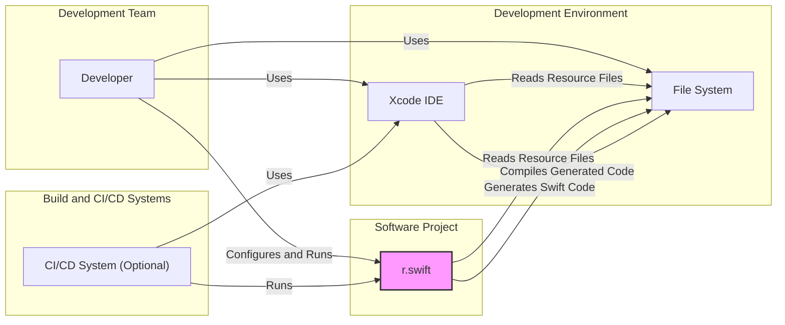
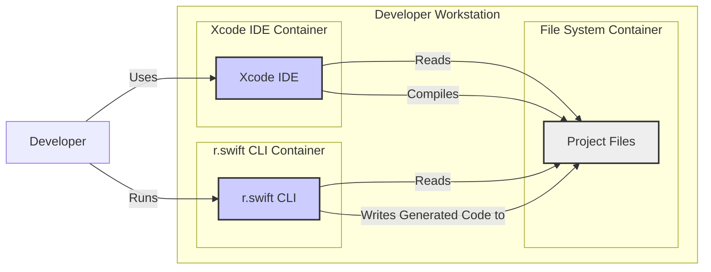
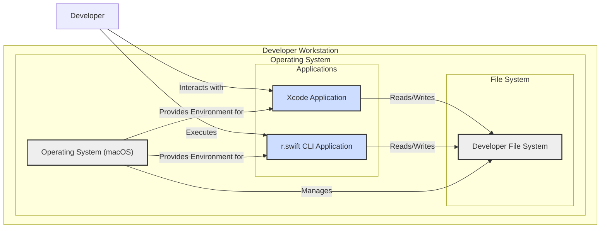
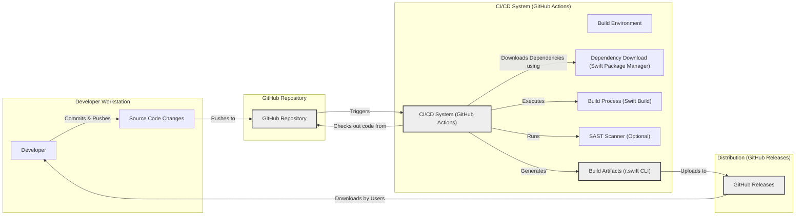

# BUSINESS POSTURE

This project, r.swift, addresses the problem of managing resources (images, fonts, localized strings, etc.) in Swift and iOS development. Manually managing string-based identifiers for resources is error-prone and reduces developer productivity. r.swift automates this process by generating strongly-typed, compile-time safe Swift code from resource files.

Business priorities and goals:
- Improve developer productivity by automating resource management.
- Reduce errors related to resource handling, leading to more stable and reliable applications.
- Enhance code maintainability by providing a clear and type-safe way to access resources.

Most important business risks:
- Supply chain compromise: If the r.swift tool itself is compromised, it could inject malicious code into applications during the build process. This is a significant risk as developers rely on r.swift to generate code that is directly included in their projects.
- Build process disruption: Issues with r.swift, such as bugs or compatibility problems, could disrupt the software development lifecycle, leading to delays and increased development costs.
- Data integrity risk: While r.swift primarily deals with resource files, incorrect or malicious manipulation of these files through a compromised r.swift could lead to application malfunction or unexpected behavior.

# SECURITY POSTURE

Existing security controls:
- security control: Source code hosted on GitHub, providing version control and transparency. (Implemented: GitHub repository)
- security control: Open source project, allowing community review and contributions. (Implemented: GitHub repository)
- security control: Swift Package Manager integration for dependency management. (Implemented: Project documentation and build system)

Accepted risks:
- accepted risk: Reliance on open-source dependencies and community contributions, which may introduce vulnerabilities if not properly vetted.
- accepted risk: Potential for vulnerabilities in the r.swift tool itself, requiring regular updates and security audits.
- accepted risk: Developers using r.swift are responsible for ensuring the security of their own development environments and build pipelines.

Recommended security controls:
- recommended security control: Implement automated dependency scanning to identify and address vulnerabilities in r.swift's dependencies.
- recommended security control: Integrate static application security testing (SAST) tools into the r.swift build process to detect potential code-level vulnerabilities.
- recommended security control: Implement code signing for r.swift releases to ensure integrity and authenticity.
- recommended security control: Provide clear security guidelines and best practices for developers using r.swift, especially regarding build process security.

Security requirements:
- Authentication: Not directly applicable to r.swift as a command-line tool. Authentication might be relevant if r.swift were to interact with external services, but in its current form, it operates locally.
- Authorization: Not directly applicable. r.swift operates based on the permissions of the user running it within their development environment.
- Input validation: r.swift needs robust input validation to ensure that it correctly parses resource files and prevents injection attacks or unexpected behavior due to malformed input. This is critical as r.swift processes files provided by the developer.
- Cryptography: Not directly applicable in the core functionality of r.swift. Cryptography might be relevant if r.swift were to handle sensitive data or communications, which is not the case in its current design. However, secure distribution and updates of r.swift itself should be considered, potentially involving cryptographic signatures.

# DESIGN

## C4 CONTEXT

Context Diagram Elements:

- Element:
  - Name: Developer
  - Type: Person
  - Description: Software developers using r.swift to manage resources in their iOS/Swift projects.
  - Responsibilities: Configure and run r.swift, integrate generated code into their projects, ensure proper usage of resources.
  - Security controls: Security awareness training, secure coding practices, local development environment security.

- Element:
  - Name: r.swift
  - Type: Software System
  - Description: A command-line tool that generates type-safe Swift code for accessing resources in iOS/Swift projects.
  - Responsibilities: Parse resource files, generate Swift code, provide a command-line interface for developers.
  - Security controls: Input validation, secure build process, code signing (recommended).

- Element:
  - Name: Xcode IDE
  - Type: Software System
  - Description: Apple's Integrated Development Environment used for iOS and macOS development.
  - Responsibilities: Read resource files, compile Swift code (including code generated by r.swift), build and package applications.
  - Security controls: Xcode security features (e.g., sandboxing), developer-configured security settings, code signing.

- Element:
  - Name: File System
  - Type: Data Store
  - Description: The local file system where project source code, resource files, and generated code are stored.
  - Responsibilities: Store project files, provide access to files for developers, Xcode, and r.swift.
  - Security controls: File system permissions, operating system security controls, disk encryption (optional).

- Element:
  - Name: CI/CD System (Optional)
  - Type: Software System
  - Description: Continuous Integration and Continuous Delivery systems used to automate the build, test, and deployment process. r.swift can be integrated into CI/CD pipelines.
  - Responsibilities: Automate build process, run r.swift as part of the build, perform testing, deploy applications.
  - Security controls: CI/CD pipeline security, access controls, secrets management, build environment hardening.

## C4 CONTAINER

Container Diagram Elements:

- Element:
  - Name: Xcode IDE Container
  - Type: Application Container
  - Description: Represents the Xcode IDE application, which is the primary tool used by developers.
  - Responsibilities: Source code editing, resource management (indirectly through r.swift), compilation, debugging, application packaging.
  - Security controls: Xcode security features, operating system security controls, user account controls.

- Element:
  - Name: r.swift CLI Container
  - Type: Application Container
  - Description: Represents the r.swift command-line interface tool, executed by developers or CI/CD systems.
  - Responsibilities: Parse resource files, generate Swift code based on configuration, provide command-line interface.
  - Security controls: Input validation, secure coding practices, potentially code signing for distribution.

- Element:
  - Name: File System Container (Project Files)
  - Type: Data Store Container
  - Description: Represents the file system directory containing the project's source code, resource files, and generated code.
  - Responsibilities: Persistent storage of project assets, access control through file system permissions.
  - Security controls: File system permissions, operating system security controls, disk encryption (optional).

## DEPLOYMENT

Deployment Architecture: Local Developer Workstation and CI/CD Pipeline

Detailed Deployment: Local Developer Workstation

Deployment Diagram Elements (Local Developer Workstation):

- Element:
  - Name: Operating System (macOS)
  - Type: Infrastructure
  - Description: The macOS operating system running on the developer's workstation.
  - Responsibilities: Provide runtime environment for applications, manage file system, enforce security policies.
  - Security controls: Operating system security features (firewall, user account controls, etc.), security updates.

- Element:
  - Name: Xcode Application
  - Type: Software Deployment Unit
  - Description: The installed Xcode application on the developer's workstation.
  - Responsibilities: IDE functionality, compilation, application building.
  - Security controls: Xcode security settings, application sandboxing (macOS).

- Element:
  - Name: r.swift CLI Application
  - Type: Software Deployment Unit
  - Description: The r.swift command-line tool, typically installed via Homebrew or downloaded as a binary.
  - Responsibilities: Resource code generation.
  - Security controls: Code signing (recommended for distribution), file system permissions.

- Element:
  - Name: Developer File System
  - Type: Infrastructure
  - Description: The portion of the local file system where the developer's project files are stored.
  - Responsibilities: Persistent storage of project data.
  - Security controls: File system permissions, disk encryption (optional).

## BUILD

Build Process Description:

1. Developer makes changes to the r.swift source code and commits them to their local repository.
2. Developer pushes changes to the remote GitHub repository.
3. GitHub repository triggers the CI/CD system (e.g., GitHub Actions) upon code push.
4. CI/CD system checks out the latest code from the GitHub repository into a clean build environment.
5. CI/CD system downloads project dependencies using Swift Package Manager.
6. CI/CD system executes the build process using Swift build tools to compile the r.swift CLI.
7. Optional: CI/CD system runs Static Application Security Testing (SAST) tools to scan the codebase for potential vulnerabilities.
8. CI/CD system generates build artifacts, including the r.swift CLI executable.
9. CI/CD system uploads the build artifacts to GitHub Releases.
10. Users (developers) can download pre-built r.swift CLI executables from GitHub Releases.

Build Security Controls:
- security control: Version control using Git and GitHub to track code changes and provide auditability. (Implemented: GitHub Repository)
- security control: Automated build process using CI/CD (GitHub Actions) to ensure consistent and repeatable builds. (Implemented: GitHub Actions)
- security control: Dependency management using Swift Package Manager to manage external libraries. (Implemented: Project build configuration)
- security control: Optional SAST scanning integrated into the CI/CD pipeline to detect potential vulnerabilities. (Recommended)
- security control: Code signing of release artifacts to ensure integrity and authenticity of downloaded binaries. (Recommended)
- security control: Secure build environment in CI/CD to minimize the risk of build infrastructure compromise. (Implemented: Best practices for CI/CD configuration)

# RISK ASSESSMENT

Critical business process we are trying to protect:
- Secure Software Development Lifecycle: Ensuring the tools used in the development process are trustworthy and do not introduce vulnerabilities. Specifically, protecting the integrity of the build process for iOS/Swift applications that rely on r.swift.

Data we are trying to protect and their sensitivity:
- r.swift Source Code: Sensitivity: Medium. Compromise could lead to malicious modifications of the tool.
- Build Artifacts (r.swift CLI Executable): Sensitivity: High. Compromised artifacts could directly inject malicious code into applications using r.swift.
- Developer Workstations: Sensitivity: Medium to High. If a developer workstation is compromised, it could be used to tamper with the r.swift project or inject malicious code.

# QUESTIONS & ASSUMPTIONS

Questions:
- What is the intended distribution method for r.swift? (GitHub Releases, Homebrew, etc.) - Answered partially by GitHub Releases in build section.
- Are there any specific security requirements or compliance standards that r.swift needs to adhere to?
- What is the process for reporting and handling security vulnerabilities in r.swift?
- Is there a plan for regular security audits or penetration testing of r.swift?

Assumptions:
- r.swift is primarily used by individual developers and small to medium-sized development teams.
- Security is important, but the primary focus is on functionality and ease of use for developers.
- The project maintainers are responsive to security concerns and will address reported vulnerabilities in a timely manner.
- Developers using r.swift are expected to have a basic understanding of software security best practices.